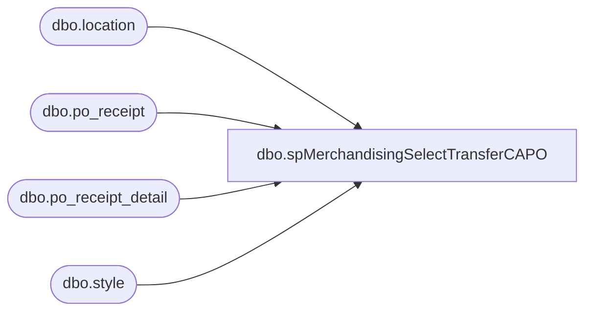

# dbo.spMerchandisingSelectTransferCAPO

**Database:** me_01  
**Server:** bedrockdb02  

## Architecture Diagram



## Table Dependencies

| Referenced Table |
|---|
| dbo.location |
| dbo.po_receipt |
| dbo.po_receipt_detail |
| dbo.style |

## Stored Procedure Code

```sql
CREATE proc [dbo].[spMerchandisingSelectTransferCAPO]
as

-- =====================================================================================================
-- Name: spMerchandisingSelectTransferCAPO
--
-- Description:	creates a shipment record for the Merch Pipeline to import
--
-- Input: NA
--
-- Output: na
--
-- Dependencies: na
--
-- Revision History
--		Name:			Date:			Comments:
--		Dan Tweedie		09/26/2011		Created proc.	
-- =====================================================================================================


set nocount on 


IF (Object_ID('tempdb..#a') IS NOT NULL) DROP TABLE #a
select  '0975_0980_' + replace(CONVERT(char,GETDATE(),101),'/','') as document_number,
            '000009750980' + replace(CONVERT(char,GETDATE(),101),'/','') as carton_label,
            '0975' as from_location_code, -- hard coded
            '0980' as to_location_code, -- hard coded
            CONVERT(varchar,GETDATE(),101) as date_shipped,
            'CORR' as reason_code,
            'XFER 0975 to 0980' as Grouping_Label,
            '000000' + s.style_code as upc,
            prd.units_received as send_units
into #a
from  po_receipt pr
join  po_receipt_detail prd
on          pr.po_receipt_id = prd.po_receipt_id
join  style s
on          prd.style_id = s.style_id
join  location l
on          pr.location_id = l.location_id
where CONVERT(varchar,GETDATE(),101) = CONVERT(varchar,pr.create_date,101) 
and         l.location_code = '0975'
and         pr.performed_by = 'Administrator'


declare
		@document varchar(20),
		@from varchar(4),
		@to varchar(4),
		@date varchar(12),
		@reason varchar(5),
		@grouping varchar(20),
		@carton varchar(20),
		@upc varchar(20),
		@send_units int,
		@counter1 int,
		@counter2 int,
		@total1 int,
		@total2 int
		

select @total1 = count(distinct document_number) from #a
declare header cursor for
		select  distinct
				document_number,
				from_location_code,
				to_location_code,
				date_shipped,
				reason_code,
				grouping_label
		from #a

open header
set @counter1 = 1
while @counter1 <= @total1
	begin
		fetch next from header into @document,@from,@to,@date,@reason,@grouping
		print 'H' + '	'	+ 'A' +	'	'+ @document + '	' + '	' + '	' + @from + '	' + '	' + @to + '	' + '	' + '	' + '	' + '	' + @date + '	' + '	' + '	' + '	' + '	' + '	' + @reason + '	' + '	'+ '	' + '	' + @grouping + '	' + '	' + '	' + 'T'
			select @total2 = count(distinct upc) from #a
			declare detail cursor for
			select distinct
					document_number,
					carton_label,
					upc,
					sum(send_units)
			from #a group by document_number, carton_label, upc order by upc
			open detail
			set @counter2 = 1
			while @counter2 <= @total2
				begin
					fetch next from detail into @document,@carton,@upc,@send_units
					print 'D' + '	' + 'A' + '	' + @document + '	' + @carton + '	' + @upc + '	' + '	' + '	' + '	' + '	' + '	' + convert(varchar, @send_units)
					set @counter2 = @counter2 + 1
				end
			close detail
			deallocate detail		
		set @counter1 = @counter1 + 1
	end
close header
deallocate header
```

