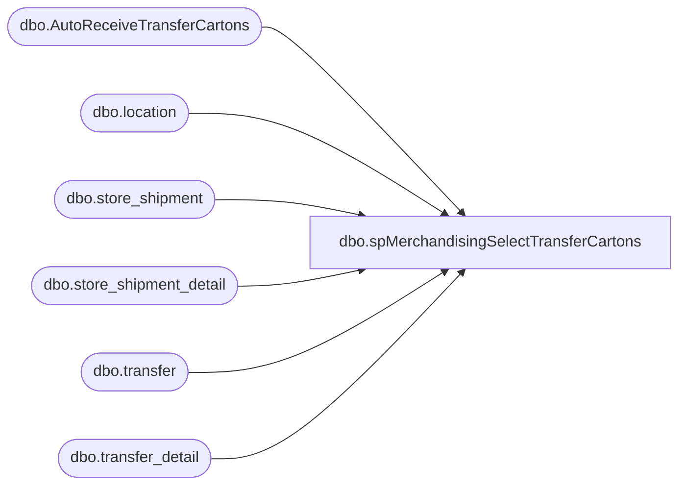

# dbo.spMerchandisingSelectTransferCartons

**Database:** me_01  
**Server:** bedrockdb02  

## Architecture Diagram



## Table Dependencies

| Referenced Table |
|---|
| dbo.AutoReceiveTransferCartons |
| dbo.location |
| dbo.store_shipment |
| dbo.store_shipment_detail |
| dbo.transfer |
| dbo.transfer_detail |

## Stored Procedure Code

```sql
CREATE proc [dbo].[spMerchandisingSelectTransferCartons]

as

-- =====================================================================================================
-- Name: spMerchandisingSelectTransferCartons
--
-- Description:	Captures carton data for outbound transfers which have not been received, 
--				generates carton batch receipt file to post to Pipeline interface.
--				The end result is that cartons from outbound transfers to/from the specified locations will be 'auto received'.
--			
-- Input: NA
--
-- Output: Resultset formatted to meet Epicor requirements for Carton Batch Receipt file
--
-- Dependencies: na
--
-- Revision History
--		Name:			Date:			Comments:
--		Dan Tweedie		6/14/2011		Created proc.	
--		Dan Tweedie		12/20/2011		Changed cartons received to be 'to' instead of 'from' the locations
--		Dan Tweedie		03/12/2012		Updated proc to include cartons on Shipments (commented out until 3/13)
--		Dan Tweedie     05/14/2013		Added 'tl' locations - '9902', '9550', '2940', '2990', '9990', '9910', '0471', '0472', '1970', '9471', '9472', '2920', '9991' Per Sara Cole's request
--		Dan Tweedie		12/11/2013		Added tl locations '2991','2940','2943','9550' by request from Lisa Waggoner
--		Tim Callahan	01/19/2016		Added tl location '2992','9530','9535','9545','9563','9565','9570','9700','9740','9770','9800','9810','9820','9830' by request from Lisa Waggoner
--		Tim Callahan	01/17/2016		Added tl location '8692' by request of from Lisa Waggoner 
--		Tim Callahan	08/16/2017		Added tl location '1951','1952','1954','1980' by request of from Lisa Waggoner 
-- =====================================================================================================


set nocount on

IF (Object_ID('me_01..AutoReceiveTransferCartons') IS NOT null) DROP TABLE AutoReceiveTransferCartons
select	'BC' a,
		'A' b,
		td.carton_no c,
		tl.location_code d,
		'099060199' e
into AutoReceiveTransferCartons
from	bedrockdb02.me_01.dbo.transfer t 
		join bedrockdb02.me_01.dbo.transfer_detail td on t.transfer_id = td.transfer_id
		join bedrockdb02.me_01.dbo.location fl on t.from_location_id = fl.location_id
		join bedrockdb02.me_01.dbo.location tl on t.to_location_id = tl.location_id
where td.carton_no is not null
and	t.document_status = 3
and (tl.location_code in ('9990','9999','9500','9503','9540','9543','9560','9580','9701','9720','9760','9912','9600', '9902', '9550', '2940', '2990', '9990', '9910', '0471', '0472', '1970', '9471', '9472', '2920', '9991','2991','2940','2943','9550','2992','9530','9535','9545','9563','9565','9570','9700','9740','9770','9800','9810','9820','9830','8692','1951','1952','1954','1980')
		or (tl.location_code between '9301' and '9493' and tl.location_code not in ('9472', '9471'))) 
union all
select	'BC' a,
		'A' b,
		td.carton_no c,
		tl.location_code d,
		'099060199' e
from	bedrockdb02.me_01.dbo.store_shipment t 
		join bedrockdb02.me_01.dbo.store_shipment_detail td on t.store_shipment_id = td.store_shipment_id
		join bedrockdb02.me_01.dbo.location fl on t.from_location_id = fl.location_id
		join bedrockdb02.me_01.dbo.location tl on t.location_id = tl.location_id
where td.carton_no is not null
and	t.document_status = 3
and (tl.location_code in ('9990','9999','9500','9503','9540','9543','9560','9580','9701','9720','9760','9912','9600', '9902', '9550', '2940', '2990', '9990', '9910', '0471', '0472', '1970', '9471', '9472', '2920', '9991','2991','2940','2943','9550','2992','9530','9535','9545','9563','9565','9570','9700','9740','9770','9800','9810','9820','9830','8692','1951','1952','1954','1980')
		or (tl.location_code between '9301' and '9493' and tl.location_code not in ('9472', '9471'))) 


if (select count(*) from AutoReceiveTransferCartons) > 0

	begin

		declare @query varchar(1000),
				@date varchar(52),
				@file_name varchar(100),
				@file_location varchar(100),
				@server varchar(20),
				@username varchar(20),
				@password varchar(20),
				@database varchar(20),
				@bcp varchar(1000)


		set @query = 'select * from bedrockdb02.me_01.dbo.AutoReceiveTransferCartons'
		select @date = convert(varchar, datepart(yyyy, getdate())) + convert(varchar, datepart(mm, getdate())) + convert(varchar, datepart(dd, getdate())) + convert(varchar, datepart(hh, getdate())) + convert(varchar, datepart(mi, getdate())) + convert(varchar, datepart(ss, getdate())) + convert(varchar, datepart(ms, getdate()))
		set @file_location = '\\pipeapp01\Company01\Text File to IM Import Tables  - Batch Carton\'
		set @file_name = 'STSIMCTN.TRANSFERS.' + @date + '.GO'
		set @server = 'bedrockdb02'
		set @database = 'me_01'
		set @bcp = 'bcp "' + @query + '" queryout "' + @file_location + @file_name + '"  -T -c -S' + @server
		
		exec master..xp_cmdshell @bcp

	end
```

