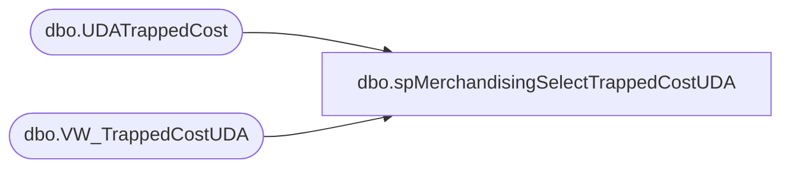

# dbo.spMerchandisingSelectTrappedCostUDA

**Database:** me_01  
**Server:** bedrockdb02  

## Architecture Diagram



## Table Dependencies

| Referenced Table |
|---|
| dbo.UDATrappedCost |
| dbo.VW_TrappedCostUDA |

## Stored Procedure Code

```sql
CREATE proc [dbo].[spMerchandisingSelectTrappedCostUDA]

as

-- =====================================================================================================
-- Name: spMerchandisingSelectTrappedCostUDA
--
-- Description:	Outputs data in format for UDA file for Pipeline
--
-- Revision History
--		Name:			Date:			Comments:
--		Dan Tweedie		04/13/2015		Created proc
-- =====================================================================================================

set nocount on 

IF (Object_ID('me_01..UDATrappedCost') IS NOT null) DROP TABLE UDATrappedCost
select *
into UDATrappedCost
from VW_TrappedCostUDA

declare @date varchar(12),
		@location varchar(4),
		@upc varchar(12),
		@cost varchar(52),
		@locationCost varchar(52),
		@total int

select @date = convert(varchar, getdate(), 101)
select @total = count(*) from UDATrappedCost 

print 'H' + '	' + 'A' + '	' + '' + '	' + @date + '	' + 'TRAP' + '	' + 'UDA Upload' + '	' + 'TRAPPED COST' + '	' + '3' + '	' + ''

while @total > 0
	BEGIN
		
		select @location = max(location_code) from UDATrappedCost
		select @upc = max(upc) from UDATrappedCost where location_code = @location
		select @cost = cost from UDATrappedCost where location_code = @location and upc = @upc
		select @locationCost = LocalCost from UDATrappedCost where location_code = @location and upc = @upc

		print 'D' + '	' + 'A' + '	' + '' + '	' + 'S' + '	' + @location + '	' + @upc +  '	' +  '	' +  '	' +  '	' +  '	' + '	' + '	' + @cost + '	' + @locationCost								
		
		delete from UDATrappedCost where location_code = @location and upc = @upc
		
		select @total = count(*) from UDATrappedCost 

		if @total = 0
			break
		else
			continue
	END
```

