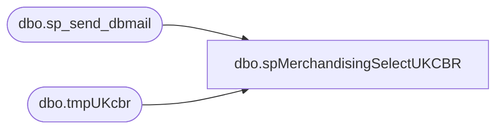

# dbo.spMerchandisingSelectUKCBR

**Database:** me_01  
**Server:** bedrockdb02  

## Architecture Diagram



## Table Dependencies

| Referenced Table |
|---|
| dbo.sp_send_dbmail |
| dbo.tmpUKcbr |

## Stored Procedure Code

```sql
CREATE proc [dbo].[spMerchandisingSelectUKCBR]
as 

-- =====================================================================================================
-- Name: spMerchandisingSelectUKCBR
--
-- Description:	Checks UK PO receipt information to see if the PO# is transfer. If so, and there is a carton, create CBR file. 
--				If no carton, send email to physical inventory.
--
-- Input: NA
--
-- Output: 
--
-- Revision History
--		Name:			Date:			Comments:
--		Dan Tweedie		05/13/2014		Created proc.	
--		Tim Callahan	08/31/2017		Adjust sorting of e-mail to be transfer doc, style
-- =====================================================================================================

set nocount on

---see if transfer has no carton, send email 
if (select count(*) from tmpUKcbr where carton_no is null) > 0
begin
declare @text nvarchar(max)
	
	set @text = '
	<font face =arial size = 2> '  +
		'</b><H1>Transfers Received at UK Warehouse (no carton numbers)</H1>' +
		'<table border="1">' +
		'<tr><th>Transfer</th><th>Style</th><th>Qty</th></tr>' +
		CAST ( ( SELECT td = document_no,'',
						td = style_code, '',
						td = qty, ''
				  from tmpUKcbr
				  where carton_no is null
				  order by document_no, style_code -- Modified on 8/31/2017
				  FOR XML PATH('tr'), TYPE 
		) AS NVARCHAR(MAX) ) +
		'</font></table></font></p></p><br>'
    
	exec msdb.dbo.sp_send_dbmail
	@profile_name = 'merchadmin',
    @recipients = 'physicalinventory@buildabear.com',
    @body = @text,
	@subject = 'Transfer Receipt @ UK Whse',
	@body_format = 'HTML'
end

---see if transfer has a carton, create CBR file
if (select count(*) from tmpUKcbr where carton_no is not null) > 0
begin
	IF (Object_ID('me_01..tmpUKcbr2') IS NOT NULL) DROP TABLE tmpUKcbr2
	select      'BC' as type,
				'A' as action,
				carton_no as carton_number,
				'2970' as location_code,
				'099060166' as employee_code -- Admin
	into tmpUKcbr2
	from tmpUKcbr 
	where carton_no is not null

	declare @query varchar(1000),
			@date varchar(52),
			@file_name varchar(100),
			@file_location varchar(100),
			@server varchar(20),
			@database varchar(20),
			@bcp varchar(1000)

	set @query = 'select * from me_01.dbo.tmpUKcbr2'
	select @date = convert(varchar, datepart(yyyy, getdate())) + convert(varchar, datepart(mm, getdate())) + convert(varchar, datepart(dd, getdate())) + convert(varchar, datepart(hh, getdate())) + convert(varchar, datepart(mi, getdate())) + convert(varchar, datepart(ss, getdate())) + convert(varchar, datepart(ms, getdate()))
	set @file_location = '\\pipeapp01\Company01\Text File to IM Import Tables  - Batch Carton\'
	set @file_name = 'STSIMCTN.UKCBR' + convert(varchar, @date) +'.GO'
	set @server = 'bedrockdb02'
	set @database = 'me_01'
	set @bcp = 'bcp "' + @query + '" queryout "' + @file_location + @file_name + '"  -T -c -S' + @server

	exec master..xp_cmdshell @bcp

end
```

