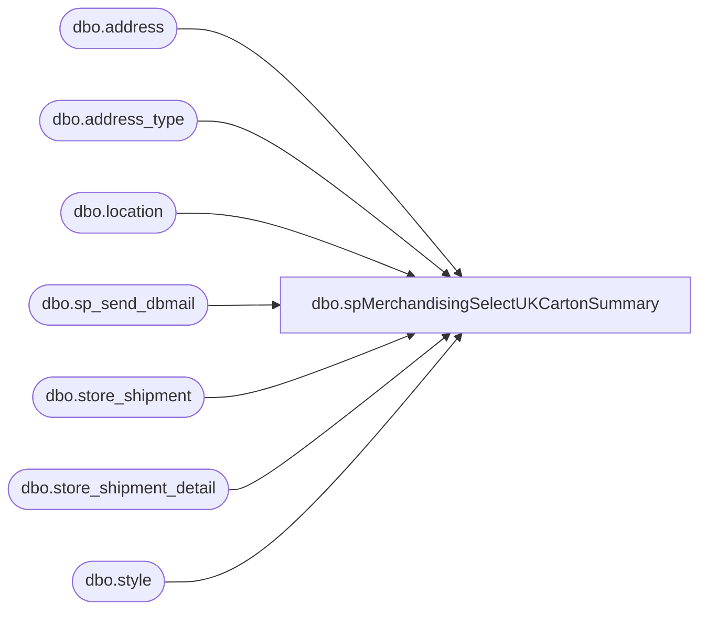

# dbo.spMerchandisingSelectUKCartonSummary

**Database:** me_01  
**Server:** bedrockdb02  

## Architecture Diagram



## Table Dependencies

| Referenced Table |
|---|
| dbo.address |
| dbo.address_type |
| dbo.location |
| dbo.sp_send_dbmail |
| dbo.store_shipment |
| dbo.store_shipment_detail |
| dbo.style |

## Stored Procedure Code

```sql
CREATE proc [dbo].[spMerchandisingSelectUKCartonSummary]
as

-- =====================================================================================================
-- Name: spMerchandisingSelectUKCartonSummary
--
-- Description:	Sends CSV email to Distro team to report weekly cartons shipped from UK Warehouse
--				
--				 
-- Revision History
--		Name:			Date:			Comments:
--		Dan Tweedie		05/13/2014		Created proc.	
--		Dan Tweedie		09/14/2015		Altered proc to select into table instead of creating table then inserting into it. 
-- =====================================================================================================

set nocount on


IF (Object_ID('me_01..tmpdmtukcartons') IS NOT NULL) DROP TABLE tmpdmtukcartons
select s.style_code,
	   s.short_desc,
	   ssd.carton_no, 
	   ssd.units_sent,
	   l.location_code,
	   a.address_city,
	   a.address_state,
	   ss.external_system_name,
	   convert(varchar, ss.ship_date, 101) ship_date
into tmpdmtukcartons
from store_shipment ss (nolock)
join store_shipment_detail ssd (nolock) on ss.store_shipment_id = ssd.store_shipment_id
join style s (nolock) on s.style_id = ssd.style_id
join location l (nolock) on l.location_id = ss.location_id
join location l2 (nolock) on l2.location_id = ss.from_location_id
join address a (nolock) on l.location_id = a.parent_id
join address_type at (nolock) on a.address_type_id = at.address_type_id
where (a.parent_type = 2 and a.address_type_id = 1)
and datediff(dd, ss.ship_date, getdate()) <= 7
and l2.location_code = '2970'
order by s.style_code, l.location_code

---CSV with headers
declare		@query varchar(1000),
			@date varchar(200),
			@file_name varchar(100),
			@file_location varchar(100),
			@server varchar(20),
			@username varchar(20),
			@password varchar(20),
			@database varchar(20),
			@sqlcmd varchar(1000),
			@query_text varchar(1000)

select @query_text = 'set nocount on select * from tmpdmtukcartons'

set @date = convert(varchar, datepart(yyyy, getdate())) + '-' + convert(varchar, datepart(mm, getdate())) + '-' + convert(varchar, datepart(dd, getdate()))
set @query = @query_text
set @file_location = '\\kermode\FileRepository\MERCHANDISING\DBCompare\UKCARTONS\' 
set @file_name = 'UK_Carton_Summary_' + @date + '.csv'
set @server = 'bedrockdb02'
set @database = 'me_01'
set @sqlcmd = 'sqlcmd -S' + @server + ' -d' + @database + ' -Q' + '"' + @query + '"' + ' -o' + '"' + @file_location + @file_name + '"' + ' -s"," -w1000 -W'
exec master..xp_cmdshell @sqlcmd

declare @attach varchar(1000), @move varchar(1000)
select @attach = @file_location + @file_name 
select @move = 'move ' + @attach + ' \\kermode\FileRepository\MERCHANDISING\DBCompare\UKCARTONS\History\'


exec msdb.dbo.sp_send_dbmail
	@profile_name = 'merchadmin',
    @recipients = 'distrobears@buildabear.com',
    @body = 'UK Cartons Shipped Weekly Summary',
	@subject = 'UK Cartons Shipped Weekly Summary',
	@file_attachments = @attach

	
exec master..xp_cmdshell @move
```

