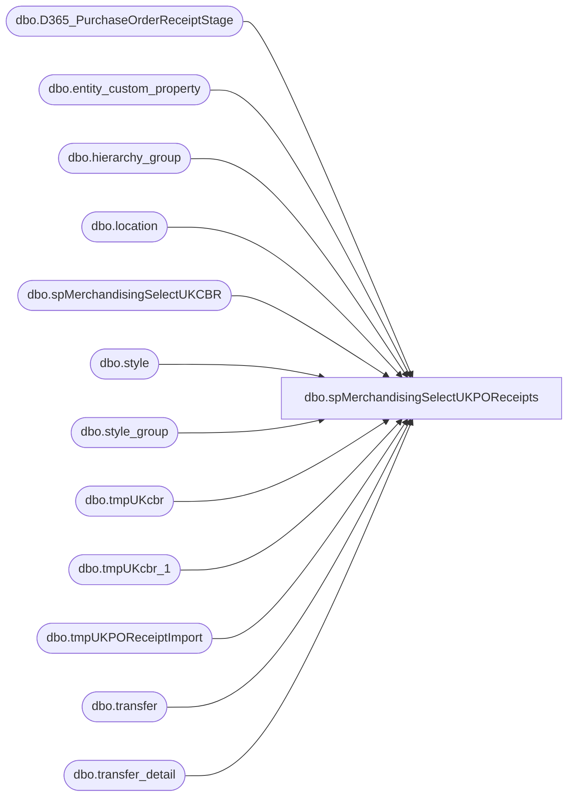

# dbo.spMerchandisingSelectUKPOReceipts

**Database:** me_01  
**Server:** bedrockdb02  

## Architecture Diagram



## Table Dependencies

| Referenced Table |
|---|
| dbo.D365_PurchaseOrderReceiptStage |
| dbo.entity_custom_property |
| dbo.hierarchy_group |
| dbo.location |
| dbo.spMerchandisingSelectUKCBR |
| dbo.style |
| dbo.style_group |
| dbo.tmpUKcbr |
| dbo.tmpUKcbr_1 |
| dbo.tmpUKPOReceiptImport |
| dbo.transfer |
| dbo.transfer_detail |

## Stored Procedure Code

```sql
CREATE proc [dbo].[spMerchandisingSelectUKPOReceipts]

as 

-- =====================================================================================================
-- Name: spMerchandisingSelectUKPOReceipts
--
-- Description:	Bulk insert PO receipt file from UK warehouse, stages data, calls another proc to output the pipeline file
--
-- Input: NA
--
-- Output: Resultset formatted to meet Epicor requirements for PO Receipt Import.
--
-- Revision History
--		Name:			Date:			Comments:
--		Dan Tweedie		09/05/2013		Created proc.	
--		Dan Tweedie		05/13/2014		Added code to lookup Transfer numbers, then if PO is a transfer w/a carton number, do a CBR. If no carton, send email. If no transfer, do a po receipt as normal.
--		Tim Callahan	08/31/2017		Added code to limit transfer lookup to documents sent to 2013 or 2970; Added Code to handle transfer receipts that include styles that do not exist on the transfer document
--		Dan Tweedie		2017-11-21		Added statement to insert PO Receipts data into D365_PurchaseOrderReceiptStage so another process can integrate to D365 as needed
--		Tim Callahan	06/28/2018		Added statement to remove D365 PO receipt date from staging table, otherwise these receipts would bomb out in Merch\Pipeline 
--		Tim Callahan	10/11/2018		Added functionality to only pull the left 7 characters because the Clipper warehouse keeps apending a datetime stamp to the end of the PO number. 
-- =====================================================================================================

set nocount on

--get list of transfer numbers from Merch --added 05/13/2014
IF (Object_ID('tempdb..#transfers') IS NOT NULL) DROP TABLE #transfers
select t.document_no, td.carton_no, s.style_code, td.units_sent
into #transfers
from transfer t (nolock)
join transfer_detail td (nolock) on t.transfer_id = td.transfer_id
join style s (nolock) on td.style_id = s.style_id
join location l (nolock) on l.location_id=t.to_location_id
where l.location_code in ('2013','2970') -- Added 8/31/2017

--check the directory to see if there are distro CSV files ready to import
-------------do a DIR command and store the results in a temp table
IF (Object_ID('tempdb..#DIR') IS NOT NULL) DROP TABLE #DIR
create table #DIR (output varchar(1000))
insert #DIR exec master..xp_cmdshell 'dir \\kermode\FileRepository\MERCHANDISING\uk_distro\RECEIPTS\*.dat /B'
delete from #DIR where output is null or output = 'File Not Found'

------------query temp table to see if there are CSV files
if (select count(*) from #DIR) > 0
---find files with spaces in the name, rename to remove the spaces

BEGIN

		if (object_id('tempdb..#UKPOR') is not null) drop table #UKPOR
		create table #UKPOR
		(receipt_date smalldatetime,
		po_no varchar(52),
		style_code varchar(52),
		qty int,
		dam int)

			
		declare @files int,
				@filename varchar(100),
				@filepath varchar(100),
				@bulkinsert varchar(4000),
				@bulkinsertArchive varchar(4000),
				@del varchar(100),
				@move varchar(1000),
				@query varchar(1000),
				@file_name varchar(100),
				@file_location varchar(100),
				@server varchar(20),
				@database varchar(20),
				@bcp varchar(1000),
				@timestamp varchar(52),
				@rename varchar(1000),
				@nameage varchar(104),
				@documentNumber varchar(9)

		select @filepath = '\\kermode\FileRepository\MERCHANDISING\uk_distro\RECEIPTS\'
		select @files = count(*) from #dir
		
		
---------Bulk Insert Loop
		while @files > 0
			begin
			    select @timestamp = cast(datepart(yyyy, getdate()) as varchar) + cast(datepart(mm, getdate()) as varchar) + cast(datepart(dd, getdate()) as varchar) + cast(datepart(hh, getdate()) as varchar) + cast(datepart(mi, getdate()) as varchar) + cast(datepart(ss, getdate()) as varchar)
				select @filename = max(output) from #dir
								
				select @bulkinsert = 'set language ''British'' bulk insert #UKPOR from ''' + @filepath + @filename + ''' with (FIELDTERMINATOR = '','', ROWTERMINATOR = ''\n'')'
				exec (@bulkinsert)
				
				select @rename = 'ren ' + @filepath + @filename + ' ' + @filename + '.' + @timestamp + '.DAT'
				exec master..xp_cmdshell @rename
				
				select @move = 'move ' + @filepath + @filename + '.' + @timestamp + '.dat' + ' \\kermode\FileRepository\MERCHANDISING\uk_distro\RECEIPTS\Done\'
		        exec master..xp_cmdshell @move
				
				delete from #dir where output = @filename
				select @files = count(*) from #dir
								
				if @files < 1
					break
				else
					continue
			end


			--------------------------------------------------------
			--Added 2017-11-21
				if (select count(*) from #UKPOR) > 0
					begin
						insert D365_PurchaseOrderReceiptStage 
						select 
							po_no as PurchaseOrderNumber,
							'9970' as ReceiptLocation,
							cast(receipt_date as date) as ReceiptDate, 
							style_code as ItemID,
							sum(qty) as Qty,
							getdate(),
							'2110' as Entity
						from #UKPOR
						group by po_no, cast(receipt_date as date), style_code
					end
			--------------------------------------------------------

-- Aded 06/28/2018 to remove D365 PO receipt data after captured above 
	
	delete 
	from #UKPOR
	where po_no like 'PO%' 

		
---convert qty for supplies - stage into holding table
if (object_id('tempdb..#tmpUKPOReceiptImport') is not null) drop table #tmpUKPOReceiptImport
select u.receipt_date,
left(u.po_no,7) as po_no,
right(('000000000000' + u.style_code),12) style_code, 
case when ecp.custom_property_value is not null and substring(hg.hierarchy_group_code,7,2)='60'
		then (u.qty / ecp.custom_property_value)
		else u.qty
	end as qty,
	'0' as dam
into #tmpUKPOReceiptImport
from #UKPOR u
join style s (nolock) on u.style_code = s.style_code
join style_group sg (nolock) on s.style_id = sg.style_id
join hierarchy_group hg (nolock) on hg.hierarchy_group_id = sg.hierarchy_group_id
left join entity_custom_property ecp (nolock) on ecp.parent_id = s.style_id
	and ecp.custom_property_id = 2 -- FRCSTM
	and	parent_type = 1

if (object_id('me_01..tmpUKPOReceiptImport') is not null) drop table tmpUKPOReceiptImport
select receipt_date, po_no, style_code, sum(qty) qty, dam
into tmpUKPOReceiptImport
from #tmpUKPOReceiptImport
group by receipt_date, po_no, style_code, dam

---if po number is a transfer, archive into work table, purge from this table --added 05/13/2014
-- Added isnull function to account for inventory received on a transfer but did not exist on transfer document -- Added 8/31/2017
if (object_id('me_01..tmpUKcbr_1') is not null) drop table tmpUKcbr_1
select isnull(t.document_no,u.po_no) as document_no, t.carton_no, u.style_code, u.qty
into tmpUKcbr_1
from tmpUKPOReceiptImport u
left join #transfers t on u.po_no = t.document_no and right(u.style_code,6) = t.style_code

---Additional step to only include styles that reference a transfer number, whether they exist on the transfer document or not  -- Added 8/31/2017
if (object_id('me_01..tmpUKcbr') is not null) drop table tmpUKcbr
select *
into tmpUKcbr
from tmpUKcbr_1 u
where u.document_no in (select document_no from #transfers)

delete from tmpUKPOReceiptImport
where po_no in (select document_no from #transfers)

if (select count(*) from tmpUKcbr) > 0
begin
	exec spMerchandisingSelectUKCBR
end
---end new code 05/13/2014


---generate po receipt file for pipeline
declare @query1 varchar(1000),
@file_location1 varchar(100),
@file_name1 varchar(100),
@server1 varchar(52),
@database1 varchar(52),
@username1 varchar(52),
@password1 varchar(52),
@sqlcmd varchar(1000)
			
set @query1 = 'set nocount on exec spMerchandisingOutputUKPOReceipts'
set @file_location1 = '\\pipeapp01\Company01\Text File to IM - Import PO Receipts\'
set @file_name1 = 'STSIMPORECEIPT.UK.' + convert(varchar, datepart(yyyy, getdate())) + convert(varchar, datepart(mm, getdate())) + convert(varchar, datepart(dd, getdate())) + convert(varchar, datepart(hh, getdate())) + convert(varchar, datepart(mi, getdate())) + convert(varchar, datepart(ss, getdate())) + '.GO'
set @server1 = 'bedrockdb02'
set @database1 = 'me_01'
set @sqlcmd = 'sqlcmd -S' + @server1 + ' -d' + @database1 + ' -Q' + '"' + @query1 + '"' + ' -o' + '"' + @file_location1 + @file_name1 + '"' + ' -s"," -w100 -W'
exec master..xp_cmdshell @sqlcmd


END
```

