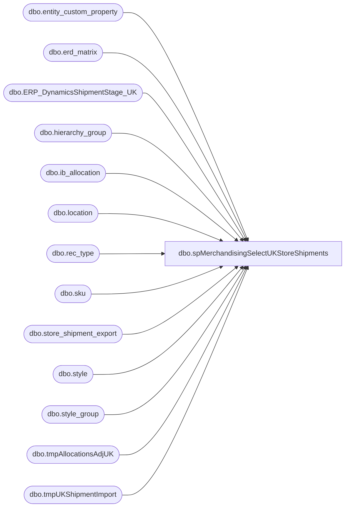

# dbo.spMerchandisingSelectUKStoreShipments

**Database:** me_01  
**Server:** bedrockdb02  

## Architecture Diagram



## Table Dependencies

| Referenced Table |
|---|
| dbo.entity_custom_property |
| dbo.erd_matrix |
| dbo.ERP_DynamicsShipmentStage_UK |
| dbo.hierarchy_group |
| dbo.ib_allocation |
| dbo.location |
| dbo.rec_type |
| dbo.sku |
| dbo.store_shipment_export |
| dbo.style |
| dbo.style_group |
| dbo.tmpAllocationsAdjUK |
| dbo.tmpUKShipmentImport |

## Stored Procedure Code

```sql
CREATE proc [dbo].[spMerchandisingSelectUKStoreShipments]

as 

-- =====================================================================================================
-- Name: spMerchandisingSelectUKStoreShipments
--
-- Description:	Bulk insert Store Shipment file from UK warehouse, stages data, calls another proc to output the pipeline file
--
-- Input: NA
--
-- Output: Resultset formatted to meet Epicor requirements for Shipments.
--
-- Revision History
--		Name:			Date:			Comments:
--		Dan Tweedie		09/06/2013		Created proc.
--		Dan Tweedie		05/27/2014		Modified rec type lookup to get from store_shipment_export instead of distribution
--		Dan Tweedie		06/26/2014		Modified code to include carton number in rec type query to allow for proper join with ERD query, to prevent extra lines returned
--		Dan Tweedie		07/18/2014		For allocation adjustment staging query, 
--										changed to max instead of sum to ensure we don't over report the shipped qty 
--										if the warehouse reports multiples lines of the same carton number & UPC 
--										(this should only be on one line, but they have accidentally over reported in the past and had multiple lines with the same data
--		Dan Tweedie		04/15/2015		Updated allocation adjustment queries so the value is determined by subtracting shipped qty from allocated qty
--		Dan Tweedie		05/1/2015		Break/Fix - Allocation adjustment = allocated - variance qty, only create adjustment if <> 0
--		Tim Callahan	12/11/2015		Called Pipeline Segments After Shipment and Allocation Adjustment Files are Generated
--		Tim Callahan	05/23/2017		Remarked Out BreakFix from 5/1/2015 , Added Where Clause for Carton Numbers of 00000000000000000000, indicates units were not shipped 
--		Tim Callahan	06/13/2017		Added code to account for if Allocator\Distro team cancels distribution lines in Merch
--										This could create a negative allocation which would cause the entire batch for that distribution to fail to import via pipeline segment 65000
--		Dan Tweedie		2018-07-03		Added stage data for Dynamics
--		Tim Callahan	07-03-2018		Added Code to remove D365 transfers from #file_input table after D365 capture otherwise this data would fail in Merch\Pipeline
--		Tim Callahan	12-01-2018		Changed location_code max length to 6 for D3FO Sales Order Location Processing
--		Dan Tweedie		2019-01-22		Updated insert statement for stage to Dynamics
--		Tim Callahan	2022-07-31		Added Insert Ddate for stage to Dynamics 
--		Lizzy Timm		2025-05-08		Add logic to accommodate longer distribution numbers
-- =====================================================================================================

set nocount on

--check the directory to see if there are distro CSV files ready to import
-------------do a DIR command and store the results in a temp table
IF (Object_ID('tempdb..#DIR') IS NOT NULL) DROP TABLE #DIR
create table #DIR (output varchar(1000))
insert #DIR exec master..xp_cmdshell 'dir \\kermode\FileRepository\MERCHANDISING\uk_distro\shipments\*.txt /B'
delete from #DIR where output is null or output = 'File Not Found'

------------query temp table to see if there are CSV files
if (select count(*) from #DIR) > 0
---find files with spaces in the name, rename to remove the spaces

BEGIN

		if (object_id('tempdb..#UKSHIPMENT') is not null) drop table #UKSHIPMENT
		create table #UKSHIPMENT
		(shipment varchar(52),
		location_code varchar(6),
		ship_date smalldatetime,
		distribution_number varchar(52),
		distribution_line int,
		style_code varchar(6),
		req_qty int,
		sent_qty int,
		variance_qty int,
		carton_nbr varchar(25))


			
		declare @files int,
				@filename varchar(100),
				@filepath varchar(100),
				@bulkinsert varchar(4000),
				@bulkinsertArchive varchar(4000),
				@del varchar(100),
				@move varchar(1000),
				@query varchar(1000),
				@file_name varchar(100),
				@file_location varchar(100),
				@server varchar(20),
				@database varchar(20),
				@bcp varchar(1000),
				@timestamp varchar(52),
				@rename varchar(1000),
				@nameage varchar(104),
				@documentNumber varchar(9)

		select @filepath = '\\kermode\FileRepository\MERCHANDISING\uk_distro\shipments\'
		select @files = count(*) from #dir
		
	
---------Bulk Insert Loop
		while @files > 0
			begin
			    select @timestamp = cast(datepart(yyyy, getdate()) as varchar) + cast(datepart(mm, getdate()) as varchar) + cast(datepart(dd, getdate()) as varchar) + cast(datepart(hh, getdate()) as varchar) + cast(datepart(mi, getdate()) as varchar) + cast(datepart(ss, getdate()) as varchar)
				select @filename = max(output) from #dir
								
				select @bulkinsert = 'set language ''British'' bulk insert #UKSHIPMENT from ''' + @filepath + @filename + ''' with (FIELDTERMINATOR = '','', ROWTERMINATOR = ''\n'')'
				exec (@bulkinsert)
				
				select @rename = 'ren ' + @filepath + @filename + ' ' + @filename + '.' + @timestamp + '.txt'
				exec master..xp_cmdshell @rename
				
				select @move = 'move ' + @filepath + @filename + '.' + @timestamp + '.txt' + ' \\kermode\FileRepository\MERCHANDISING\uk_distro\shipments\Done\'
		        exec master..xp_cmdshell @move
				
				delete from #dir where output = @filename
				select @files = count(*) from #dir
								
				if @files < 1
					break
				else
					continue
			end
			

	------------STAGE FOR DYNAMICS

		
		insert ERP_DynamicsShipmentStage_UK
		select
			Shipment,
			location_code, 
			ship_date,
			distribution_number,
			distribution_line,
			style_code,
			req_qty,
			sent_qty,
			variance_qty,
			carton_nbr,
			NULL as rec_type,
			NULL as external_system_name,
			NULL as erd_date, 					 
			GETDATE()
		from #UKSHIPMENT
		where carton_nbr is not null
		and len(carton_nbr) > 1
		and carton_nbr not in (select carton_nbr from ERP_DynamicsShipmentStage_UK where carton_nbr is not null)

-----------------------------------------
-- Added 7/03/2018
-- Delete D365 Distros 

delete 
from #UKSHIPMENT
where distribution_number like 'S%' or distribution_number like 'T%'

			
if (select count(*) from #UKSHIPMENT) > 0

	begin

		---convert qty for supplies - stage into holding table
		if (object_id('tempdb..#shipment') is not null) drop table #shipment
		select u.shipment, u.location_code, convert(varchar, u.ship_date, 101) ship_date,
		--right(('000000' + u.distribution_number),6) as distribution_number, 
		CASE
			WHEN LEN(u.distribution_number) < 7
			THEN right(('000000' + u.distribution_number),6)
			ELSE right(('0000000' + u.distribution_number),7)
		END as distribution_number, 
		u.distribution_line,  right(('000000000000' + u.style_code),12) style_code, 
		case when ecp.custom_property_value is not null and substring(hg.hierarchy_group_code,7,2)='60'
				then (u.req_qty / ecp.custom_property_value)
				else u.req_qty
			end as req_qty,
		case when ecp.custom_property_value is not null and substring(hg.hierarchy_group_code,7,2)='60'
				then (u.sent_qty / ecp.custom_property_value)
				else u.sent_qty
			end as sent_qty,
		case when ecp.custom_property_value is not null and substring(hg.hierarchy_group_code,7,2)='60'
				then (u.variance_qty / ecp.custom_property_value)
				else u.variance_qty
			end as variance_qty,
		u.carton_nbr
		into #shipment
		from #UKSHIPMENT u
		join style s (nolock) on right(('000000000000' + u.style_code),6) = s.style_code
		join style_group sg (nolock) on s.style_id = sg.style_id
		join hierarchy_group hg (nolock) on hg.hierarchy_group_id = sg.hierarchy_group_id
		left join entity_custom_property ecp (nolock) on ecp.parent_id = s.style_id
			and ecp.custom_property_id = 2 -- FRCSTM
			and	parent_type = 1

		--get rec_types per distro, since the UK doesn't put this in the shipment file
		IF (Object_ID('tempdb..#rectype') IS NOT NULL) DROP TABLE #rectype
		select	distinct sh.distribution_number,
				sse.rec_type,
				sh.location_code,
				sh.carton_nbr --added 06/26/2014
		into #rectype
		from #shipment sh
		join store_shipment_export sse (nolock) on sh.shipment = sse.document_number

		IF (Object_ID('tempdb..#erd') IS NOT NULL) DROP TABLE #erd
		select distinct rt.*, isnull(em.days, 7) as 'days', rt1.message external_system_name
		into #erd
		from #rectype rt 
		left join erd_matrix em (nolock) on rt.rec_type = em.rec_type and rt.location_code = em.location_code
		join rec_type rt1 (nolock) on rt.rec_type = rt1.rectype
		order by 1

	
		IF (Object_ID('me_01..tmpUKShipmentImport') IS NOT NULL) DROP TABLE tmpUKShipmentImport
		select s.*, e.rec_type, e.external_system_name,
		case when upper(datename(dw,getdate())) = 'MONDAY' and e.days > 4 or upper(datename(dw,getdate())) = 'TUESDAY' and e.days > 3
			or upper(datename(dw,getdate())) = 'WEDNESDAY' and e.days > 2 or upper(datename(dw,getdate())) = 'THURSDAY' and e.days > 1
			or upper(datename(dw,getdate())) = 'FRIDAY'
				then convert(varchar(10), getdate() + e.days + 2,101)
			when upper(datename(dw,getdate())) = 'MONDAY' and e.rec_type in (55,89,1005)
				then convert(varchar(10), getdate() + e.days + 5,101)
			when upper(datename(dw,getdate())) = 'TUESDAY' and e.rec_type in (55,89,1005)
				then convert(varchar(10), getdate() + e.days + 4,101)
			when upper(datename(dw,getdate())) = 'WEDNESDAY' and e.rec_type in (55,89,1005)
				then convert(varchar(10), getdate() + e.days + 3,101)
			when upper(datename(dw,getdate())) = 'THURSDAY' and e.rec_type in (55,89,1005)
				then convert(varchar(10), getdate() + e.days + 2,101)
			when upper(datename(dw,getdate())) = 'FRIDAY' and e.rec_type in (55,89,1005)
				then convert(varchar(10), getdate() + e.days + 1,101)
			else
				 convert(varchar, getdate() + e.days,101)
			end as erd_date
		into tmpUKShipmentImport
		from #shipment s
		join #erd e on s.distribution_number = e.distribution_number and s.location_code = e.location_code 
			AND S.CARTON_NBR = E.CARTON_NBR --added 06/26/2014
		order by s.shipment

		--copy data into allocations adjustment staging table 
		----first, stage allocation data
		IF (Object_ID('tempdb..#allocations') IS NOT NULL) DROP TABLE #allocations
		select	s.style_code,
				l.location_code,
				ia.allocation_number distribution_number,
				sum(ia.allocated_units) allocated_units
		into #allocations
		from ib_allocation ia (nolock)
		join sku sk (nolock) on ia.sku_id = sk.sku_id
		join style s (nolock) on sk.style_id = s.style_id
		join location l (nolock) on ia.location_id = l.location_id
		where ia.allocation_number in (select distribution_number from tmpUKShipmentImport)
		and l.location_code in (select location_code from tmpUKShipmentImport)
		group by s.style_code, l.location_code, ia.allocation_number
		
		---second, stage the variance qty to be subtracted from the allocated qty
		IF (Object_ID('tempdb..#shippedStageTwo') IS NOT NULL) DROP TABLE #shippedStageTwo
		select fi.distribution_number, fi.distribution_line, fi.style_code UPC, fi.location_code, max(fi.variance_qty) variance_qty, carton_nbr --the reason we have max(variance_qty) is because the uk whse has been known to report duplicate carton data from time to time
		into #shippedStageTwo
		from tmpUKShipmentImport fi
		group by fi.distribution_number, fi.distribution_line, fi.style_code, fi.location_code, carton_nbr

		--third, join alloacation and variance data, subtracting variance units from allocated units
		IF (Object_ID('me_01..tmpAllocationsAdjUK') IS NOT NULL) DROP TABLE tmpAllocationsAdjUK
		select sst.distribution_number, sst.distribution_line, sst.UPC, sst.location_code, 
		(a.allocated_units - sum((sst.variance_qty * -1))) Adj_qty --the variance_qty * -1 is because they report it in the shipment file as -X so I convert the number to absolute value so I can effectively subtract variance qty from allocated qty
		into tmpAllocationsAdjUK
		from #shippedStageTwo sst
		join #allocations a on sst.distribution_number = a.distribution_number
			and right(sst.UPC, 6) = a.style_code
			and sst.location_code = a.location_code
		where carton_nbr = '00000000000000000000' -- Added 5/23/2017
		group by sst.distribution_number, sst.distribution_line, sst.UPC, sst.location_code, a.allocated_units
		--having (a.allocated_units - sum((sst.variance_qty * -1))) <> 0 -- Remarked out on 5/23/2017


		-- Additional Data Refinement -- Added 6/13/2017
		-- Massage data again, if negative then make 0 as you cannot have a negative allocation
		if (select count(*) from tmpAllocationsAdjUK where Adj_qty < 0 ) > 0 

		Begin
			select distribution_number, 
					distribution_line,
					upc,
					location_code,
					case when Adj_qty < 0 then 0 else Adj_qty end as Adj_Qty
					into #AllocTemp
					from tmpAllocationsAdjUK

			-- Now insert modified data backinto tmpAllocationsAdjUK table from temp massage table
			-- This is so the Printing Stored Proc will not have to be rewritten and will pull the correct data. 

			IF (Object_ID('me_01..tmpAllocationsAdjUK') IS NOT NULL) DROP TABLE tmpAllocationsAdjUK
			select *
			into tmpAllocationsAdjUK
			from #AllocTemp

		End 

		-- End of Code added 06/13/2017
			
		if (select count(*) from tmpUKShipmentImport where sent_qty <> 0) > 0

		begin

			---generate store shipment file for pipeline
			declare @query1 varchar(1000),
			@file_location1 varchar(100),
			@file_name1 varchar(100),
			@server1 varchar(52),
			@database1 varchar(52),
			@username1 varchar(52),
			@password1 varchar(52),
			@sqlcmd varchar(1000)
			
			set @query1 = 'set nocount on exec spMerchandisingOutputUKShipment'
			set @file_location1 = '\\pipeapp01\Company01\Text File to IM Import Tables - Import Store Shipment\'
			set @file_name1 = 'NSBIMSTORESHIPMENT.UK.' + convert(varchar, datepart(yyyy, getdate())) + convert(varchar, datepart(mm, getdate())) + convert(varchar, datepart(dd, getdate())) + convert(varchar, datepart(hh, getdate())) + convert(varchar, datepart(mi, getdate())) + convert(varchar, datepart(ss, getdate())) + '.GO'
			set @server1 = 'bedrockdb02'
			set @database1 = 'me_01'
			set @sqlcmd = 'sqlcmd -S' + @server1 + ' -d' + @database1 + ' -Q' + '"' + @query1 + '"' + ' -o' + '"' + @file_location1 + @file_name1 + '"' + ' -s"," -w100 -W'
			exec master..xp_cmdshell @sqlcmd
			EXEC pipeapp01.master..xp_cmdshell 'PipelineScheduleClient Start 16500 0' --shipments -- Added 12/11/2015
			EXEC pipeapp01.master..xp_cmdshell 'PipelineScheduleClient Start 19000 0' --write to prod tables -- Added 12/11/2015

		end

	
		if (select count(*) from tmpAllocationsAdjUK) > 0
		
		begin

		-- GENERATE ALLOCATIONS ADJUSTMENT RECORDS FOR PIPELINE
			declare @query_alloc varchar(1000),
					@date_alloc varchar(200),
					@file_name_alloc varchar(100),
					@file_location_alloc varchar(100),
					@server_alloc varchar(20),
					@database_alloc varchar(20),
					@sqlcmd_alloc varchar(1000)

			set @date_alloc = convert(varchar, datepart(yyyy, getdate())) + convert(varchar, datepart(mm, getdate())) + convert(varchar, datepart(dd, getdate())) + convert(varchar, datepart(hh, getdate())) + convert(varchar, datepart(mi, getdate())) + convert(varchar, datepart(ss, getdate()))
			set @query_alloc = 'set nocount on exec spMerchandisingOutputUKAllocAdj'
			set @file_location_alloc = '\\pipeapp01\Company01\Text File to AR Import Tables - Allocation Adjustment\'
			set @file_name_alloc = 'NSBIMALLADJUSTMENT.UK.' + @date_alloc + '.GO'
			set @server_alloc = 'bedrockdb02'
			set @database_alloc = 'me_01'
			set @sqlcmd_alloc = 'sqlcmd -S' + @server_alloc + ' -d' + @database_alloc + ' -Q' + '"' + @query_alloc + '"' + ' -o' + '"' + @file_location_alloc + @file_name_alloc + '"' + ' -w1000 -W'
			exec master..xp_cmdshell @sqlcmd_alloc

			EXEC pipeapp01.master..xp_cmdshell 'PipelineScheduleClient Start 16503 0' --alloc adj -- Added 12/11/2015
			EXEC pipeapp01.master..xp_cmdshell 'PipelineScheduleClient Start 65000 0' --write to prod tables - Added 12/11/2015

		end
	end

END
```

