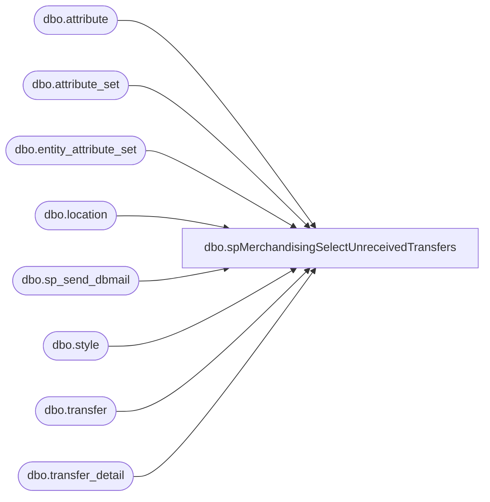

# dbo.spMerchandisingSelectUnreceivedTransfers

**Database:** me_01  
**Server:** bedrockdb02  

## Architecture Diagram



## Table Dependencies

| Referenced Table |
|---|
| dbo.attribute |
| dbo.attribute_set |
| dbo.entity_attribute_set |
| dbo.location |
| dbo.sp_send_dbmail |
| dbo.style |
| dbo.transfer |
| dbo.transfer_detail |

## Stored Procedure Code

```sql
CREATE proc [dbo].[spMerchandisingSelectUnreceivedTransfers]

as 

-- =====================================================================================================
-- Name: spMerchandisingSelectUnreceivedTransfers
--
-- Description:	Captures unreceived transfers older than 2 days, sends email to distro team
--				
--				 
-- Revision History
--		Name:			Date:			Comments:
--		Dan Tweedie		07/02/2014		Created proc.	
-- =====================================================================================================

set nocount on

--get list of pool point locations
if(object_id('tempdb..#b') is not NULL) drop table #b
select l.location_id
into #b
from entity_attribute_set eas (nolock)
join location l (nolock) on eas.parent_id = l.location_id
join attribute_set att (nolock) on eas.attribute_set_id = att.attribute_set_id
	and att.attribute_set_code = 'POOL'
join attribute a (nolock) on att.attribute_id = a.attribute_id 
	and a.parent_type = 2
	and a.attribute_code = 'type'


--get tranfers and shipments received today with condos or bales from pool point locations 
if(object_id('tempdb..##receiptz') is not NULL) drop table ##receiptz
select 'Transfer' as Document,
	    t.document_no,
		s.style_code,
		s.short_desc,
		count(distinct td.carton_no) cartons,
		sum(td.units_sent) units,
		l.location_code
into ##receiptz
from transfer t (nolock)
join transfer_detail td (nolock) on t.transfer_id = td.transfer_id
join style s (nolock) on td.style_id = s.style_id
join #b b on t.from_location_id = b.location_id
join location l (nolock) on t.to_location_id = l.location_id
where datediff(dd, t.create_date, getdate()) > 2
and t.document_status = 3
group by t.document_no, s.style_code, s.short_desc, l.location_code
order by 7, 2, 3

if (select count(*) from ##receiptz) > 0

begin
	declare @text nvarchar(max)
	
	set @text = '
	<font face =arial size = 2> '  +
		'</b><H1>Unreceived Pool Point Transfers Older Than 2 Days</H1>' +
		'<table border="1">' +
		'<tr><th>DOCUMENT#</th><th>STYLE</th><th>SHORT DESCRIPTION</th><th>CARTONS</th><th>UNITS</th><th>LOCATION CODE</th></tr>' +
		CAST ( ( SELECT td = document_no, '',
						td = style_code, '',
						td = short_desc, '',
						td = cartons, '',
						td = units, '',
						td = location_code, ''
				  from ##receiptz
				  order by location_code, document_no, style_code
				  FOR XML PATH('tr'), TYPE 
		) AS NVARCHAR(MAX) ) +
		'</font></table></font></p></p><br>'
    
	exec msdb.dbo.sp_send_dbmail
	@profile_name = 'merchadmin',
    @recipients = 'distrobears@buildabear.com',
    @body = @text,
	@subject = 'Unreceived Pool Point Transfers Older Than 2 Days',
	@body_format = 'HTML'

end
```

