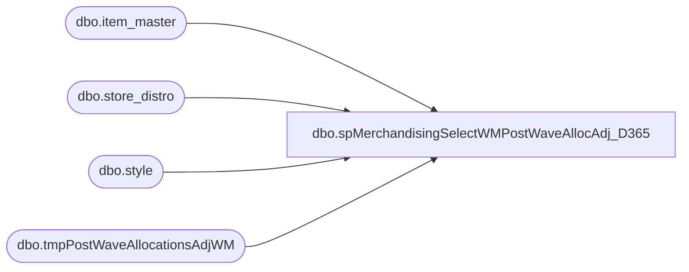

# dbo.spMerchandisingSelectWMPostWaveAllocAdj_D365

**Database:** me_01  
**Server:** bedrockdb02  

## Architecture Diagram



## Table Dependencies

| Referenced Table |
|---|
| dbo.item_master |
| dbo.store_distro |
| dbo.style |
| dbo.tmpPostWaveAllocationsAdjWM |

## Stored Procedure Code

```sql
CREATE proc [dbo].[spMerchandisingSelectWMPostWaveAllocAdj_D365]

as 
-- =====================================================================================================
-- Name: spMerchandisingSelectWMPostWaveAllocAdj
--
-- Description:	Stages WM post-wave allocation adjustment records
--
-- Revision History
--		Name:			Date:			Comments:
--		Dan Tweedie		05/07/2015		created proc
--		Tim Callahan	06/28/2018		Updated Proc to exlude Distros ("POs") that start with SO or TR
-- =====================================================================================================


set nocount on 

---get list of active styles from Merch
IF (Object_ID('tempdb..#style') IS NOT NULL) DROP TABLE #style
select style_code
into #style
from style with (nolock)
where active_flag = 1

IF (Object_ID('me_01..tmpPostWaveAllocationsAdjWM') IS NOT NULL) DROP TABLE tmpPostWaveAllocationsAdjWM
select sd.po_nbr as distribution_no, -- distribution document #?
	sd.ref_field_1 as distribution_line_no,
	'000000' + im.style as upc_no,
	left(sd.store_nbr,4) as location_code,
	case when im.store_dept = 'SUP'
	then
		cast(sum(sd.wave_alloc_qty/std_pack_qty) as int)
	else
		cast(sum(sd.wave_alloc_qty)	as int)
	end as allocated_units 
into tmpPostWaveAllocationsAdjWM
from wmdb01.wmprod.dbo.store_distro sd with (nolock)
join wmdb01.wmprod.dbo.item_master im (nolock) on sd.sku_id = im.sku_id
where datediff(dd,sd.mod_date_time,getdate()) = 0
and	sd.stat_code in (90,95,99) -- Shorted and cancelled.
and sd.po_nbr not like 'SD%'--not sure what this is
and im.style in (select style_code from #style)
and sd.dsgnated_serv_lvl not in ('33', '34', '35', '36', '37') --costco
and (sd.po_nbr not like 'SO%' OR sd.po_nbr not  like 'TR%') -- Added 6/28/2018
group by sd.po_nbr, sd.ref_field_1,im.style,left(sd.store_nbr,4),im.std_pack_qty,
im.store_dept
order by sd.po_nbr, distribution_line_no

if (select count(*) from tmpPostWaveAllocationsAdjWM) > 0

begin
		------------------------------------
		--OUTPUT ALLOCATION ADJUSTMENT FILE
		------------------------------------
		declare @query_alloc varchar(1000),
				@date_alloc varchar(200),
				@file_name_alloc varchar(100),
				@file_location_alloc varchar(100),
				@server_alloc varchar(20),
				@database_alloc varchar(20),
				@sqlcmd_alloc varchar(1000)

		set @date_alloc = convert(varchar, datepart(yyyy, getdate())) + convert(varchar, datepart(mm, getdate())) + convert(varchar, datepart(dd, getdate())) + convert(varchar, datepart(hh, getdate())) + convert(varchar, datepart(mi, getdate())) + convert(varchar, datepart(ss, getdate()))
		set @query_alloc = 'set nocount on exec me_01.dbo.spMerchandisingOutputWMPostWaveAllocAdj'
		set @file_location_alloc = '\\pipeapp01\Company01\Text File to AR Import Tables - Allocation Adjustment\'
		set @file_name_alloc = 'NSBIMALLADJUSTMENT.WMPostWave.' + @date_alloc + '.GO'
		set @server_alloc = 'bedrockdb02'
		set @database_alloc = 'me_01'
		set @sqlcmd_alloc = 'sqlcmd -S' + @server_alloc + ' -d' + @database_alloc + ' -Q' + '"' + @query_alloc + '"' + ' -o' + '"' + @file_location_alloc + @file_name_alloc + '"' + ' -w1000 -W'
		exec master..xp_cmdshell @sqlcmd_alloc

end
```

