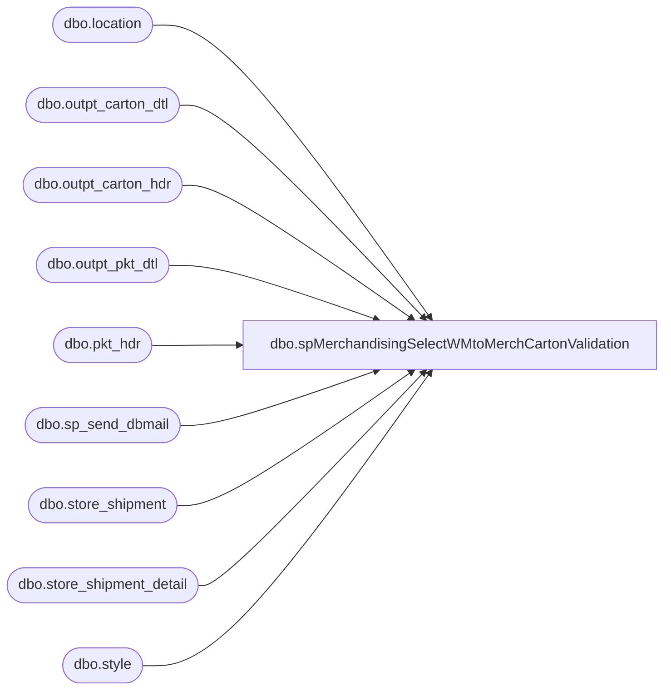

# dbo.spMerchandisingSelectWMtoMerchCartonValidation

**Database:** me_01  
**Server:** bedrockdb02  

## Architecture Diagram



## Table Dependencies

| Referenced Table |
|---|
| dbo.location |
| dbo.outpt_carton_dtl |
| dbo.outpt_carton_hdr |
| dbo.outpt_pkt_dtl |
| dbo.pkt_hdr |
| dbo.sp_send_dbmail |
| dbo.store_shipment |
| dbo.store_shipment_detail |
| dbo.style |

## Stored Procedure Code

```sql
CREATE proc [dbo].[spMerchandisingSelectWMtoMerchCartonValidation]
as
-- =====================================================================================================
-- Name: spMerchandisingSelectWMtoMerchCartonValidation
--
-- Description:	Checks for WM cartons shipped that are not in Merch, sends alert
--				
--
-- Input:	NA
--
-- Output: 
--			
--
-- Dependencies: 
--
-- Revision History
--		Name:			Date:			Comments:
--		Dan Tweedie		08/19/2014		Created proc
--		Dan Tweedie		09/09/2014	    Added filter to exclude non-Merch styles
--		Dan Tweedie		09/18/2014		Added filter to exclude non-Merch locations (Costco, for example)
--		Tim Callahan	07/05/2018		Added filter to exdlue D365 distro cartons 
-- =====================================================================================================

set nocount on 

IF (Object_ID('tempdb..##cartons') IS NOT NULL) DROP TABLE ##cartons
select distinct
	   och.create_date_time,
	   ph.shipto,
	   och.trlr_nbr as wm_shipment,
	   och.carton_nbr as wm_carton,
       isnull(ss.document_no, 'NULL') as merch_shipment,
	   isnull(ssd.carton_no, 'NULL') as merch_carton
into ##cartons
from wmdb01.wmprod.dbo.outpt_carton_hdr och 
join wmdb01.wmprod.dbo.pkt_hdr ph (nolock) on och.pkt_ctrl_nbr = ph.pkt_ctrl_nbr
join wmdb01.wmprod.dbo.outpt_carton_dtl ocd (nolock) on och.carton_nbr = ocd.carton_nbr
join wmdb01.wmprod.dbo.outpt_pkt_dtl opd on ocd.pkt_ctrl_nbr = opd.pkt_ctrl_nbr -- Added 7/5/2018
		and ocd.pkt_seq_nbr = opd.pkt_seq_nbr -- Added 7/5/2018
left join store_shipment_detail ssd (nolock) on och.carton_nbr = ssd.carton_no
left join store_shipment ss (nolock) on ssd.store_shipment_id = ss.store_shipment_id
join style s (nolock) on ocd.style = s.style_code and s.active_flag = 1
join location l (nolock) on left(ph.shipto, 4) = l.location_code and ph.shipto not like '9____'--excludes non-Merch locations
where ph.ord_type is null --means this is not a web carton
and opd.PO_NBR not like 'T%' -- Added 7/5/2018
and opd.PO_NBR not like 'S%' -- Added 7/5/2018
and ssd.carton_no is null
and och.proc_stat_code <> 99
and datediff(dd, och.create_date_time, getdate()) <= 1
order by och.create_date_time, ph.shipto, och.carton_nbr


if (select count(*) from ##cartons) > 0

begin
	declare @text nvarchar(max)
	set @text = '<font face =arial size = 2>' + 
			'WM to Merch Shipment & Carton Validation' +
			'<br>'+
				'<table border="1">' +
				'<tr><th>Ship Date</th><th>Destination</th><th>WM Shipment</th><th>WM Carton</th><th>Merch Shipment</th><th>Merch Carton</th></tr>' +
				CAST ( ( SELECT td = convert(varchar, create_date_time, 101), '',
								td = shipto, '',
								td = wm_shipment, '',
								td = wm_carton, '',
								td = merch_shipment, '',
								td = merch_carton, ''
						  from ##cartons
						  order by convert(varchar, create_date_time, 101), shipto, wm_shipment, wm_carton
						  FOR XML PATH('tr'), TYPE 
				) AS NVARCHAR(MAX) ) +
				'</font></table></font></p></p>
				<br>
				<br>'

				EXEC bedrockdb02.msdb.dbo.sp_send_dbmail
				@recipients = 'EntSysSupport@buildabear.com;',
				@body = @text,
				@subject = 'WM to Merch Shipment & Carton Validation',
				@profile_name = 'MerchAdmin',
				@body_format = 'HTML'

end
```

