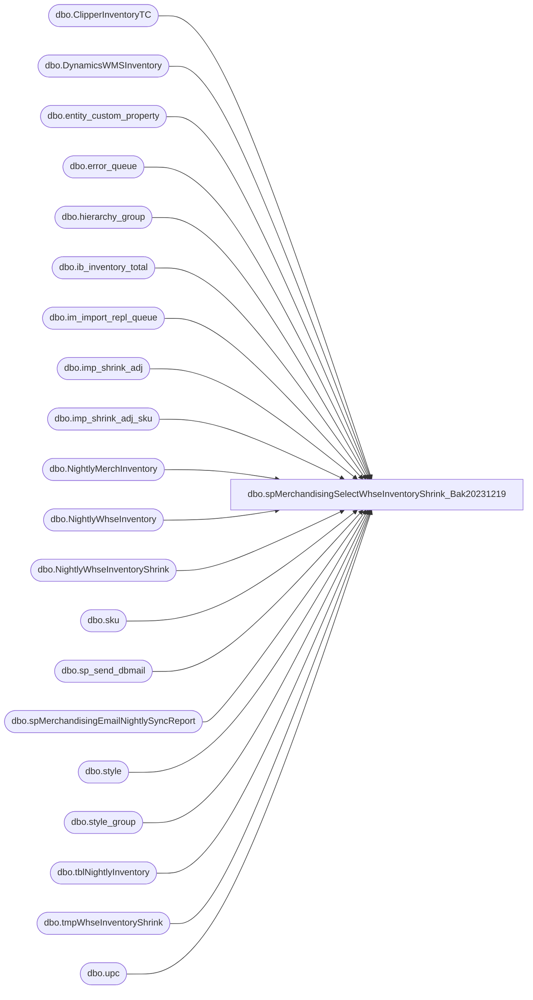

# dbo.spMerchandisingSelectWhseInventoryShrink_Bak20231219

**Database:** me_01  
**Server:** bedrockdb02  

## Architecture Diagram



## Table Dependencies

| Referenced Table |
|---|
| dbo.ClipperInventoryTC |
| dbo.DynamicsWMSInventory |
| dbo.entity_custom_property |
| dbo.error_queue |
| dbo.hierarchy_group |
| dbo.ib_inventory_total |
| dbo.im_import_repl_queue |
| dbo.imp_shrink_adj |
| dbo.imp_shrink_adj_sku |
| dbo.NightlyMerchInventory |
| dbo.NightlyWhseInventory |
| dbo.NightlyWhseInventoryShrink |
| dbo.sku |
| dbo.sp_send_dbmail |
| dbo.spMerchandisingEmailNightlySyncReport |
| dbo.style |
| dbo.style_group |
| dbo.tblNightlyInventory |
| dbo.tmpWhseInventoryShrink |
| dbo.upc |

## Stored Procedure Code

```sql
CREATE proc [dbo].[spMerchandisingSelectWhseInventoryShrink_Bak20231219]
as

-- =====================================================================================================
-- Name: spMerchandisingSelectWhseInventoryShrink
--
-- Description:	Compares inventory by whse/style in merch versus data provided by warehouses, outputs difference
--
-- Input: N/A
--
-- Output: 
--
-- Dependencies: 
--
-- Revision History
--		Name:			Date:			Comments:
--		Dan Tweedie		04/02/2012		Created proc.	
--		Dan Tweedie		07/24/2012		Altered proc to correctly identify skus with qty's less than 0 in Merch
--		Dan Tweedie		05/19/2015		Altered proc to include capturing of Outlet inventory (location 920) in WM and Merch
--		Dan Tweedie		03/01/2016		Altered proc to include Shanghai warehouse
--		Dan Tweedie		08/11/2017		Added statement to delete from NightlyWhseInventory where datediff(dd, load_date, getdate()) > 365
--		Tim Callahan	10/23/2017		Altered proc , specifically  "capture 2970 inventory" staging data section 
--										Clipper started sending some zero unit "housekeeping" style_codes that were longer than 10 characters
--										Increased style_code field max characters from 10 to 20 characters
--		Tim Callahan	01/09/2018		Added logic to exclude desire locations from pipeline file, this is to assist with PI exclusion 
--		Tim Callahan	05/06/2019		Temp added error handling for when all of 0013 records are zero
--		Lizzy Timm		02/16/2020		Updated logic for WM go live to pull data from temp table containing Dynamics information rather than Manhattan on WMDB01 
--		Lizzy Timm		04/28/2020		Enabled logic for Dynamics information;  Added logic to consolidate and compare the inventory of locations 0980 and 0013 to D365 warehouse 9980 then post to 0980 in Merch; Modified proc to exclude 0980 and 0013 supplies from sync per Dawn G.'s request
--		Tim Callahan	11/05/2020		Added Code to capture raw data from Clipper Inventory file tobe used for other reporting purposes 
--		Tim Callahan	06/14/2021		Added handling for all CN warehouses (3970,3980, 8502, 8505) for GoLive with Ocean East Logistics 
--		Dan Tweedie		2022-08-03		For insert into NightlyWhseInventory, added extra queries are to include the dynamics supply items / items not in aptos so these can be used for another process to sync to dynamics...
--		Tim Callahan	08/29/2023		Changed Dynamics Source for 980/13  warehouse inventory 
-- =====================================================================================================

set nocount on

---first execute pipeline segments to push pending data through
EXEC pipeapp01.master..xp_cmdshell 'PipelineScheduleClient Start 16003 0'--po receipts
EXEC pipeapp01.master..xp_cmdshell 'PipelineScheduleClient Start 16500 0' --shipments
EXEC pipeapp01.master..xp_cmdshell 'PipelineScheduleClient Start 16499 0' --cartons
EXEC pipeapp01.master..xp_cmdshell 'PipelineScheduleClient Start 16506 0' --shrink adjustments
EXEC pipeapp01.master..xp_cmdshell 'PipelineScheduleClient Start 19000 0' --write to prod tables
----------------------------------------------------------------------------------------------------


---capture list of 'active' styles (as opposed to inactive styles)
IF (Object_ID('tempdb..#active') IS NOT NULL) DROP TABLE #active
select s.style_code, s.short_desc, 
case when substring(hg.hierarchy_group_code,7,2)='60' then 'SUP' else 'MERCH' end as style_type,
case when substring(hg.hierarchy_group_code,7,2)='60' 
		then isnull(ecp.custom_property_value,1) 
		else s.distribution_multiple 
	end as DistMult
into #active
from style s (nolock)
join style_group sg (nolock) on s.style_id = sg.style_id
join hierarchy_group hg (nolock) on hg.hierarchy_group_id = sg.hierarchy_group_id
left join entity_custom_property ecp (nolock) on ecp.parent_id = s.style_id
	and	ecp.custom_property_id = 2 -- FRCSTM
	and parent_type = 1
where s.active_flag = 1


--Capture inventory from Merch for each warehouse and webstore 13
IF (Object_ID('tempdb..#merch') IS NOT NULL) DROP TABLE #merch
/* -- Remark out for 2970 PI
select  '2970' location_code,
		s.style_code,
		s.short_desc,
		case when ecp.custom_property_value is not null and substring(hg.hierarchy_group_code,7,2)='60'
		then sum(iit.total_on_hand_units * ecp.custom_property_value)
		else sum(iit.total_on_hand_units)
		end "Units"
into #merch
from 		ib_inventory_total iit
inner join	sku sk
on		iit.sku_id = sk.sku_id
and		iit.location_id = 115 -- 2970
and		iit.inventory_status_id = 1
inner join	style s
on		sk.style_id = s.style_id
join 		style_group sg
on 		s.style_id = sg.style_id
join 		hierarchy_group hg
on 		hg.hierarchy_group_id = sg.hierarchy_group_id
left join 	entity_custom_property ecp
on 		ecp.parent_id = s.style_id
and 		ecp.custom_property_id = 2 -- FRCSTM
and		parent_type = 1
where s.active_flag = 1
group by  s.style_code,s.short_desc,ecp.custom_property_value,hg.hierarchy_group_code
union all -- Remark out for 0980 PI
*/ -- Remark out for 2970 PI 
--/* -- Remark out for 0980 PI
select 	'0980' location_code,
		s.style_code,
		s.short_desc,
		case when ecp.custom_property_value is not null and substring(hg.hierarchy_group_code,7,2)='60' 
		then sum(iit.total_on_hand_units * ecp.custom_property_value)
		else sum(iit.total_on_hand_units)
		end "Units"
into #merch -- Remark out for 2970 PI 
from 		ib_inventory_total iit
inner join	sku sk
on		iit.sku_id = sk.sku_id
and		iit.location_id IN ('59','705') -- 59=0980, 705=1000; Requested to compare 980 + 1000 quantities to warehouse 9980 then post to 980 in Merch
and		iit.inventory_status_id = 1
inner join	style s
on		sk.style_id = s.style_id
join 		style_group sg
on 		s.style_id = sg.style_id
join 		hierarchy_group hg
on 		hg.hierarchy_group_id = sg.hierarchy_group_id
left join 	entity_custom_property ecp
on 		ecp.parent_id = s.style_id
and 		ecp.custom_property_id = 2 -- FRCSTM
and		parent_type = 1
where	s.active_flag = 1
group by  s.style_code,s.short_desc,ecp.custom_property_value,hg.hierarchy_group_code
--*/ -- Remark out for 0980 PI 
--/* -- Remark out for 0013 PI
union all
select 	'0013' location_code,
		s.style_code,
		s.short_desc,
		sum(iit.total_on_hand_units) as "Units"
from 		ib_inventory_total iit
inner join	sku sk
on		iit.sku_id = sk.sku_id
and		iit.location_id in (167,281,65) -- Webstore + RideMakerz + Canada
and		iit.inventory_status_id in (1, 9) -- Added inventory status 9 for ES reserved inventory.  Keith -> 9/21/2017
inner join	style s
on		sk.style_id = s.style_id
join 		style_group sg
on 		s.style_id = sg.style_id
join 		hierarchy_group hg
on 		hg.hierarchy_group_id = sg.hierarchy_group_id
and		substring(hg.hierarchy_group_code,7,2) <>'60' 
left join 	entity_custom_property ecp
on 		ecp.parent_id = s.style_id
and 		ecp.custom_property_id = 2 -- FRCSTM
and		parent_type = 1
where s.active_flag = 1
group by  s.style_code,s.short_desc,ecp.custom_property_value,hg.hierarchy_group_code
--*/ -- Remark out for 0013 PI
--/* -- Remark out for 0960 PI
union all
select 	'0960' location_code,
		s.style_code,
		s.short_desc,
		case when ecp.custom_property_value is not null and substring(hg.hierarchy_group_code,7,2) ='60' 
then sum(iit.total_on_hand_units * ecp.custom_property_value)
		else sum(iit.total_on_hand_units)
		end "Units"
from 		ib_inventory_total iit
inner join	sku sk
on		iit.sku_id = sk.sku_id
and		iit.location_id = 58 --0960
and		iit.inventory_status_id = 1
inner join	style s
on		sk.style_id = s.style_id
join 		style_group sg
on 		s.style_id = sg.style_id
join 		hierarchy_group hg
on 		hg.hierarchy_group_id = sg.hierarchy_group_id
left join 	entity_custom_property ecp
on 		ecp.parent_id = s.style_id
and 		ecp.custom_property_id = 2 -- FRCSTM
and		parent_type = 1
where s.active_flag = 1
group by  s.style_code,s.short_desc,ecp.custom_property_value,hg.hierarchy_group_code
--*/ -- Remark out for 0960 PI
union
select  '3970' location_code,
		s.style_code,
		s.short_desc,
		case when ecp.custom_property_value is not null and substring(hg.hierarchy_group_code,7,2)='60'
		then sum(iit.total_on_hand_units * ecp.custom_property_value)
		else sum(iit.total_on_hand_units)
		end "Units"
from 		ib_inventory_total iit
inner join	sku sk
on		iit.sku_id = sk.sku_id
and		iit.location_id = 774-- 3970
and		iit.inventory_status_id = 1
inner join	style s
on		sk.style_id = s.style_id
join 		style_group sg
on 		s.style_id = sg.style_id
join 		hierarchy_group hg
on 		hg.hierarchy_group_id = sg.hierarchy_group_id
left join 	entity_custom_property ecp
on 		ecp.parent_id = s.style_id
and 		ecp.custom_property_id = 2 -- FRCSTM
and		parent_type = 1
where s.active_flag = 1
group by  s.style_code,s.short_desc,ecp.custom_property_value,hg.hierarchy_group_code
union select  '3980' location_code,
		s.style_code,
		s.short_desc,
		case when ecp.custom_property_value is not null and substring(hg.hierarchy_group_code,7,2)='60'
		then sum(iit.total_on_hand_units * ecp.custom_property_value)
		else sum(iit.total_on_hand_units)
		end "Units"
from 		ib_inventory_total iit
inner join	sku sk
on		iit.sku_id = sk.sku_id
and		iit.location_id = 775 -- 3980
and		iit.inventory_status_id = 1
inner join	style s
on		sk.style_id = s.style_id
join 		style_group sg
on 		s.style_id = sg.style_id
join 		hierarchy_group hg
on 		hg.hierarchy_group_id = sg.hierarchy_group_id
left join 	entity_custom_property ecp
on 		ecp.parent_id = s.style_id
and 		ecp.custom_property_id = 2 -- FRCSTM
and		parent_type = 1
where s.active_flag = 1
group by  s.style_code,s.short_desc,ecp.custom_property_value,hg.hierarchy_group_code
union 
select  '8502' location_code,
		s.style_code,
		s.short_desc,
		case when ecp.custom_property_value is not null and substring(hg.hierarchy_group_code,7,2)='60'
		then sum(iit.total_on_hand_units * ecp.custom_property_value)
		else sum(iit.total_on_hand_units)
		end "Units"
from 		ib_inventory_total iit
inner join	sku sk
on		iit.sku_id = sk.sku_id
and		iit.location_id = 915 -- 8502
and		iit.inventory_status_id = 1
inner join	style s
on		sk.style_id = s.style_id
join 		style_group sg
on 		s.style_id = sg.style_id
join 		hierarchy_group hg
on 		hg.hierarchy_group_id = sg.hierarchy_group_id
left join 	entity_custom_property ecp
on 		ecp.parent_id = s.style_id
and 		ecp.custom_property_id = 2 -- FRCSTM
and		parent_type = 1
where s.active_flag = 1
group by  s.style_code,s.short_desc,ecp.custom_property_value,hg.hierarchy_group_code
union 
select  '8505' location_code,
		s.style_code,
		s.short_desc,
		case when ecp.custom_property_value is not null and substring(hg.hierarchy_group_code,7,2)='60'
		then sum(iit.total_on_hand_units * ecp.custom_property_value)
		else sum(iit.total_on_hand_units)
		end "Units"
from 		ib_inventory_total iit
inner join	sku sk
on		iit.sku_id = sk.sku_id
and		iit.location_id = 916 -- 8505
and		iit.inventory_status_id = 1
inner join	style s
on		sk.style_id = s.style_id
join 		style_group sg
on 		s.style_id = sg.style_id
join 		hierarchy_group hg
on 		hg.hierarchy_group_id = sg.hierarchy_group_id
left join 	entity_custom_property ecp
on 		ecp.parent_id = s.style_id
and 		ecp.custom_property_id = 2 -- FRCSTM
and		parent_type = 1
where s.active_flag = 1
group by  s.style_code,s.short_desc,ecp.custom_property_value,hg.hierarchy_group_code


-------------------------------------------------------------------------------
--ARCHIVE NIGHTLY SNAPSHOT OF MERCH INVENTORY
insert NightlyMerchInventory
select *, getdate() as capture_date
from #merch

-------------------------------------
-------capture whse/webstore inventories (from WM and 3PLs)
truncate table tblNightlyInventory

/* -- Remarked out for WM Dynamics go live
----capture webstore 13 inventory
	exec wmdb01.wmprod.dbo.WEB_INVN -- pre-existing procedure, called from multiple processes, writes to keith_webstore_inventory table
	insert tblNightlyInventory
	select '0013', wb.*
	from wmdb01.wmprod.dbo.keith_webstore_inventory wb
	join #active a on wb.sku = a.style_code
------------------------------------------
----capture 980 inventory
	exec wmdb01.wmprod.dbo.spWmSelectNightlySyncInventory ---> writes to BearhouseInventory table
	insert tblNightlyInventory
	select '0980', bh.*
	from wmdb01.wmprod.dbo.BearhouseInventory bh
	join #active a on bh.style = a.style_code
------------------------------------------
*/ -- Remarked out for WM Dynamics go live

------------------------------------------


--Capture 0980 and Webstore 0013 inventory, prestaged via SSIS from Dynamics WMS
	--insert tblNightlyInventory
	--select d.*
	--from DynamicsWMSInventoryStage d
	--join #active a on a.style_code = d.style_code

-- Replaced Above on 8/29/2023
	insert tblNightlyInventory
	select
	d.location_code,
	d.style_code,
	d.sku_desc,
	d.qty,
	getdate() as load_date
	from DynamicsWMSInventory d
	join #active a on a.style_code = d.style_code


--capture 960 inventory
IF (Object_ID('tempdb..#wc_files') IS NOT NULL) DROP TABLE #wc_files
create table #wc_files (output varchar(1000))
insert #wc_files exec master..xp_cmdshell 'dir \\kermode\FileRepository\MERCHANDISING\WC_Distro\INVENTORY\*.txt /B'
delete from #wc_files where output is null or output = 'File Not Found'
OR output not like '%.txt%'

IF (Object_ID('tempdb..#tmp960') IS NOT NULL) DROP TABLE #tmp960
create table #tmp960
(a varchar(10), b varchar(10), style_code varchar(52), onhand int, onhold int, available int)

if (select count(*) from #wc_files) > 0

begin

declare @wc_bulk varchar(1000),
		@wc_file varchar(1000),
		@wc_move varchar(1000)
		
select @wc_file = max(output) from #wc_files
set @wc_bulk = 'bulk insert #tmp960 from ''\\kermode\FileRepository\MERCHANDISING\WC_Distro\INVENTORY\' + @wc_file + ''' with (FIELDTERMINATOR = ''	'', ROWTERMINATOR = ''\n'')'
exec (@wc_bulk)

select @wc_move = 'move \\kermode\FileRepository\MERCHANDISING\WC_Distro\INVENTORY\*.txt \\kermode\FileRepository\MERCHANDISING\WC_Distro\INVENTORY\Done'
exec master..xp_cmdshell @wc_move

insert tblNightlyInventory
select '0960', t.style_code, a.short_desc, t.onhand - t.onhold, getdate()
from #tmp960 t
join #active a on t.style_code = a.style_code
and len(t.style_code) = 6

end


-----------------------------------------
--capture 2970 inventory
IF (Object_ID('tempdb..#uk_files') IS NOT NULL) DROP TABLE #uk_files
create table #uk_files (output varchar(1000))
insert #uk_files exec master..xp_cmdshell 'dir \\kermode\FileRepository\MERCHANDISING\UK_Distro\INVENTORY\*.txt /B'
delete from #uk_files where output is null or output = 'File Not Found'
OR output not like '%.txt%'

IF (Object_ID('tempdb..#tmp2970') IS NOT NULL) DROP TABLE #tmp2970
create table #tmp2970
(style_code varchar(20), booked int, available int, allocated int) -- Changed Style_Code max character from 10 to 20 on 10/23/2017

if (select count(*) from #uk_files) > 0

begin


declare @uk_bulk varchar(1000),
		@uk_file varchar(1000),
		@uk_move varchar(1000)
		
select @uk_file = max(output) from #uk_files
set @uk_bulk = 'bulk insert #tmp2970 from ''\\kermode\FileRepository\MERCHANDISING\UK_Distro\INVENTORY\' + @uk_file + ''' with (FIELDTERMINATOR = '','', ROWTERMINATOR = ''\n'')'
exec (@uk_bulk)

select @uk_move = 'move \\kermode\FileRepository\MERCHANDISING\UK_Distro\INVENTORY\*.txt \\kermode\FileRepository\MERCHANDISING\UK_Distro\INVENTORY\Done'
exec master..xp_cmdshell @uk_move

-- Added 11/05/2020
-- Capturing Raw Data from Clipper file for other reporting purposes as the only active Aptos styles are captured for the sync process
	truncate table ClipperInventoryTC
	insert ClipperInventoryTC
	select *
	from #tmp2970
-- End of new code 


insert tblNightlyInventory
select '2970', t.style_code, a.short_desc, t.available + t.allocated, getdate()
from #tmp2970 t
join #active a on t.style_code = a.style_code
and len(t.style_code) = 6

end


------------------------------------------
----
------------------------------------------
--Capture China Warehouse Inventory for Warehouses 3970, 3980, 8502, 8505
IF (Object_ID('tempdb..#cn_files') IS NOT NULL) DROP TABLE #cn_files
create table #cn_files (output varchar(1000))
insert #cn_files exec master..xp_cmdshell 'dir \\kermode\FileRepository\MERCHANDISING\cn_Distro\INBOUND\INVENTORY\*.csv /B'
delete from #cn_files where output is null or output = 'File Not Found'
OR output not like '%.csv%'

IF (Object_ID('tempdb..#tmpCN') IS NOT NULL) DROP TABLE #tmpCN
create table #tmpCN
(location_code varchar(4), style_code varchar(10), booked int, available int, allocated int)

if (select count(*) from #cn_files) > 0


begin

--Old Code, added loop to handle multiple files (one for each warehouse) 
/*
declare @cn_bulk varchar(1000),
		@cn_file varchar(1000),
		@cn_move varchar(1000)
		
select @cn_file = max(output) from #cn_files
set @cn_bulk = 'bulk insert #tmpCN from ''\\kermode\FileRepository\MERCHANDISING\cn_Distro\INBOUND\INVENTORY\' + @cn_file + ''' with (FIELDTERMINATOR = '','', ROWTERMINATOR = ''\n'')'
exec (@cn_bulk)

select @cn_move = 'move \\kermode\FileRepository\MERCHANDISING\cn_Distro\INBOUND\INVENTORY\*.csv \\kermode\FileRepository\MERCHANDISING\cn_Distro\INBOUND\INVENTORY\Done'
exec master..xp_cmdshell @cn_move

*/

declare @cn_bulk varchar(1000),
		@cn_file varchar(1000),
		@cn_move varchar(1000), 
		@Files int
		
select @Files = count (*) from #cn_files

while @Files > 0 
	Begin 
		select @cn_file = max(output) from #cn_files
		set @cn_bulk = 'bulk insert #tmpCN from ''\\kermode\FileRepository\MERCHANDISING\cn_Distro\INBOUND\INVENTORY\' + @cn_file + ''' with (FIELDTERMINATOR = '','', ROWTERMINATOR = ''\n'')'
		exec (@cn_bulk)

		select @cn_move = 'move \\kermode\FileRepository\MERCHANDISING\cn_Distro\INBOUND\INVENTORY\' +@cn_file +' \\kermode\FileRepository\MERCHANDISING\cn_Distro\INBOUND\INVENTORY\Done'
		exec master..xp_cmdshell @cn_move


		delete from #cn_files where output = @cn_file

		select @Files = count (*) from #cn_files
		if @Files < 1 
			break
		else
			continue
	end 

insert tblNightlyInventory
select location_code, t.style_code, a.short_desc, t.available + t.allocated, getdate()
from #tmpCN t
join #active a on t.style_code = a.style_code
and len(t.style_code) = 6

end

------------------------------------------

---archive whse inventory snapshot
	delete
	from NightlyWhseInventory
	where datediff(dd, load_date, getdate()) > 365

	insert NightlyWhseInventory
	select * 
	from tblNightlyInventory
	---the extra queries are to include the dynamics supply items / items not in aptos so these can be used for another process to sync to dynamics...
	UNION
	select '0960', t.style_code, NULL, t.onhand - t.onhold, getdate()
	from #tmp960 t
	where t.style_code not in (select style_code from #active)
	and isnumeric(style_code)=1
	and len(style_code)=6
	UNION
	select '2970', t.style_code, NULL, t.available + t.allocated, getdate()
	from #tmp2970 t
	where t.style_code not in (select style_code from #active)
	and isnumeric(style_code)=1
	and len(style_code)=6
	UNION
	select location_code, t.style_code, NULL, t.available + t.allocated, getdate()
	from #tmpcn t
	where t.style_code not in (select style_code from #active)
	and isnumeric(style_code)=1
	and len(style_code)=6
---------------------------

-----COMPARE INVENTORY - OUTPUT DIFFERENCE
IF (Object_ID('tempdb..#total_summary') IS NOT NULL) DROP TABLE #total_summary

select M.*, W.W0013, W.W0980, W.W0960, W.W2970, W.W3970, W.W3980,W.W8502, W.W8505
into #total_summary 
from 
(
select M.style_code, M.short_desc, M.style_type, M.distmult,
sum(M.loc_0013) M0013, sum(M.loc_0980) M0980, sum(M.loc_0960) M0960, sum(M.loc_2970) M2970, sum(M.loc_3970) M3970, sum(M.loc_3980) M3980,  sum(M.loc_8502) M8502, sum(M.loc_8505) M8505
--new line above, previously the 'sum' was a 'max'
from 
	(select a.style_code,
		   a.short_desc, 
		   a.style_type,
		   a.distmult,
		   case when M.location_code = '0013' then M.units else 0 end as 'loc_0013',
		   case when M.location_code = '0980' then M.units else 0 end as 'loc_0980',
		   case when M.location_code = '0960' then M.units else 0 end as 'loc_0960',
		   case when M.location_code = '2970' then M.units else 0 end as 'loc_2970',
		   case when M.location_code = '3970' then M.units else 0 end as 'loc_3970',
		   case when M.location_code = '3980' then M.units else 0 end as 'loc_3980',
		   case when M.location_code = '8502' then M.units else 0 end as 'loc_8502',
		   case when M.location_code = '8505' then M.units else 0 end as 'loc_8505'
	from #active a
	left join #merch M on a.style_code = M.style_code) M
group by M.style_code, M.short_desc, M.style_type, M.distmult
) M
join 
(
select M.style_code, M.short_desc, M.style_type, M.distmult,
sum(M.loc_0013) W0013, sum(M.loc_0980) W0980, sum(M.loc_0960) W0960, sum(M.loc_2970) W2970, sum(M.loc_3970) W3970, sum(M.loc_3980) W3980,  sum(M.loc_8502) W8502,  sum(M.loc_8505) W8505
--new line above, previously the 'sum' was a 'max'
from 
	(select a.style_code,
		   a.short_desc,
		   a.style_type,
		   a.distmult,
		   case when M.location_code = '0013' then M.qty else 0 end as 'Loc_0013',
		   case when M.location_code = '0980' then M.qty else 0 end as 'Loc_0980',
		   case when M.location_code = '0960' then M.qty else 0 end as 'Loc_0960',
		   case when M.location_code = '2970' then M.qty else 0 end as 'Loc_2970',
		   case when M.location_code = '3970' then M.qty else 0 end as 'Loc_3970',
		   case when M.location_code = '3980' then M.qty else 0 end as 'Loc_3980',
		   case when M.location_code = '8502' then M.qty else 0 end as 'Loc_8502',
		   case when M.location_code = '8505' then M.qty else 0 end as 'Loc_8505'
	from #active a
	left join tblNightlyInventory M on a.style_code = M.style_code) M
group by M.style_code, M.short_desc, M.style_type, M.distmult
) W on M.style_code = W.style_code
where M.M0013 <> W.W0013
or    M.M0980 <> W.W0980
or	  M.M0960 <> W.W0960
or	  M.M2970 <> W.W2970
or	  M.M3970 <> W.W3970
or	  M.M3980 <> W.W3980
or	  M.M8502 <> W.W8502
or	  M.M8505 <> W.W8505
order by M.style_code
----------------------------------------

IF (Object_ID('me_01..tmpWhseInventoryShrink') IS NOT NULL) DROP TABLE tmpWhseInventoryShrink
--/* -- Remark out for 0013 PI
select '0013' location_code,
	   ts.style_code,
	   ts.short_desc,
	   ts.M0013 MerchQty,
	   ts.W0013 Whseqty,
	   ts.M0013-ts.W0013 shrinkqty,
	   ts.style_type,
	   ts.M0013-ts.W0013 shrinkqty_distribution_multiple
into tmpWhseInventoryShrink
from #total_summary ts
where ts.M0013-ts.W0013 <> 0
AND ts.style_type <> 'SUP' -- LT Added 02/16 per Dawn G.'s request to exclude 1013 supplies from sync
union all
--*/ -- Remark out for 0013 PI
--/* -- Remark out for 0980 PI
select '0980' location_code,
	   ts.style_code,
	   ts.short_desc,
	   ts.M0980 MerchQty,
	   ts.W0980 Whseqty,
	   ts.M0980-ts.W0980 shrinkqty,
	   ts.style_type,
	   case when ts.style_type = 'SUP' then (ts.M0980-ts.W0980)/ts.distmult 
	   else ts.M0980-ts.W0980 end as shrinkqty_distribution_multiple
--into tmpWhseInventoryShrink -- remark out after PI 
from #total_summary ts 
where ts.M0980-ts.W0980 <> 0
AND ts.style_type <> 'SUP' -- LT Added 02/16 per Dawn G.'s request to exclude 9980 supplies from sync
union all
--*/ -- Remark out for 0980 PI
--/* -- Remark out for 0960 PI
select '0960' location_code,
	   ts.style_code,
	   ts.short_desc,
	   ts.M0960 MerchQty,
	   ts.W0960 Whseqty,
	   ts.M0960-ts.W0960 shrinkqty,
	   ts.style_type,
	   case when ts.style_type = 'SUP' then (ts.M0960-ts.W0960)/ts.distmult 
	   else ts.M0960-ts.W0960 end as shrinkqty_distribution_multiple
-- into tmpWhseInventoryShrink -- This will need to remarked out after adding 0013 back in 
from #total_summary ts
where ts.M0960-ts.W0960 <> 0
union all
--*/ -- Remark out for 0960 PI
/* -- Remark out for 2970 PI
select '2970' location_code,
	   ts.style_code,
	   ts.short_desc,
	   ts.M2970 MerchQty,
	   ts.W2970 Whseqty,
	   ts.M2970-ts.W2970 shrinkqty,
	   ts.style_type,
	   case when ts.style_type = 'SUP' then (ts.M2970-ts.W2970)/ts.distmult 
	   else ts.M2970-ts.W2970 end as shrinkqty_distribution_multiple
from #total_summary ts
where ts.M2970-ts.W2970 <> 0
union all
*/ -- Remark out for 2970 PI
select '3970' location_code,
	   ts.style_code,
	   ts.short_desc,
	   ts.M3970 MerchQty,
	   ts.W3970 Whseqty,
	   ts.M3970-ts.W3970 shrinkqty,
	   ts.style_type,
	   case when ts.style_type = 'SUP' then (ts.M3970-ts.W3970)/ts.distmult 
	   else ts.M3970-ts.W3970 end as shrinkqty_distribution_multiple
from #total_summary ts
where ts.M3970-ts.W3970 <> 0
union all
select '3980' location_code,
	   ts.style_code,
	   ts.short_desc,
	   ts.M3980 MerchQty,
	   ts.W3980 Whseqty,
	   ts.M3980-ts.W3980 shrinkqty,
	   ts.style_type,
	   case when ts.style_type = 'SUP' then (ts.M3980-ts.W3980)/ts.distmult 
	   else ts.M3980-ts.W3980 end as shrinkqty_distribution_multiple
from #total_summary ts
where ts.M3980-ts.W3980 <> 0
union all
select '8502' location_code,
	   ts.style_code,
	   ts.short_desc,
	   ts.M8502 MerchQty,
	   ts.W8502 Whseqty,
	   ts.M8502-ts.W8502 shrinkqty,
	   ts.style_type,
	   case when ts.style_type = 'SUP' then (ts.M8502-ts.W8502)/ts.distmult 
	   else ts.M8502-ts.W8502 end as shrinkqty_distribution_multiple
from #total_summary ts
where ts.M8502-ts.W8502 <> 0
union all
select '8505' location_code,
	   ts.style_code,
	   ts.short_desc,
	   ts.M8505 MerchQty,
	   ts.W8505 Whseqty,
	   ts.M8505-ts.W8505 shrinkqty,
	   ts.style_type,
	   case when ts.style_type = 'SUP' then (ts.M8505-ts.W8505)/ts.distmult 
	   else ts.M8505-ts.W8505 end as shrinkqty_distribution_multiple
from #total_summary ts
where ts.M8505-ts.W8505 <> 0


order by 1,2


----if there's no file from the uk or ddc or CN, we shouldn't post a shrink

if (select count(*) from #wc_files) = 0 
	or 
   (select count(*) from #tmp960) = 0

	begin
	delete from tmpWhseInventoryShrink where location_code = '0960'
	insert tmpWhseInventoryShrink select '0960', 'n/a', 'n/a', 0, 0, 0, 'n/a', 0
	end

if (select count(*) from #uk_files) = 0 
	or
   (select count(*) from #tmp2970) = 0

	begin
	delete from tmpWhseInventoryShrink where location_code = '2970'
	insert tmpWhseInventoryShrink select '2970', 'n/a', 'n/a', 0, 0, 0, 'n/a', 0
	end

--if (select count(*) from #cn_files) = 0 
--	or
--   (select count(*) from #tmpcn) = 0

--	begin
--	delete from tmpWhseInventoryShrink where location_code in ('3970', '3980')
--	insert tmpWhseInventoryShrink select '3970', 'n/a', 'n/a', 0, 0, 0, 'n/a', 0
--	insert tmpWhseInventoryShrink select '3980', 'n/a', 'n/a', 0, 0, 0, 'n/a', 0
--	end

If (select count(*) from #tmpcn where location_code = '3970') = 0
	Begin
		delete from tmpWhseInventoryShrink where location_code = '3970'
		insert tmpWhseInventoryShrink select '3970', 'n/a', 'n/a', 0, 0, 0, 'n/a', 0
	End

If (select count(*) from #tmpcn where location_code = '3980') = 0
	Begin
		delete from tmpWhseInventoryShrink where location_code = '3980'
		insert tmpWhseInventoryShrink select '3980', 'n/a', 'n/a', 0, 0, 0, 'n/a', 0
	End

If (select count(*) from #tmpcn where location_code = '8502') = 0
	Begin
		delete from tmpWhseInventoryShrink where location_code = '8502'
		insert tmpWhseInventoryShrink select '8502', 'n/a', 'n/a', 0, 0, 0, 'n/a', 0
	End

If (select count(*) from #tmpcn where location_code = '8505') = 0
	Begin
		delete from tmpWhseInventoryShrink where location_code = '8505'
		insert tmpWhseInventoryShrink select '8505', 'n/a', 'n/a', 0, 0, 0, 'n/a', 0
	End


--archive nightly discrepancies
insert NightlyWhseInventoryShrink
select *, getdate()
from tmpWhseInventoryShrink
--------------------

-- Temporarily Added on 5/6/2019
-- The stored proc responsible for capturing inventory for 0013 failed 3 times in one week. 
-- This caused very large shrink adjustments which distorted the inventory levels. 
-- Will check the tmpWhseInventoryShrink if all records for 0013 are zero, then send an email to MerchAdmin and delete the records from the temp table
-- Also wanted to do it before the email to reduce confusion. 

--If (select count (style_code) as Total_Styles from tmpWhseInventoryShrink where location_code = '0013' ) 
--	 =  
--		(select count (whseqty) as Total_Zero from tmpWhseInventoryShrink where location_code = '0013' and Whseqty < 1 ) 

-- Begin 

--	 EXEC bedrockdb02.msdb.dbo.sp_send_dbmail
--			@recipients = 'TimC@buildabear.com',
--			@subject = 'Inventory Capture for nightly sync for 0013 Failed ',
--			@body = 'Inventory Capture for nightly sync for 0013 has failed. These records have been excluded from the nightly shrink adjustment file.',
--			@profile_name = 'MerchAdmin'


--	Delete from tmpWhseInventoryShrink where location_code = '0013'


-- End 


------generate outbound email
exec spMerchandisingEmailNightlySyncReport

---to ensure we don't try to post invalid qty's -- this step is after the email so the qty's will still be reported
if (select count(*) from tmpWhseInventoryShrink where shrinkqty_distribution_multiple like '%.%' or shrinkqty_distribution_multiple = 0) > 0 
begin
delete from tmpWhseInventoryShrink where shrinkqty_distribution_multiple like '%.%' or shrinkqty_distribution_multiple = 0
end

-- Temporary Add for Physical Inventory or other exclusion events-- Added 1/9/2019
-- Easiest way to exclude a location 
/*
if (select count(*) from tmpWhseInventoryShrink) > 0 
Begin

delete from tmpWhseInventoryShrink
where location_code in ('0980','0013')

end 

*/
-----generate nightly shrink file
if (select count(*) from tmpWhseInventoryShrink) > 0 

begin
	declare @query varchar(1000),
			@date varchar(200),
			@file_name varchar(100),
			@file_location varchar(100),
			@server varchar(20),
			@username varchar(20),
			@password varchar(20),
			@database varchar(20),
			@sqlcmd varchar(1000),
			@query_text varchar(4000)

	select @query_text = 'exec spMerchandisingOutputWhseInventoryShrink'
	set @date = convert(varchar, datepart(yyyy, getdate())) + convert(varchar, datepart(mm, getdate())) + convert(varchar, datepart(dd, getdate())) + convert(varchar, datepart(hh, getdate())) + convert(varchar, datepart(mi, getdate())) + convert(varchar, datepart(ss, getdate()))
	set @query = @query_text
	set @file_location = '\\pipeapp01\Company01\Text File to IM Import Tables- Import Shrink Adj\'
	set @file_name = 'STSIMSA.WhseSync.' + @date + '.GO'
	set @server = 'bedrockdb02'
	set @database = 'me_01'
	set @sqlcmd = 'sqlcmd -S' + @server + ' -d' + @database + ' -Q' + '"' + @query + '"' + ' -o' + '"' + @file_location + @file_name + '"' + ' -s"," -w100 -W'
	exec master..xp_cmdshell @sqlcmd
end

--------execute the pipeline segments
EXEC pipeapp01.master..xp_cmdshell 'PipelineScheduleClient Start 16506 0'

EXEC pipeapp01.master..xp_cmdshell 'PipelineScheduleClient Start 19000 0'
---------------------------------------------------------------------------------


---check for error, send alert 
--Pipeline Errors -- if there is an error during the posting to the production tables, it is written in the error table
if (select count(*)
	from imp_shrink_adj isa (nolock)
	join imp_shrink_adj_sku isas (nolock) on isa.imp_shrink_adj_id = isas.imp_shrink_adj_id
	join upc (nolock) on upc.upc_number = isas.upc_number
	join sku (nolock) on sku.sku_id = upc.sku_id
	join style s (nolock) on s.style_id = sku.style_id
	join im_import_repl_queue iirq (nolock) on iirq.entity_id = isa.imp_shrink_adj_id and iirq.entity_code = 1
	join pipeapp01.PipelineRepository.dbo.error_queue eq on iirq.im_import_repl_queue_id = eq.sequence_id 
	where iirq.entity_id in (select substring(entity_key,1,CHARINDEX('~', substring(entity_key,1,30),1)-1)
								from pipeapp01.PipelineRepository.dbo.error_queue
								where segment_id = 19000 and entity_code = 1)
	---and datediff(hh, iirq.action_date, getdate()) <= 24
	and isa.grouping_label = 'Nightly Sync') > 0 
	
begin
	exec msdb.dbo.sp_send_dbmail
	@profile_name = 'MerchAdmin',
	@recipients = 'EntSysSupport@buildabear.com',
	@body = 'Nightly sync error; check the Pipeline 19000 Error Queue for details.     Email Technical Source: BEDROCKDB02.me_01.dbo.spMerchandisingSelectWhseInventoryShrink',
	@subject = 'Nightly Sync Error'
end
```

