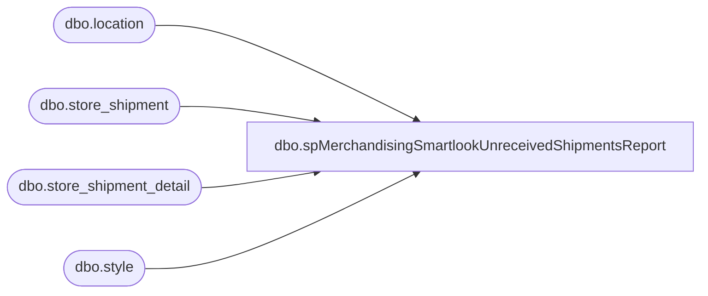

# dbo.spMerchandisingSmartlookUnreceivedShipmentsReport

**Database:** me_01  
**Server:** bedrockdb02  

## Architecture Diagram



## Table Dependencies

| Referenced Table |
|---|
| dbo.location |
| dbo.store_shipment |
| dbo.store_shipment_detail |
| dbo.style |

## Stored Procedure Code

```sql
CREATE proc [dbo].[spMerchandisingSmartlookUnreceivedShipmentsReport]
@days int

as

select distinct ss.document_no shipment, 
				l2.location_code whse,
				l.location_code store,
				s.style_code,	
				s.short_desc,
				sum(ssd.units_sent) units_sent,
				sum(ssd.units_received) units_received,
				ss.expected_receipt_date,
				case when ss.document_status = 3 then 'Shipped' when ss.document_status = 4 then 'Received' end as 'Shipment Status'
from store_shipment ss (nolock)
join store_shipment_detail ssd (nolock) on ss.store_shipment_id = ssd.store_shipment_id
join style s (nolock) on s.style_id = ssd.style_id
join location l (nolock) on l.location_id = ss.location_id
join location l2 (nolock) on l2.location_id = ss.from_location_id
where ss.expected_receipt_date <= getdate()+ @days 
and l2.location_code in ('0980', '2970')
and (ssd.units_received = 0 or ssd.units_received is null or ss.document_status = 3) --sent)
group by ss.document_no, s.style_code, s.short_desc, ss.expected_receipt_date, l2.location_code, l.location_code, ss.document_status
order by l2.location_code, ss.expected_receipt_date desc, l.location_code, s.style_code
```

