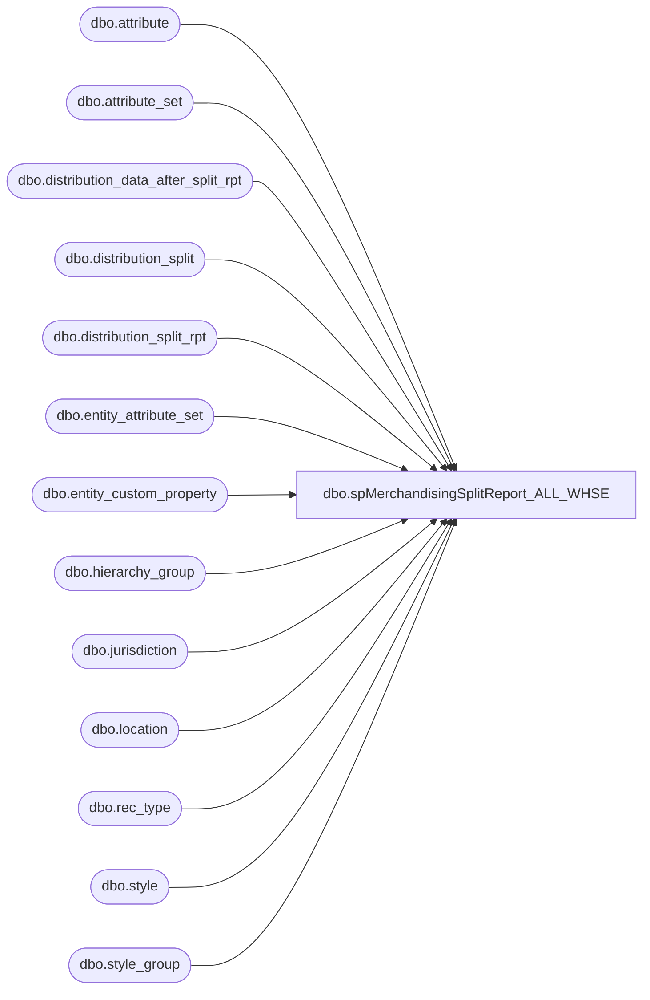

# dbo.spMerchandisingSplitReport_ALL_WHSE

**Database:** me_01  
**Server:** bedrockdb02  

## Architecture Diagram



## Table Dependencies

| Referenced Table |
|---|
| dbo.attribute |
| dbo.attribute_set |
| dbo.distribution_data_after_split_rpt |
| dbo.distribution_split |
| dbo.distribution_split_rpt |
| dbo.entity_attribute_set |
| dbo.entity_custom_property |
| dbo.hierarchy_group |
| dbo.jurisdiction |
| dbo.location |
| dbo.rec_type |
| dbo.style |
| dbo.style_group |

## Stored Procedure Code

```sql
CREATE proc [dbo].[spMerchandisingSplitReport_ALL_WHSE]

as

-- =====================================================================================================
-- Name: spMerchandisingSplitReport_ALL_WHSE
--
-- Description:	This is for testing the output of the split tool, by feeding real production distros into a test version of the tool, outputting to reporting table
--				
--				 
-- Revision History
--		Name:			Date:			Comments:
--		Dan Tweedie		07/31/2015 		Created proc.
--		Dan Tweedie		08/05/2015		Updated proc to stage yesterday's staged distros
-- =====================================================================================================


set nocount on 

truncate table distribution_split_rpt
truncate table distribution_data_after_split_rpt

/*-- --commented out 08/05/2015
--GET ACTIVE PICK STYLES FOR 980 & 960 FROM WM - - GET ACTIVE PICK ATTRIBUTE FOR UK STYLES FROM MERCH
if (object_id('tempdb..#activepickNA') is not null) drop table #activepickNA
select im.style as style_code
into #activepickNA
from wmdb01.wmprod.dbo.item_master im 
join wmdb01.wmprod.dbo.item_whse_master iwm on im.sku_id = iwm.sku_id
where iwm.dflt_wave_proc_type in ('15', '5') 
and iwm.pick_locn_assign_type in ('A', 'B', 'C')

if (object_id('tempdb..#activepickUK') is not null) drop table #activepickUK
select s.style_code
into #activepickUK
from style s (nolock)
join entity_attribute_set eas (nolock) on eas.parent_id = s.style_id
join attribute_set att (nolock) on eas.attribute_set_id = att.attribute_set_id
join attribute a (nolock) on att.attribute_id = a.attribute_id and a.parent_type = 1
where a.attribute_code = 'ACTIVE' and att.attribute_set_code = 'YES'

--GET SHIP DAY CONFIGURATION
----980 & 960
if (object_id('tempdb..#shipday') is not null) drop table #shipday
select	right('0000' + cast(iSourceID as varchar), 4) as warehouse,
		right('0000' + cast(iDestID as varchar), 4) as location_code,
		case iShipDay
			when 1 then 'MONDAY'
			when 2 then 'TUESDAY'
			when 3 then 'WEDNESDAY'
			when 4 then 'THURSDAY'
			when 5 then 'FRIDAY'
			when 6 then 'MULTI'
			else 'ClosedSpecial' 
		end as iShipDay
into #shipday
from kodiak.beardata.dbo.tblSourceDest 
where iSourceID in (960, 980)
--and	iShipDay between 1 and 6
and len(iDestId) <= 4
union all----2970
select	right('0000' + cast(iSourceID as varchar), 4) as warehouse,
		right('0000' + cast(iDestID as varchar), 4) as location_code,
		case iShipDay
			when 1 then 'MONDAY'
			when 2 then 'TUESDAY'
			when 3 then 'WEDNESDAY'
			when 4 then 'THURSDAY'
			when 5 then 'FRIDAY'
			when 6 then 'MULTI'
			else 'ClosedSpecial' 
		end as iShipDay
from kodiak.beardata.dbo.tblSourceDest_UK 
where iSourceID in (2970)
--and	iShipDay between 1 and 6
and len(iDestId) <= 4
order by warehouse, location_code


--CAPTURE DISTROS FROM MERCH
if (object_id('tempdb..#distros') is not null) drop table #distros
select *
into #distros
from VW_DistroExportPreSplit_SPLIT_TOOL_TEST

if (select count(*) from #distros) > 0

	BEGIN

	--STAGE FOR DISTRIBUTION_SPLIT - JOIN ACTIVE PICK / SHIP DAY / DISTRO
		if (object_id('tempdb..#distroSplit') is not null) drop table #distroSplit
		select d.sourceid, 
			   d.destid, 
			   d.style_code, 
			   d.quantity, 
			   d.rec_type,
			   d.sequencenbr,
			   d.distribution_number, 
			   d.ref_field_1,
			   d.release_date,
			   case when (d.sourceid in ('0980', '0960') and d.style_code in (select style_code from #activepickNA))
					or (d.sourceid in ('2970') and d.style_code in (select style_code from #activepickUK))
				then 'Y'
				else 'N'
				end as active_pick_flag,
			   d.released,
			   d.exported_date
		into #distroSplit
		from #distros d
		join #shipday sd on d.sourceid = sd.warehouse
			and d.destid = sd.location_code
		where sd.iShipDay = 'MULTI' --If ship day = 6 (multi), it can export, regardless of rec type
		or sd.iShipDay = d.current_day --if ship day is 'today', it can export, regardless of rec type
		or d.rec_type > 50 --If rec type is > 50, it can export regardless of ship day
		
		if (select count(*) from #distroSplit) > 0
*/--commented out 08/05/2015
		begin

			--INSERT INTO DISTRIBUTION_SPLIT
			insert distribution_split_rpt
			--select * from #distroSplit
			select sourceid, destid, style_code, quantity, rec_type, sequencenbr, distribution_number, ref_field_1, release_date, active_pick_flag, '0', getdate()
			from distribution_split with (nolock)
			where datediff(dd, exported_date, getdate()-1) = 0
			and datepart(hh, exported_date) >= 18
			and destid = '0052'

		end	

	--END --commented out 08/05/2015

--EXECUTE SPLIT TOOL
EXEC master..xp_cmdshell '"\\kermode\d$\ETL Executables\DistroSplit\SplitWithNoUI_rpt\DistroSplitToolInterface.exe"'
WAITFOR DELAY '00:01:00' --allow time for task to execute

---output report to show number of cartons

IF (Object_ID('tempdb..#actv_summary') IS NOT null) DROP TABLE #actv_summary
select l2.location_code Whse,
	   l.location_code Store,
   	   case when atswc.attribute_set_code ='960' and ddas.rec_type in (1,3,7) and ddas.sourceid = '0980'
			then 'GROUND SHIPPING'
			else rt.message
		end as RecTypeLabel,
	   s.style_code StyleCode,
	   s.short_desc StyleShortDescription,
	   case when substring(hg.hierarchy_group_code,7,2) ='60'
			then ecp.custom_property_value * ddas.quantity
			else ddas.quantity * s.distribution_multiple
	   end as Quantity,
	   case when substring(hg.hierarchy_group_code,7,2)='60' 
			then 'Supplies'
			--else hg.hierarchy_group_short_label
			else hg2.hierarchy_group_label --changed from hg.hierarchy_group_short_label 08/30/2011
		end as Category,
		case when ddas.active_pick_flag = 'Y' then 'ActivePick' else 'NonActivePick' end as 'Type',
		ecp.custom_property_value,
		s.distribution_multiple
into #actv_summary
from distribution_data_after_split_rpt ddas (nolock)
join location l with (nolock) on ddas.destid = l.location_code
join location l2 with (nolock) on ddas.sourceid = l2.location_code
join jurisdiction j with (nolock) on j.jurisdiction_id = l.jurisdiction_id
join entity_attribute_set easwc with (nolock) on l.location_id = easwc.parent_id
	and easwc.parent_type = 2
join attribute_set atswc with (nolock) on easwc.attribute_set_id = atswc.attribute_set_id
join attribute awc with (nolock) on atswc.attribute_id = awc.attribute_id
	and awc.attribute_code= 'DC'
join rec_type rt with (nolock) on rt.rectype = ddas.rec_type
join style s with (nolock) on s.style_code = ddas.style_code
join style_group sg with (nolock) on s.style_id = sg.style_id
join hierarchy_group hg with (nolock) on sg.hierarchy_group_id = hg.hierarchy_group_id
join hierarchy_group hg2 with (nolock) on left(hg.hierarchy_group_code,8) = hg2.hierarchy_group_code --added 08/30/2011
left join entity_custom_property ecp with (nolock) on s.style_id = ecp.parent_id
	and ecp.custom_property_id = 2
	and	ecp.parent_type = 1


IF (Object_ID('tempdb..#sum1') IS NOT null) DROP TABLE #sum1
select Whse,
	   Store, 
	   RecTypeLabel,
	   StyleCode, 
	   StyleShortDescription,
	   case when category = 'supplies'
			then quantity / custom_property_value
			else quantity / distribution_multiple
	   end as 'Cartons',
	   type
into #sum1
from #actv_summary

IF (Object_ID('tempdb..#sum2') IS NOT null) DROP TABLE #sum2
select Whse, Store, RecTypeLabel, 'Store ' + store + ' ' + RecTypeLabel + ': ' + cast(sum(cartons) as varchar) + ' Cartons' CtnsPerShpmt
into #sum2
from #sum1
group by Whse, store, rectypelabel

select s1.*, s2.CtnsPerShpmt
from #sum1 s1
join #sum2 s2 on s1.store = s2.store
	and s1.rectypelabel = s2.rectypelabel 
order by s1.whse, s1.store, s1.rectypelabel, s1.stylecode, s1.type
```

