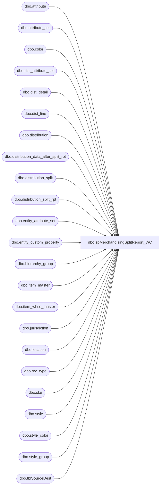

# dbo.spMerchandisingSplitReport_WC

**Database:** me_01  
**Server:** bedrockdb02  

## Architecture Diagram



## Table Dependencies

| Referenced Table |
|---|
| dbo.attribute |
| dbo.attribute_set |
| dbo.color |
| dbo.dist_attribute_set |
| dbo.dist_detail |
| dbo.dist_line |
| dbo.distribution |
| dbo.distribution_data_after_split_rpt |
| dbo.distribution_split |
| dbo.distribution_split_rpt |
| dbo.entity_attribute_set |
| dbo.entity_custom_property |
| dbo.hierarchy_group |
| dbo.item_master |
| dbo.item_whse_master |
| dbo.jurisdiction |
| dbo.location |
| dbo.rec_type |
| dbo.sku |
| dbo.style |
| dbo.style_color |
| dbo.style_group |
| dbo.tblSourceDest |

## Stored Procedure Code

```sql
CREATE proc [dbo].[spMerchandisingSplitReport_WC]

as 


-- =====================================================================================================
-- Name: spMerchandisingSplitReport_WC
--
-- Description:	Runs 'simulator' version of the split tool, outputs summary report, leaves data in Merch untouched
--				
--				 
-- Revision History
--		Name:			Date:			Comments:
--		Dan Tweedie		12/02/2014 		Created proc.
--		Dan Tweedie		07/29/2015		Changed path to split tool executable
-- =====================================================================================================


set nocount on
--truncate staging tables
truncate table distribution_split_rpt
truncate table distribution_data_after_split_rpt

--stage active pick flag
IF (Object_ID('tempdb..#actv') IS NOT null) DROP TABLE #actv
select	im.style as style_code,
		case when iwm.dflt_wave_proc_type in ('15', '5') and iwm.pick_locn_assign_type in ('A', 'B', 'C')
			then 'Y'
			else 'N'
		end as active_pick
into #actv
from wmdb01.wmprod.dbo.item_master im
join wmdb01.wmprod.dbo.item_whse_master iwm on im.sku_id = iwm.sku_id


--populate pre-split staging table
set identity_insert distribution_split_rpt on
insert distribution_split_rpt (id, sourceid, destid, style_code, quantity, rec_type, sequencenbr, distribution_number, ref_field_1, release_date, active_pick_flag, released, exported_date)
select  d.distribution_id,
		l1.location_code as sourceid,
		l2.location_code as destid,
		s.style_code,
		case when substring(hg.hierarchy_group_code,7,2)= '60'
				then 
					dd.quantity -- supplies in cases
				else 
					dd.quantity/s.distribution_multiple -- merch converted to cases
				end as quantity,
		case when das.attribute_set_id is not null
					then ats.attribute_set_code			
					else	'1' -- default to REGULAR TRUCK
				end rec_type,
		dd.dist_detail_id AS sequencenbr,  --	'1' AS sequencenbr, -- replaced by <-
		d.distribution_number,
		dl.dist_line_id as ref_field_1,
		d.release_date,
		actv.active_pick,
		0 as released,
		getdate() as exported_date
from 	distribution d with (nolock)
join	location l1 with (nolock) on d.location_id = l1.location_id
join	dist_line dl with (nolock) on d.distribution_id = dl.distribution_id
join	style_color sc with (nolock) on dl.style_color_id = sc.style_color_id
join	style s with (nolock) on sc.style_id = s.style_id
join	style_group sg with (nolock) on s.style_id = sg.style_id
join	hierarchy_group hg with (nolock) on sg.hierarchy_group_id = hg.hierarchy_group_id
join	color c with (nolock) on sc.color_id = c.color_id
join	sku sk with (nolock) on s.style_id = sk.style_id
join	dist_detail dd with (nolock) on sk.sku_id = dd.sku_id
	and		d.distribution_id = dd.distribution_id 
join	location l2 with (nolock) on dd.location_id = l2.location_id
join  entity_attribute_set easwc (nolock) on l2.location_id = easwc.parent_id
	and         easwc.parent_type  = 2
join  attribute_set atswc (nolock) on easwc.attribute_set_id = atswc.attribute_set_id
join  attribute awc (nolock) on atswc.attribute_id = awc.attribute_id
	and         awc.attribute_code= 'DC'
left outer join	dist_attribute_set das with (nolock) on d.distribution_id = das.distribution_id
left outer join	entity_custom_property ecp with (nolock) on s.style_id = ecp.parent_id
	and		ecp.parent_type = 1
	and		ecp.custom_property_id = 2
left join distribution_split ds (nolock) on	d.distribution_number = ds.distribution_number
	and		l2.location_code = ds.destid
left join attribute_set ats (nolock) on das.attribute_set_id = ats.attribute_set_id
	and		ats.attribute_id = 112
join #actv actv on s.style_code = actv.style_code
where	d.distribution_status in (6,7) -- 2 = Preliminary 5 = Open 6 = Release 9 = Cancelled
and		l1.location_code in ('0960')
and		dd.quantity > 0
and		ds.distribution_number is null
and		ds.destid is null
and		sc.reorder_flag = 1
and l2.location_code in (select distinct idestid
		from kodiak.beardata.dbo.tblSourceDest 
		where iSourceID in (960) 
		and (ishipday = datepart(dw, getdate()-1)
			or ishipday = 6))

if (select count(*) from distribution_split_rpt) > 0

begin

	--execute split tool simulator
	EXEC master..xp_cmdshell '\\kermode\d$\ETL Executables\DistroSplit\DistroSplitToolInterface.exe'

end

---output report to show number of cartons

IF (Object_ID('tempdb..#actv_summary') IS NOT null) DROP TABLE #actv_summary
select l.location_code Store,
   	   case when atswc.attribute_set_code ='960' and ddas.rec_type in (1,3,7) and ddas.sourceid = '0980'
			then 'GROUND SHIPPING'
			else rt.message
		end as RecTypeLabel,
	   s.style_code StyleCode,
	   s.short_desc StyleShortDescription,
	   case when substring(hg.hierarchy_group_code,7,2) ='60'
			then ecp.custom_property_value * ddas.quantity
			else ddas.quantity * s.distribution_multiple
	   end as Quantity,
	   case when substring(hg.hierarchy_group_code,7,2)='60' 
			then 'Supplies'
			--else hg.hierarchy_group_short_label
			else hg2.hierarchy_group_label --changed from hg.hierarchy_group_short_label 08/30/2011
		end as Category,
		case when actv.active_pick = 'Y' then 'ActivePick' else 'Non ActivePick' end as 'Type',
		ecp.custom_property_value,
		s.distribution_multiple
into #actv_summary
from distribution_data_after_split_rpt ddas (nolock)
join location l (nolock) on l.location_code = ddas.destid
join jurisdiction j (nolock) on j.jurisdiction_id = l.jurisdiction_id
join entity_attribute_set easwc (nolock) on l.location_id = easwc.parent_id
	and easwc.parent_type = 2
join attribute_set atswc (nolock) on easwc.attribute_set_id = atswc.attribute_set_id
join attribute awc (nolock) on atswc.attribute_id = awc.attribute_id
	and awc.attribute_code= 'DC'
join rec_type rt (nolock) on rt.rectype = ddas.rec_type
join style s (nolock) on s.style_code = ddas.style_code
join style_group sg (nolock) on s.style_id = sg.style_id
join hierarchy_group hg (nolock) on sg.hierarchy_group_id = hg.hierarchy_group_id
join hierarchy_group hg2 (nolock) on left(hg.hierarchy_group_code,8) = hg2.hierarchy_group_code --added 08/30/2011
left join entity_custom_property ecp (nolock) on s.style_id = ecp.parent_id
	and ecp.custom_property_id = 2
	and	ecp.parent_type = 1
join #actv actv on s.style_code = actv.style_code

IF (Object_ID('tempdb..#sum1') IS NOT null) DROP TABLE #sum1
select Store, 
	   RecTypeLabel,
	   StyleCode, 
	   StyleShortDescription,
	   case when category = 'supplies'
			then quantity / custom_property_value
			else quantity / distribution_multiple
	   end as 'Cartons',
	   type
into #sum1
from #actv_summary

IF (Object_ID('tempdb..#sum2') IS NOT null) DROP TABLE #sum2
select Store, RecTypeLabel, 'Store ' + store + ' ' + RecTypeLabel + ': ' + cast(sum(cartons) as varchar) + ' Cartons' CtnsPerShpmt
into #sum2
from #sum1
group by store, rectypelabel

select s1.*, s2.CtnsPerShpmt
from #sum1 s1
join #sum2 s2 on s1.store = s2.store
	and s1.rectypelabel = s2.rectypelabel 
order by s1.store, s1.rectypelabel, s1.stylecode, s1.type
```

