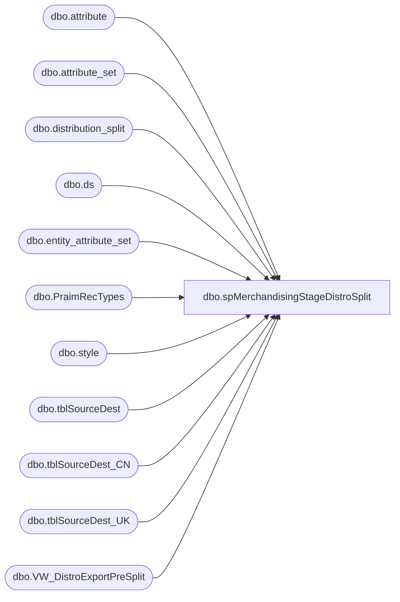

# dbo.spMerchandisingStageDistroSplit

**Database:** me_01  
**Server:** bedrockdb02  

## Architecture Diagram



## Table Dependencies

| Referenced Table |
|---|
| dbo.attribute |
| dbo.attribute_set |
| dbo.distribution_split |
| dbo.ds |
| dbo.entity_attribute_set |
| dbo.PraimRecTypes |
| dbo.style |
| dbo.tblSourceDest |
| dbo.tblSourceDest_CN |
| dbo.tblSourceDest_UK |
| dbo.VW_DistroExportPreSplit |

## Stored Procedure Code

```sql
CREATE proc [dbo].[spMerchandisingStageDistroSplit]

as 

-- =====================================================================================================
-- Name: spMerchandisingStageDistroSplit
--
-- Description:	Stages distros to distribution_split, runs Distro Split Tool
--				 
-- Revision History
--		Name:			Date:			Comments:
--		Dan Tweedie		03/13/2015		Created proc.	
--		Dan Tweedie		07/28/2015		Updated GET SHIP DAY CONFIGURATION to remove filter of values 1-6 and apply filter logic
--		Dan Tweedie		10/15/2015		Added handling for Praim Chocolate styles, to change the rec type based on what is configured in table PraimRecTypes
--		Dan Tweedie		05/09/2016		Added 3970 warehouse
--		Tim Callahan	06/21/2016		Pointed Proc to Kodiak PROD server for kodiak.beardata.dbo.tblSourceDest_CN as it was pointed to TEST
--		Tim Callahan	07/03/2018		Added 8502 and 8505 Ship Day Configuration 
--		Tim Callahan	07/03/2018		Moved Split Tool Call to be outside of if distros exist logic to account for D365 distros 
--		Dan Tweedie		2020-02-24		Updated proc for use for Dynamics WMS
-- =====================================================================================================

set nocount on 

----GET ACTIVE PICK STYLES FOR 980 & 960 FROM WM - - GET ACTIVE PICK ATTRIBUTE FOR UK STYLES FROM MERCH
--if (object_id('tempdb..#activepickNA') is not null) drop table #activepickNA
--select im.style as style_code
--into #activepickNA
--from wmdb01.wmprod.dbo.item_master im 
--join wmdb01.wmprod.dbo.item_whse_master iwm on im.sku_id = iwm.sku_id
--where iwm.dflt_wave_proc_type in ('15', '5') 
--and iwm.pick_locn_assign_type in ('A', 'B', 'C')

if (object_id('tempdb..#activepickNA') is not null) drop table #activepickNA
select s.style_code
into #activepickNA
from style s (nolock)
join entity_attribute_set eas (nolock) on eas.parent_id = s.style_id
join attribute_set att (nolock) on eas.attribute_set_id = att.attribute_set_id
join attribute a (nolock) on att.attribute_id = a.attribute_id and a.parent_type = 1
where a.attribute_code = 'ACTIVE' and att.attribute_set_code = 'YES'

if (object_id('tempdb..#activepickUK') is not null) drop table #activepickUK
select s.style_code
into #activepickUK
from style s (nolock)
join entity_attribute_set eas (nolock) on eas.parent_id = s.style_id
join attribute_set att (nolock) on eas.attribute_set_id = att.attribute_set_id
join attribute a (nolock) on att.attribute_id = a.attribute_id and a.parent_type = 1
where a.attribute_code = 'ACTIVE' and att.attribute_set_code = 'YES'

--GET SHIP DAY CONFIGURATION
----980 & 960
if (object_id('tempdb..#shipday') is not null) drop table #shipday
select	right('0000' + cast(iSourceID as varchar), 4) as warehouse,
		right('0000' + cast(iDestID as varchar), 4) as location_code,
		case iShipDay
			when 1 then 'MONDAY'
			when 2 then 'TUESDAY'
			when 3 then 'WEDNESDAY'
			when 4 then 'THURSDAY'
			when 5 then 'FRIDAY'
			when 6 then 'MULTI'
			else 'ClosedSpecial' 
		end as iShipDay
into #shipday
from kodiak.beardata.dbo.tblSourceDest 
where iSourceID in (960, 980)
--and	iShipDay between 1 and 6
and len(iDestId) <= 4
union all----2970
select	right('0000' + cast(iSourceID as varchar), 4) as warehouse,
		right('0000' + cast(iDestID as varchar), 4) as location_code,
		case iShipDay
			when 1 then 'MONDAY'
			when 2 then 'TUESDAY'
			when 3 then 'WEDNESDAY'
			when 4 then 'THURSDAY'
			when 5 then 'FRIDAY'
			when 6 then 'MULTI'
			else 'ClosedSpecial' 
		end as iShipDay
from kodiak.beardata.dbo.tblSourceDest_UK 
where iSourceID in (2970)
--and	iShipDay between 1 and 6
and len(iDestId) <= 4
union all ----3970, 3980
select	right('0000' + cast(iSourceID as varchar), 4) as warehouse,
		right('0000' + cast(iDestID as varchar), 4) as location_code,
		case iShipDay
			when 1 then 'MONDAY'
			when 2 then 'TUESDAY'
			when 3 then 'WEDNESDAY'
			when 4 then 'THURSDAY'
			when 5 then 'FRIDAY'
			when 13 then '13'
			else 'MULTI' 
		end as iShipDay
from kodiak.beardata.dbo.tblSourceDest_CN 
where iSourceID in (3970,8502,8505)
and	(iShipDay between 1 and 6 or iShipDay = '13')
and len(iDestId) <= 4
order by warehouse, location_code


--CAPTURE DISTROS FROM MERCH
if (object_id('tempdb..#distros') is not null) drop table #distros
select *
into #distros
from VW_DistroExportPreSplit

if (select count(*) from #distros) > 0

	BEGIN

	--STAGE FOR DISTRIBUTION_SPLIT - JOIN ACTIVE PICK / SHIP DAY / DISTRO
		if (object_id('tempdb..#distroSplit') is not null) drop table #distroSplit
		select d.sourceid, 
			   d.destid, 
			   d.style_code, 
			   d.quantity, 
			   d.rec_type,
			   d.sequencenbr,
			   d.distribution_number, 
			   d.ref_field_1,
			   d.release_date,
			   case when (d.sourceid in ('0980', '0960') and d.style_code in (select style_code from #activepickNA))
					or (d.sourceid in ('2970') and d.style_code in (select style_code from #activepickUK))
				then 'Y'
				else 'N'
				end as active_pick_flag,
			   d.released,
			   d.exported_date
		into #distroSplit
		from #distros d
		join #shipday sd on d.sourceid = sd.warehouse
			and d.destid = sd.location_code
		where sd.iShipDay = 'MULTI' --If ship day = 6 (multi), it can export, regardless of rec type
		or sd.iShipDay = d.current_day --if ship day is 'today', it can export, regardless of rec type
		or d.rec_type > 50 --If rec type is > 50, it can export regardless of ship day
		or (sd.iShipDay = '13' and d.current_day in ('Monday', 'Wednesday')) --unique for China, they might use 2 days
		
		if (select count(*) from #distroSplit) > 0

		begin

			--CHANGE REC TYPE TO 52 OR 54 FOR PRAIM CHOCOLATE STYLE, BASED ON CONFIGURATION IN PraimRecTypes TABLE
			if (select count(*) from #distroSplit where style_code in ('023442', '023443', '023444', '023445')) > 0
				begin
					update ds
					set ds.rec_type = p.rec_type
					from #distroSplit ds 
					join PraimRecTypes p on ds.destid = p.location_code
					where ds.style_code in ('023442', '023443', '023444', '023445')
				end

			--INSERT INTO DISTRIBUTION_SPLIT
			insert distribution_split
			select * 
			from #distroSplit

			----EXECUTE SPLIT TOOL
			--EXEC master..xp_cmdshell '"\\kermode\d$\ETL Executables\DistroSplit\SplitWithNoUI\DistroSplitToolInterface.exe"'
			--WAITFOR DELAY '00:01:00' --allow time for task to execute


		end	
		
	END

		--EXECUTE SPLIT TOOL
			EXEC master..xp_cmdshell '"\\kermode\d$\ETL Executables\DistroSplit\SplitWithNoUI\DistroSplitToolInterface.exe"'
			WAITFOR DELAY '00:01:00' --allow time for task to executef
```

