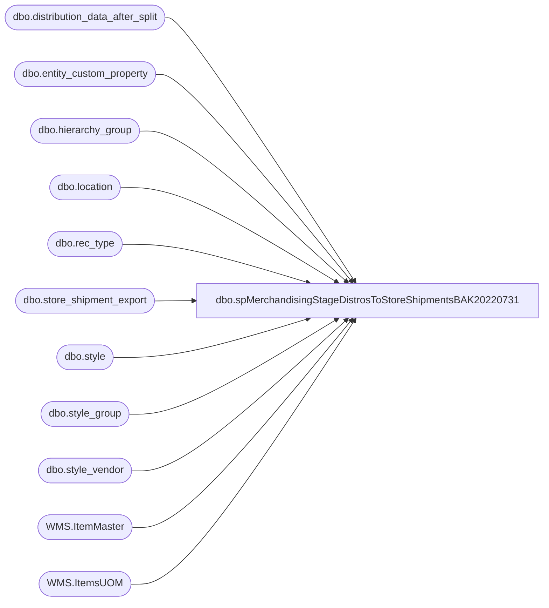

# dbo.spMerchandisingStageDistrosToStoreShipmentsBAK20220731

**Database:** me_01  
**Server:** bedrockdb02  

## Architecture Diagram



## Table Dependencies

| Referenced Table |
|---|
| dbo.distribution_data_after_split |
| dbo.entity_custom_property |
| dbo.hierarchy_group |
| dbo.location |
| dbo.rec_type |
| dbo.store_shipment_export |
| dbo.style |
| dbo.style_group |
| dbo.style_vendor |
| WMS.ItemMaster |
| WMS.ItemsUOM |

## Stored Procedure Code

```sql
CREATE proc [dbo].[spMerchandisingStageDistrosToStoreShipmentsBAK20220731]

as

-- =====================================================================================================
-- Name: spMerchandisingStageDistrosToStoreShipments
--
-- Description:	Exports UK Distros to CSV, generates shipment number, inserts into store_shipment_export table
--				 
-- Revision History
--		Name:			Date:			Comments:
--		Dan Tweedie		03/25/2019		Created proc, modeled after spMerchExportStoreDistroTransferOrdersUK, so we can stage store shipments for Dynamics WMS
--		Dan Tweedie		2020-05-19		Updated grouping logic for distros from 980 to 13 so there are no more than 10 items per shipment
--		Dan Tweedie		2020-06-24		Fixed issue with grouping..
--		Dan	Tweedie		2021-03-24		Updated to use new @RowsPerShipment variable, set to 1 where we previously use hard-coded value of 10 in grouping for document_number in #StageTwo table
-- =====================================================================================================

set nocount on

declare 
	@seed bigint, 
	@RowsPerShipment int

select @RowsPerShipment=1

select @seed = max(document_number) from store_shipment_export

if (object_id('tempdb..#StageTwo') is not null) drop table #StageTwo
	CREATE TABLE #StageTwo
		(
			[id] [bigint] NULL,
			[destid] [varchar](21) NULL,
			[rec_type] [varchar](6) NULL,
			[message] [nvarchar](255) NULL,
			[style_code] [varchar](20) NULL,
			[quantity] [int] NULL,
			[release_date] [varchar](30) NULL,
			[distribution_number] [varchar](50) NULL,
			[ref_field_1] [int] NULL,
			[short_desc] [nvarchar](20) NULL,
			[document_number] [bigint] NULL
		)


if (object_id('tempdb..#StageOne') is not null) drop table #StageOne
;
with 
InventoryUnit as
(
	select 
		im.Entity,
		im.ItemNumber,
		right(im.ItemNumber,6) as StyleCode,
		im.InventoryUnitSymbol,
		cast(uom.Factor as int) as Factor 
	from [stl-ssis-p-01].IntegrationStaging.WMS.ItemMaster im 
	join [stl-ssis-p-01].IntegrationStaging.WMS.ItemsUOM uom 
		on im.Entity = uom.Entity 
		and im.PRODUCTNUMBER = uom.PRODUCTNUMBER
		and im.INVENTORYUNITSYMBOL = uom.FROMUNITSYMBOL
		and uom.TOUNITSYMBOL = 'wmea'
	where im.NecessaryProductionWorkingTimeSchedulingPropertyId in ('Merch', 'Supplies')
)
select	ddas.id as id,
		ddas.destid as destid,
		ddas.rec_type,
		rt.message,
		ddas.style_code, 
		case when substring(hg.hierarchy_group_code,7,2)='60'
			then	ecp.custom_property_value * ddas.quantity
			else	ddas.quantity * s.distribution_multiple
		end as quantity, 
		convert(varchar, ddas.release_date,101) as release_date,
		ddas.distribution_number, 
		ddas.ref_field_1,
		s.short_desc
into #StageOne
from	distribution_data_after_split ddas with (nolock)
join rec_type rt with (nolock) on ddas.rec_type = rt.rectype
join location l with (nolock) on ddas.destid = l.location_code
join style s with (nolock) on ddas.style_code = s.style_code
join style_group sg with (nolock) on s.style_id = sg.style_id
join hierarchy_group hg with (nolock) on sg.hierarchy_group_id = hg.hierarchy_group_id
join style_vendor sv with (nolock) on s.style_id = sv.style_id
	and sv.primary_vendor_flag = 1
left join entity_custom_property ecp with (nolock) on s.style_id = ecp.parent_id
	and ecp.custom_property_id = 2
	and ecp.parent_type = 1
where ddas.sourceid = 980
and	ddas.released is null


if (select count(*) from #StageOne) > 0
BEGIN

		if (select count(*) from #StageOne where destid='0013') > 0
		begin
			Insert #StageTwo
			select 
				id,
				destid,
				rec_type,
				message,
				style_code, 
				quantity, 
				release_date,
				distribution_number, 
				ref_field_1,
				short_desc, 
				--@seed + DENSE_RANK() OVER (ORDER BY destid, rec_type) as document_number
				@seed + DENSE_RANK() OVER (ORDER BY destid, rec_type) + (DENSE_RANK() OVER (ORDER BY destid, rec_type, style_code) / @RowsPerShipment) as document_number
			from #StageOne
			where destid='0013'

			select @seed = max(document_number) from #StageTwo
		end

		if (select count(*) from #StageOne where destid<>'0013') > 0
		begin
			Insert #StageTwo
			select 
				id,
				destid,
				rec_type,
				message,
				style_code, 
				quantity, 
				release_date,
				distribution_number, 
				ref_field_1,
				short_desc, 
				@seed + DENSE_RANK() OVER (ORDER BY destid, rec_type) as document_number
				--@seed + DENSE_RANK() OVER (ORDER BY destid, rec_type) + (DENSE_RANK() OVER (ORDER BY destid, rec_type, style_code) / 50) as document_number
			from #StageOne
			where destid<>'0013'
		end


end

if (object_id('tempdb..#WMDistros') is not null) drop table #WMDistros
		select * 
		into #WMDistros
		from #StageTwo

if (select count(*) from #WMDistros) > 0

BEGIN

		---INSERT INTO STORE_SHIPMENT_EXPORT TABLE
		insert store_shipment_export
		select distribution_number, 
			   document_number, 
			   ref_field_1 as distribution_line_number,
			   '0980' as warehouse,
			   left(destid,6) as location_code, -- Changed from 4 to 6 on 10/8/2018
			   rec_type,
			   left(message, 20) as rec_label,
			   style_code, 
			   quantity,
			   getdate() as release_date,
			   short_desc,
			   NULL as vendor_style,
			   NULL as color_code,
			   NULL as exported,
			   NULL as expected_ship_date,
			   NULL as Cancelled
		from #WMDistros

		--UPDATE DISTRIBUTION_DATA_AFTER_SPLIT TO SET THE RECORDS AS EXPORTED
		update distribution_data_after_split
		set released = 1
		where id in (select id from #WMDistros)
		OR 
	(
		ID is NULL 
		and distribution_number in  (select distribution_number from #WMDistros) 
		and sourceid = 980
	)


END
```

