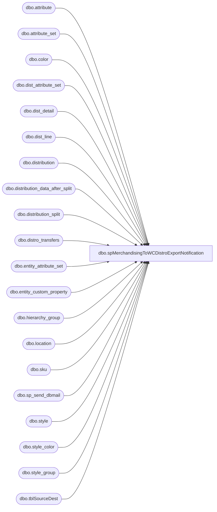

# dbo.spMerchandisingToWCDistroExportNotification

**Database:** me_01  
**Server:** bedrockdb02  

## Architecture Diagram



## Table Dependencies

| Referenced Table |
|---|
| dbo.attribute |
| dbo.attribute_set |
| dbo.color |
| dbo.dist_attribute_set |
| dbo.dist_detail |
| dbo.dist_line |
| dbo.distribution |
| dbo.distribution_data_after_split |
| dbo.distribution_split |
| dbo.distro_transfers |
| dbo.entity_attribute_set |
| dbo.entity_custom_property |
| dbo.hierarchy_group |
| dbo.location |
| dbo.sku |
| dbo.sp_send_dbmail |
| dbo.style |
| dbo.style_color |
| dbo.style_group |
| dbo.tblSourceDest |

## Stored Procedure Code

```sql
CREATE proc [dbo].[spMerchandisingToWCDistroExportNotification]

as

-- =====================================================================================================
-- Name: spMerchandisingToWCDistroExportNotification
--
-- Description:	Sends email summary of distro export
--				
--
-- Input:	NA
--
-- Output: 
--			
--
-- Dependencies: 
--
-- Revision History
--		Name:			Date:			Comments:
--		Dan Tweedie		08/14/2012		Created proc
--		Lizzy Timm		07/23/2020		Updated timing from 18 to 14:30 per SR 27924
-- =====================================================================================================

set nocount on

---Get count of records in the tables to be processed on the next run

declare @distro_transfers int,
		@distros int,
		@distro_split int,
		@distro_after_split int, 
		@eis int,
		@recip varchar(1000),
		@copy varchar(1000),
		@subj varchar(1000),
		@text nvarchar(max)		
		
select @distro_transfers = count(*)
		FROM distro_transfers dt (nolock)
		join location l1 (nolock) on right('0000' + convert(varchar(4),dt.sourceid),4) = l1.location_code
		join location l2 (nolock) on right('0000' + convert(varchar(4),dt.destid),4) = l2.location_code
		where l1.location_type = 4 -- warehouse
		and	l2.location_type= 2 --store
		and	l1.location_code = '0960'
		and dt.exported_date is null

select @distros = count(*)
					from 	distribution d with (nolock)
					join	location l1 with (nolock) on d.location_id = l1.location_id
					join	dist_line dl with (nolock) on d.distribution_id = dl.distribution_id
					join	style_color sc with (nolock) on dl.style_color_id = sc.style_color_id
					join	style s with (nolock) on sc.style_id = s.style_id
					join	style_group sg with (nolock) on s.style_id = sg.style_id
					join	hierarchy_group hg with (nolock) on sg.hierarchy_group_id = hg.hierarchy_group_id
					join	color c with (nolock) on sc.color_id = c.color_id
					join	sku sk with (nolock) on s.style_id = sk.style_id
					join	dist_detail dd with (nolock) on sk.sku_id = dd.sku_id
						and		d.distribution_id = dd.distribution_id 
					join	location l2 with (nolock) on dd.location_id = l2.location_id
					join  entity_attribute_set easwc (nolock) on l2.location_id = easwc.parent_id
						and         easwc.parent_type  = 2
					join  attribute_set atswc (nolock) on easwc.attribute_set_id = atswc.attribute_set_id
					join  attribute awc (nolock) on atswc.attribute_id = awc.attribute_id
						and         awc.attribute_code= 'DC'
					left outer join	dist_attribute_set das with (nolock) on d.distribution_id = das.distribution_id
					left outer join	entity_custom_property ecp with (nolock) on s.style_id = ecp.parent_id
						and		ecp.parent_type = 1
						and		ecp.custom_property_id = 2
					left join distribution_split ds (nolock) on	d.distribution_number = ds.distribution_number
						and		l2.location_code = ds.destid
					left join attribute_set ats (nolock) on das.attribute_set_id = ats.attribute_set_id
						and		ats.attribute_id = 112
					where	d.distribution_status in (6,7) -- 2 = Preliminary 5 = Open 6 = Release 9 = Cancelled
					--and	cast(convert(varchar, d.release_date,101)as datetime)  = cast(convert(varchar, getdate(),101)as datetime)
					and		l1.location_code in ('0960')
					and		dd.quantity > 0
					and		ds.distribution_number is null
					and		ds.destid is null
					and		sc.reorder_flag = 1

					and		(isnull(ats.attribute_set_code,1) >= 50
					-- or		isnull(ats.attribute_set_code,1) < 50 and datepart(hh,getdate()) >= 18 -- Usual time
					or		isnull(ats.attribute_set_code,1) < 50 and convert(varchar, getdate(), 108) >= '16:30:00' -- Updated per SR 27924
					)
					and l2.location_code <> '0165' -- Hawaii as per Mark D 6/1/2009
					and l2.location_code in (select distinct idestid
							from kodiak.beardata.dbo.tblSourceDest 
							where iSourceID in (960) 
							and (ishipday = datepart(dw, getdate()-1)
								or ishipday = 6))
					
select @distro_split = count(*)
		from distribution_split ds (nolock)
		where ds.sourceid in ('0960')
		and ds.released = 0 ---all records with released = 0 are eligible to be picked up by split tool

select @distro_after_split = count(*)
		from distribution_data_after_split ddas (nolock)
		join style s (nolock) on ddas.style_code = s.style_code
		join style_group sg (nolock) on s.style_id = sg.style_id
		join hierarchy_group hg (nolock) on sg.hierarchy_group_id = hg.hierarchy_group_id
		where ddas.sourceid = '0960'
		and ddas.released is null
		and			(cast(ddas.rec_type as int) >= 50
		--or			(cast(ddas.rec_type as int) < 50 and datepart(hh,getdate()) >= 18) -- Usual time
		or			(cast(ddas.rec_type as int) < 50 and convert(varchar, getdate(), 108) >= '16:30:00') -- Updated per SR 27924
		)
		and ddas.quantity > 0
				
				
--------------------------------------------------------------------


--output summary of distros exported to wm

	select @subj = 'Merch-to-WC Distro Export: ' + cast(getdate() as varchar)
	
	set @text = '<font face =arial size = 2></font>' + 
		'<font face =arial size = 2>' + 
		'The Merch-to-WC Distro Export Process Has Completed.' +
		'<br>'+
		'The following validations were run to look for additional data to process on the next load.' +
		'<br><br>' +
		'<b><u>Tables/Data-Sets</u></b>' +
		'<br>' +
		'<b>Access/Distro Transfers:</b> ' + convert(varchar, @distro_transfers) +
		'<br>' +
		'<b>Distribution:</b> ' + convert(varchar, @distros) + 
		'<br>' +
		'<b>Distribution Split:</b> ' + convert(varchar, @distro_split) +
		'<br>' + 
		'<b>Distribution After Split:</b> ' + convert(varchar, @distro_after_split)+
		'<br>' +
			'</font></p></p> <br><br><br>
		<font face =arial size = 1><i>The information in this message may be privileged, “confidential” and protected from disclosure and/or intended only for the addressee(s) named above.  If the reader of this message is not the intended recipient, or an employee or agent responsible for delivering this message to the intended recipient, you are hereby notified that any dissemination, distribution or copying of the communication is strictly prohibited.  If you have received this communication in error, please notify us immediately by replying to the message and deleting it from your computer.  Thank you beary much.</i></font>'
		
	select @recip = 'merchadmin@buildabear.com'
	
	if datepart(hh, getdate()) >= 18 and @distro_split > 0
	begin
	select @recip = 'EnterpriseSystemsAlerts@buildabear.com'
	select @subj = 'DISTRO SPLIT ERROR'
		exec msdb.dbo.sp_send_dbmail
		@profile_name = 'merchadmin',
		@recipients = @recip,
		@body = @text,
		@subject = @subj,
		@body_format = 'HTML'
	end
```

