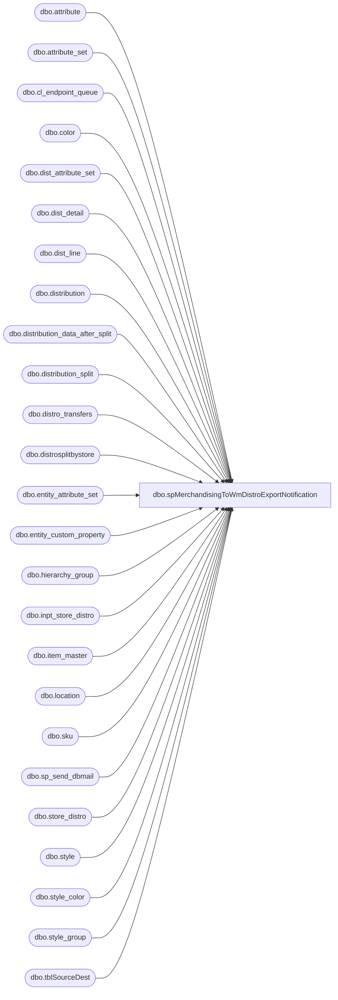

# dbo.spMerchandisingToWmDistroExportNotification

**Database:** me_01  
**Server:** bedrockdb02  

## Architecture Diagram



## Table Dependencies

| Referenced Table |
|---|
| dbo.attribute |
| dbo.attribute_set |
| dbo.cl_endpoint_queue |
| dbo.color |
| dbo.dist_attribute_set |
| dbo.dist_detail |
| dbo.dist_line |
| dbo.distribution |
| dbo.distribution_data_after_split |
| dbo.distribution_split |
| dbo.distro_transfers |
| dbo.distrosplitbystore |
| dbo.entity_attribute_set |
| dbo.entity_custom_property |
| dbo.hierarchy_group |
| dbo.inpt_store_distro |
| dbo.item_master |
| dbo.location |
| dbo.sku |
| dbo.sp_send_dbmail |
| dbo.store_distro |
| dbo.style |
| dbo.style_color |
| dbo.style_group |
| dbo.tblSourceDest |

## Stored Procedure Code

```sql
CREATE proc [dbo].[spMerchandisingToWmDistroExportNotification]

as

-- =====================================================================================================
-- Name: spMerchandisingToWmDistroExportNotification
--
-- Description:	Sends email summary of distro export
--				
--
-- Input:	NA
--
-- Output: 
--			
--
-- Dependencies: 
--
-- Revision History
--		Name:			Date:			Comments:
--		Dan Tweedie		04/19/2012		Created proc
--		Dan Tweedie		09/26/2013		Added filter to exclude rec type 33 since this is handled in a different procedure
--		Dan Tweedie		11/03/2014		Added nightly distro export summary email, grouped by location and rec type
--		Dan Tweedie		11/07/2014		Added Merch to WM distro validation
--		Dan Tweedie		11/14/2014		added code to address issue with distros having the same seq_nbr per distro number
--		Tim Callahan	01/03/2017		Removed CorieB and Added DistroBears@buildabear.com to email at request of Larry White
--		Tim Callahan	04/11/2017		Temporarily Removed 99XX series locations due to performance issues. 
--		Tim Callahan	11/09/2017		Remarked out code that was using a "count loop" to give time for the bridges to complete 
--										As beginning 11/7/17 the loop would take 10 - 15 minutes but previously was only 50 seconds
--										Now using a waitfordelay sql logic, we use this for other procs as well
--		Tim Callahan	07/10/2018		Added additional Join Logic to MERCH TO WM DISTRO VALIDATION  to account for D365 wholesale orders
--		Tim Callahan	12/03/2018		Added Purchasing to the Validation Report Distro list at Tracy Fisher
-- =====================================================================================================

set nocount on

declare @start datetime
select @start = max(create_date_time) from wmdb01.wmprod.dbo.store_distro

---Get count of records in the tables to be processed on the next run

declare @distro_transfers int,
		@distros int,
		@distro_split int,
		@distro_after_split int, 
		@eis int,
		@bridge int,
		@wm int,
		@recip varchar(1000),
		@copy varchar(1000),
		@subj varchar(1000),
		@text nvarchar(max)		
		
select @distro_transfers = count(*)
		FROM distro_transfers dt (nolock)
		join location l1 (nolock) on right('0000' + convert(varchar(4),dt.sourceid),4) = l1.location_code
		join location l2 (nolock) on right('0000' + convert(varchar(4),dt.destid),4) = l2.location_code
		where l1.location_type = 4 -- warehouse
		and	l2.location_type= 2 --store
		and	l1.location_code = '0980'
		and dt.exported_date is null
		and dt.rec_type not in (33, 34, 35, 36, 37) --added 09/26/2013

select @distros = count(*)
					from 	distribution d with (nolock)
					join	location l1 with (nolock) on d.location_id = l1.location_id
					join	dist_line dl with (nolock) on d.distribution_id = dl.distribution_id
					join	style_color sc with (nolock) on dl.style_color_id = sc.style_color_id
					join	style s with (nolock) on sc.style_id = s.style_id
					join	style_group sg with (nolock) on s.style_id = sg.style_id
					join	hierarchy_group hg with (nolock) on sg.hierarchy_group_id = hg.hierarchy_group_id
					join	color c with (nolock) on sc.color_id = c.color_id
					join	sku sk with (nolock) on s.style_id = sk.style_id
					join	dist_detail dd with (nolock) on sk.sku_id = dd.sku_id
						and		d.distribution_id = dd.distribution_id 
					join	location l2 with (nolock) on dd.location_id = l2.location_id
					join  entity_attribute_set easwc (nolock) on l2.location_id = easwc.parent_id
						and         easwc.parent_type  = 2
					join  attribute_set atswc (nolock) on easwc.attribute_set_id = atswc.attribute_set_id
					join  attribute awc (nolock) on atswc.attribute_id = awc.attribute_id
						and         awc.attribute_code= 'DC'
					left outer join	dist_attribute_set das with (nolock) on d.distribution_id = das.distribution_id
					left outer join	entity_custom_property ecp with (nolock) on s.style_id = ecp.parent_id
						and		ecp.parent_type = 1
						and		ecp.custom_property_id = 2
					left join distribution_split ds (nolock) on	d.distribution_number = ds.distribution_number
						and		l2.location_code = ds.destid
					left join attribute_set ats (nolock) on das.attribute_set_id = ats.attribute_set_id
						and		ats.attribute_id = 112
					where	d.distribution_status in (6,7) -- 2 = Preliminary 5 = Open 6 = Release 9 = Cancelled
					and		l1.location_code in ('0980') --'9913','9914','9915','9916','9917','9918','9919','9920','9921','9922','9125') -- Temp Removed locations on 4/11/2017
					and		dd.quantity > 0
					and		ds.distribution_number is null
					and		ds.destid is null
					and		sc.reorder_flag = 1
					and		(isnull(ats.attribute_set_code,1) >= 50
					or		isnull(ats.attribute_set_code,1) < 50 and datepart(hh,getdate()) >= 18 
					or	        atswc.attribute_set_code ='960')
					and l2.location_code <> '0165' -- Hawaii as per Mark D 6/1/2009
					and l2.location_code in (select distinct idestid
							from kodiak.beardata.dbo.tblSourceDest 
							where iSourceID in (980) 
							and (ishipday = datepart(dw, getdate()-1)
								or ishipday = 6))
					
select @distro_split = count(*)
		from distribution_split ds (nolock)
		where ds.sourceid in ('0980')
		and ds.released = 0 ---all records with released = 0 are eligible to be picked up by split tool

select @distro_after_split = count(*)
		from distribution_data_after_split ddas (nolock)
		join style s (nolock) on ddas.style_code = s.style_code
		join style_group sg (nolock) on s.style_id = sg.style_id
		join hierarchy_group hg (nolock) on sg.hierarchy_group_id = hg.hierarchy_group_id
		where ((ddas.sourceid = '0980' and ddas.destid not in ('0013', '1513') and ddas.released is null)
		or (ddas.sourceid = '0980' and (ddas.destid in ('0013', '1513') and substring(hg.hierarchy_group_code,7,2) ='60') and ddas.released is null))
		and ddas.quantity > 0		
		
---Check to see if the records are still processing into WM's import tables
select @eis = count(*)
			  from wmdb01.eis40.dbo.cl_endpoint_queue 
			  where endpoint_id in (6,7)
		      and status <> 5
while @eis > 0
begin
	select @eis = count(*)
				  from wmdb01.eis40.dbo.cl_endpoint_queue
				  where endpoint_id in (6,7)
				  and status <> 5
	if @eis < 1
		break
	else 
		continue
end


---exec store distro bridge from wmapp01 scheduled task
select @bridge = count(*) 
				 from wmdb01.wmprod.dbo.inpt_store_distro isd
				 where isd.proc_stat_code = 0
				 and isd.error_seq_nbr = 0
				 and datediff(mi, isd.create_date_time, getdate()) < 5

if @bridge > 0
begin ---run the bridge process
	EXEC master..xp_cmdshell 'schtasks /run /s wmapp01.buildabear.com /TN "StoreDistroBridge"'
end

---allow time for the bridge process to complete

WAITFOR DELAY '00:01:00' --allow time for task to execute

-- Remarked out  loop below  on 11/9/2017 and replaced with a WAITFOR DELAY '00:01:00' --allow time for task to execute
/*
---this is accomplished by putting the code into a loop until it counts up to 20000000 --takes about 50 seconds to complete
declare @count int
set @count = 0

while @count < 20010000
begin
	select @count = @count + 1
	
	if @count = 20010000
		break
	else
		continue
end
*/


----------------------------------------------------------------------------------------------
--added 11/14/2014 to address issue with distros having the same seq_nbr per distro number
----------------------------------------------------------------------------------------------
 if (select count(*) 
		from wmdb01.wmprod.dbo.inpt_store_distro isd
		left join wmdb01.wmprod.dbo.store_distro sd (nolock) on isd.po_nbr = sd.po_nbr and isd.seq_nbr = sd.seq_nbr
		where (isd.proc_stat_code <> 0 or isd.error_seq_nbr <> 0)) > 0 ---since the bridge just ran, there should be 0 distros in the table

	begin
		update wmdb01.wmprod.dbo.inpt_store_distro
		set proc_stat_code = 0,
		error_seq_nbr = 0,
		seq_nbr = 100 + seq_nbr
	
		EXEC master..xp_cmdshell 'schtasks /run /s wmapp01.buildabear.com /TN "StoreDistroBridge"'
	
		---allow time for the bridge process to complete
		WAITFOR DELAY '00:01:00' --allow time for task to execute

		
		-- Remarked out  loop below  on 11/9/2017 and replaced with a WAITFOR DELAY '00:01:00' --allow time for task to execute
		/*
		---this is accomplished by putting the code into a loop until it counts up to 20000000 --takes about 50 seconds to complete
		set @count = 0

		while @count < 20010000
		begin
			select @count = @count + 1
			if @count = 20010000
				break
			else
				continue
		end
		*/
	end

--output summary of distros exported to wm

	select @subj = 'Merch-to-WM Distro Export: ' + cast(getdate() as varchar)
	
	select @wm = @bridge
	--select @wm = count(*)
	--			 from wmdb01.wmprod.dbo.store_distro
	--			 where create_date_time > @start
				 --and stat_code = 0
				 
	if @wm > 0
	
		set @text = '<font face =arial size = 2>' + 
		'The Merch-to-WM Distro Export Process Has Completed.' +
		'<br>'+
		'The following validations were run to look for additional data to process on the next load.' +
		'<br><br>' +
		'<b><u>Tables/Data-Sets</u></b>' +
		'<br>' +
		'<b>Access/Distro Transfers:</b> ' + convert(varchar, @distro_transfers) +
		'<br>' +
		'<b>Distribution:</b> ' + convert(varchar, @distros) + 
		'<br>' +
		'<b>Distribution Split:</b> ' + convert(varchar, @distro_split) +
		'<br>' + 
		'<b>Distribution After Split:</b> ' + convert(varchar, @distro_after_split)+
		'<br><br>' + 
		'<H1>Distros Exported to WM: ' + convert(varchar, @wm) + '</H1>' +
		'<br>' +
			'<table border="1">' +
			'<tr><th>STYLE</th><th>DESCRIPTION</th><th>STORE</th><th>CREATE DATE Eastern</th></tr>' +
			CAST ( ( SELECT td = im.style,'',
							td = im.sku_desc, '',
							td = sd.store_nbr, '',
							td = sd.create_date_time, ''
					  from wmdb01.wmprod.dbo.store_distro sd
							join wmdb01.wmprod.dbo.item_master im on im.sku_id = sd.sku_id
					  where sd.create_date_time > @start
					  --and sd.stat_code = 0
					  order by im.style, sd.store_nbr
					  FOR XML PATH('tr'), TYPE 
			) AS NVARCHAR(MAX) ) +
			'</font></table></font></p></p>
			<br>
			<br>
			<br>
		<font face =arial size = 1><i>The information in this message may be privileged, “confidential” and protected from disclosure and/or intended only for the addressee(s) named above.  If the reader of this message is not the intended recipient, or an employee or agent responsible for delivering this message to the intended recipient, you are hereby notified that any dissemination, distribution or copying of the communication is strictly prohibited.  If you have received this communication in error, please notify us immediately by replying to the message and deleting it from your computer.  Thank you beary much.</i></font>'
	else
		set @text = '<font face =arial size = 2></font>' + 
		'<font face =arial size = 2>' + 
		'The Merch-to-WM Distro Export Process Has Completed. <b>NO DISTROS EXPORTED.</b>' +
		'<br>'+
		'The following validations were run to look for additional data to process on the next load.' +
		'<br><br>' +
		'<b><u>Tables/Data-Sets</u></b>' +
		'<br>' +
		'<b>Access/Distro Transfers:</b> ' + convert(varchar, @distro_transfers) +
		'<br>' +
		'<b>Distribution:</b> ' + convert(varchar, @distros) + 
		'<br>' +
		'<b>Distribution Split:</b> ' + convert(varchar, @distro_split) +
		'<br>' + 
		'<b>Distribution After Split:</b> ' + convert(varchar, @distro_after_split)+
		'<br>' +
			'</font></p></p> <br><br><br>
		<font face =arial size = 1><i>The information in this message may be privileged, “confidential” and protected from disclosure and/or intended only for the addressee(s) named above.  If the reader of this message is not the intended recipient, or an employee or agent responsible for delivering this message to the intended recipient, you are hereby notified that any dissemination, distribution or copying of the communication is strictly prohibited.  If you have received this communication in error, please notify us immediately by replying to the message and deleting it from your computer.  Thank you beary much.</i></font>'
		
		if @wm > 0
			select @recip = 'OhioOut@buildabear.com;DistroBears@buildabear.com;Purchasing@buildabear.com', @copy = 'merchadmin@buildabear.com'
		else
			select @recip = 'merchadmin@buildabear.com'
		
	exec msdb.dbo.sp_send_dbmail
		@profile_name = 'merchadmin',
		@recipients = @recip,
		@copy_recipients = @copy,
		@body = @text,
		@subject = @subj,
		@body_format = 'HTML'

	if datepart(hh, getdate()) >= 18 and @distro_split > 0
	begin
		select @recip = 'EntSysSupport@buildabear.com;'
		select @subj = 'DISTRO SPLIT ERROR'
		
		exec msdb.dbo.sp_send_dbmail
		@profile_name = 'merchadmin',
		@recipients = @recip,
		@body = @text,
		@subject = @subj,
		@body_format = 'HTML'
			
	end
	
---------------------------------------------------------------------------------------------------------
---	NIGHTLY DISTRO EXPORT SUMMARY --- added 11/03/2014
---------------------------------------------------------------------------------------------------------
if (select datepart(hh, getdate())) >= 18
and (select count(*) from wmdb01.wmprod.dbo.store_distro where datepart(hh, create_date_time) >= 19) > 0
and @wm > 0 

	BEGIN
		
		select @subj = 'MERCH TO WM NIGHTLY DISTRO EXPORT SUMMARY: ' + convert(varchar, getdate(), 101)
	
		set @text = '<font face =arial size = 2>' + 
		'<b>MERCH TO WM NIGHTLY DISTRO EXPORT SUMMARY: ' + convert(varchar, getdate(), 101) + '</b>' +
		'<br>'+
		'<b>Distros Exported to WM: ' + convert(varchar, @wm) + '</b>' +
		'<br>' +
			'<table border="1">' +
			'<tr><th>STORE</th><th>REC TYPE</th><th>DISTROS</th></tr>' +
			CAST ( ( SELECT td = store_nbr, '',
							td = dsgnated_serv_lvl, '',
							td = count(*), ''
					  from wmdb01.wmprod.dbo.store_distro
					  where datediff(dd, create_date_time, getdate()) = 0
					  and datepart(hh, create_date_time) >= 19
					  group by store_nbr, dsgnated_serv_lvl
					  order by store_nbr, dsgnated_serv_lvl
					  FOR XML PATH('tr'), TYPE 
			) AS NVARCHAR(MAX) ) +
			'</font></table></font></p></p>
			<br>
			<br>
			<br>
		<font face =arial size = 1><i>The information in this message may be privileged, “confidential” and protected from disclosure and/or intended only for the addressee(s) named above.  If the reader of this message is not the intended recipient, or an employee or agent responsible for delivering this message to the intended recipient, you are hereby notified that any dissemination, distribution or copying of the communication is strictly prohibited.  If you have received this communication in error, please notify us immediately by replying to the message and deleting it from your computer.  Thank you beary much.</i></font>'
		
		select @recip = 'larryw@buildabear.com;shauns@buildabear.com;dennish@buildabear.com'
		select @copy = 'merchadmin@buildabear.com'
	
		
		exec msdb.dbo.sp_send_dbmail
		@profile_name = 'merchadmin',
		@recipients = @recip,
		@copy_recipients = @copy,
		@body = @text,
		@subject = @subj,
		@body_format = 'HTML'

	END
	

----------------------------------------------------------------------------------------------
---MERCH TO WM DISTRO VALIDATION TO ENSURE ALL DISTROS ARE IN WM -- added 11/07/2014
----------------------------------------------------------------------------------------------

BEGIN


	if(object_id('tempdb..##missing_distros') is not NULL) drop table ##missing_distros
	select ddas.DestID, 
	       ddas.style_code, 
	       ddas.quantity, 
	       ddas.distribution_number,
	       ddas.release_date,
		   ddas.sequencenbr,
		   sd.seq_nbr
	into ##missing_distros
	from distribution_data_after_split ddas (nolock)
	left join wmdb01.wmprod.dbo.item_master im (nolock) on im.style = ddas.style_code
	left join wmdb01.wmprod.dbo.store_distro sd (nolock) on ddas.distribution_number = sd.po_nbr 
		and ddas.destid = case  --Added Case Logic on 7/10/2018
								when right(sd.store_nbr, 1) in ('a', 'b', 'c', 'd', 'e', 'f', 'g') 
								then left(sd.store_nbr, 4)
								else sd.store_nbr 
						end 
		and im.sku_id = sd.sku_id
	where ddas.sourceid = '0980'
	and ddas.destid not in ('0013', '1513')
	and datediff(dd, ddas.release_date, getdate()) <= 1
	and (sd.po_nbr is null or im.style is null or sd.store_nbr is null)
	and ddas.distribution_number not in ('TO0000009438','TO0000039852','TO0000043966','TO0000050303','TO0000051688','TO0000051882','TO0000057941','SO0000004638') -- Temporarily added on 10/24/2019 so I wouldn't get an alert for 2 days.  LT Temporarily added TO0000057941 on 12/16/19; LT Temporarily added SO0000004638 on 02/04/2020
	order by ddas.release_date, ddas.destid, ddas.distribution_number


	if (select count(*) from ##missing_distros) > 0

		begin
			declare @total int
					
			select @total = count(*) from ##missing_distros
			
			select @subj = 'BEARHOUSE DISTROS NOT IN WM: ' + convert(varchar(100), @total)
	
			select @text = '<font face =arial size = 2>' + 
			'<b>BEARHOUSE DISTROS NOT IN WM: ' + convert(varchar(100), @total) +
			'<br>'+
				'<table border="1">' +
				'<tr><th>STORE</th><th>STYLE</th><th>QTY</th><th>DISTRO</th><th>RELEASED</th></tr>' +
				CAST ( ( SELECT td = destid, '',
								td = style_code, '',
								td = quantity, '',
								td = distribution_number, '',
								td = release_date, ''
						  from ##missing_distros
						  order by release_date, destid, distribution_number
						  FOR XML PATH('tr'), TYPE 
				) AS NVARCHAR(MAX) ) +
				'</font></table></font></p></p>
				<br>
				<br>
				<br>
			<font face =arial size = 1><i>The information in this message may be privileged, “confidential” and protected from disclosure and/or intended only for the addressee(s) named above.  If the reader of this message is not the intended recipient, or an employee or agent responsible for delivering this message to the intended recipient, you are hereby notified that any dissemination, distribution or copying of the communication is strictly prohibited.  If you have received this communication in error, please notify us immediately by replying to the message and deleting it from your computer.  Thank you beary much.</i></font>'
		
					
			exec msdb.dbo.sp_send_dbmail
			@profile_name = 'merchadmin',
			@recipients = 'EntSysSupport@buildabear.com;',
			@body = @text,
			@subject = @subj,
			@body_format = 'HTML'

		end


END


if(object_id('tempdb..#StuckInDistroSplit') is not NULL) drop table #StuckInDistroSplit
select ds.distribution_number, ds.style_code, ds.sourceid whse, ds.destid store, case when dsbs.store_num is NULL then 'NO' else 'YES' end as DistroSplitByStoreConfigured
into #StuckInDistroSplit
from distribution_split ds with (nolock)
	left join distrosplitbystore dsbs with (nolock) on ds.destid = right(('0000' + cast(dsbs.store_num as varchar)),4)
		and ds.sourceid = right(('0000' + cast(dsbs.warehouse_num as varchar)),4)
	where ds.released = 0


if (select count(*) from #StuckInDistroSplit) > 0
BEGIN

	declare 
		@total2 int,
		@text2 nvarchar(max),
		@subj2 varchar(1000)

	select @total2 = count(*) from #StuckInDistroSplit
	select @subj2 = 'DISTROS STUCK IN DISTRIBUTION SPLIT STAGING TABLE: ' + convert(varchar(100), @total2) 

	select @text2 = 

	'<font face =arial size = 4>' + 
				'<b>' + @subj2 +
				'<br>'+
					'<table border="1">' +
					'<font face =arial size = 2>' + 
					'<tr><th>DISTRIBUTION</th><th>STYLE</th><th>WHSE</th><th>STORE</th><th>DISTRO SPLIT CONFIGURED</th></tr>' +
					CAST ( ( SELECT td = distribution_number, '',
									td = style_code, '',
									td = whse, '',
									td = store, '',
									td = distrosplitbystoreconfigured, ''
							  from #StuckInDistroSplit
							  order by distribution_number, style_code, whse, store
							  FOR XML PATH('tr'), TYPE 
					) AS NVARCHAR(MAX) ) +
					'</font></table></font></p></p>
					<br>
					<br>
					<br>
				<font face =arial size = 1><i>The information in this message may be privileged, “confidential” and protected from disclosure and/or intended only for the addressee(s) named above.  If the reader of this message is not the intended recipient, or an employee or agent responsible for delivering this message to the intended recipient, you are hereby notified that any dissemination, distribution or copying of the communication is strictly prohibited.  If you have received this communication in error, please notify us immediately by replying to the message and deleting it from your computer.  Thank you beary much.</i></font>'
		


			exec msdb.dbo.sp_send_dbmail
			@profile_name = 'merchadmin',
			@recipients = 'distrobears@buildabear.com;merchadmin@buildabear.com;Purchasing@buildabear.com',
			@body = @text2,
			@subject = @subj2,
			@body_format = 'HTML'


	END
```

