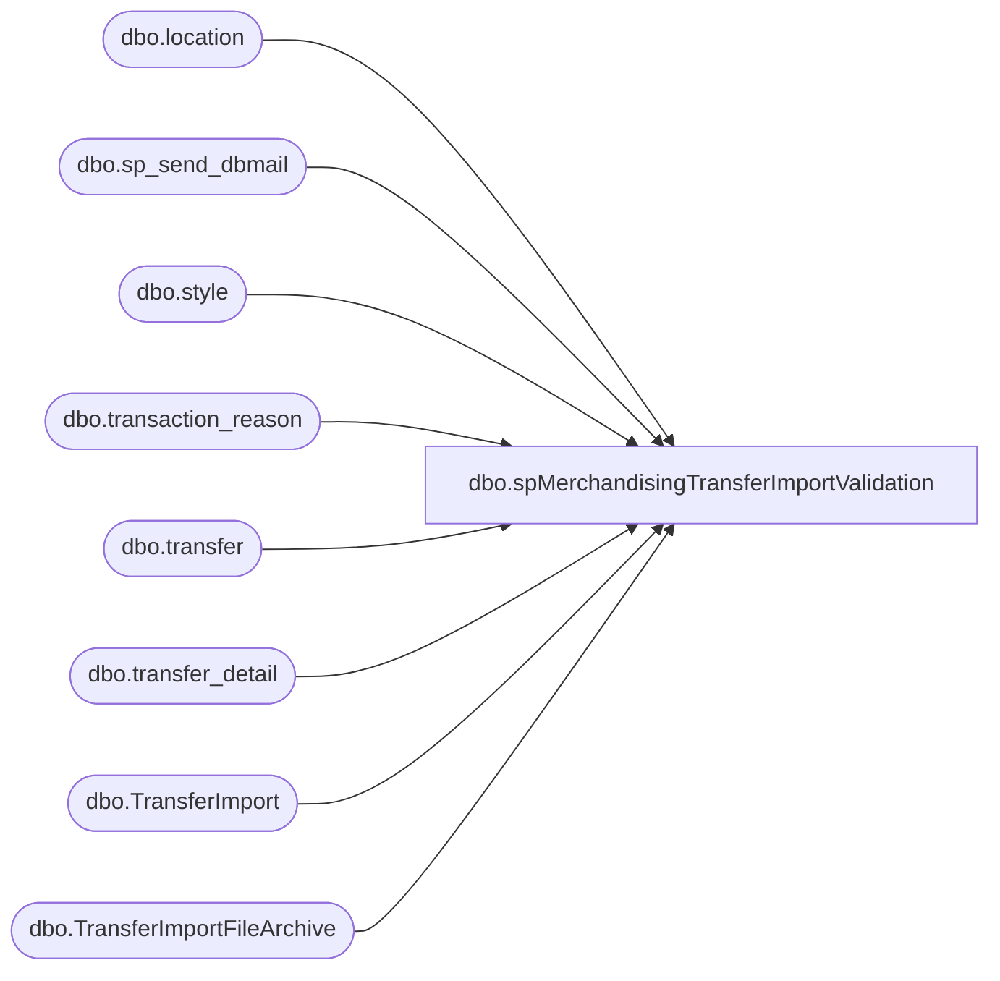

# dbo.spMerchandisingTransferImportValidation

**Database:** me_01  
**Server:** bedrockdb02  

## Architecture Diagram



## Table Dependencies

| Referenced Table |
|---|
| dbo.location |
| dbo.sp_send_dbmail |
| dbo.style |
| dbo.transaction_reason |
| dbo.transfer |
| dbo.transfer_detail |
| dbo.TransferImport |
| dbo.TransferImportFileArchive |

## Stored Procedure Code

```sql
CREATE proc [dbo].[spMerchandisingTransferImportValidation]

as

-- =====================================================================================================
-- Name: spMerchandisingTransferImportValidation
--
-- Description:	Sends summary email to Distro team to report on Transfers imported into Merch, sends txt alert if transfers aren't in Merch
--				
--				 
-- Revision History
--		Name:			Date:			Comments:
--		Dan Tweedie		05/12/2014		Created proc.	
-- =====================================================================================================

set nocount on

--run the pipeline segments to import any files that may still be in queue
EXEC pipeapp01.master..xp_cmdshell 'PipelineScheduleClient Start 16002 0'
EXEC pipeapp01.master..xp_cmdshell 'PipelineScheduleClient Start 19000 0'

--capture information for files imported since the previous run
if (object_id('tempdb..#a') is not null) drop table #a
select *
into #a
from TransferImport
where datediff(dd, import_time, getdate()) = 0
and importfile not in (select importfile from TransferImportFileArchive)
order by import_time desc

--if new file information exists, proceed...
if (select count(*) from #a) > 0

begin

--archive the import file name to prevent reporting on the same import multiple times
insert TransferImportFileArchive
select importfile
from TransferImport
where importfile not in (select importfile from TransferImportFileArchive)


--get list of transfers created in merch today
	if (object_id('tempdb..#b') is not null) drop table #b
	select	tl.location_code as destid,
			s.style_code,
			td.units_sent quantity,
			tr.transaction_reason_code rec_type,
			fl.location_code as sourceid,
			t.document_no,
			t.create_date,
			t.document_source
	into #b
	from	transfer t (nolock)
			join transfer_detail td (nolock) on t.transfer_id = td.transfer_id
			join style s (nolock) on td.style_id = s.style_id
			join location fl (nolock) on t.from_location_id = fl.location_id
			join location tl (nolock) on t.to_location_id = tl.location_id
			join transaction_reason tr (nolock) on t.transaction_reason_id = tr.transaction_reason_id
	where datediff(dd, t.create_date, getdate()) = 0

			
	--left join import file data to transfers created today 
	----- join based on style, qty, reason code, locations, (file import time < transfer create time)
	if (object_id('tempdb..##TransferImportLog') is not null) drop table ##TransferImportLog
	select a.from_location sourceLocn,
		   a.reason_code,
		   a.upc,
		   a.to_location destLocn,
		   a.qty,
		   a.importfile,
		   b.document_no transfer_number,
		   b.create_date transferCreated
	into ##TransferImportLog
	from #a a
	left join #b b on a.to_location = b.destid
	and			 right(a.upc,6) = b.style_code
	and			 a.qty = b.quantity
	and			 a.reason_code = b.rec_type
	and			 a.from_location = b.sourceid
	and			 a.import_time < b.create_date
	order by a.from_location, a.reason_code, a.upc
	--------
	
	--send summary email
	declare @text nvarchar(max)
	
	set @text = '
	<font face =arial size = 2> '  +
		'</b><H1>Transfer Import Log</H1>' +
		'<table border="1">' +
		'<tr><th>Source</th><th>Destination</th><th>Style</th><th>Qty</th><th>Transfer Number</th><th>Transfer Created</th><th>File Name</th></tr>' +
		CAST ( ( SELECT td = sourceLocn,'',
						td = destlocn, '',
						td = right(upc,6), '',
						td = qty, '',
						td = transfer_number, '',
						td = convert(varchar,transfercreated,100), '',
						td = importfile, ''						
				  from ##TransferImportLog
				  order by transfercreated desc, sourcelocn, upc, destlocn
				  FOR XML PATH('tr'), TYPE 
		) AS NVARCHAR(MAX) ) +
		'</font></table></font></p></p><br><br>
    <font face =arial size = 1>This report was run from bedrockdb02.me_01.dbo.spMerchandisingTransferImportValidation.</font>
    <br>'
    
	exec msdb.dbo.sp_send_dbmail
	@profile_name = 'merchadmin',
    @recipients = 'distrobears@buildabear.com;',
    @body = @text,
	@subject = 'Transfer Import Log',
	@body_format = 'HTML'

	--send alert if import data is not in Merch as a transfer
	if (select count(*) from ##TransferImportLog where transfer_number is null) > 0
	begin

		declare @text2 nvarchar(max)
	
		set @text2 = '
		<font face =arial size = 2> '  +
			'</b><H1>Transfer Import Error</H1>' +
			'<table border="1">' +
			'<tr><th>Source</th><th>Destination</th><th>Style</th><th>Qty</th><th>File Name</th></tr>' +
			CAST ( ( SELECT td = sourceLocn,'',
							td = destlocn, '',
							td = right(upc,6), '',
							td = qty, '',
							td = importfile, ''						
					  from ##TransferImportLog
					  where transfer_number is null
					  order by transfercreated desc, sourcelocn, upc, destlocn
					  FOR XML PATH('tr'), TYPE 
			) AS NVARCHAR(MAX) ) +
			'</font></table></font></p></p><br><br>
    <font face =arial size = 1>This report was run from bedrockdb02.me_01.dbo.spMerchandisingTransferImportValidation.</font>
    <br>'
    
		exec msdb.dbo.sp_send_dbmail
		@profile_name = 'merchadmin',
		@recipients = 'EntSysSupport@buildabear.com',
		@body = @text2,
		@subject = 'Transfer Import Error',
		@body_format = 'HTML'

	end

end
```

