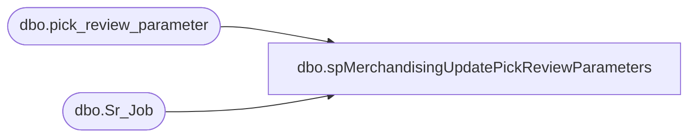

# dbo.spMerchandisingUpdatePickReviewParameters

**Database:** me_01  
**Server:** bedrockdb02  

## Architecture Diagram



## Table Dependencies

| Referenced Table |
|---|
| dbo.pick_review_parameter |
| dbo.Sr_Job |

## Stored Procedure Code

```sql
-- =============================================
-- Author:		<Justin Cross>
-- Create date: <07-31-24>
-- Description:	<If Min Max Job Runs Long and Does not complete by 11:59 am on Sunday Night, This will Update Pick Review Job to Run the next day Once Min Max Completes>
--			<	and will Trigger Pick review job to run.  >
-- =============================================
Create proc [dbo].[spMerchandisingUpdatePickReviewParameters]

As
Begin
 
 -- Create and populate the temporary table
IF OBJECT_ID('tempdb..#Min_Max_last') IS NOT NULL 
    DROP TABLE #Min_Max_last;

SELECT [last_date_time]
INTO #Min_Max_last
FROM [fn_01].[dbo].[Sr_Job]
WHERE job_id = 101;
 
 
 
 -- Update pick_review_parameter table
UPDATE pick_review_parameter
SET next_execution = CAST(GETDATE() AS DATE),
    review_on_Monday = 1
WHERE next_execution < CAST(GETDATE() AS DATE)
  AND NOT EXISTS (
   SELECT 1
FROM #Min_Max_last
WHERE #Min_Max_last.[last_date_time] >= DATEADD(day, DATEDIFF(day, 0, GETDATE()) - 1, 0)  -- Start of yesterday
  AND #Min_Max_last.[last_date_time] < DATEADD(day, DATEDIFF(day, 0, GETDATE()), 0)  -- Start of today

);
END;
```

