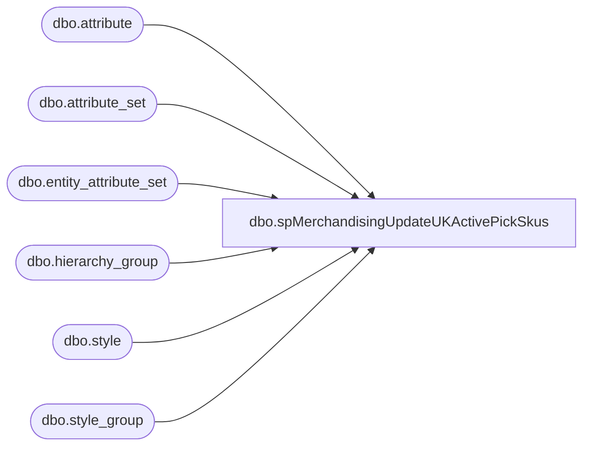

# dbo.spMerchandisingUpdateUKActivePickSkus

**Database:** me_01  
**Server:** bedrockdb02  

## Architecture Diagram



## Table Dependencies

| Referenced Table |
|---|
| dbo.attribute |
| dbo.attribute_set |
| dbo.entity_attribute_set |
| dbo.hierarchy_group |
| dbo.style |
| dbo.style_group |

## Stored Procedure Code

```sql
CREATE proc [dbo].[spMerchandisingUpdateUKActivePickSkus]

as 

-- =====================================================================================================
-- Name: spMerchandisingUpdateUKActivePickSkus
--
-- Description:	This is for updating the Active Pick attribute for the UK styles, based on a list of Active Pick styles provided to us from the UK warehouse.
--
-- Input: 
--
-- Output: 
--
-- Dependencies: 
--
-- Revision History
--		Name:			Date:			Comments:	
--		Dan Tweedie		03/30/2016		Created 
--		Tim Callahan	03/30/2016		Added Proc Description header and updated to new Pipeline server 
--		Lizzy Timm		09/03/2020		Commented out "FIRSTROW = 2" because the files do not contain headers
-- =====================================================================================================


--Created 2016-03-30 - Dan Tweedie - 

set nocount on

create table #ActivePick
(style_code varchar(6))

bulk insert #ActivePick
from '\\kermode\FileRepository\MERCHANDISING\UK_Distro\ActivePick\ActivePick.csv'
with 
(
--FIRSTROW = 2, --ensures headers will be ignored
FIELDTERMINATOR = ',',
ROWTERMINATOR = '\n'
)

if (select count(*) from #ActivePick) > 0

begin

	--Styles set to Active from file, but in Merch are currently set to Active = NO.  These will be updated to Active = YES
	IF (Object_ID('tempdb..#a') IS NOT NULL) DROP TABLE #a
	select s.style_code, 'YES' NewValue
	into #a
	from style s (nolock)
	join style_group sg (nolock) on s.style_id = sg.style_id
	join hierarchy_group hg (nolock) on sg.hierarchy_group_id = hg.hierarchy_group_id
	join entity_attribute_set eas (nolock) on s.style_id = eas.parent_id
	join attribute_set att (nolock) on eas.attribute_set_id = att.attribute_set_id
	join attribute a (nolock) on att.attribute_id = a.attribute_id and a.parent_type = 1
	where a.attribute_code in ('ACTIVE') --these are the hts attribute codes
	and att.attribute_set_code = 'NO'
	and s.active_flag = 1
	and s.style_code in (select style_code from #ActivePick)

	--Styles in Merch that are set to Active = YES, but are not set to Active in the File. These will be updated to Active = NO
	insert #a
	select s.style_code, 'NO' NewValue
	from style s (nolock)
	join style_group sg (nolock) on s.style_id = sg.style_id
	join hierarchy_group hg (nolock) on sg.hierarchy_group_id = hg.hierarchy_group_id
	join entity_attribute_set eas (nolock) on s.style_id = eas.parent_id
	join attribute_set att (nolock) on eas.attribute_set_id = att.attribute_set_id
	join attribute a (nolock) on att.attribute_id = a.attribute_id and a.parent_type = 1
	where a.attribute_code in ('ACTIVE') 
	and att.attribute_set_code = 'YES'
	and s.active_flag = 1
	and left(s.style_code, 1) =  '4'
	and s.style_code not in (select style_code from #ActivePick)


IF (select count(*) from #a) > 0

	begin

		IF (Object_ID('me_01..tmpACTIVEattribute') IS NOT NULL) DROP TABLE tmpACTIVEattribute
		select distinct 'SA' a, 'M' b, style_code c, 'ACTIVE' d, newvalue e
		into tmpACTIVEattribute
		from #a


		declare @query varchar(1000),
				@date varchar(14),
				@filename varchar(1000),
				@file_location varchar(100),
				@server varchar(20),
				@username varchar(20),
				@password varchar(20),
				@bcp varchar(1000),
				@ren varchar(200)

		set @query = 'set nocount on select * from me_01.dbo.tmpACTIVEattribute'
		set @date = convert(varchar, datepart(yyyy, getdate())) + convert(varchar, datepart(mm, getdate())) + convert(varchar, datepart(dd, getdate())) + convert(varchar, datepart(hh, getdate())) + convert(varchar, datepart(mi, getdate())) + convert(varchar, datepart(ss, getdate()))
		set @filename = 'STSIMStyleAttribute.ACT.' + @date + '.GO'
		set @file_location = '\\pipeapp01\Company01\Text File to EDM & PROD Import Tables - Imp Master Entities\'
		set @server = 'bedrockdb02'
		set @bcp = 'bcp "' + @query + '" queryout "' + @file_location + @filename + '" -T -c -S' + @server 

		exec master..xp_cmdshell @bcp
	
		set @ren = 	'EXEC master..xp_cmdshell ''ren \\kermode\FileRepository\MERCHANDISING\UK_Distro\ActivePick\ActivePick.csv ActivePick.' + @date + '.csv'''
		exec(@ren)

		EXEC master..xp_cmdshell 'move \\kermode\FileRepository\MERCHANDISING\UK_Distro\ActivePick\* \\kermode\FileRepository\MERCHANDISING\UK_Distro\ActivePick\done'

	 

	end

end
```

