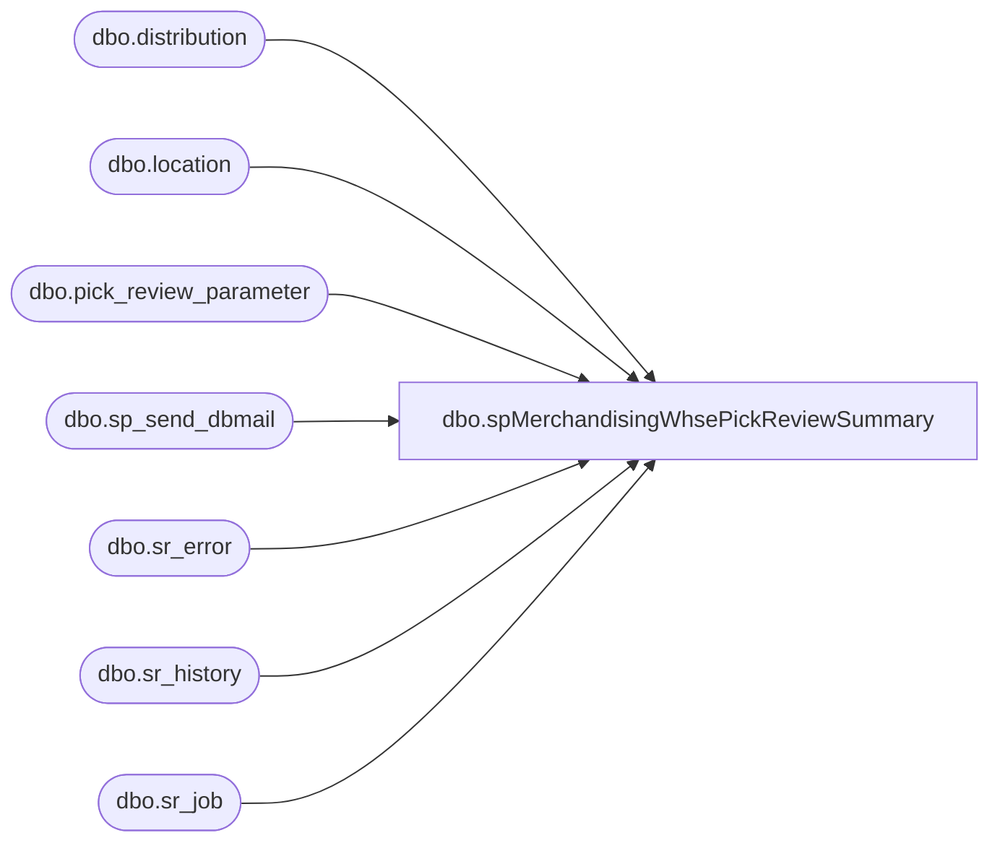

# dbo.spMerchandisingWhsePickReviewSummary

**Database:** me_01  
**Server:** bedrockdb02  

## Architecture Diagram



## Table Dependencies

| Referenced Table |
|---|
| dbo.distribution |
| dbo.location |
| dbo.pick_review_parameter |
| dbo.sp_send_dbmail |
| dbo.sr_error |
| dbo.sr_history |
| dbo.sr_job |

## Stored Procedure Code

```sql
CREATE proc [dbo].[spMerchandisingWhsePickReviewSummary]

as 

-- =====================================================================================================
-- Name: spMerchandisingWhsePickReviewSummary
--
-- Description:	Summarizes and checks for errors with the Warehouse Pick Review 
--				1) Checks to see if the Distro (A&R) Schedule is set in the Merch system.
--					-->If schedule is not set, it sends an informational email to MerchAdmin team just as an FYI
--					---->The Distro team is responsible for setting this and sometimes they intentionally have nothing scheduled. Usually Wednesdays.
--				2) If distro schedule is set, it checks for the following.
--					-->Confirm that the Whse Pick Review job completed successfully.
--					---->If job not completed successfully, send an email and text alert.
--					-->Confirm that distros were created
--					---->If distros created, send summary email to Distro team
--					---->If distros not created, send email and text alert
--					-->Confirm that Next Run date was updated on the distro schedule for the descriptions scheduled
--					---->If Next Run Date not updated, send email and text alert
--
-- Revision History
--		Name:			Date:			Comments:
--		Dan Tweedie		07/15/2013		Created proc.	
--		Dan Tweedie		07/29/2014		Added RS Polling and my SMS as recipients of the alerts
--		Dan Tweedie		7/20/2015		Changed job server lookup to fn_01 instead of smartlook_01 due to new merch version changes
--		Dan Tweedie		08/18/2015		Removed my phone number from email alerts
--		Paul Beckman	12/31/2019		Changed the section that checks the Next Run Date by removing the date formatting
--										due to the new year.  Left the original line below the new one but commented out for now.
--		Paul Beckman	12/31/2019		Corrected the SQL Agent job name for the body of the emails
--		Justin Cross	01/24/2024		Added Text Alert to ES team for Problem email or error when running
-- =====================================================================================================

set nocount on

---CHECK TO SEE IF THE DISTRO SCHEDULE IS SET FOR 'YESTERDAY' (JOB RUNS AT 2AM, SO SCHEDULE WOULD BE FOR THE PREVIOUS DAY)
IF (Object_ID('tempdb..#schedule') IS NOT null) DROP TABLE #schedule
select l.location_code warehouse,
p.distribution_description,
convert(varchar, last_execution, 101) last_execution,
convert(varchar, next_execution, 101) next_execution,
case when p.review_on_sunday = 1 then 'YES' else 'NO' end as Sunday,
case when p.review_on_monday = 1 then 'YES' else 'NO' end as Monday,
case when p.review_on_tuesday = 1 then 'YES' else 'NO' end as Tuesday,
case when p.review_on_wednesday = 1 then 'YES' else 'NO' end as Wednesday,
case when p.review_on_thursday = 1 then 'YES' else 'NO' end as Thursday,
case when p.review_on_friday = 1 then 'YES' else 'NO' end as Friday,
case when p.review_on_saturday = 1 then 'YES' else 'NO' end as Saturday
into #schedule
from pick_review_parameter p (nolock)
join location l (nolock) on p.warehouse_id = l.location_id
order by last_execution, next_execution

IF (Object_ID('tempdb..#distribtuion_description') IS NOT null) DROP TABLE #distribtuion_description
create table #distribtuion_description
(distribution_description varchar(1000))

declare @runday varchar(10),
		@sql varchar(1000)

select @runday = datename(dw, getdate()-1)
select @sql = 'select distribution_description from #schedule where ' + @runday + ' = ''YES'' and (datediff(dd, last_execution, getdate()-1) = 0 or datediff(dd, next_execution, getdate()-1) = 0)'

insert #distribtuion_description
exec (@sql)

---IF DISTRO SCHEDULE IS SET.........
if (select count(*) from #distribtuion_description) > 0 ---this means there was a distro schedule

BEGIN
	---CHECK TO SEE IF THE JOB HAS RUN
	IF (Object_ID('tempdb..#status') IS NOT null) DROP TABLE #status
	select j.label, 
		   max(h.start_datetime) last_start_time, 
		   max(end_datetime) last_finish_time, 
		   case when sucessful = 1 then 'YES' else 'NO' end as Success,
		   case when e.message is null then 'N/A' else e.message end as Error
	into #status
	from fn_01.dbo.sr_job j (nolock)
	join fn_01.dbo.sr_history h (nolock) on j.job_id = h.job_id
	left join fn_01.dbo.sr_error e (nolock) on h.execution_id = e.execution_id
	where j.active = 1
	and j.server_id = 16 --'Merch Scheduled Jobs - LIVE'
	and j.job_id in (104, 118) --'A&R- Sunday Warehouse Pick Review', 'A&R: Daily - Warehouse Pick review'
	and datediff(dd, h.start_datetime, getdate()-1) = 0
	group by j.label, j.last_date_time, j.next_date_time, sucessful, e.message
	order by j.label

	--IF THE JOB HAS COMPLETED SUCCESSFULLY
	if (select count(*) from #status where success = 'YES') > 0 ---JOB COMPLETED SUCCESSFULLY
			
		begin --CONFIRM IF DISTROS ARE CREATED, SEND SUMMARY EMAIL IF DISTROS CREATED
			
			If	(select count(*)
				from distribution (nolock)
				where document_source = 9 and distribution_description in (select distribution_description from #distribtuion_description)
			) > 0 --DISTROS CREATED
			begin
				declare @text nvarchar(max)
				set @text = '
				<font face =arial size = 2> ' +
					'<b>Warehouse Pick Review Summary</b>' +
					'<br>The warehouse pick review process has completed, with the following distribution counts.' +
					'<br><br>' +
					'<table border="1" <font face =arial size = 2>' +
					'<tr><th>START-TIME</th><th>END-TIME</th></tr>' +
					CAST ( ( SELECT td = convert(varchar, last_start_time, 100), '',
									td = convert(varchar, last_finish_time, 100), ''
								from #status
								FOR XML PATH('tr'), TYPE 
					) AS NVARCHAR(MAX) ) +
					
					'<tr><th>DESCRIPTION</th><th>DISTRO COUNT</th></tr>' +
					CAST ( ( SELECT td = distribution_description,'',
									td = count(*), ''
								from distribution
								where document_source = 9 and distribution_description in (select distribution_description from #distribtuion_description)
								group by distribution_description
								FOR XML PATH('tr'), TYPE 
					) AS NVARCHAR(MAX) ) +
					'</font></table></font></p></p>
					<br>
					<br>
					Brought to you by bedrockdb02.SQL_AGENT.MERCHANDISING - Validation - Warehouse Pick Review'

				exec msdb.dbo.sp_send_dbmail
				@profile_name = 'merchadmin',
				@recipients = 'tamib@buildabear.com;corieb@buildabear.com;poll@buildabear.com',
				@subject = 'WAREHOUSE REVIEW SUMMARY',
				@body = @text,
				@body_format = 'HTML'
			end

		If	(select count(*)
				from distribution (nolock)
				where document_source = 9 and distribution_description in (select distribution_description from #distribtuion_description)
			) < 1 --DISTROS NOT CREATED

			begin --IF DISTROS NOT CREATED, SEND 'PROBLEM' EMAIL
				exec msdb.dbo.sp_send_dbmail
				@profile_name = 'merchadmin',
				@recipients = 'enterprisesystemsalerts@buildabear.com; EntSysSupport@buildabear.com; poll@buildabear.com',
				@subject = 'WAREHOUSE REVIEW - NO DISTROS CREATED - PROBLEM',
				@body = 'The warehouse pick review process completed, and the distro schedule was set, but no distros were created. !Call MerchAdmin ASAP!

Brought to you by bedrockdb02.SQL_AGENT.MERCHANDISING - Validation - Warehouse Pick Review'
			end

			--IF NEXT RUN DATE NOT CHANGED, SEND EMAIL
		If (select count(*) 
			from #schedule 
			where distribution_description in (select distribution_description from #distribtuion_description)
			and next_execution < getdate()) > 0 --NEXT RUN DATE BEFORE TODAY'S DATE
			--and convert(varchar, next_execution, 101) < convert(varchar, getdate(), 101)) > 0 --ORINIGNAL CODE REPLACED WITH THE LINE ABOVE ON 12/31/2019
			
			begin
				exec msdb.dbo.sp_send_dbmail
				@profile_name = 'merchadmin',
				@recipients = 'EntSysSupport@buildabear.com; poll@buildabear.com',
				@subject = 'WAREHOUSE REVIEW - NEXT RUN DATE NOT CHANGED - PROBLEM',
				@body = 'The warehouse pick review has completed, but the ''next run date'' was not changed on the Distro schedule in Merch. !Call MerchAdmin ASAP!

Brought to you by bedrockdb02.SQL_AGENT.MERCHANDISING - Validation - Warehouse Pick Review'
			end
		
		end

		--IF WHSE JOB HAS NOT COMPLETED SUCCESSFULLY, SEND EMAIL
	if (select count(*) from #status where success = 'YES') < 1

		begin
			exec msdb.dbo.sp_send_dbmail
			@profile_name = 'merchadmin',
			@recipients = 'EntSysSupport@buildabear.com; poll@buildabear.com; enterprisesystemsalerts@buildabear.com',
			@subject = 'WAREHOUSE REVIEW NOT COMPLETED - PROBLEM',
			@body = 'The warehouse pick review process has not finished successfully, or may have an error. !Call Merch Admin ASAP!
Brought to you by bedrockdb02.SQL_AGENT.MERCHANDISING - Validation - Warehouse Pick Review'
		end

END

--IF DISTRO SCHEDULE WASN'T SET, SEND FYI EMAIL
if (select count(*) from #distribtuion_description) < 1 ---this means there was NOT a distro schedule
	begin
		exec msdb.dbo.sp_send_dbmail
		@profile_name = 'merchadmin',
		@recipients = 'poll@buildabear.com',
		@subject = 'WAREHOUSE REVIEW - NO SCHEDULE SET - NO PROBLEM',
		@body = 'There is not a distro schedule set in the A&R system. This is only FYI.
Brought to you by bedrockdb02.SQL_AGENT.MERCHANDISING - Validation - Warehouse Pick Review'
	end
```

