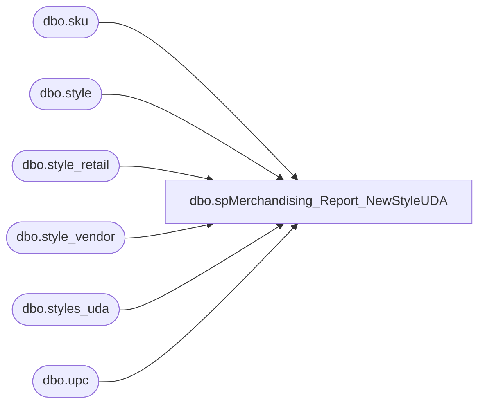

# dbo.spMerchandising_Report_NewStyleUDA

**Database:** me_01  
**Server:** bedrockdb02  

## Architecture Diagram



## Table Dependencies

| Referenced Table |
|---|
| dbo.sku |
| dbo.style |
| dbo.style_retail |
| dbo.style_vendor |
| dbo.styles_uda |
| dbo.upc |

## Stored Procedure Code

```sql
CREATE proc [dbo].[spMerchandising_Report_NewStyleUDA]
as
set nocount on

-- =====================================================================================================
-- Name: spMerchandising_Report_NewStyleUDA
--
-- Description:	For styles in New status, creates UDA file to adjust 1 unit up for location 9990, 
--				then creates UDA file to adjust 1 unit down for location 9990.
--				This triggers Merch to update the style status from New to Received.
--
-- Input:	NA
--			
--
-- Output: Resultset formatted to meet Epicor requirements for User Defined Adjustment file.
--			
--
-- Dependencies: spMerchandising_Select_NewStyleUDAMinus
--				 spMerchandising_Select_NewStyleUDAPlus	
--
-- Revision History
--		Name:			Date:			Comments:
--		Dan Tweedie		05/27/2010		Created proc.
--		Dan Tweedie		10/09/2013		updated script with a join sku table and to the UPC table instead of a subquery to upc table, also style_status filter is now <4 instead of <3	
--		Dan Tweedie		06/05/2014		Changed the datestamp variable to be varchar and the value to include hour, minutes, seconds
--		Dan Tweedie		05/02/2015		Added join condition to style_vendor so primary_vendor_flag = 1
-- =====================================================================================================


IF (Object_ID('me_01..styles_uda') IS NOT NULL) DROP TABLE me_01..styles_uda
create table styles_uda
(id int identity, datestamp varchar(20), style varchar(6))

insert styles_uda
select distinct convert(varchar, datepart(yyyy, getdate())) + convert(varchar, datepart(mm, getdate())) + convert(varchar, datepart(dd, getdate())) + convert(varchar, datepart(hh, getdate())) + convert(varchar, datepart(mi, getdate())) + convert(varchar, datepart(ss, getdate())), s.style_code
from style s (nolock)
join style_vendor sv (nolock) on s.style_id = sv.style_id and sv.primary_vendor_flag = 1
join sku (nolock) on s.style_id = sku.style_id --new 10/09/2013
join upc u (nolock) on '000000' + s.style_code = u.upc_number and sku.sku_id = u.sku_id --new 10/09/2013
left join style_retail sr (nolock) on sr.style_id = s.style_id
where s.style_status < 4  --changed to 4 on 10/09/2013
and s.active_flag = 1
and sv.current_cost is not null
and sr.style_id is not null
order by s.style_code


if (select count(*) from styles_uda) > 0

begin

	declare @plusfile varchar(1000),
			@minusfile varchar(1000)

	select @plusfile = 'sqlcmd  -Sbedrockdb02 -dme_01 -Q"exec spMerchandising_Select_NewStyleUDAPlus" -o"\\pipeapp01\Company01\Text File to IM Import Tables - Import UDAs\STSIMUDA.NewStylesPlus.%date:~10%%date:~4,2%%date:~7,2%%time:~0,2%%time:~3,2%%time:~6,2%.GO" -w1000'
	select @minusfile = 'sqlcmd  -Sbedrockdb02 -dme_01 -Q"exec spMerchandising_Select_NewStyleUDAMinus" -o"\\pipeapp01\Company01\Text File to IM Import Tables - Import UDAs\STSIMUDA.NewStylesMinus.%date:~10%%date:~4,2%%date:~7,2%%time:~0,2%%time:~3,2%%time:~6,2%.GO" -w1000'

	exec master..xp_cmdshell @plusfile
	exec master..xp_cmdshell @minusfile

end
```

