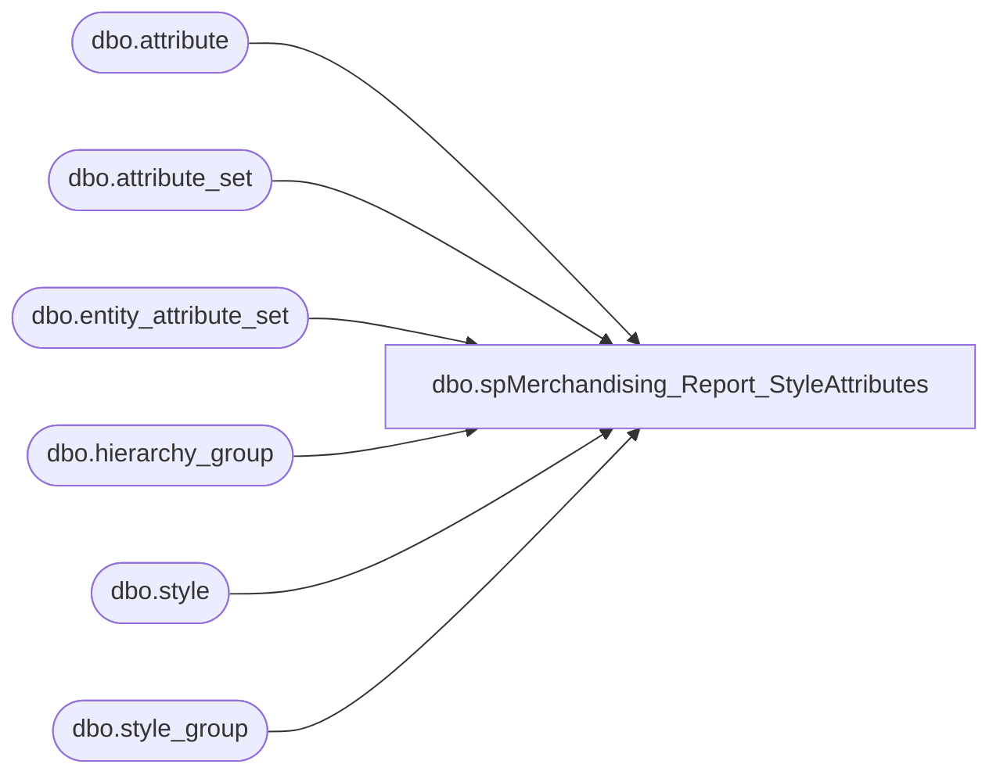

# dbo.spMerchandising_Report_StyleAttributes

**Database:** me_01  
**Server:** bedrockdb02  

## Architecture Diagram



## Table Dependencies

| Referenced Table |
|---|
| dbo.attribute |
| dbo.attribute_set |
| dbo.entity_attribute_set |
| dbo.hierarchy_group |
| dbo.style |
| dbo.style_group |

## Stored Procedure Code

```sql
CREATE proc [dbo].[spMerchandising_Report_StyleAttributes]
as

-- =====================================================================================================
-- Name: spMerchandising_Report_StyleAttributes
--
-- Description:	Set factory attribute for UK & CA styles to be equal to the factory attribute of the US versions of the styles
--
-- Input:
--
-- Output: Resultset formatted to meet Epicor requirements for Style Attribute Set
--
-- Dependencies: spMerchandising_Select_StyleAttributes
--
-- Revision History
--		Name:			Date:			Comments:
--		Dan Tweedie		11/22/2010		Created proc.	
--		Dan Tweedie		12/7/2010		Added code to exclude Supplies
-- =====================================================================================================

set nocount on

IF (Object_ID('tempdb..#a') IS NOT NULL) DROP TABLE #a

select	s.style_code
into #a
from style s (nolock)
join entity_attribute_set eas (nolock) on s.style_id = eas.parent_id
join attribute_set att (nolock) on eas.attribute_set_id = att.attribute_set_id
join attribute a (nolock) on att.attribute_id = a.attribute_id
join style_group sg (nolock) on s.style_id = sg.style_id
join hierarchy_group hg (nolock) on sg.hierarchy_group_id = hg.hierarchy_group_id
where a.attribute_code = 'FACTRY'
and a.parent_type = 1
and att.attribute_set_code <> 'NONE'
and left(s.style_code,1) = '0'
and substring(hg.hierarchy_group_code,7,2) <> 60 --excludes supplies
order by s.style_code


if (select count(s.style_code) 
	from style s (nolock)
	join entity_attribute_set eas (nolock) on s.style_id = eas.parent_id
	join attribute_set att (nolock) on eas.attribute_set_id = att.attribute_set_id
	join attribute a (nolock) on att.attribute_id = a.attribute_id
	join #a USA on right(USA.style_code, 5) = right(s.style_code, 5) and left(s.style_code, 1) in ('1', '4')
	where a.attribute_code = 'FACTRY'
	and a.parent_type = 1
	and att.attribute_set_code = 'NONE') > 0
		
BEGIN

	declare @query varchar(1000),
			@filename varchar(1000),
			@file_location varchar(100),
			@server varchar(20),
			@username varchar(20),
			@password varchar(20),
			@bcp varchar(1000)

	set @query = 'set nocount on exec me_01.dbo.spMerchandising_Select_StyleAttributes'
	set @filename = 'STSIMStyleAttribute.' + convert(varchar, datepart(yyyy, getdate())) + convert(varchar, datepart(mm, getdate())) + convert(varchar, datepart(dd, getdate())) + convert(varchar, datepart(hh, getdate())) + convert(varchar, datepart(mi, getdate())) + convert(varchar, datepart(ss, getdate())) + '.GO'
	set @file_location = '\\pipeapp01\Company01\Text File to EDM & PROD Import Tables - Imp Master Entities\'
	set @server = 'bedrockdb02'
	set @username = 'ssis'
	set @password = 'SS1S'
	set @bcp = 'bcp "' + @query + '" queryout "' + @file_location + @filename + '" -T -c -S' + @server + ' -U' + @username + ' -P' + @password

	exec master..xp_cmdshell @bcp

END
```

