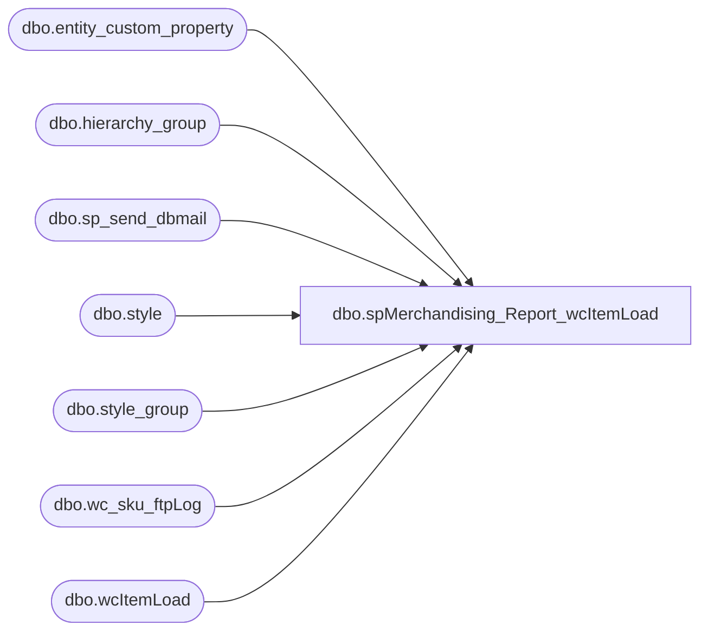

# dbo.spMerchandising_Report_wcItemLoad

**Database:** me_01  
**Server:** bedrockdb02  

## Architecture Diagram



## Table Dependencies

| Referenced Table |
|---|
| dbo.entity_custom_property |
| dbo.hierarchy_group |
| dbo.sp_send_dbmail |
| dbo.style |
| dbo.style_group |
| dbo.wc_sku_ftpLog |
| dbo.wcItemLoad |

## Stored Procedure Code

```sql
CREATE proc [dbo].[spMerchandising_Report_wcItemLoad]
as
set nocount on
-- =====================================================================================================
-- Name: spMerchandising_Report_wcItemLoad
--
-- Description:	Captures SKU data and uploads to Dependable IT's server for the West Coast Warehouse.
--
-- Input:	NA
--
-- Output: Item Master CSV file
--
-- Dependencies: 
--				 
--
-- Revision History
--		Name:			Date:			Comments:
--		Dan Tweedie		06/01/2010		Created proc.	
-- =====================================================================================================
---Capture SKU data into wcItemLoad table
IF (Object_ID('me_01..wcItemLoad') IS NOT NULL) DROP TABLE wcItemload
create table wcItemLoad
(UpdateDate varchar(10),
UpdateUserID varchar(4),
UpdatePID varchar(10),
ActionCode varchar(1),
Direction varchar(2),
InterfaceStatus varchar(3),
SKU varchar(10),
Facility varchar(2),
Class varchar(2),
InternalUse1 varchar(1),
InternalUse2 varchar(1),
InternalUse3 varchar(1),
Description1 varchar(50),
Description2 varchar(1),
UnitDesc varchar(2),
BulkDesc varchar(1),
BulkQty varchar(1),
InternalUse4 varchar(1),
InternalUse5 varchar(1),
InternalUse6 varchar(1),
Length varchar(1),
Width varchar(1),
Height varchar(1),
Cube varchar(1),
Weight varchar(1),
SerialTrack varchar(1),
LotTrack varchar(1),
ExpDateTrack varchar(1),
MfgDateTrack varchar(1),
HighQty varchar(1),
TieQty varchar(1),
ShippableUnit varchar(1),
AgeControl varchar(1),
InternalUse7 varchar(1),
InternalUse8 varchar(1),
InternalUse9 varchar(1),
NMFCode varchar(1),
InternalUse10 varchar(1),
InternalUse11 varchar(1),
InternalUse12 varchar(1),
InternalUse13 varchar(4),
AltPartNbr varchar(1) )

insert wcItemLoad
select 	left(convert(varchar, getdate(), 120), 10) as UpdateDate,
		'BABW' as UpdateUserID,
		'wcItemLoad' as UpdatePID,
		'A' as ActionCode,
		'IN' as Direction,
		'NEW' as InterfaceStatus,
		s.style_code as SKU,
		'01' as Facility,
		'01' as Class,
		'' as InternalUse1,
		'' as InternalUse2,
		'' as InternalUse3,
		replace(s.short_desc,'"','') as Description1,
		'' as Description2,
		'EA' as UnitDesc,
		'' as BulkDesc,
		'' as BulkQty,
		'' as InternalUse4,
		'' as InternalUse5,
		'' as InternalUse6,
		'0' as Length,
		'0' as Width,
		'0' as Height,
		'0' as Cube,
		'0' as Weight,
		'N' as SerialTrack,
		'N' as LotTrack,
		'N' as ExpDateTrack,
		'N' as MfgDateTrack,
		'' as HighQty,
		'' as TieQty,
		'N' as ShippableUnit,
		'Y' as AgeControl,
		'' as InternalUse7,
		'N' as InternalUse8,
		'0' as InternalUse9,
		'' as NMFCode,
		'' as InternalUse10,
		'' as InternalUse11,
		'' as InternalUse12,
		'1856' as InternalUse13, 
		'' as AltPartNbr
from	style s (nolock)
join	style_group sg (nolock) on	s.style_id = sg.style_id
join	hierarchy_group hg (nolock) on	sg.hierarchy_group_id = hg.hierarchy_group_id
left outer join entity_custom_property ecp2 (nolock) on s.style_id = ecp2.parent_id
		and	ecp2.custom_property_id = 2 -- FRCSTM
		and	ecp2.parent_type = 1
where left(s.style_code, 1) not in ('1', '4') --excludes CA and UK style codes
and datediff(dd, s.last_modified, getdate()) = 0 
order by s.style_code

if (select count(*) from wcItemLoad) > 0

begin

--Export data to CSV file
	declare @itemload varchar(1000)
	select @itemload = 'sqlcmd -Ussis -PSS1S -Soursmerchdb01 -dme_01 -s"," -h"-1" -Q"set nocount on select * from wcItemLoad order by SKU" -o"\\wmetl01\Informatica\TgtFiles\HOST_to_WestCoastDC_ItemMaster\ItemMaster.%date:~10%%date:~4,2%%date:~7,2%%time:~0,2%%time:~3,2%%time:~6,2%.csv" -w1000'
	exec master..xp_cmdshell @itemload
	
---FTP file to west coast warehouse, capture log 
	IF (Object_ID('me_01..wc_sku_ftpLog') IS NOT NULL) DROP TABLE wc_sku_ftpLog
	create table wc_sku_ftpLog
	(ftpLog varchar(4000))

	declare @ftp varchar(1000)
	set @ftp = 'ftp -d -s:\\wmetl01\Informatica\TgtFiles\HOST_to_WestCoastDC_ItemMaster\ftpscript.txt' 
	insert wc_sku_ftpLog exec master..xp_cmdshell @ftp

	if (select count (*) from wc_sku_ftpLog where ftpLog like '%Transfer complete%') > 0 
		begin
		---Move file to DONE folder
			declare @done varchar(1000)
			set @done = 'move \\wmetl01\Informatica\TgtFiles\HOST_to_WestCoastDC_ItemMaster\*.csv \\wmetl01\Informatica\TgtFiles\HOST_to_WestCoastDC_ItemMaster\DONE'	
			exec master..xp_cmdshell @done
		end
	
	if (select count (*) from wc_sku_ftpLog where ftpLog like '%Transfer complete%') < 1
		begin
			
		--output from ftpLog to text file
			declare @Log_query varchar(1000),
					@Log_filename varchar(100),
					@Log_file_location varchar(100),
					@Log_bcp varchar(1000)

			set @Log_query = 'select * from oursmerchdb01.me_01.dbo.wc_sku_ftpLog'
			set @Log_filename = 'ftpLog.txt'
			set @Log_file_location = '\\wmetl01\Informatica\TgtFiles\HOST_to_WestCoastDC_ItemMaster\'
			set @Log_bcp = 'bcp "' + @Log_query + '" queryout "' + @Log_file_location + @Log_filename + '" -t, -T -c'

			exec master..xp_cmdshell @Log_bcp
		--send email with log file attached
			declare @body varchar(4000)
			set @body =	'An attempt to FTP an Item Load file from Merchandising to West Coast DC (Dependable) failed.' 
						+ char(10) + char(13) + 
						'See the attached log for details.'
						+ char(10) + char(13) + 
						+ char(10) + char(13) + 
						'This process is managed by oursmerchdb01.me_01.dbo.spMerchandising_Report_wcItemLoad'
	
			EXEC oursmerchdb01.msdb.dbo.sp_send_dbmail
			@profile_name = 'MerchAdmin',
			@recipients = 'EntSysSupport@buildabear.com',
			@subject = 'FTP Failure: Item Load File From Merchandising To West Coast DC (Dependable)',
			@body = @body,
			@file_attachments = '\\wmetl01\Informatica\TgtFiles\HOST_to_WestCoastDC_ItemMaster\ftpLog.txt',
			@importance = 'HIGH'
		end			

end
```

