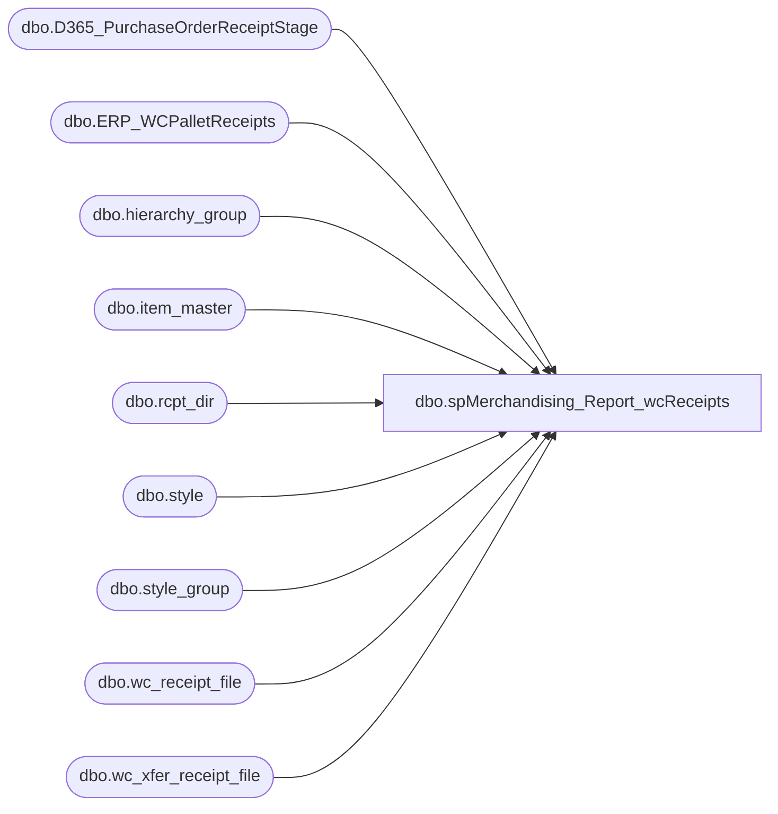

# dbo.spMerchandising_Report_wcReceipts

**Database:** me_01  
**Server:** bedrockdb02  

## Architecture Diagram



## Table Dependencies

| Referenced Table |
|---|
| dbo.D365_PurchaseOrderReceiptStage |
| dbo.ERP_WCPalletReceipts |
| dbo.hierarchy_group |
| dbo.item_master |
| dbo.rcpt_dir |
| dbo.style |
| dbo.style_group |
| dbo.wc_receipt_file |
| dbo.wc_xfer_receipt_file |

## Stored Procedure Code

```sql
CREATE proc [dbo].[spMerchandising_Report_wcReceipts]
as

-- =====================================================================================================
-- Name: spMerchandising_Report_wcReceipts
--
-- Description:	Produces PO Receipt file & Carton Batch Receiving file, based on data provided in file from West Coast DC.
--				This proc will import a file from the west coast DC, check for existence of po receipts and/or shipment receipts,
--				execute procs to produce po receipt file and/or shipment receipt file, drop files on pipeline server.
--
-- Input:	*.dat file located at \\kermode\FileRepository\MERCHANDISING\WC_Distro\RECEIPTS\ -- This file will be uploaded by the West Coast DC.
--
-- Output: Resultset formatted to meet Epicor requirements for PO Receipt Import.
--
-- Dependencies: spMerchandising_Select_wcPOreceipts
--				
--
-- Revision History
--		Name:			Date:			Comments:
--		Dan Tweedie		07/13/2010		Created proc.	
--		Keith Lee		07/27/2010		Changed distribution_multiple to order_multiple.
--		Dan Tweedie		11/2/2010		For PO Receipt block, I added code to execute the Pipeline segment 16003 to import the file
--										Added SMS text message for the exception notification
--		Dan Tweedie		10/25/2011		Added special handling depending on whether file is for po receipt or for xfer receipt
--		Dan Tweedie		07/14/2015		Pointed to Kermode instead of Oursmerchdb01
--		Dan Tweedie		2017-11-21		Added statement to insert PO Receipts data into D365_PurchaseOrderReceiptStage so another process can integrate to D365 as needed
--		Dan Tweedie		2017-11-21		Added statement to insert Pallet Receipts data into ERP_WCPalletReceipts so another process can integrate to D365 as needed
--		Tim Callahan	06/28/2018		Added statement to delete records from wc_receipt_file staging table for D365 POs, otherwise they would fail to import in Merch\Pipeline 
--										May need to add additional logic for the transfer receipts as PO number is not referenced as it's not a PO 
--										May have to some sort of look up to the Carton Dtl table in WM 
--		Tim Callahan	04/08/2019		Updated How Temp Item Master Table is generated as Aptos is no longer the system of record for supply styles, using WM for supply pack qty and Aptos for merch pack qty
--										Also updated Xfer (0980 to 0960) transfer receipt CBR generation exclude cartons with supplies as these cartons will not exist in Aptos. 
--		Dan Tweedie		2021-02-01		Replace ItemMaster query from WM with query to Merch, Replace CBR query to select containers from stl-ssis-p-01.IntegrationStaging.WMS.DynamicsContainer
--		Lizzy Timm		2022-11-11		Update field terminator for xfer files from comma to tab and added logic to kick off pipeline segment 16499
-- =====================================================================================================


set nocount on

if (object_id('me_01..rcpt_dir') is not null) drop table rcpt_dir
create table rcpt_dir
(output varchar(100))

insert rcpt_dir
EXEC master..xp_cmdshell 'dir \\kermode\FileRepository\MERCHANDISING\WC_Distro\RECEIPTS\*.dat /B'

if (select count(*) from rcpt_dir where output like '%.dat%') > 0

BEGIN

		--capture style list and hierarchy
		if (object_id('me_01..item_master') is not null) drop table item_master
		create table item_master
		(style varchar(10),
		store_dept varchar(3),
		order_multiple int)

	

		-- New Item Master Code Added on 4/8/2018

		 
		insert item_master
		select 
			   s.style_code as style,
			   'MER' as store_dept,
			   s.order_multiple
		from style s with (nolock)
		join style_group sg with (nolock) on s.style_id = sg.style_id
		join hierarchy_group hg with (nolock) on sg.hierarchy_group_id = hg.hierarchy_group_id
		where 1=1
		and s.active_flag = 1
		and substring(hg.hierarchy_group_code,7,2) <> 60 --EXCLUDES SUPPLIES


		-------------------------------------------------------------------------------------------------------------------------------------
		--This process handles transfer receipt files and po receipt files, there is special handling for each.
		--the sql agent job (that executes this procedure) already polled the directory into rcpt_dir so we use this date to manage the handling.

		--Handle the xfer receipt file (if any)
		if (select count(*) from rcpt_dir where output like 'rc_babw_xfer%.dat') > 0
			begin
					--rename file
					EXEC master..xp_cmdshell 'ren \\kermode\FileRepository\MERCHANDISING\WC_Distro\RECEIPTS\rc_babw_xfer*.dat xfer_receipt.dat'
					--import file into work table
					if (object_id('me_01..wc_xfer_receipt_file') is not null) drop table wc_xfer_receipt_file
					create table wc_xfer_receipt_file
					(dateage varchar(10),
					pallet varchar(20))

					bulk insert wc_xfer_receipt_file
					from '\\kermode\FileRepository\MERCHANDISING\WC_Distro\RECEIPTS\xfer_receipt.dat'
					with 
					(
					FIELDTERMINATOR = '\t',
					ROWTERMINATOR = '\n'
					)

					----STAGE DATA FOR DYNAMICS
					if (select count(*) from wc_xfer_receipt_file) > 0
					begin
						insert ERP_WCPalletReceipts
						select dateage, pallet 
						from wc_xfer_receipt_file
					end

					

					--rename file with timestamp
					EXEC master..xp_cmdshell 'ren \\kermode\FileRepository\MERCHANDISING\WC_Distro\RECEIPTS\xfer_receipt.dat xfer_receipt%date:~4,2%%date:~7,2%%date:~10%.dat'
					--move file to DONE folder
					EXEC master..xp_cmdshell 'move \\kermode\FileRepository\MERCHANDISING\WC_Distro\RECEIPTS\xfer_receipt*.dat \\kermode\FileRepository\MERCHANDISING\WC_Distro\RECEIPTS\done'
					---generate carton batch receipt file for pipeline
								declare @query2 varchar(1000),
								@file_location2 varchar(100),
								@file_name2 varchar(100),
								@server2 varchar(52),
								@database2 varchar(52),
								@bcp varchar(1000)
						
								-- Replaced  @query2 on 4/8/2019
								--set @query2 = 'set nocount on select ''BC'', ''A'', ch.carton_nbr, ''0960'', ''099060199'' from wmdb01.wmprod.dbo.carton_hdr ch where stat_code = 90 and ch.plt_id in (select pallet from bedrockdb02.me_01.dbo.wc_xfer_receipt_file)'


								-- New Query2 as of 4/8/2019 -- REPLACED WITH NEW QUERY ON 2021-02-01
								--set @query2 = 'set nocount on select ''BC'', ''A'', ch.carton_nbr, ''0960'', ''099060199'' from wmdb01.wmprod.dbo.carton_hdr ch left join  wmdb01.wmprod.dbo.item_master im on im.sku_id=ch.sku_id where ch.stat_code = 90 and ch.plt_id in (select pallet from bedrockdb02.me_01.dbo.wc_xfer_receipt_file) and (im.store_dept not in (''SUP'') or ch.SNGL_SKU_FLAG = ''N'')'
						
						--New Query2 as of 2021-02-01
						set @query2 = 'set nocount on select ''BC'', ''A'', ch.ContainerId as carton_nbr, ''0960'', ''099060199'' from [STL-SSIS-P-01].IntegrationStaging.WMS.DynamicsContainer ch where ch.LicensePlateId in (select pallet from me_01.dbo.wc_xfer_receipt_file) and ch.ItemId in (select style from me_01.dbo.item_master)'
						set @file_location2 = '\\pipeapp01\Company01\Text File to IM Import Tables  - Batch Carton\'
						set @file_name2 = 'STSIMCTN.WC.' + convert(varchar, datepart(yyyy, getdate())) + convert(varchar, datepart(mm, getdate())) + convert(varchar, datepart(dd, getdate())) + '.GO'
						set @server2 = 'bedrockdb02'
						set @database2 = 'me_01'
						set @bcp = 'bcp "' + @query2 + '" queryout "' + @file_location2 + @file_name2 + '" -T -c -Sbedrockdb02'

						exec master..xp_cmdshell @bcp

						EXEC pipeapp01.master..xp_cmdshell 'PipelineScheduleClient Start 16499 0'
			end
		----------------------------------------------------------------------------------------------------------------------------------------------
		--Handle the po receipt file (if any)
		if (select count(*) from rcpt_dir where output like 'rc_babw%.dat' and output not like 'rc_babw_xfer%.dat') > 0
			begin
					--rename file
					EXEC master..xp_cmdshell 'ren \\kermode\FileRepository\MERCHANDISING\WC_Distro\RECEIPTS\rc_babw*.dat receipt.dat'
					--import file into work table
					if (object_id('me_01..wc_receipt_file') is not null) drop table wc_receipt_file
					create table wc_receipt_file
					(receipt_date varchar(8),
					po_nbr varchar(52),
					ref_nbr varchar(10),
					style varchar(6),
					qty_received int,
					qty_damaged int)

					bulk insert wc_receipt_file
					from '\\kermode\FileRepository\MERCHANDISING\WC_Distro\RECEIPTS\receipt.dat'
					with 
					(
					FIELDTERMINATOR = ',',
					ROWTERMINATOR = '\n'
					)

					--------------------------------------------------------
					--Added 2017-11-21
						if (select count(*) from wc_receipt_file) > 0
							begin
								insert D365_PurchaseOrderReceiptStage 
								select 
									po_nbr as PurchaseOrderNumber,
									'9960' as ReceiptLocation,
									cast(receipt_date as date) as ReceiptDate, 
									style as ItemID,
									sum(qty_received) as Qty,
									getdate(),
									'1100' as Entity
								from wc_receipt_file
								group by po_nbr, cast(receipt_date as date), style
							end
					--------------------------------------------------------
					-- Added 06-28-2018

					delete 
					from wc_receipt_file
					where po_nbr like 'PO%'
					
					--------------------------------------------------------


					--rename file with timestamp
					EXEC master..xp_cmdshell 'ren \\kermode\FileRepository\MERCHANDISING\WC_Distro\RECEIPTS\receipt.dat po_receipt%date:~4,2%%date:~7,2%%date:~10%.dat'
					--move file to DONE folder
					EXEC master..xp_cmdshell 'move \\kermode\FileRepository\MERCHANDISING\WC_Distro\RECEIPTS\po_receipt*.dat \\kermode\FileRepository\MERCHANDISING\WC_Distro\RECEIPTS\done'
					---generate po receipt file for pipeline
							declare @query1 varchar(1000),
							@file_location1 varchar(100),
							@file_name1 varchar(100),
							@server1 varchar(52),
							@database1 varchar(52),
							@osql1 varchar(1000)
			
					set @query1 = 'set nocount on exec spMerchandising_Select_wcPOreceipts'
					set @file_location1 = '\\pipeapp01\Company01\Text File to IM - Import PO Receipts\'
					set @file_name1 = 'STSIMPORECEIPT.WC.' + convert(varchar, datepart(yyyy, getdate())) + convert(varchar, datepart(mm, getdate())) + convert(varchar, datepart(dd, getdate())) + convert(varchar, datepart(hh, getdate())) + convert(varchar, datepart(mi, getdate())) + convert(varchar, datepart(ss, getdate())) + '.GO'
					set @server1 = 'bedrockdb02'
					set @database1 = 'me_01'
					set @osql1 = 'osql -E -S' + @server1 + ' -d' + @database1 + ' -Q' + '"' + @query1 + '"' + ' -o' + '"' + @file_location1 + @file_name1 + '"' + ' -w1000'

					exec master..xp_cmdshell @osql1			
			
			end


		EXEC pipeapp01.master..xp_cmdshell 'PipelineScheduleClient Start 16003 0'

END
```

