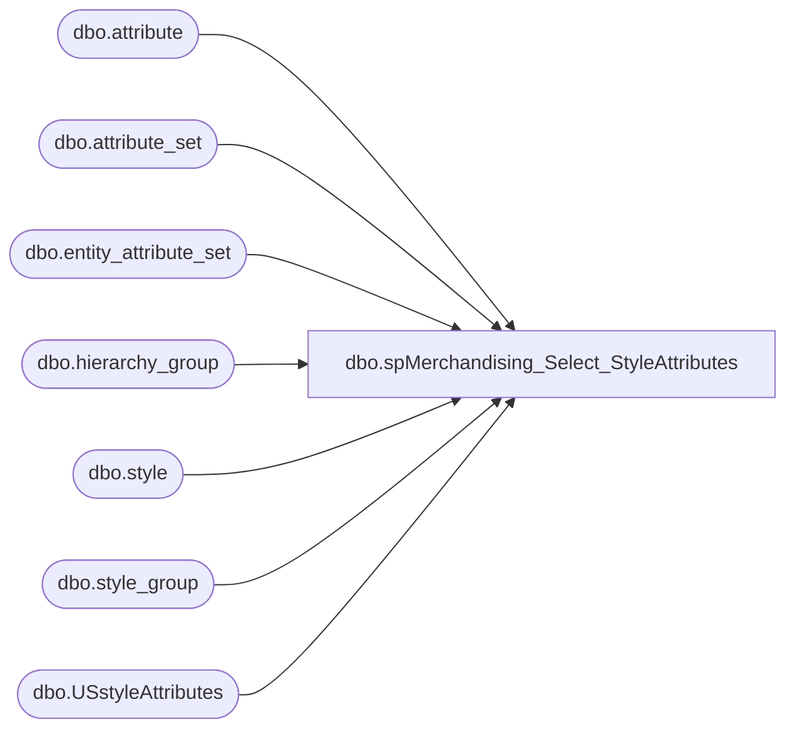

# dbo.spMerchandising_Select_StyleAttributes

**Database:** me_01  
**Server:** bedrockdb02  

## Architecture Diagram



## Table Dependencies

| Referenced Table |
|---|
| dbo.attribute |
| dbo.attribute_set |
| dbo.entity_attribute_set |
| dbo.hierarchy_group |
| dbo.style |
| dbo.style_group |
| dbo.USstyleAttributes |

## Stored Procedure Code

```sql
CREATE proc [dbo].[spMerchandising_Select_StyleAttributes]

as

-- =====================================================================================================
-- Name: spMerchandising_Select_StyleAttributes
--
-- Description:	Set factory attribute for UK & CA styles to be equal to the factory attribute of the US versions of the styles
--				
--
-- Input:
--
-- Output: Resultset formatted to meet Epicor requirements for Style Attribute Set
--
-- Dependencies: spMerchandising_Report_StyleAttributes
--
-- Revision History
--		Name:			Date:			Comments:
--		Dan Tweedie		11/22/2010		Created proc.	
--		Dan Tweedie		12/7/2010		Added code to exclude Supplies
-- =====================================================================================================
set nocount on

--find factory information for U.S. styles
IF (Object_ID('me_01..USstyleAttributes') IS NOT NULL) DROP TABLE USstyleAttributes
create table USstyleAttributes
(style_code varchar(6),
attribute_set_code varchar(6))

insert USstyleAttributes
select	s.style_code as Style_Code, 
		att.attribute_set_code as Attribute_Set_Code
from style s (nolock)
join entity_attribute_set eas (nolock) on s.style_id = eas.parent_id
join attribute_set att (nolock) on eas.attribute_set_id = att.attribute_set_id
join attribute a (nolock) on att.attribute_id = a.attribute_id
join style_group sg (nolock) on s.style_id = sg.style_id
join hierarchy_group hg (nolock) on sg.hierarchy_group_id = hg.hierarchy_group_id
where a.attribute_code = 'FACTRY'
and a.parent_type = 1
and att.attribute_set_code <> 'NONE'
and left(s.style_code,1) = '0'
and substring(hg.hierarchy_group_code,7,2) <> 60 --excludes supplies
order by s.style_code

--find the UK and CA versions of the U.S. styles above that do not have factory information
select	'SA', 'M', s.style_code, 'FACTRY', USA.attribute_set_code
from style s (nolock)
join entity_attribute_set eas (nolock) on s.style_id = eas.parent_id
join attribute_set att (nolock) on eas.attribute_set_id = att.attribute_set_id
join attribute a (nolock) on att.attribute_id = a.attribute_id
join USstyleAttributes USA on right(USA.style_code, 5) = right(s.style_code, 5) and left(s.style_code, 1) in ('1', '4')
where a.attribute_code = 'FACTRY'
and a.parent_type = 1
and att.attribute_set_code = 'NONE'
order by s.style_code
```

