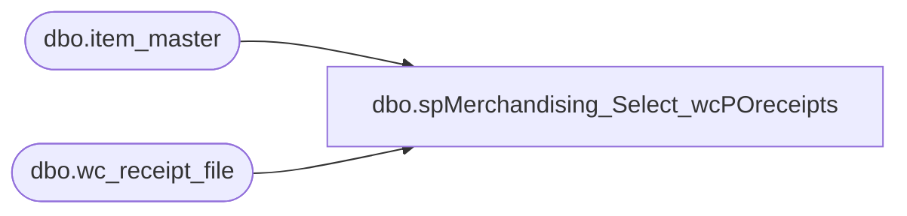

# dbo.spMerchandising_Select_wcPOreceipts

**Database:** me_01  
**Server:** bedrockdb02  

## Architecture Diagram



## Table Dependencies

| Referenced Table |
|---|
| dbo.item_master |
| dbo.wc_receipt_file |

## Stored Procedure Code

```sql
CREATE proc [dbo].[spMerchandising_Select_wcPOreceipts]
as

-- =====================================================================================================
-- Name: spMerchandising_Select_wcPOreceipts
--
-- Description:	Produces PO Receipt file, based on data provided in file from West Coast DC.
--
-- Input: NA
--
-- Output: Resultset formatted to meet Epicor requirements for PO Receipt Import.
--
-- Dependencies: spMerchandising_Report_wcReceipts
--
-- Revision History
--		Name:			Date:			Comments:
--		Dan Tweedie		07/13/2010		Created proc.	
--		Keith Lee		07/27/2010		Changed distribution_multiple to order_multiple.
-- =====================================================================================================


--capture po receipt data into work table
if (object_id('tempdb..#wc_po_receipts') is not null) drop table #wc_po_receipts

create table #wc_po_receipts
(receipt_date varchar(10),
po varchar(20),
ref_nbr varchar(10),
UPC varchar(12),
rcvd_units int,
dmg_units int,
id int identity(100, 1))

insert #wc_po_receipts
select	convert(varchar, cast(receipt_date as smalldatetime), 101) as receipt_date,
		rf.po_nbr as PO, 
		rf.ref_nbr as ref_nbr,
		'000000' + rf.style as UPC, 
		case when im.store_dept = 'SUP' then (sum(rf.qty_received)/im.order_multiple) else sum(rf.qty_received) end as rcvd_units,
		case when im.store_dept = 'SUP' then (sum(rf.qty_damaged)/im.order_multiple) else sum(rf.qty_damaged) end as dmg_units
from wc_receipt_file rf (nolock)
join item_master im (nolock) on im.style = rf.style
where rf.po_nbr is not null
group by convert(varchar, cast(receipt_date as smalldatetime), 101), rf.po_nbr, rf.ref_nbr, '000000' + rf.style, im.order_multiple, im.store_dept
order by rf.po_nbr, '000000' + rf.style

---prepare data for printing po receipt file
declare @date varchar(12),
		@counterH int,
		@counterD int,
		@totalH int,
		@totalD int,
		@docnbr varchar(20),
		@po varchar(20),
		@UPC varchar(12),
		@Rcvd_Units int,
		@dmg_units int

select @totalH = count(distinct receipt_date+po+ref_nbr) from #wc_po_receipts
set @counterH = 1

declare header cursor for
	select receipt_date, ref_nbr, po
	from #wc_po_receipts
	group by receipt_date, ref_nbr, po
	order by receipt_date, ref_nbr, po

open header
while @counterH <= @totalH
	begin
		fetch next from header into @date, @docnbr, @po
		print 'H' + '	' + 'A' + '	' + @docnbr + '	' + '	' + @date + '	' + '0960' + '	' + @po + '	' + 'Administrator' + '	' + '	' + '	' + '	' + '	' + '	' + '	' + '	' + '	' + '	' + '	' + '	' + '	' + '	' + '	' + '	' + 'N' + '	'
			--detail cursor
				set @counterD = 1
				select @totalD = count(upc) from #wc_po_receipts where po = @po and ref_nbr = @docnbr and receipt_date = @date
												
				declare detail cursor for
					select upc, rcvd_units, dmg_units
					from #wc_po_receipts
					where po = @po and ref_nbr = @docnbr and receipt_date = @date
					order by upc
				
				open detail
				while @counterD <= @totalD
					begin
						fetch next from detail into @upc, @rcvd_units, @dmg_units
						print 'D' + '	' + 'A' + '	' + @docnbr + '	' + '	' + @upc + '	' + + '	' +  + '	' +  + '	' +  + '	' +  + '	' +  convert(varchar, @rcvd_units) + '	' + convert(varchar, @dmg_units)
						set @counterD = @counterD + 1
					end
				close detail
				deallocate detail
		
		set @counterH = @counterH + 1

	end

close header
deallocate header
```

