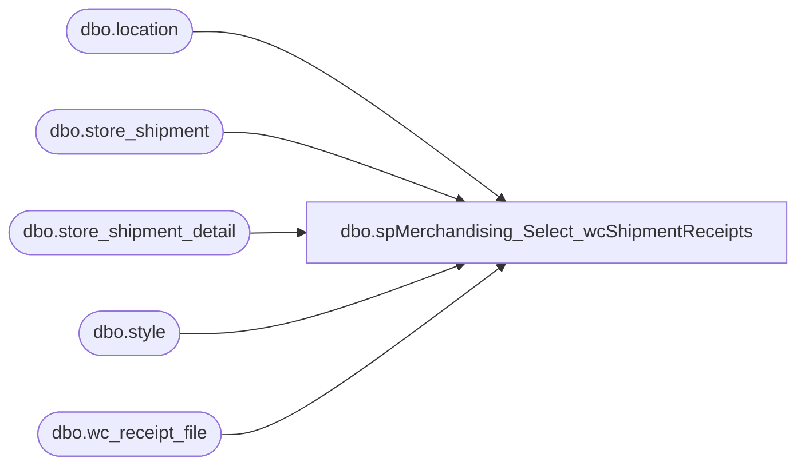

# dbo.spMerchandising_Select_wcShipmentReceipts

**Database:** me_01  
**Server:** bedrockdb02  

## Architecture Diagram



## Table Dependencies

| Referenced Table |
|---|
| dbo.location |
| dbo.store_shipment |
| dbo.store_shipment_detail |
| dbo.style |
| dbo.wc_receipt_file |

## Stored Procedure Code

```sql
CREATE proc [dbo].[spMerchandising_Select_wcShipmentReceipts]
as

-- =====================================================================================================
-- Name: spMerchandising_Select_wcShipmentReceipts
--
-- Description:	Produces Carton Batch Receiving file, based on data provided in file from West Coast DC.
--
-- Input: NA
--
-- Output: Resultset formatted to meet Epicor requirements for PO Receipt Import.
--
-- Dependencies: spMerchandising_Report_wcReceipts
--
-- Revision History
--		Name:			Date:			Comments:
--		Dan Tweedie		07/13/2010		Created proc.	
-- =====================================================================================================


---capture whse shipment receipt data into work table
/*if (object_id('me_01..wc_whse_shipment_receipts') is not null) drop table wc_whse_shipment_receipts

create table wc_whse_shipment_receipts
(record_type varchar(2),
action varchar(1),
carton_nbr varchar(52),
location_code varchar(20),
employee_code varchar(20))

insert wc_whse_shipment_receipts */

select	'BC',
		'A',
		ssd.carton_no,
		'0960',
		'099060199'
from wc_receipt_file rf (nolock)
join style s (nolock) on s.style_code = rf.style
join store_shipment_detail ssd (nolock) on ssd.style_id = s.style_id and ssd.units_received = 0
join store_shipment ss (nolock) on ss.store_shipment_id = ssd.store_shipment_id and ss.location_id = (select location_id from location where location_code = '0960')
where ssd.units_received = 0
order by ssd.carton_no
----------------------------------------------------------------------------------------------------------------------------------------------
select * from wc_receipt_file

--/*
--If DDC sends their internal PO number instead of a valid shipment number, we need to match the data to open shipments based on style and qty
select s.style_code, sum(ssd.units_sent) units_shipped, rf.qty_received, (rf.qty_received / ssd.units_sent) cartons_received
--, ssd.carton_no
--into #a
from store_shipment ss (nolock) 
join store_shipment_detail ssd (nolock) on ss.store_shipment_id = ssd.store_shipment_id
join location l (nolock) on l.location_id = ss.location_id
join style s (nolock) on s.style_id = ssd.style_id
join wc_receipt_file rf (nolock) on rf.style = s.style_code 
where l.location_code = '0960'
and ssd.units_received = 0
--and s.style_code in 
group by s.style_code, rf.qty_received, ssd.units_sent--, ssd.carton_no
order by s.style_code--, ssd.carton_no
--having rf.qty_received = sum(ssd.units_sent)

select distinct style_code, units_shipped, sum(qty_received) received, sum(cartons_received) cartons
into #b
from #a
group by style_code, units_shipped
order by style_code

select style_code, units_shipped, received, cartons
from #b
where units_shipped <> received
order by style_code

--
select	--top 175 -- enter cartons_received from query above
		'BC',
		'A',
		ssd.carton_no,
		'0960',
		'099060199'
from store_shipment ss (nolock) 
join store_shipment_detail ssd (nolock) on ss.store_shipment_id = ssd.store_shipment_id
join location l (nolock) on l.location_id = ss.location_id
join style s (nolock) on s.style_id = ssd.style_id
--join wc_receipt_file rf (nolock) on rf.style = s.style_code
join #b b on b.style_code = s.style_code --and b.units_shipped <> b.received
where l.location_code = '0960'
and ssd.units_received = 0
order by ssd.carton_no
--*/
------------------------------------------------------------------------------------------------------------------------------------------------


/*

---THE SQL BELOW IS FOR MANUAL EXECUTION
---FOR THE FIRST FEW WHSE SHIPMENTS, WE USED THE SHIPMENT NUMBER AS THE PO. ONE SHIPMENT = MULTIPLE CARTONS
------THIS MEANS THAT IF THEY RECEIVE LESS THAN WHAT IS SHIPPED, WE NEED A WAY TO ONLY GENERATE A CBR FILE FOR CARTONS TO EQUAL THE QTY RECEIVED.
--FOR ALL SHIPMENTS SHIPPED FROM THE BEARHOUSE ON OR AFTER 7/20, WE GENERATE A DISTINCT SHIPMENT NUMBER PER CARTON, SO WE DON'T HAVE THIS ISSUE.
---HERE IS THE SQL TO ENSURE YOU ONLY GET CARTONS EQUAL TO THE TOTAL UNITS RECEIVED
---IF THIS NEEDS TO BE EXECUTED, IT SHOULD BE COMPLETELY MANUAL. COPY THE RESULTS INTO NOTEPAD, SAVE THE FILE AS .GO AND DROP ON PIPELINE
----SEE THE MOTHER PROC FOR DETAILS (spMerchandising_Report_wcReceipts) -- THIS PROC IS WHAT CALLS THE PROC WE'RE IN NOW.

---This will show all data in the receipt file, alongside a summary of what was shipped and will calculate cartons received, show what is left
select rf.receipt_date, rf.po_nbr, rf.ref_nbr, rf.style, rf.qty_received units_received, (rf.qty_received / ssd.units_sent) cartons_received,
sum(ssd.units_sent) units_shipped, count(ssd.carton_no) cartons_shipped, ssd.units_sent units_shipped_per_carton,
(sum(ssd.units_sent) - rf.qty_received) units_not_received, ((sum(ssd.units_sent) - rf.qty_received) / ssd.units_sent) cartons_not_received
from wc_receipt_file rf (nolock)
join style s (nolock) on s.style_code = rf.style
join store_shipment ss (nolock) on rf.po_nbr = ss.document_no
join store_shipment_detail ssd (nolock) on ss.store_shipment_id = ssd.store_shipment_id and ssd.style_id = s.style_id
where ssd.units_received = 0
group by rf.receipt_date, rf.po_nbr, rf.ref_nbr, rf.style, rf.qty_received, ssd.units_sent

---by using the data above, the key facts are cartons received, so we can now only pull that many cartons to produce the file
---we have to do this line by line
select	top 131 -- enter cartons_received from query above
		'BC',
		'A',
		ssd.carton_no,
		'0960',
		'099060199'
from wc_receipt_file rf (nolock)
join style s (nolock) on s.style_code = rf.style
join store_shipment ss (nolock) on rf.po_nbr = ss.document_no
join store_shipment_detail ssd (nolock) on ss.store_shipment_id = ssd.store_shipment_id and ssd.style_id = s.style_id
where ssd.units_received = 0
and ss.document_no = '200084730' -- enter from po_no field from query above
and rf.style = '015439' --enter style code from query above
order by ssd.carton_no

*/
```

