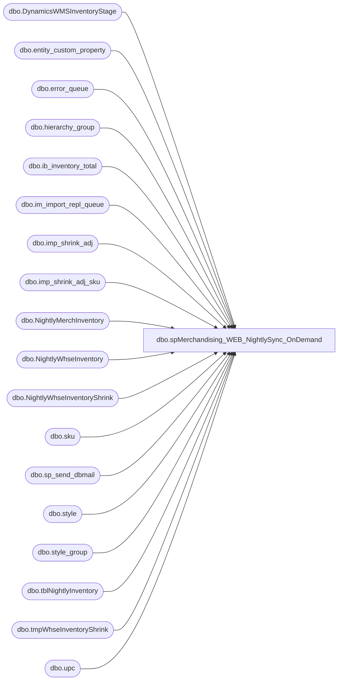

# dbo.spMerchandising_WEB_NightlySync_OnDemand

**Database:** me_01  
**Server:** bedrockdb02  

## Architecture Diagram



## Table Dependencies

| Referenced Table |
|---|
| dbo.DynamicsWMSInventoryStage |
| dbo.entity_custom_property |
| dbo.error_queue |
| dbo.hierarchy_group |
| dbo.ib_inventory_total |
| dbo.im_import_repl_queue |
| dbo.imp_shrink_adj |
| dbo.imp_shrink_adj_sku |
| dbo.NightlyMerchInventory |
| dbo.NightlyWhseInventory |
| dbo.NightlyWhseInventoryShrink |
| dbo.sku |
| dbo.sp_send_dbmail |
| dbo.style |
| dbo.style_group |
| dbo.tblNightlyInventory |
| dbo.tmpWhseInventoryShrink |
| dbo.upc |

## Stored Procedure Code

```sql
CREATE proc [dbo].[spMerchandising_WEB_NightlySync_OnDemand]
as
-- =====================================================================================================
-- Name: spMerchandising_980NightlySync_OnDemand
--
-- Description:	Runs nightly sync for only warehouse 0013.
--
-- Input: N/A
--
-- Output: 
--
-- Dependencies: 
--
-- Revision History
--		Name:			Date:			Comments:
--		Lizzy Timm		01/07/2021		Created SP
-- =====================================================================================================

set nocount on
-- Step 1
---first execute pipeline segments to push pending data through
EXEC pipeapp01.master..xp_cmdshell 'PipelineScheduleClient Start 16003 0'--po receipts
EXEC pipeapp01.master..xp_cmdshell 'PipelineScheduleClient Start 16500 0' --shipments
EXEC pipeapp01.master..xp_cmdshell 'PipelineScheduleClient Start 16499 0' --cartons
EXEC pipeapp01.master..xp_cmdshell 'PipelineScheduleClient Start 16506 0' --shrink adjustments
EXEC pipeapp01.master..xp_cmdshell 'PipelineScheduleClient Start 19000 0' --write to prod tables
----------------------------------------------------------------------------------------------------

-- Step 2
---capture list of 'active' styles (as opposed to inactive styles)
IF (Object_ID('tempdb..#active') IS NOT NULL) DROP TABLE #active
select s.style_code, s.short_desc, 
case when substring(hg.hierarchy_group_code,7,2)='60' then 'SUP' else 'MERCH' end as style_type,
case when substring(hg.hierarchy_group_code,7,2)='60' 
		then isnull(ecp.custom_property_value,1) 
		else s.distribution_multiple 
	end as DistMult
into #active
from style s (nolock)
join style_group sg (nolock) on s.style_id = sg.style_id
join hierarchy_group hg (nolock) on hg.hierarchy_group_id = sg.hierarchy_group_id
left join entity_custom_property ecp (nolock) on ecp.parent_id = s.style_id
	and	ecp.custom_property_id = 2 -- FRCSTM
	and parent_type = 1
where s.active_flag = 1

-- Step 3
--Capture inventory from Merch for each warehouse and webstore 13
IF (Object_ID('tempdb..#merch') IS NOT NULL) DROP TABLE #merch

select 	'0013' location_code,
		s.style_code,
		s.short_desc,
		sum(iit.total_on_hand_units) as "Units"
into #merch
from 		ib_inventory_total iit
inner join	sku sk
on		iit.sku_id = sk.sku_id
and		iit.location_id in (167,281,65) -- Webstore + RideMakerz + Canada
and		iit.inventory_status_id in (1, 9) -- Added inventory status 9 for ES reserved inventory.  Keith -> 9/21/2017
inner join	style s
on		sk.style_id = s.style_id
join 		style_group sg
on 		s.style_id = sg.style_id
join 		hierarchy_group hg
on 		hg.hierarchy_group_id = sg.hierarchy_group_id
and		substring(hg.hierarchy_group_code,7,2) <>'60' 
left join 	entity_custom_property ecp
on 		ecp.parent_id = s.style_id
and 		ecp.custom_property_id = 2 -- FRCSTM
and		parent_type = 1
where s.active_flag = 1
group by  s.style_code,s.short_desc,ecp.custom_property_value,hg.hierarchy_group_code

-- Step 4
--ARCHIVE NIGHTLY SNAPSHOT OF MERCH INVENTORY
insert NightlyMerchInventory
select *, getdate() as capture_date
from #merch


-- Step 5
--Capture 0013 and Webstore 0013 inventory, prestaged via SSIS from Dynamics WMS
	truncate table tblNightlyInventory
	insert tblNightlyInventory
	select d.*
	from DynamicsWMSInventoryStage d
	 join #active a on a.style_code = d.style_code


-- Step 6
---archive whse inventory snapshot
	delete
	from NightlyWhseInventory
	where datediff(dd, load_date, getdate()) > 365

	insert NightlyWhseInventory
	select * 
	from tblNightlyInventory
---------------------------

-- Step 7
-----COMPARE INVENTORY - OUTPUT DIFFERENCE
IF (Object_ID('tempdb..#total_summary') IS NOT NULL) DROP TABLE #total_summary

select M.*, W.W0013
into #total_summary 
from 
(
select M.style_code, M.short_desc, M.style_type, M.distmult, sum(M.loc_0013) M0013
from 
	(select a.style_code,
		   a.short_desc, 
		   a.style_type,
		   a.distmult,
		   case when M.location_code = '0013' then M.units else 0 end as 'loc_0013'
	from #active a
	left join #merch M on a.style_code = M.style_code) M
group by M.style_code, M.short_desc, M.style_type, M.distmult
) M
join 
(
select M.style_code, M.short_desc, M.style_type, M.distmult, sum(M.loc_0013) W0013
from 
	(select a.style_code,
		   a.short_desc,
		   a.style_type,
		   a.distmult,
		   case when M.location_code = '0013' then M.qty else 0 end as 'Loc_0013'
	from #active a
	left join tblNightlyInventory M on a.style_code = M.style_code) M
group by M.style_code, M.short_desc, M.style_type, M.distmult
) W on M.style_code = W.style_code
where M.M0013 <> W.W0013
order by M.style_code


-- Step 8a
IF (Object_ID('me_01..tmpWhseInventoryShrink') IS NOT NULL) DROP TABLE tmpWhseInventoryShrink
select '0013' location_code,
	   ts.style_code,
	   ts.short_desc,
	   ts.M0013 MerchQty,
	   ts.W0013 Whseqty,
	   ts.M0013-ts.W0013 shrinkqty,
	   ts.style_type,
	   case when ts.style_type = 'SUP' then (ts.M0013-ts.W0013)/ts.distmult 
	   else ts.M0013-ts.W0013 end as shrinkqty_distribution_multiple
into tmpWhseInventoryShrink
from #total_summary ts 
where ts.M0013-ts.W0013 <> 0
AND ts.style_type <> 'SUP'

-- Step 8b
Delete from tmpWhseInventoryShrink where location_code <> '0013'

-- Step 9
--archive nightly discrepancies
insert NightlyWhseInventoryShrink
select *, getdate()
from tmpWhseInventoryShrink


-- Step 10
----output a file for Physical Inventory team, 
begin

	declare @1query varchar(1000),
			@1date varchar(200),
			@1file_name varchar(100),
			@1file_location varchar(100),
			@1server varchar(20),
			@1database varchar(20),
			@1sqlcmd varchar(1000),
			@1query_text varchar(1000),
			@1file varchar(1000),
			@1body varchar(1000),
			@1subj varchar(1000)

			select @1query_text = 'set nocount on select * from tmpWhseInventoryShrink'
			set @1date = convert(varchar, datepart(yyyy, getdate())) + '-' + convert(varchar, datepart(mm, getdate())) + '-' + convert(varchar, datepart(dd, getdate()))+ convert(varchar, datepart(hh, getdate())) + convert(varchar, datepart(mi, getdate())) 
			set @1query = @1query_text
			set @1file_location = '\\sharebear1\shared\Inventory Reports\TESTING\'  
			set @1file_name = 'NightlySyncs' + @1date + '.csv'
			set @1server = 'bedrockdb02'
			set @1database = 'me_01'
			set @1sqlcmd = 'sqlcmd -S' + @1server + ' -d' + @1database + ' -Q' + '"' + @1query + '"' + ' -o' + '"' + @1file_location + @1file_name + '"' + ' -s"," -w1000 -W'
			exec master..xp_cmdshell @1sqlcmd
end

-- Step 11
------generate outbound email
if (select count(*) from tmpWhseInventoryShrink where location_code = '0013') > 0

begin
	declare @loc varchar(4),
		@text nvarchar(max),
		@recip varchar(4000),
		@copy varchar(4000),
		@subj varchar(4000)	
		select @loc = '0013'
	select @recip = 'brysona@buildabear.com;EntSysSupport@buildabear.com;BearAP@buildabear.com;sharonp@buildabear.com;sherir@buildabear.com;valeriec@buildabear.com;DawnGo@buildabear.com'
	select @copy = 'larryw@buildabear.com;dennish@buildabear.com;christh@buildabear.com;bryanw@buildabear.com;candaces@buildabear.com'
	select @subj = 'Nightly Sync Summary for ' + @loc
	
	set @text = '<font face =arial size = 2>' + 
	'</b><H1>Nightly Sync Summary for ' + @loc + '</H1>' +
		'<table border="1">' +
		'<tr><th>STYLE</th><th>DESCRIPTION</th><th>WHSE QTY</th><th>MERCH QTY</th><th>DIFFERENCE</th></tr>' +
		CAST ( ( SELECT td = style_code,'',
						td = short_desc, '',
						td = whseqty, '',
						td = merchqty, '',
						td = shrinkqty, ''
				  from tmpWhseInventoryShrink
				  where location_code = @loc
				  order by style_code
				  FOR XML PATH('tr'), TYPE 
		) AS NVARCHAR(MAX) ) +
		'</font></table></font></p></p>
		<br>
		<font face =arial size = 1>This report was run from bedrockdb02.me_01.dbo.spMerchandising_980NightlySync_OnDemand.</font>
		<br>
		<br>
	<font face =arial size = 1><i>The information in this message may be privileged, “confidential” and protected from disclosure and/or intended only for the addressee(s) named above.  If the reader of this message is not the intended recipient, or an employee or agent responsible for delivering this message to the intended recipient, you are hereby notified that any dissemination, distribution or copying of the communication is strictly prohibited.  If you have received this communication in error, please notify us immediately by replying to the message and deleting it from your computer.  Thank you beary much.</i></font>'

	exec msdb.dbo.sp_send_dbmail
		@profile_name = 'merchadmin',
		@recipients = @recip,
		@copy_recipients = @copy,
		@body = @text,
		@subject = @subj,
		@body_format = 'HTML'

end

--  Step 11
---to ensure we don't try to post invalid qty's -- this step is after the email so the qty's will still be reported
if (select count(*) from tmpWhseInventoryShrink where shrinkqty_distribution_multiple like '%.%' or shrinkqty_distribution_multiple = 0) > 0 
begin
delete from tmpWhseInventoryShrink where shrinkqty_distribution_multiple like '%.%' or shrinkqty_distribution_multiple = 0
end


-- Step 12A
-----generate nightly shrink file
if (select count(*) from tmpWhseInventoryShrink) > 0 

begin
	declare @query varchar(1000),
			@date varchar(200),
			@file_name varchar(100),
			@file_location varchar(100),
			@server varchar(20),
			@username varchar(20),
			@password varchar(20),
			@database varchar(20),
			@sqlcmd varchar(1000),
			@query_text varchar(4000)

	select @query_text = 'exec spMerchandisingOutputWhseInventoryShrink'
	set @date = convert(varchar, datepart(yyyy, getdate())) + convert(varchar, datepart(mm, getdate())) + convert(varchar, datepart(dd, getdate())) + convert(varchar, datepart(hh, getdate())) + convert(varchar, datepart(mi, getdate())) + convert(varchar, datepart(ss, getdate()))
	set @query = @query_text
	set @file_location = '\\pipeapp01\Company01\Text File to IM Import Tables- Import Shrink Adj\'
	set @file_name = 'STSIMSA.WhseSync.0013' + @date + '.GO'
	set @server = 'bedrockdb02'
	set @database = 'me_01'
	set @sqlcmd = 'sqlcmd -S' + @server + ' -d' + @database + ' -Q' + '"' + @query + '"' + ' -o' + '"' + @file_location + @file_name + '"' + ' -s"," -w100 -W'
	exec master..xp_cmdshell @sqlcmd
end

-- Step 12B
--------execute the pipeline segments
EXEC pipeapp01.master..xp_cmdshell 'PipelineScheduleClient Start 16506 0'

EXEC pipeapp01.master..xp_cmdshell 'PipelineScheduleClient Start 19000 0'
---------------------------------------------------------------------------------

-- Step 13
---check for error, send alert 
--Pipeline Errors -- if there is an error during the posting to the production tables, it is written in the error table
if (select count(*)
	from imp_shrink_adj isa (nolock)
	join imp_shrink_adj_sku isas (nolock) on isa.imp_shrink_adj_id = isas.imp_shrink_adj_id
	join upc (nolock) on upc.upc_number = isas.upc_number
	join sku (nolock) on sku.sku_id = upc.sku_id
	join style s (nolock) on s.style_id = sku.style_id
	join im_import_repl_queue iirq (nolock) on iirq.entity_id = isa.imp_shrink_adj_id and iirq.entity_code = 1
	join pipeapp01.PipelineRepository.dbo.error_queue eq on iirq.im_import_repl_queue_id = eq.sequence_id 
	where iirq.entity_id in (select substring(entity_key,1,CHARINDEX('~', substring(entity_key,1,30),1)-1)
								from pipeapp01.PipelineRepository.dbo.error_queue
								where segment_id = 19000 and entity_code = 1)
	---and datediff(hh, iirq.action_date, getdate()) <= 24
	and isa.grouping_label = 'Nightly Sync') > 0 
	
begin
	exec msdb.dbo.sp_send_dbmail
	@profile_name = 'MerchAdmin',
	@recipients = 'EntSysSupport@buildabear.com',
	@body = 'Nightly Sync Error. Check Pipeline 19000 Error Queue for Details',
	@subject = 'Nightly Sync Error'
end
```

