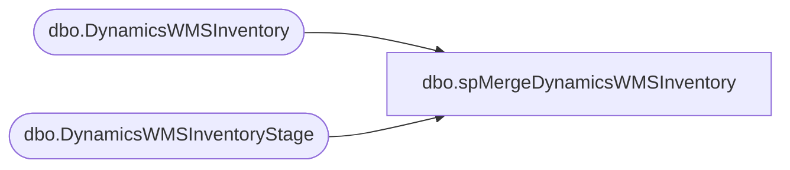

# dbo.spMergeDynamicsWMSInventory

**Database:** me_01  
**Server:** bedrockdb02  

## Architecture Diagram



## Table Dependencies

| Referenced Table |
|---|
| dbo.DynamicsWMSInventory |
| dbo.DynamicsWMSInventoryStage |

## Stored Procedure Code

```sql
CREATE proc [dbo].[spMergeDynamicsWMSInventory] -- Update to Proper Name 

as 

---------------------------------------------------------------------------------------------------------
----	Tim Callahan	-	2023-08-29	-	Created proc - Merges Dynamics Inentory Data from DynamicsWMSInventoryStage to DynamicsWMSInventory
---------------------------------------------------------------------------------------------------------

set nocount on

merge into me_01.dbo.DynamicsWMSInventory as target
using	( 
		select 
		s.location_code, 
		s.style_code, 
		s.sku_desc, 
		s.qty
		from DynamicsWMSInventoryStage s
		) as source 
on 
	(
		-- Key 
		target.[location_code]=source.[location_code] 
			and
		target.[style_code]=source.[style_code]
	)


When Not Matched by target
Then Insert
	(
		-- Fields to be inserted 
		   [location_code],
		   [style_code],
		   [sku_desc], 
		   [qty], 
		   [InsertDate]
         
	)
Values
	(
           source.[location_code],
		   source.[style_code],
		   source.[sku_desc], 
		   source.[qty],
           getdate()

	)

When Matched and
	(		
			-- Besure to use isnull logic for compare otherwise may have unintended results 
		    isnull(target.[qty],0)<>isnull(source.[qty],0) 
		      
	)
Then Update
	-- Fields to be updated
	set     
		 target.[qty]=source.[qty],		 
		 target.[UpdateDate]=getdate()
 
 -- If we find records that exist in target but not the source, we just want to set them to zero 
 WHEN NOT MATCHED BY Source 
  THEN Update 
	set target.qty = 0 , 
	target.[UpdateDate]=getdate()

;
```

