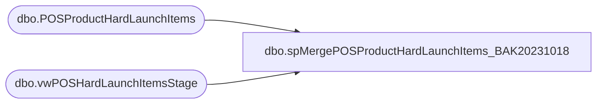

# dbo.spMergePOSProductHardLaunchItems_BAK20231018

**Database:** me_01  
**Server:** bedrockdb02  

## Architecture Diagram



## Table Dependencies

| Referenced Table |
|---|
| dbo.POSProductHardLaunchItems |
| dbo.vwPOSHardLaunchItemsStage |

## Stored Procedure Code

```sql
CREATE proc [dbo].[spMergePOSProductHardLaunchItems_BAK20231018] 

as 

-------------------------------------------------------------------------------------------------------
--	Tim Callahan	-	2023-04-27	-	Created proc - 
-------------------------------------------------------------------------------------------------------

set nocount on

merge into POSProductHardLaunchItems as target
using
(
	select
	AptosStyleCode, 
	CountryCode
	from vwPOSHardLaunchItemsStage
	group by
	AptosStyleCode, 
	CountryCode
) as source -- This may evolve to lookup the other jurisdiction style codes as Amy mentioned she may only do the US counterpart 

on 
	(
		target.[StyleCode]=source.[AptosStyleCode] -- Key 
	)


When Not Matched by target
Then Insert
	(
		-- Fields to be inserted 
		   [StyleCode],
		   [CountryCode],
		   [InsertDate]
         
	)
Values
	(
           source.[AptosStyleCode],		   
		   source.[CountryCode],
           getdate()

	)
WHEN NOT MATCHED BY SOURCE 
THEN DELETE 

;
```

