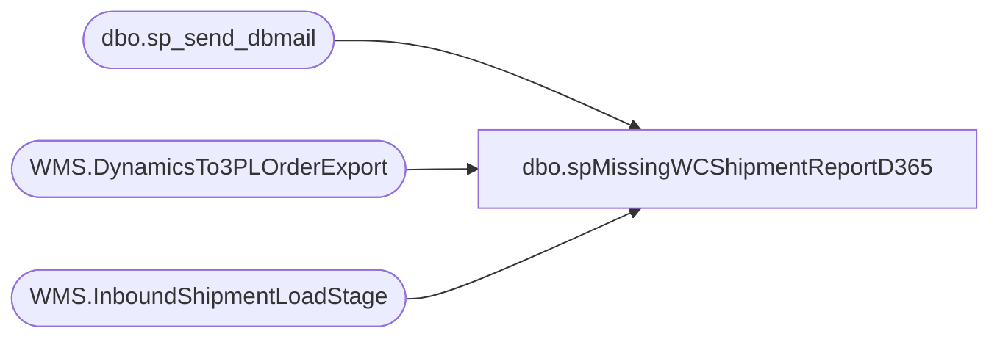

# dbo.spMissingWCShipmentReportD365

**Database:** me_01  
**Server:** bedrockdb02  

## Architecture Diagram



## Table Dependencies

| Referenced Table |
|---|
| dbo.sp_send_dbmail |
| WMS.DynamicsTo3PLOrderExport |
| WMS.InboundShipmentLoadStage |

## Stored Procedure Code

```sql
-- =============================================
-- Author:      Justin Cross
-- Create date: 4/22/2026
-- Description: Replacement WC Missing Shipment report
-- =============================================
CREATE PROC [dbo].[spMissingWCShipmentReportD365]
AS
BEGIN
    SET NOCOUNT ON;

 ------------------------------------------------------------
    -- PARAMETERS
    ------------------------------------------------------------
    DECLARE @SourceId     varchar(4)   = '0960';
    DECLARE @FileRoot     varchar(500) = '\\kermode\filerepository\MERCHANDISING\WC_Distro\SHIPMENTS';
    DECLARE @DaysBack     int          = -14;

    -- EMAIL PARAMETERS
    DECLARE @MailProfile  varchar(128) = 'merchadmin';
    DECLARE @Recipients   varchar(500) = 'JustinCr@buildabear.com; JasonR@buildabear.com; PaulK@buildabear.com';
    DECLARE @Subject      varchar(255) = 'Missing WC Shipment Report - THIS IS A TEST PLEASE DO NOT TAKE ACTION '
                                         + CONVERT(varchar(10), GETDATE(), 120);
    DECLARE @D365BaseUrl  varchar(500) = 'https://buildabear.operations.dynamics.com';
    DECLARE @D365Company  varchar(10)  = '1100';

    ------------------------------------------------------------
    -- VARIABLES
    ------------------------------------------------------------
    DECLARE @RowsHtml       varchar(max) = '';
    DECLARE @Body           varchar(max) = '';
    DECLARE @FooterHtml     varchar(max) = '';
    DECLARE @EmptyBody      varchar(max) = '';
    DECLARE @RowCount       int          = 0;
    DECLARE @CsvQuery       nvarchar(max);
    DECLARE @GlobalCsvTable sysname      = '##MissingWCShipmentEmail_' + CAST(@@SPID AS varchar(20));
    DECLARE @Sql            nvarchar(max);

    ------------------------------------------------------------
    -- CLEANUP
    ------------------------------------------------------------
    IF OBJECT_ID('tempdb..#Base')        IS NOT NULL DROP TABLE #Base;
    IF OBJECT_ID('tempdb..#ContentHits') IS NOT NULL DROP TABLE #ContentHits;
    IF OBJECT_ID('tempdb..#CmdOut')      IS NOT NULL DROP TABLE #CmdOut;
    IF OBJECT_ID('tempdb..#HitPaths')    IS NOT NULL DROP TABLE #HitPaths;
    IF OBJECT_ID('tempdb..#HitCounts')   IS NOT NULL DROP TABLE #HitCounts;
    IF OBJECT_ID('tempdb..#Top3')        IS NOT NULL DROP TABLE #Top3;
    IF OBJECT_ID('tempdb..#TOSummary')   IS NOT NULL DROP TABLE #TOSummary;

    SET @Sql = N'
        IF OBJECT_ID(''tempdb..' + @GlobalCsvTable + N''') IS NOT NULL
            DROP TABLE ' + QUOTENAME(@GlobalCsvTable) + N';';
    EXEC sys.sp_executesql @Sql;

    ------------------------------------------------------------
    -- 1) EXPORT ROWS NOT YET INBOUND
    ------------------------------------------------------------
    SELECT DISTINCT
        sse.DynamicsOrderId,
        sse.destid AS StoreNumber,
        sse.distribution_number,
        sse.ExportDate
    INTO #Base
    FROM [STL-SSIS-P-01].[IntegrationStaging].[WMS].[DynamicsTo3PLOrderExport] sse
    LEFT JOIN [STL-SSIS-P-01].[IntegrationStaging].[WMS].[InboundShipmentLoadStage] isl
        ON isl.OrderId = sse.DynamicsOrderId
    WHERE sse.sourceid = @SourceId
      AND isl.OrderId IS NULL
      AND sse.ExportDate >= DATEADD(DAY, -7, GETDATE())
      AND sse.ExportDate <  DATEADD(DAY, -2, GETDATE())
      AND sse.distribution_number IS NOT NULL
      AND LTRIM(RTRIM(sse.distribution_number)) <> '';

    ------------------------------------------------------------
    -- 2) SEARCH FILES USING DISTRIBUTION NUMBER
    ------------------------------------------------------------
    CREATE TABLE #ContentHits
    (
        DistributionNumber varchar(50),
        FilePath           varchar(8000)
    );

    DECLARE @distro varchar(50);
    DECLARE @ps     varchar(8000);

    DECLARE distro_cur CURSOR LOCAL FAST_FORWARD FOR
        SELECT DISTINCT distribution_number
        FROM #Base;

    OPEN distro_cur;
    FETCH NEXT FROM distro_cur INTO @distro;

    WHILE @@FETCH_STATUS = 0
    BEGIN
        SET @ps =
            'powershell -NoProfile -Command "'
          + '$path = ''' + @FileRoot + ''';'
          + '$cut = (Get-Date).AddDays(' + CAST(@DaysBack AS varchar(10)) + ');'
          + 'Get-ChildItem -Path $path -Recurse -File | '
          + 'Where-Object { $_.LastWriteTime -gt $cut } | '
          + 'Select-String -SimpleMatch -Pattern ''' + REPLACE(@distro,'''','''''') + ''' | '
          + 'Select-Object -ExpandProperty Path -Unique"';

        IF OBJECT_ID('tempdb..#CmdOut') IS NOT NULL DROP TABLE #CmdOut;
        CREATE TABLE #CmdOut (output varchar(8000));

        INSERT #CmdOut
        EXEC master..xp_cmdshell @ps;

        INSERT INTO #ContentHits (DistributionNumber, FilePath)
        SELECT @distro, output
        FROM #CmdOut
        WHERE output IS NOT NULL
          AND LTRIM(RTRIM(output)) <> ''
          AND output <> 'File Not Found';

        FETCH NEXT FROM distro_cur INTO @distro;
    END

    CLOSE distro_cur;
    DEALLOCATE distro_cur;

    ------------------------------------------------------------
    -- 3) BUILD SUMMARY TABLE
    --    MatchingFiles = first 3 clickable file links
    ------------------------------------------------------------

    -- Distinct TO/file hit pairs
    SELECT DISTINCT
        b.DynamicsOrderId,
        b.StoreNumber,
        b.ExportDate,
        ch.FilePath
    INTO #HitPaths
    FROM #Base b
    INNER JOIN #ContentHits ch
        ON ch.DistributionNumber = b.distribution_number
    WHERE ch.FilePath IS NOT NULL
      AND LTRIM(RTRIM(ch.FilePath)) <> '';

    -- Total hit counts per TO
    SELECT
        DynamicsOrderId,
        COUNT(*) AS TotalFileHits
    INTO #HitCounts
    FROM #HitPaths
    GROUP BY DynamicsOrderId;

    -- First 3 file paths per TO
    SELECT
        DynamicsOrderId,
        FilePath,
        ROW_NUMBER() OVER (PARTITION BY DynamicsOrderId ORDER BY FilePath) AS rn
    INTO #Top3
    FROM #HitPaths;

    CREATE TABLE #TOSummary
    (
        DynamicsOrderId varchar(50),
        StoreNumber     varchar(20),
        ExportDate      datetime,
        TotalFileHits   int,
        ShipmentStatus  varchar(100),
        MatchingFiles   varchar(max)
    );

    INSERT INTO #TOSummary
    (
        DynamicsOrderId,
        StoreNumber,
        ExportDate,
        TotalFileHits,
        ShipmentStatus,
        MatchingFiles
    )
    SELECT
        t.DynamicsOrderId,
        t.StoreNumber,
        t.ExportDate,
        ISNULL(h.TotalFileHits, 0) AS TotalFileHits,
        CASE
            WHEN ISNULL(h.TotalFileHits, 0) > 0
                THEN 'Exists in Files (Zero Shipped / Pending)'
            ELSE 'Missing (No Inbound, No File)'
        END AS ShipmentStatus,
        ISNULL(
            (
                SELECT
                    '<div><a href="file://'
                    + REPLACE(STUFF(t3.FilePath, 1, 2, ''), '\', '/')
                    + '" target="_blank">'
                    + CASE
                        WHEN CHARINDEX('\', REVERSE(t3.FilePath)) > 0
                            THEN RIGHT(t3.FilePath, CHARINDEX('\', REVERSE(t3.FilePath)) - 1)
                        ELSE t3.FilePath
                      END
                    + '</a></div>'
                FROM #Top3 t3
                WHERE t3.DynamicsOrderId = t.DynamicsOrderId
                  AND t3.rn <= 3
                ORDER BY t3.FilePath
                FOR XML PATH(''), TYPE
            ).value('.', 'varchar(max)')
        , '') AS MatchingFiles
    FROM
    (
        SELECT
            DynamicsOrderId,
            MIN(StoreNumber) AS StoreNumber,
            MIN(ExportDate) AS ExportDate
        FROM #Base
        GROUP BY DynamicsOrderId
    ) t
    LEFT JOIN #HitCounts h
        ON h.DynamicsOrderId = t.DynamicsOrderId;

    SELECT @RowCount = COUNT(*) FROM #TOSummary;

    ------------------------------------------------------------
    -- TABLE ROWS
    ------------------------------------------------------------
    SELECT @RowsHtml = @RowsHtml
        + '<tr>'
        + '<td>' + ISNULL(DynamicsOrderId,'') + '</td>'
        + '<td>' + ISNULL(StoreNumber,'') + '</td>'
        + '<td>' + CONVERT(varchar(19), ExportDate, 120) + '</td>'
        + '<td style="color:'
            + CASE WHEN TotalFileHits > 0 THEN '#E67E22' ELSE '#E74C3C' END
            + ';font-weight:bold;">'
            + ShipmentStatus + '</td>'
        + '<td style="text-align:center;">' + CAST(TotalFileHits AS varchar(10)) + '</td>'
        + '<td style="font-size:11px; line-height:1.35; word-break:break-word;">'
            + ISNULL(MatchingFiles,'')
            + CASE
                WHEN TotalFileHits > 3 THEN '<div><em>... only first 3 shown</em></div>'
                ELSE ''
              END
            + '</td>'
        + '</tr>'
    FROM #TOSummary
    ORDER BY ExportDate DESC;

    ------------------------------------------------------------
    -- LINK TO TRANSFER ORDERS LIST
    ------------------------------------------------------------
    SET @FooterHtml =
          '<p style="font-size:13px;">'
        + '<a href="'
        + @D365BaseUrl
        + '/?mi=InventTransferOrder&amp;cmp=' + @D365Company
        + '" target="_blank" style="color:#2980B9;text-decoration:underline;font-weight:bold;">'
        + 'D365 Transfer Orders'
        + '</a>'
        + '</p>';

    ------------------------------------------------------------
    -- FULL HTML BODY
    ------------------------------------------------------------
    SET @Body =
    '<html><head><style>
        body  { font-family:Segoe UI,Arial,sans-serif; font-size:13px; }
        table { border-collapse:collapse; width:100%; table-layout:fixed; }
        th    { background:#2C3E50; color:#fff; padding:8px 10px; text-align:left; }
        td    { border:1px solid #ddd; padding:6px 10px; vertical-align:top; word-wrap:break-word; word-break:break-word; }
        tr:nth-child(even) { background:#f9f9f9; }
        .summary { margin-bottom:12px; font-size:14px; }
    </style></head><body>
    <p class="summary"><strong>1100 Missing Inbound Shipment Report</strong><br/>
    Source: <strong>' + @SourceId + '</strong> &nbsp;|&nbsp; '
    + 'Window: <strong>' + CONVERT(varchar(10), DATEADD(DAY,-7,GETDATE()), 120)
    + '</strong> to <strong>' + CONVERT(varchar(10), DATEADD(DAY,-2,GETDATE()), 120)
    + '</strong> &nbsp;|&nbsp; Rows: <strong>' + CAST(@RowCount AS varchar(10)) + '</strong></p>
    <table>
    <tr>
        <th>Dynamics Order ID</th>
        <th>Store Number</th>
        <th>Export Date</th>
        <th>Shipment Status</th>
        <th>File Hits</th>
        <th>Matching Files (first 3 shown)</th>
    </tr>'
    + @RowsHtml
    + '</table>'
    + @FooterHtml
    + '<p style="color:#888;font-size:11px;">CSV attachment contains the same rows/columns as the email. Matching Files lists the first 3 file names shown per transfer order. '
    + CONVERT(varchar(19), GETDATE(), 120) + '</p>
    </body></html>';

    ------------------------------------------------------------
    -- CREATE GLOBAL TEMP TABLE FOR CSV ATTACHMENT
    ------------------------------------------------------------
    SET @Sql = N'
        SELECT
            DynamicsOrderId AS [Dynamics Order ID],
            StoreNumber     AS [Store Number],
            CONVERT(varchar(19), ExportDate, 120) AS [Export Date],
            ShipmentStatus  AS [Shipment Status],
            TotalFileHits   AS [File Hits],
            ISNULL(MatchingFiles, '''') AS [Matching Files]
        INTO ' + QUOTENAME(@GlobalCsvTable) + N'
        FROM #TOSummary;';
    EXEC sys.sp_executesql @Sql;

    SET @CsvQuery = N'
        SELECT
            [Dynamics Order ID],
            [Store Number],
            [Export Date],
            [Shipment Status],
            [File Hits],
            [Matching Files]
        FROM ' + QUOTENAME(@GlobalCsvTable) + N'
        ORDER BY [Export Date] DESC;';

    ------------------------------------------------------------
    -- 4) SEND EMAIL
    ------------------------------------------------------------
    IF @RowCount > 0
    BEGIN
        EXEC msdb.dbo.sp_send_dbmail
            @profile_name                = @MailProfile,
            @recipients                  = @Recipients,
            @subject                     = @Subject,
            @body                        = @Body,
            @body_format                 = 'HTML',
            @execute_query_database      = 'me_01',
            @query                       = @CsvQuery,
            @attach_query_result_as_file = 1,
            @query_attachment_filename   = 'Missing_WC_Shipments_1100.csv',
            @query_result_separator      = ',',
            @query_result_header         = 1,
            @query_result_no_padding     = 1,
            @exclude_query_output        = 1;
    END
    ELSE
    BEGIN
        SET @EmptyBody = '<html><body style="font-family:Segoe UI,Arial,sans-serif;">'
            + '<p>&#9989; <strong>No missing inbound shipments</strong> found for source '
            + @SourceId
            + ' in the review window.</p></body></html>';

        EXEC msdb.dbo.sp_send_dbmail
            @profile_name = @MailProfile,
            @recipients   = @Recipients,
            @subject      = @Subject,
            @body         = @EmptyBody,
            @body_format  = 'HTML';
    END

    ------------------------------------------------------------
    -- CLEANUP GLOBAL TEMP TABLE
    ------------------------------------------------------------
    SET @Sql = N'
        IF OBJECT_ID(''tempdb..' + @GlobalCsvTable + N''') IS NOT NULL
            DROP TABLE ' + QUOTENAME(@GlobalCsvTable) + N';';
    EXEC sys.sp_executesql @Sql;

END
```

