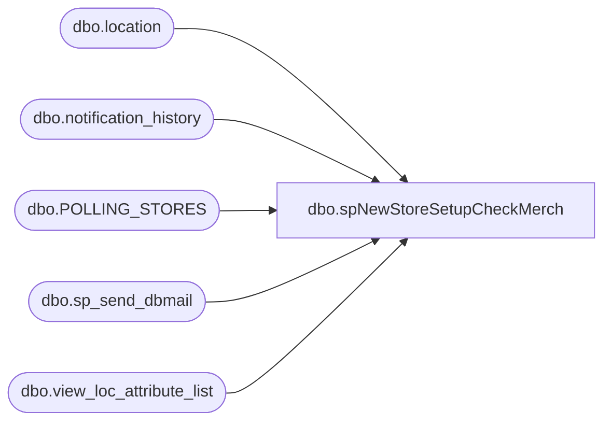

# dbo.spNewStoreSetupCheckMerch

**Database:** me_01  
**Server:** bedrockdb02  

## Architecture Diagram



## Table Dependencies

| Referenced Table |
|---|
| dbo.location |
| dbo.notification_history |
| dbo.POLLING_STORES |
| dbo.sp_send_dbmail |
| dbo.view_loc_attribute_list |

## Stored Procedure Code

```sql
CREATE   procedure [dbo].[spNewStoreSetupCheckMerch]

AS
-- =====================================================================================================
-- Name: spNewStoreSetupCheckMerch
--
-- Description:	Performs some checks on store setup and reports to the business user responsible for
--				said setup
--	
--
-- Input:	
--			
--
-- Output: Email
--			
--
-- Schedule: 
--		
--
-- Dependencies: None	
--	
--
-- Revision History
--		Name:				Date:			Comments:
--		Paul Beckman		07/18/2019		Initial setup
--		Paul Beckman		07/24/2019		Added color formatting based on items needing attention
--		Paul Beckman		08/05/2019		Added WebIM user setup check for IT
--		Paul Beckman		10/24/2019		Updated to use notification_history table
--		Paul Beckman		02/18/2020		Updated email profile to 'EntSysSupport'
--		Juan Peterson		06/08/2021		Replaced 'JenniferMa@buildabear.com' with 'AaronS@buildabear.com' and removed 'DawnGo@buildabear.com'
--      Enjoli Simpson      09/29/2023      Replaced 'AaronS@buildabear.com' with 'JenM@buildabear.com' and removed WebIM check
-- 
-- exec spNewStoreSetupCheckMerch
-- 
-- =====================================================================================================


--####################################
-- Create Temp Table
--####################################

IF (Object_ID('tempdb..##NewStoreList') IS NOT NULL) DROP TABLE ##NewStoreList
CREATE TABLE ##NewStoreList (StoreNum numeric(4,0)
	,OpenDate date
	,GeneratePLU varchar(5)
	,ESsetup varchar(5)
	,OWNRSPattr varchar(5)
	--,WebIMuser varchar(5)
	,AttrCode varchar(5)
	)


--####################################
-- Declare script variables
--####################################

DECLARE @SQL VARCHAR(8000)
DECLARE @CMD VARCHAR(4000)
DECLARE @Recipients VARCHAR(4000)
DECLARE @Copy_Recipients VARCHAR(4000)
DECLARE @Subject VARCHAR(80)
DECLARE @Query VARCHAR(8000)
DECLARE @Text nvarchar(max)
DECLARE @StoreCount AS INT
DECLARE @DateCount AS INT


--####################################
-- Set variables
--####################################

SET @DateCount = 30  --<< Days prior to Stores [OPEN_DATE] in [bedrockdb01].[auditworks].[dbo].[POLLING_STORES]

--SET @Recipients = 'paulb@buildabear.com'
SET @Recipients = 'ScottP@buildabear.com;'
SET @Copy_Recipients = 'EntSysSupport@buildabear.com;JenM@buildabear.com'


--####################################
-- Insert Stores into Temp Table
--####################################

INSERT INTO ##NewStoreList
SELECT STORE_NUM
	,OPEN_DATE
	,NULL
	,NULL
	,NULL
	,NULL
	,CASE WHEN COUNTRY = 'USA' THEN 'US'
		WHEN COUNTRY = 'CAN' THEN 'CAN'
		WHEN COUNTRY = 'GBR' THEN 'UK'
		WHEN COUNTRY = 'IRL' THEN 'UK'
		WHEN COUNTRY = 'DNK' THEN 'UK'
		WHEN COUNTRY = 'CHN' THEN 'CN'
		END AS AttrCode
FROM bedrockdb01.auditworks.dbo.POLLING_STORES
WHERE CLOSED_DATE IS NULL
AND STORE_NUM NOT IN (470)
AND STORE_BRAND IN ('Workshop')
AND OPEN_DATE <= DATEADD(day,+@DateCount,GETDATE())
AND OPEN_DATE >= DATEADD(day,-30,GETDATE())


--####################################
-- Setup Checks
--####################################

---------------- Generate PLU flag -----------------
UPDATE ##NewStoreList
SET GeneratePLU = 'X'
WHERE StoreNum IN (
SELECT a.STORE_NUM
FROM bedrockdb01.auditworks.dbo.POLLING_STORES a
WHERE a.STORE_NUM NOT IN (SELECT a.STORE_NUM FROM bedrockdb01.auditworks.dbo.POLLING_STORES a
LEFT JOIN location b ON a.STORE_NUM = b.location_code
WHERE b.generate_plu_file_flag = 1
)
AND a.CLOSED_DATE IS NULL
AND a.STORE_NUM NOT IN (470)
AND a.STORE_BRAND IN ('Workshop')
AND a.OPEN_DATE <= DATEADD(day,+@DateCount,GETDATE())
)

------------------ ES Settings ---------------------
UPDATE ##NewStoreList
SET ESsetup = 'X'
WHERE StoreNum IN (
SELECT a.STORE_NUM
FROM bedrockdb01.auditworks.dbo.POLLING_STORES a
WHERE a.STORE_NUM NOT IN (SELECT a.STORE_NUM FROM bedrockdb01.auditworks.dbo.POLLING_STORES a
LEFT JOIN location b ON a.STORE_NUM = b.location_code
WHERE b.allow_customer_order_flag = 1
AND b.send_inv_move_to_es_flag = 1
AND b.es_allow_customer_pickup_order_flag = 0
AND b.routing_priority = 0
)
AND a.CLOSED_DATE IS NULL
AND a.STORE_NUM NOT IN (470)
AND a.STORE_BRAND IN ('Workshop')
AND a.OPEN_DATE <= DATEADD(day,+@DateCount,GETDATE())
)

--------------- Ownership of Styles ----------------
UPDATE ##NewStoreList
SET OWNRSPattr = 'X'
WHERE StoreNum IN (
SELECT a.STORE_NUM
FROM bedrockdb01.auditworks.dbo.POLLING_STORES a
WHERE a.STORE_NUM NOT IN (SELECT a.StoreNum FROM ##NewStoreList a
LEFT JOIN location b ON a.StoreNum = b.location_code
JOIN view_loc_attribute_list c ON b.location_id = c.location_id
WHERE c.attribute_id = 3
AND c.attribute_set_code = a.AttrCode
)
AND a.CLOSED_DATE IS NULL
AND a.STORE_NUM NOT IN (470)
AND a.STORE_BRAND IN ('Workshop')
AND a.OPEN_DATE <= DATEADD(day,+@DateCount,GETDATE())
)

---------------- WebIM User setup ------------------
/*UPDATE ##NewStoreList
SET WebIMuser = 'X'
WHERE StoreNum IN (
SELECT a.STORE_NUM
FROM bedrockdb01.auditworks.dbo.POLLING_STORES a
WHERE a.STORE_NUM NOT IN (SELECT a.STORE_NUM FROM bedrockdb01.auditworks.dbo.POLLING_STORES a
LEFT JOIN FNDTN_VIEW_SCRTY_USER b ON RIGHT('000'+CONVERT(VARCHAR,a.STORE_NUM),4) = right(b.USER_NAME,4)
WHERE user_name LIKE 'store%'
)
AND a.CLOSED_DATE IS NULL
AND a.STORE_NUM NOT IN (470)
AND a.STORE_BRAND IN ('Workshop')
AND a.OPEN_DATE <= DATEADD(day,+@DateCount,GETDATE())
)

IF (SELECT COUNT(*) FROM ##NewStoreList WHERE WebIMuser LIKE '%X%') > 0
BEGIN
	--SET @Recipients = 'paulb@buildabear.com'
	SET @Recipients = 'ScottP@buildabear.com;DawnGo@buildabear.com;EntSysSupport@buildabear.com'
END
*/

--####################################
-- Send Email id applicable
--####################################

SET @StoreCount = (SELECT COUNT(*) FROM ##NewStoreList WHERE CONCAT(GeneratePLU, ESsetup, OWNRSPattr) LIKE '%X%')

IF @StoreCount = 0
GOTO FINISH

SET @Text = 
		'<font face =arial size = 2 color="Red">' +
		N'<H3>** ACTION REQUIRED **</H3>' +
		'(' + CONVERT(VARCHAR(5),@StoreCount) + ') Stores found that are opening within the next ' + CONVERT(VARCHAR(5),@DateCount) + ' days and require setup completion in Merchandising. <br>' +
		'The below items identified by store and marked with "X" require setup and/or correction. <br>' +
		'<br>' +
		'<br>' + 
		'<font face =arial size = 2 color="Black">' +
		(SELECT CASE WHEN COUNT(GeneratePLU) = 0 THEN '<font color="#D3D3D3">' ELSE '<font color="#000080">' END FROM ##NewStoreList) +
		'&nbsp;&nbsp;&nbsp;&nbsp;&nbsp;<b>- Generate PLU:</b>&nbsp;&nbsp;<i>"Generate PLU file" is not checked</i><br>' +
		(SELECT CASE WHEN COUNT(ESsetup) = 0 THEN '<font color="#D3D3D3">' ELSE '<font color="#000080">' END FROM ##NewStoreList) +
		'&nbsp;&nbsp;&nbsp;&nbsp;&nbsp;<b>- ES settings:</b>&nbsp;&nbsp;<i>ES settings not defined correctly.  Allow Customer Order and Send inventory movements to ES should both be checked.  Routing priority should be 0</i><br>' +
		(SELECT CASE WHEN COUNT(OWNRSPattr) = 0 THEN '<font color="#D3D3D3">' ELSE '<font color="#000080">' END FROM ##NewStoreList) +
		'&nbsp;&nbsp;&nbsp;&nbsp;&nbsp;<b>- OWNRSP attribute:</b>&nbsp;&nbsp;<i>OWNRSP Attribute Set Code is not defined or is set incorrectly based on the store country</i><br>' +
		--(SELECT CASE WHEN COUNT(WebIMuser) = 0 THEN '<font color="#D3D3D3">' ELSE '<font color="#000080">' END FROM ##NewStoreList) +
		--'&nbsp;&nbsp;&nbsp;&nbsp;&nbsp;<b>- WebIM user (IT):</b>&nbsp;&nbsp;<i>WebIM user needs to be setup by IT MerchAdmin</i><br>' +
		'<br>' +
		'<table border="1">' + 
		'<font face =arial size = 2 color="Black">' +
		'<tr bgcolor=#D5D5F7><th>Store Num</th><th>Open Date</th><th>Generate PLU</th><th>ES settings</th><th>OWNRSP attribute</th> (IT)</th></tr>' +
		CAST ( ( SELECT [td/@align]='left',
						td = StoreNum, '',
						[td/@align]='left',
						td = CONVERT(VARCHAR(19),OpenDate,101), '',
						[td/@align]='center',
						td = CASE WHEN GeneratePLU IS NULL THEN '' ELSE GeneratePLU END, '',
						[td/@align]='center',
						td = CASE WHEN ESsetup IS NULL THEN '' ELSE ESsetup END, '',
						[td/@align]='center',
						td = CASE WHEN OWNRSPattr IS NULL THEN '' ELSE OWNRSPattr END, ''
						--[td/@align]='center',
						--td = CASE WHEN WebIMuser IS NULL THEN '' ELSE WebIMuser END, ''
				FROM ##NewStoreList
				WHERE CONCAT(GeneratePLU, ESsetup, OWNRSPattr) LIKE '%X%'
				ORDER BY OpenDate,StoreNum
				FOR xml path ('tr'), type
		) AS NVARCHAR(MAX) ) +
		'</table>' +
		'<font face =arial size = 1 color="#C0C0C0">' +
		'<br><br><br><br>' +
		'Server:  BEDROCKDB02 <br>' +
		'Job Name:  New_Store_Setup_Check <br>' +
		'Stored Proc:  BEDROCKDB02.me_01.dbo.spNewStoreSetupCheckMerch <br>' +
		'Created by:  Paul Beckman <br>' +
		'Team Ownership:  Enterprise Systems <br>'

SET @Subject = 'ALERT - Merchandising New Store setup required'
	EXEC msdb.dbo.sp_send_dbmail  
	@profile_name = 'EntSysSupport',
	@recipients = @Recipients,
	@copy_recipients = @Copy_Recipients,
	@subject=@Subject, 
	@body = @Text,
	@body_format = 'HTML'
	
	INSERT INTO notification_history
	(stored_proc_name,
	record_logged_datetime,
	issues_found,
	action_required,
	notification_sent,
	email_type,
	email_to,
	email_cc,
	email_subject,
	comment
	)
	VALUES (
	'spNewStoreSetupCheckMerch', --<< Stored Proc name
	GETDATE(),
	'Yes', --<< Issues found - Yes / No
	'Yes', --<< Action required - Yes / No
	'Yes', --<< Notification sent - Yes / No
	'Alert', --<< Email type - Notification Only / Alert / Warning
	@Recipients, --<< Email TO
	@Copy_Recipients, --<< Email CC
	@Subject, --<< Email Subject
	'Merchandising setup items identified that need completion for stores opening soon' --<< Comment
	)


FINISH:
--####################################
-- Temp Table Cleanup
--####################################

IF (Object_ID('tempdb..##NewStoreList') IS NOT NULL) DROP TABLE ##NewStoreList


--####################################


/*

SELECT * FROM ##NewStoreList

*/
```

