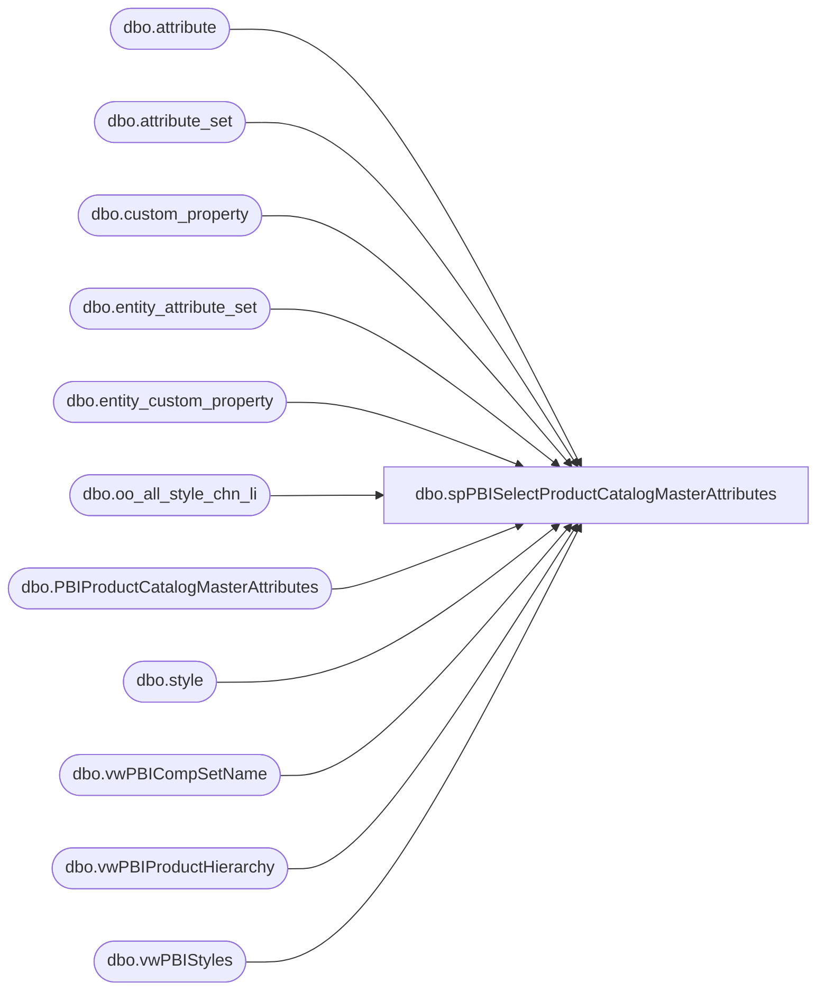

# dbo.spPBISelectProductCatalogMasterAttributes

**Database:** me_01  
**Server:** bedrockdb02  

## Architecture Diagram



## Table Dependencies

| Referenced Table |
|---|
| dbo.attribute |
| dbo.attribute_set |
| dbo.custom_property |
| dbo.entity_attribute_set |
| dbo.entity_custom_property |
| dbo.oo_all_style_chn_li |
| dbo.PBIProductCatalogMasterAttributes |
| dbo.style |
| dbo.vwPBICompSetName |
| dbo.vwPBIProductHierarchy |
| dbo.vwPBIStyles |

## Stored Procedure Code

```sql
CREATE proc [dbo].[spPBISelectProductCatalogMasterAttributes]

as


set nocount on


truncate table PBIProductCatalogMasterAttributes
--------------------------------------------------------------------------------------
--------------------------------------------------------------------------------------


--PRE STAGE 
IF (Object_ID('tempdb..#Styles') IS NOT null) DROP TABLE #Styles;
WITH 
OnOrder as
	(
		select 
			s.style_code
		from ma_01.dbo.oo_all_style_chn_li oo
		join style s on oo.style_id = s.style_id
		where oo.on_order_units >  100
	)
select 
	s.style_id,	
	s.hierarchy_group_id,
	s.SKU,	
	s.style_code,	
	s.SKUDescription,	
	s.Color,	
	s.UPC,	
	s.SellingGeography,	
	s.StoreFrontEligible,
	h.Chain,
	h.Division,
	h.Department,	
	h.Class,	
	h.SubClass,	
	h.ChainCode,
	h.DivisionCode,
	h.DepartmentCode,	
	h.ClassCode,	
	h.SubClassCode,	
	h.SubClassHierarchyGroupID,
	case 
		when oo.style_code is null 
		then 0
		else 1
	end as OnOrderFlag,
	s.isEndlessAisleEligible,
	s.isTaxExempt, --= leaving as NULL for now... Until further noted as needed
	case when h.DepartmentCode in 
				(
					'R-B-C-45',
					'R-B-D-45',
					'R-B-U-45',
					'R-B-C-46',
					'R-B-D-46',
					'R-B-U-46',
					'R-B-C-47',
					'R-B-D-47',
					'R-B-U-47',
					'R-B-C-48',
					'R-B-D-48',
					'R-B-U-48',
					'R-B-C-57',
					'R-B-D-57',
					'R-B-U-57'
				) and s.style_code not in ('083500','083501','183500','483500','183501','483501','080725','080726','080727','080728','080729') --party play card -- should get discounts, per Mike Dalton and team -- also gift card activate item for jm
				and h.SubClass not in ('Transaction Flags','UK-Transaction Flags')--we need transaction flags to be coupon eligible - per Mike D
				then 0 
					else s.isCouponEligible --defaults to 1
	end as isCouponEligible, -- Changed on 2/21/2023
	case when h.DepartmentCode in 
				(
					'R-B-C-45',
					'R-B-D-45',
					'R-B-U-45',
					'R-B-C-46',
					'R-B-D-46',
					'R-B-U-46',
					'R-B-C-47',
					'R-B-D-47',
					'R-B-U-47',
					'R-B-C-48',
					'R-B-D-48',
					'R-B-U-48',
					'R-B-C-57',
					'R-B-D-57',
					'R-B-U-57'
				) and s.style_code not in ('083500','083501','183500','483500','183501','483501','080725','080726','080727','080728','080729')--party play card -- should get discounts, per Mike Dalton and team-- also gift card activate item for jm
				and h.SubClass not in ('Transaction Flags','UK-Transaction Flags')--we need transaction flags to be coupon eligible - per Mike D
				then 0 
					else s.isEmployeeDiscountEligible
	end as isEmployeeDiscountEligible, -- Changed on 2/23/2023 to match that of isCouponEligible
	case when h.DepartmentCode in 
				(
					'R-B-C-45',
					'R-B-D-45',
					'R-B-U-45',
					'R-B-C-46',
					'R-B-D-46',
					'R-B-U-46',
					'R-B-C-47',
					'R-B-D-47',
					'R-B-U-47',
					'R-B-C-48',
					'R-B-D-48',
					'R-B-U-48',
					'R-B-C-57',
					'R-B-D-57',
					'R-B-U-57',
					'R-B-C-80',
					'R-B-D-80',
					'R-B-U-80'
				) and s.style_code not in ('083500','083501','183500','483500','183501','483501','080725','080726','080727','080728','080729') --party play card -- should get discounts, per Mike Dalton and team-- also gift card activate item for jm
				and h.SubClass not in ('Transaction Flags','UK-Transaction Flags')--we need transaction flags to be coupon eligible - per Mike D
				then 0 
					else s.isLoyaltyRewardsDiscountEligible
	end as isLoyaltyRewardsDiscountEligible, 
	s.isReturnEligible, --= yes for all - - SellingStatus what equals sale or return
	s.ItemDescription, --Added to Basket
	s.ProductDescription, --Item Inquiry
	s.ItemName, --View Details 
	s.isCashierEnterQty, --all set to 0
	s.isCashierEntersPrice, --all set to 0
	s.isQtyRestricted, --all set to 0,
	s.isWebEligible,
	case when h.Chain not in ('BABW', 'Retail Concept Company') then h.Chain else NULL end as ConsumerGroup, 
	s.distribution_multiple,
	s.order_multiple,
	s.distribution_multiple as InnerCasePack,
	cs.CompSetName
into #Styles 
from vwPBIStyles s 
join vwPBIProductHierarchy h on s.style_code=h.StyleCode
left join OnOrder oo on s.style_code = oo.style_code
left join vwPBICompSetName cs on s.style_code=cs.style_code 
--where not exists (select style_code from POSProductCatalogMasterAttributes where style_code=s.style_code)
group by 
	s.style_id,	
	s.hierarchy_group_id,
	s.SKU,	
	s.style_code,	
	s.SKUDescription,	
	s.Color,	
	s.UPC,	
	s.SellingGeography,	
	s.StoreFrontEligible,
	h.Department,	
	h.Class,	
	h.SubClass,	
	h.DepartmentCode,	
	h.ClassCode,	
	h.SubClassCode,	
	h.SubClassHierarchyGroupID,	
	case 
		when oo.style_code is null 
		then 0
		else 1
	end,
	s.isEndlessAisleEligible,
	s.isTaxExempt, 
	s.isCouponEligible,
	s.isEmployeeDiscountEligible, 
	s.isLoyaltyRewardsDiscountEligible,
	s.isReturnEligible, 
	s.ItemDescription, 
	s.ProductDescription, 
	s.ItemName, 
	s.isCashierEnterQty,
	s.isCashierEntersPrice,
	s.isQtyRestricted,
	s.isWebEligible,
	case when h.Chain not in ('BABW', 'Retail Concept Company') then h.Chain else NULL end, 
	s.distribution_multiple,
	s.order_multiple,
	s.distribution_multiple,
	cs.CompSetName,
	h.Chain,
	h.Division, 
	h.ChainCode,
	h.DivisionCode 


IF (Object_ID('tempdb..#Attributes') IS NOT null) DROP TABLE #Attributes
SELECT  
	s.style_code,
	a.attribute_code,
	a.attribute_label,
	ats.attribute_set_code,
	ats.attribute_set_label
into #Attributes
FROM #Styles s 
join entity_attribute_set eas with (nolock) on eas.parent_id = s.style_id
join attribute_set ats with (nolock) on eas.attribute_set_id = ats.attribute_set_id
join attribute a with (nolock) on ats.attribute_id = a.attribute_id and a.parent_type = 1
where a.attribute_code in
	(
		'AMAZON','AMLTYP','ANSOLD','ASTHMA','AVAILB',
		'BODY','BOTTOM','BOY', 'BRF',
		'COO',
		'EMBCAN','EMBMUS','EYECLR',
		'GFTBOX','GFTCOM','GIRL',
		'INTSHP',
		'LICEN','LICNSR',
		'MSTAT',
		'NEUTRA',
		'OUTFIT','OTHRLC','OMSTAT','Outlet',
		'PURSES',
		'QTYRST',
		'REFUND',
		'SAC','SEAS','SNC',
		'TEAMS','TOPS',
		'UKTRF','USTRF',
		'WARN','WEBEXC', 'WOCCAS', 'WEBBUF',
		'WEBPAC', 'WEBLIN', 'WEB',
		'WMLB','WBBALL','WNFL','WNHL','WUKFB','WMSTAT'
	)
group by 
	s.style_code,
	a.attribute_code,
	a.attribute_label,
	ats.attribute_set_code,
	ats.attribute_set_label
	
IF (Object_ID('tempdb..#CustomProperties') IS NOT null) DROP TABLE #CustomProperties
select 
	s.style_code,
	cp.cust_prop_code,
	ecp.custom_property_value CustomProperty
into #CustomProperties
from #Styles s 
join entity_custom_property ecp on s.style_id = ecp.parent_id and ecp.parent_type = 1
join custom_property cp (nolock) on cp.custom_property_id = ecp.custom_property_id 
where cp.cust_prop_code IN 
	(
		'HEIGHT',
		'IDATE',
		'KEYSTY',
		'WEIGHT',
		'INLINE',
		'ODATE',
		'ONOTE',
		'ODATE'
	)
group by 
	s.style_code,
	cp.cust_prop_code,
	ecp.custom_property_value


--select * from #CustomProperties
--where cust_prop_code='ODATE'
--and isdate(customProperty)=1


IF (Object_ID('tempdb..#AnimalSoldSeparately') IS NOT null) DROP TABLE #AnimalSoldSeparately
select
	s.style_code
into #AnimalSoldSeparately
from #Styles s
join #Attributes a on s.style_code = a.style_code
where a.attribute_code = 'ANSOLD' 
and a.attribute_set_code = 'N'
group by s.style_code

IF (Object_ID('tempdb..#AsthmaFriendly') IS NOT null) DROP TABLE #AsthmaFriendly
select
	s.style_code
into #AsthmaFriendly
from #Styles s
join #Attributes a on s.style_code = a.style_code
where a.attribute_code = 'ASTHMA' 
and a.attribute_set_code = 'Y'
group by s.style_code	

--=========================================================================================================================================
--IF (Object_ID('tempdb..#LicensedCollection') IS NOT null) DROP TABLE #LicensedCollection
--select
--	s.style_code,
--	min(a.attribute_set_code) as LICNSR
--into #LicensedCollection
--from #Styles s
--join #Attributes a on s.style_code = a.style_code
--where a.attribute_code = 'LICNSR'
--and a.attribute_set_code <> 'SOUNDS'
--group by s.style_code

IF (Object_ID('tempdb..#LicensedCollection') IS NOT null) DROP TABLE #LicensedCollection
select
s.style_code,
isnull(min(ats.attribute_set_code),min(a.attribute_set_code)) as LICNSR
into #LicensedCollection
from #Styles s
left join #Attributes a on s.style_code = a.style_code and a.attribute_code = 'LICNSR' and a.attribute_set_code <> 'SOUNDS'
left join #Attributes ats on s.style_code = ats.style_code and ats.attribute_code ='OTHRLC' and ats.attribute_set_code <> 'SOUNDS'
group by s.style_code
	
------=======================================================================================================================================
IF (Object_ID('tempdb..#BodyType') IS NOT null) DROP TABLE #BodyType
select
	s.style_code,
	a.attribute_set_code as BodyType
into #BodyType
from #Styles s
join #Attributes a on s.style_code = a.style_code
where a.attribute_code = 'BODY'
group by 
	s.style_code,
	a.attribute_set_code

IF (Object_ID('tempdb..#Bottoms') IS NOT null) DROP TABLE #Bottoms
select
	s.style_code
into #Bottoms
from #Styles s
join #Attributes a on s.style_code = a.style_code
where a.attribute_code = 'BOTTOM'
and a.attribute_set_code = 'Y'
group by s.style_code


IF (Object_ID('tempdb..#Boy') IS NOT null) DROP TABLE #Boy
select
	s.style_code
into #Boy
from #Styles s
join #Attributes a on s.style_code = a.style_code
where a.attribute_code = 'BOY'
and a.attribute_set_code = 'Y'
group by s.style_code

IF (Object_ID('tempdb..#CommodityCode') IS NOT null) DROP TABLE #CommodityCode
select
	s.style_code,
	us.attribute_set_label as USTRF,
	uk.attribute_set_label as UKTRF
into #CommodityCode
from #Styles s
join #Attributes us on s.style_code = us.style_code and us.attribute_code = 'USTRF'
join #Attributes uk on s.style_code = uk.style_code and uk.attribute_code = 'UKTRF'
group by 
	s.style_code,
	us.attribute_set_label,
	uk.attribute_set_label

IF (Object_ID('tempdb..#DisplayOnAmazon') IS NOT null) DROP TABLE #DisplayOnAmazon
select
	s.style_code
into #DisplayOnAmazon
from #Styles s
join #Attributes a on s.style_code = a.style_code
where a.attribute_code = 'AMAZON'
and a.attribute_set_code = 'Y'
group by s.style_code

IF (Object_ID('tempdb..#EyeColor') IS NOT null) DROP TABLE #EyeColor
select
	s.style_code,
	a.attribute_set_code as EyeColor
into #EyeColor
from #Styles s
join #Attributes a on s.style_code = a.style_code
where a.attribute_code = 'EYECLR'
group by 
	s.style_code,
	a.attribute_set_code

IF (Object_ID('tempdb..#WebExclusive') IS NOT null) DROP TABLE #WebExclusive
select
	s.style_code
into #WebExclusive
from #Styles s
join #Attributes a on s.style_code = a.style_code
where a.attribute_code = 'WEBEXC'
and a.attribute_set_code = 'Y'
group by s.style_code

IF (Object_ID('tempdb..#Girl') IS NOT null) DROP TABLE #Girl
select
	s.style_code
into #Girl
from #Styles s
join #Attributes a on s.style_code = a.style_code
where a.attribute_code = 'GIRL'
and a.attribute_set_code = 'Y'
group by s.style_code

IF (Object_ID('tempdb..#Neutral') IS NOT null) DROP TABLE #Neutral
select
	s.style_code
into #Neutral
from #Styles s
join #Attributes a on s.style_code = a.style_code
where a.attribute_code = 'NEUTRA'
and a.attribute_set_code = 'Y'
group by s.style_code

IF (Object_ID('tempdb..#Outfits') IS NOT null) DROP TABLE #Outfits
select
	s.style_code
into #Outfits
from #Styles s
join #Attributes a on s.style_code = a.style_code
where a.attribute_code = 'OUTFIT'
and a.attribute_set_code = 'Y'
group by s.style_code

IF (Object_ID('tempdb..#GiftBoxType') IS NOT null) DROP TABLE #GiftBoxType
select
	s.style_code
into #GiftBoxType
from #Styles s
join #Attributes a on s.style_code = a.style_code
where a.attribute_code = 'GFTBOX'
and a.attribute_set_code = 'LARGE'
group by s.style_code

IF (Object_ID('tempdb..#KeyStory') IS NOT null) DROP TABLE #KeyStory
select 
	s.style_code,
	min(cp.CustomProperty) as KeyStory 
into #KeyStory
from #Styles s
join #CustomProperties cp on s.style_code = cp.style_code
where cp.cust_prop_code = 'KEYSTY'
group by s.style_code

IF (Object_ID('tempdb..#COO') IS NOT null) DROP TABLE #COO
select
	s.style_code,
	a.attribute_set_code as COO
into #COO
from #Styles s
join #Attributes a on s.style_code = a.style_code
where a.attribute_code = 'COO'
group by 
	s.style_code,
	a.attribute_set_code

IF (Object_ID('tempdb..#MerchInDate') IS NOT null) DROP TABLE #MerchInDate
select 
	s.style_code,
	MIN(cast(
			case 
				when isdate(replace(replace(replace(replace(cp.CustomProperty, '\', '-'), '/', '-'), '.', '-'), ' ', '')) = 1
				then cast( replace(replace(replace(replace(cp.CustomProperty, '\', '-'), '/', '-'), '.', '-'), ' ', '') as date)
				else '1999-12-31'
			end 
	as date)) MerchInDate
into #MerchInDate
from #Styles s
join #CustomProperties cp on s.style_code = cp.style_code
where cp.cust_prop_code = 'IDATE'
group by s.style_code

IF (Object_ID('tempdb..#NoInternationalShipping') IS NOT null) DROP TABLE #NoInternationalShipping
select
	s.style_code
into #NoInternationalShipping
from #Styles s
join #Attributes a on s.style_code = a.style_code
where a.attribute_code = 'INTSHP'
and a.attribute_set_code = 'Y'
group by s.style_code

IF (Object_ID('tempdb..#SAC') IS NOT null) DROP TABLE #SAC
select
	s.style_code
into #SAC
from #Styles s
join #Attributes a on s.style_code = a.style_code
where a.attribute_code = 'SAC'
and a.attribute_set_code = 'Y'
group by s.style_code

IF (Object_ID('tempdb..#SNC') IS NOT null) DROP TABLE #SNC
select
	s.style_code
into #SNC
from #Styles s
join #Attributes a on s.style_code = a.style_code
where a.attribute_code = 'SNC'
and a.attribute_set_code = 'Y'
group by s.style_code

IF (Object_ID('tempdb..#QuantityRestriction') IS NOT null) DROP TABLE #QuantityRestriction
select 
	s.style_code,
	case 
		when a.attribute_set_code = 'NONE'
		then 0
		else a.attribute_set_code
	end as QuantityRestriction
into #QuantityRestriction
from #Styles s
join #Attributes a on s.style_code = a.style_code
where a.attribute_code = 'QTYRST'
and a.attribute_set_code not in ('10')
group by 
	s.style_code,
	case 
		when a.attribute_set_code = 'NONE'
		then 0
		else a.attribute_set_code
	end

IF (Object_ID('tempdb..#RefundEligible') IS NOT null) DROP TABLE #RefundEligible
select
	s.style_code 
into #RefundEligible
from #Styles s
join #Attributes a on s.style_code = a.style_code
where a.attribute_code = 'REFUND'
and a.attribute_set_code = 'Y'
group by s.style_code

IF (Object_ID('tempdb..#Seasonal') IS NOT null) DROP TABLE #Seasonal
select
	s.style_code
into #Seasonal
from #Styles s
join #Attributes a on s.style_code = a.style_code
where a.attribute_code = 'SEAS'
and a.attribute_set_code = 'Y'
group by s.style_code

IF (Object_ID('tempdb..#ThirdPartySiteEligible') IS NOT null) DROP TABLE #ThirdPartySiteEligible
select
	s.style_code
into #ThirdPartySiteEligible
from #Styles s
join #Attributes a on s.style_code = a.style_code
where a.attribute_code = 'GFTCOM'
and a.attribute_set_code = 'Y'
group by s.style_code

IF (Object_ID('tempdb..#Tops') IS NOT null) DROP TABLE #Tops
select
	s.style_code
into #Tops
from #Styles s
join #Attributes a on s.style_code = a.style_code
where a.attribute_code = 'TOPS'
and a.attribute_set_code = 'Y'
group by s.style_code

IF (Object_ID('tempdb..#WarningLabel') IS NOT null) DROP TABLE #WarningLabel
select
	s.style_code,
	a.attribute_set_code as WarningLabel
into #WarningLabel
from #Styles s
join #Attributes a on s.style_code = a.style_code
where a.attribute_code = 'WARN'
group by 
	s.style_code,
	a.attribute_set_code

IF (Object_ID('tempdb..#SkinType') IS NOT null) DROP TABLE #SkinType
select
	s.style_code,
	a.attribute_set_code as SkinType
into #SkinType
from #Styles s
join #Attributes a on s.style_code = a.style_code
where a.attribute_code = 'AMLTYP'
group by 
	s.style_code,
	a.attribute_set_code

IF (Object_ID('tempdb..#FriendHeight') IS NOT null) DROP TABLE #FriendHeight
;with 
Rounded as
	(
		select 
			s.style_code,
			--cp.CustomProperty as FriendHeight
			case 
				when s.SellingGeography = 'UK'
					--then cast(round((cast(cp.CustomProperty as numeric(10,2)) * 2.54),0,0) as int) 
					then round((cast(cp.CustomProperty as numeric(10,2)) * 2.54),0,0)
				else cp.CustomProperty
			end as FriendHeight
		from #Styles s
		join #CustomProperties cp on s.style_code = cp.style_code
		where cp.cust_prop_code = 'HEIGHT'
	)
select style_code, 
	   cast(FriendHeight as int) as FriendHeight
into #FriendHeight
from Rounded 
group by 
	style_code, 
	cast(FriendHeight as int)

	
IF (Object_ID('tempdb..#FriendWeight') IS NOT null) DROP TABLE #FriendWeight
select 
	s.style_code,
	cp.CustomProperty as FriendWeight
into #FriendWeight
from #Styles s
join #CustomProperties cp on s.style_code = cp.style_code
where cp.cust_prop_code = 'WEIGHT'
group by 
	s.style_code,
	cp.CustomProperty

IF (Object_ID('tempdb..#MSTAT') IS NOT null) DROP TABLE #MSTAT
select
	s.style_code,
	a.attribute_set_code as MSTAT
into #MSTAT
from #Styles s
join #Attributes a on s.style_code = a.style_code
where a.attribute_code = 'MSTAT'
group by 
	s.style_code,
	a.attribute_set_code

IF (Object_ID('tempdb..#ProductCanBeEmbroidered') IS NOT null) DROP TABLE #ProductCanBeEmbroidered
select
	s.style_code
into #ProductCanBeEmbroidered
from #Styles s
join #Attributes a on s.style_code = a.style_code
where a.attribute_code = 'EMBCAN'
and a.attribute_set_code = 'Y'
group by s.style_code

IF (Object_ID('tempdb..#ProductMustBeEmbroidered') IS NOT null) DROP TABLE #ProductMustBeEmbroidered
select
	s.style_code
into #ProductMustBeEmbroidered
from #Styles s
join #Attributes a on s.style_code = a.style_code
where a.attribute_code = 'EMBMUS'
and a.attribute_set_code = 'Y'
group by s.style_code

IF (Object_ID('tempdb..#EmbroideryProductList') IS NOT null) DROP TABLE #EmbroideryProductList
select 
	style_code
into #EmbroideryProductList
from #ProductCanBeEmbroidered
group by style_code
UNION
select
	style_code
from #ProductMustBeEmbroidered
group by style_code

IF (Object_ID('tempdb..#Purses') IS NOT null) DROP TABLE #Purses
select
	s.style_code
into #Purses
from #Styles s
join #Attributes a on s.style_code = a.style_code
where a.attribute_code = 'PURSES'
and a.attribute_set_code = 'Y'
group by s.style_code

IF (Object_ID('tempdb..#LICEN') IS NOT null) DROP TABLE #LICEN
select
	s.style_code
into #LICEN
from #Styles s
join #Attributes a on s.style_code = a.style_code
where a.attribute_code = 'LICEN'
and a.attribute_set_code = 'NO'
group by s.style_code

IF (Object_ID('tempdb..#sportsTeams') IS NOT null) DROP TABLE #sportsTeams
select
	s.style_code,
	a.attribute_set_label as sportsTeam
into #sportsTeams
from #Styles s
join #Attributes a on s.style_code = a.style_code
where a.attribute_code = 'TEAMS'
group by 
	s.style_code,
	a.attribute_set_label

IF (Object_ID('tempdb..#occasion') IS NOT null) DROP TABLE #occasion
select 
	style_code,
	attribute_set_label as occasion,
	attribute_set_code as OccasionCode
into #occasion
from #attributes 
where attribute_code = 'woccas'
and attribute_set_label <> 'Not Available'
group by
	style_code,
	attribute_set_label,
	attribute_set_code

IF (Object_ID('tempdb..#buffer') IS NOT null) DROP TABLE #buffer
select 
	style_code,
	replace(attribute_set_code, 'units', '') as InventoryBuffer
into #buffer
from #attributes 
where attribute_code = 'WEBBUF'
group by 
	style_code,
	replace(attribute_set_code, 'units', '')

IF (Object_ID('tempdb..#PackageOption') IS NOT null) DROP TABLE #PackageOption
select 
	style_code,
	attribute_set_code as PackageOption 
into #PackageOption 
from #Attributes
where attribute_code = 'WEBPAC' 
group by	
	style_code,
	attribute_set_code

IF (Object_ID('tempdb..#dropShipCustLines') IS NOT null) DROP TABLE #dropShipCustLines
select 
	style_code,
	attribute_set_code as dropShipCustLines 
into #dropShipCustLines 
from #Attributes
where attribute_code = 'WEBLIN'  
group by 
	style_code,
	attribute_set_code

IF (Object_ID('tempdb..#WEB') IS NOT null) DROP TABLE #WEB
select 
	style_code,
	attribute_set_code as WEB 
into #WEB
from #Attributes
where attribute_code = 'WEB'  
group by 
	style_code,
	attribute_set_code

IF (Object_ID('tempdb..#BRF') IS NOT null) DROP TABLE #BRF
select 
	style_code,
	attribute_set_code as BRF 
into #BRF
from #Attributes
where attribute_code = 'BRF'  
group by 
	style_code,
	attribute_set_code

IF (Object_ID('tempdb..#AVAILB') IS NOT null) DROP TABLE #AVAILB
select 
	style_code,
	attribute_set_code as AVAILB 
into #AVAILB
from #Attributes
where attribute_code = 'AVAILB'  
and attribute_set_code in ('USWEB', 'UKWEB')
group by 
	style_code,
	attribute_set_code

IF (Object_ID('tempdb..#INLINE') IS NOT null) DROP TABLE #INLINE
select 
	style_code,
	CustomProperty as INLINE 
into #INLINE
from #CustomProperties
where cust_prop_code = 'INLINE'  
group by 
	style_code,
	cust_prop_code,
	CustomProperty


IF (Object_ID('tempdb..#MerchOutDate') IS NOT null) DROP TABLE #MerchOutDate
select 
	style_code,
	cast(CustomProperty as date) as MerchOutDate
into #MerchOutDate
from #CustomProperties
where cust_prop_code='ODATE'
and isdate(CustomProperty)=1
and len(CustomProperty)=10
and CustomProperty like '%/%'
and isnumeric(replace(CustomProperty,'/',''))=1

IF (Object_ID('tempdb..#MLBTeams') IS NOT null) DROP TABLE #MLBTeams
select
	style_code,
	attribute_set_code MLBTeams
into #MLBTeams
from #attributes
where attribute_code='WMLB'

IF (Object_ID('tempdb..#NBATeams') IS NOT null) DROP TABLE #NBATeams
select
	style_code,
	attribute_set_code as NBATeams
into #NBATeams
from #attributes
where attribute_code='WBBALL'

IF (Object_ID('tempdb..#NFLTeams') IS NOT null) DROP TABLE #NFLTeams
select
	style_code,
	attribute_set_code as NFLTeams
into #NFLTeams
from #attributes
where attribute_code='WNFL'

IF (Object_ID('tempdb..#NHLTeams') IS NOT null) DROP TABLE #NHLTeams
select
	style_code,
	attribute_set_code as NHLTeams
into #NHLTeams
from #attributes
where attribute_code='WNHL'

IF (Object_ID('tempdb..#UKFootball') IS NOT null) DROP TABLE #UKFootball
select
	style_code,
	attribute_set_code as UKFootball
into #UKFootball
from #attributes
where attribute_code='WUKFB'

IF (Object_ID('tempdb..#ODATE') IS NOT null) DROP TABLE #ODATE
select 
	style_code,
	max(CustomProperty) as ODATE 
into #ODATE
from #CustomProperties
where cust_prop_code = 'ODATE'  
group by 
	style_code

IF (Object_ID('tempdb..#ONOTE') IS NOT null) DROP TABLE #ONOTE
select 
	style_code,
	CustomProperty as ONOTE 
into #ONOTE
from #CustomProperties
where cust_prop_code = 'ONOTE'  
group by 
	style_code,
	CustomProperty

IF (Object_ID('tempdb..#OMSTAT') IS NOT null) DROP TABLE #OMSTAT
select
	style_code,
	attribute_set_code as OMSTAT
into #OMSTAT
from #attributes
where attribute_code='OMSTAT'

IF (Object_ID('tempdb..#WMSTAT') IS NOT null) DROP TABLE #WMSTAT
select
	style_code,
	attribute_set_code as WMSTAT
into #WMSTAT
from #attributes
where attribute_code='WMSTAT'

IF (Object_ID('tempdb..#Outlet') IS NOT null) DROP TABLE #Outlet 
select
	style_code,
	attribute_set_code as Outlet
into #Outlet
from #attributes
where attribute_code='Outlet'

--------------------------------------------------------------------------------------
--------------------------------------------------------------------------------------


--FINAL PreSTAGE

select 
	s.Style_Code,
	s.SKUDescription,
	s.UPC,
	NULL as DefaultDisplayName,
	case 
		when s.ClassCode in 
							(
								'W-C-K-08-02', 
								'W-C-K-08-03',
								'W-D-K-08-02', 
								'W-D-K-08-03',
								'W-E-K-08-02', 
								'W-E-K-08-03',
								'W-F-K-08-02', 
								'W-F-K-08-03'
							)
		then s.SubClass
		else NULL
	end as AccessoryType,
	case 
		when exists (select ass.style_code from #AnimalSoldSeparately ass where ass.style_code = s.style_code)
		then 'false'
		else 'true'
	end as AnimalSoldSeparately,
	case 
		when exists (select af.style_code from #AsthmaFriendly af where af.style_code = s.style_code)
		then 'true'
		else 'false'
	end as AsthmaFriendly,
	s.Color as ColorCode,
	lc.LICNSR as LicensedCollection,
	s.style_code as BABWProductID,
	case when s.DepartmentCode in ('W-C-J-02', 'W-D-J-02', 'W-E-J-02', 'W-F-J-02') --Unstuffed - Per Mark D, use DepartmentCode instead of name
		then 'true' 
		else 'false'
	end as BirthCertificateRequired,
	bt.BodyType,
	case 
		when exists (select b.style_code from #Bottoms b where b.style_code = s.style_code)
		then 'true'
		else 'false'
	end as Bottoms,
	case 
		when exists (select boy.style_code from #Boy boy where boy.style_code = s.style_code)
		then 'true'
		else 'false'
	end as Boy,
	s.Class as ClassName,
	case 
		when s.SellingGeography = 'UK' 
			then cct.UKTRF
		else cct.USTRF
	end as CommodityCode,
	s.Department,
	cast(case s.Department
			when 'Unstuffed' then 1
			when 'Clothes' then 3
			when 'Footwear' then 4
			when 'Stuffers' then 5
			when 'Accessories' then 6
			when 'Friend' then 7
			when 'Stuffed' then 8
			when 'Human Clothes' then 9
			when 'Human' then 10
			when 'Cookies' then 11
			when 'Candy' then 12
			end
		as int) as DepartmentSortOrder,

	case
		when exists (select doa.style_code from #DisplayOnAmazon doa where doa.style_code = s.style_code)
		then 'true'
		else 'false'
	end as DisplayOnAmazon,
	ec.EyeColor,
	case 
		when exists (select we.style_code from #WebExclusive we where we.style_code = s.style_code)
		then 'true'
		else 'false'
	end as WebExclusive,
	case
		when exists (select g.style_code from #Girl g where g.style_code = s.style_code)
		then 'true'
		else 'false'
	end as Girl,
	case
		when exists (select n.style_code from #Neutral n where n.style_code = s.style_code)
		then 'true'
		else 'false'
	end as Neutral,
	case 
		when exists (select o.style_code from #Outfits o where o.style_code = s.style_code)
		then 'true'
		else 'false'
	end as Outfits,
	case 
		when exists (select gbt.style_code from #GiftBoxType gbt where gbt.style_code = s.style_code)
		then 'Large'
		else 'Regular'
	end as GiftBoxType,
	s.SubClassCode as HierarchyGroupCode,
	ks.KeyStory,
	coo.COO as ManufacturerCountry,
	isnull(mid.MerchInDate, '1999-12-31') as MerchInDate,
	case 
		when s.DepartmentCode in ('W-C-J-04','W-D-J-04','W-E-J-04','W-F-J-04') --stuffed
		then 'true' 
		else 'false'
	end as Mini,
	case 
		when s.SubClassCode in 
			(
				'W-C-K-12-01-02',
				'W-C-K-12-01-04',
				'W-D-K-12-01-02',
				'W-D-K-12-01-04',
				'W-E-K-12-01-02',
				'W-E-K-12-01-04',
				'W-F-K-12-01-02',
				'W-F-K-12-01-04'
			)
		then 'true'
		else 'false'
	end as Music,
	case
		when exists (select nis.style_code from #NoInternationalShipping nis where nis.style_code = s.style_code)
		then 'true'
		else 'false'
	end as NoInternationalShipping,
	case
		when exists (select sac.style_code from #SAC sac where sac.style_code = s.style_code)
		then 'true'
		else 'false'
	end as SAC,
	case
		when exists (select snc.style_code from #SNC snc where snc.style_code = s.style_code)
		then 'true'
		else 'false'
	end as SNC,
	s.SellingGeography as ProductSellingGeography,
	isnull(qr.QuantityRestriction,10) as QuantityRestriction,
	case 
		when exists (select re.style_code from #RefundEligible re where re.style_code = s.style_code)
		then 'true'
		else 'false'
	end as RefundEligible,
	case 
		when exists (select snl.style_code from #Seasonal snl where snl.style_code = s.style_code)
		then 'true'
		else 'false'
	end as Seasonal,
	case 
		when exists (select tpse.style_code from #ThirdPartySiteEligible tpse where tpse.style_code = s.style_code)
		then 'true'
		else 'false'
	end as ThirdPartySiteEligible,
	case when s.DepartmentCode in ('W-C-J-02', 'W-D-J-02', 'W-E-J-02', 'W-F-J-02') 
		then 'AnimalShip' 
		else 'AccessoryShip'
	end as ShippingClass,
	case when s.DepartmentCode in ('W-C-J-02', 'W-D-J-02', 'W-E-J-02', 'W-F-J-02') --Unstuffed - Per Mark D, use DepartmentCode instead of name
		then 'true' 
		else 'false'
	end as Stuffable,
	case
		when exists (select Tops.style_code from #Tops Tops where Tops.style_code = s.style_code)
		then 'true'
		else 'false'
	end as Tops,
	isnull(wl.WarningLabel, 'None') as WarningLabel,
	case when s.DepartmentCode in ('W-C-J-02', 'W-D-J-02', 'W-E-J-02', 'W-F-J-02') 
		then 'true' 
		else 'false'
	end as AccessoryEligible,
	st.SkinType,
	fh.FriendHeight,
	fw.FriendWeight,
	case when s.DepartmentCode in ('W-C-J-02', 'W-D-J-02', 'W-E-J-02', 'W-F-J-02') 
		then 'true'
		else 'false'
	end as SoundEligible,
	ms.MSTAT,
	case
		when exists (select epl.style_code from #EmbroideryProductList epl where epl.style_code = s.style_code)
		then 'true'
		else 'false'
	end as EmbroideryProductList,
	case
		when exists (select cbe.style_code from #ProductCanBeEmbroidered cbe where cbe.style_code = s.style_code)
		then 'true'
		else 'false'
	end as ProductCanBeEmbroidered,
	case
		when exists (select mbe.style_code from #ProductMustBeEmbroidered mbe where mbe.style_code = s.style_code)
		then 'true'
		else 'false'
	end as ProductMustBeEmbroidered,
	case 
		when exists (select p.style_code from #Purses p where p.style_code = s.style_code)
		then 'true'
		else 'false'
	end as Purses,
	NULL as EnableEmailAFriend,
	NULL as CopyStatus,
	NULL as GoogleTag1,
	NULL as GoogleTag2,
	NULL as GoogleTag3,
	NULL as GoogleTag4,
	NULL as GoogleTag5,
	NULL as NewProduct,
	NULL as PrimaryCategoryDerived,
	NULL as ChildSKUs,
	NULL as DisplayableSkuAttributes,
	NULL as PreOrderable,
	NULL as PreorderEndDate,
	NULL as DefaultKeywords,
	lower(s.Department
		+ '-' + s.Class 
		+ '-' + s.SubClass)
	as CategoryTree,
	case 
		when exists (select ass.style_code from #LICEN ass where ass.style_code = s.style_code)
		then 'NO'
		else NULL
	end as LICEN,
	spt.sportsTeam,
	o.occasion,
	o.OccasionCode,
	s.StoreFrontEligible,
	s.OnOrderFlag,
	isnull(b.InventoryBuffer,0) as InventoryBuffer,
	1 as SearchableFlag,
	1 as SearchableIfUnavailableFlag,
	case 
		when s.DepartmentCode in ('R-B-D-80','R-B-U-80')
			then 
				case 
					when s.SubClassCode in ('R-B-D-80-02-00', 'R-B-U-80-02-00')
						then 'EGC'
					when s.SubClassCode in ('R-B-D-80-01-04', 'R-B-U-80-01-04 ')
						then NULL
					else 'PGC'
				end 
		else NULL
	end as giftCardType,
	po.PackageOption,
	dscl.dropShipCustLines,
	web.Web,
	case when brf.style_code is null then 'False' else 'True' end as BRF,
	i.Inline,
	case when ab.style_code is null then 'False' else 'True' end as AvailB,
	s.SubClass as SubClassLabel,
	case 
		when left(s.style_code, 1) in ('2','3') then s.style_code
		when left(s.style_code,1) in ('0','4') then right(s.style_code,5) 
		when left(s.style_code,1)='5' then concat(cast('2' as varchar), cast(right(s.style_code,5) as varchar))
		when left(s.style_code,1)='6' then concat(cast('3' as varchar), cast(right(s.style_code,5) as varchar))
		Else s.style_code
	end as BaseID,
	case when s.Department='Footwear' then 1 else 0 end as 'Shoes',
	case when s.Class='Sound' then 1 else 0 end as 'Sound',
	case when bt.BodyType in ('4LEGG','POSED') then 1 else 0 end as fourLeggedAnimal,	
	mo.merchOutDate,	
	mlb.MLBTeams,
	nba.NBATeams,
	nfl.NFLTeams,
	NHL.NHLTeams,
	UKF.UKFootball,
	case
		when s.isEndlessAisleEligible = 1 --or brf.style_code is not null
			then 1
	    else 0
	end as isEndlessAisleEligible,
	NULL as isTaxExempt,
	s.isCouponEligible, --= no known way to exclude items from using coupon
	s.isEmployeeDiscountEligible, -- = currently manually communicated - should be based on not being a donation or gift card?
	s.isLoyaltyRewardsDiscountEligible, 
	s.isReturnEligible, --= yes for all - - SellingStatus what equals sale or return
	s.ItemDescription, --Added to Basket
	s.ProductDescription, --Item Inquiry
	s.ItemName, --View Details 
	s.isCashierEnterQty,
	s.isCashierEntersPrice,
	s.isQtyRestricted,
	s.isWebEligible,
	s.Chain,
	s.Division,
	s.ChainCode,
	s.DivisionCode,
	s.ConsumerGroup,
	s.distribution_multiple,
	s.order_multiple,
	s.InnerCasePack,
	s.CompSetName,
	os.OMSTAT,
	ws.WMSTAT,
	oon.ONOTE,
	ood.ODATE,
	isnull(ooo.Outlet,'N') Outlet
into #PBIProductCatalogMasterAttributes
from #Styles s
left join #LicensedCollection lc on s.style_code = lc.style_code
left join #BodyType bt on s.style_code = bt.style_code
left join #CommodityCode cct on s.style_code = cct.style_code
left join #EyeColor ec on s.style_code = ec.style_code
left join #KeyStory ks on s.style_code = ks.style_code
left join #COO COO on s.style_code = COO.style_code
left join #MerchInDate mid on s.style_code = mid.style_code
left join #QuantityRestriction qr on s.style_code = qr.style_code
left join #WarningLabel wl on s.style_code = wl.style_code
left join #SkinType st on s.style_code = st.style_code
left join #FriendHeight fh on s.style_code = fh.style_code
left join #FriendWeight fw on s.style_code = fw.style_code
left join #MSTAT ms on s.style_code = ms.style_code
left join #sportsTeams spt on s.style_code = spt.style_code
left join #occasion o on s.style_code = o.style_code 
left join #buffer b on s.style_code = b.style_code
left join #PackageOption po on s.style_code = po.style_code 
left join #dropShipCustLines dscl on s.style_code = dscl.style_code 
left join #WEB web on s.style_code=web.style_code
--left join #WEBBUF wb on s.style_code=wb.style_code
left join #BRF brf on s.style_code=brf.style_code
left join #AVAILB ab on s.style_code=ab.style_code
left join #Inline i on s.style_code=i.style_code
left join #MerchOutDate mo on s.style_code=mo.style_code
left join #MLBTeams	mlb on s.style_code=mlb.style_code
left join #NBATeams	nba on s.style_code=nba.style_code
left join #NFLTeams	nfl on s.style_code=nfl.style_code
left join #NHLTeams	nhl on s.style_code=nhl.style_code
left join #UKFootball ukf on s.style_code=ukf.style_code
--left join POSAwTaxGroupReferenceStage tg on s.style_code=tg.style_code
--left join bedrockdb01.auditworks.dbo.vwPOSTaxItemGroupAssignment tg on s.style_code collate SQL_Latin1_General_CP1_CI_AS =tg.StyleCode
left join #OMSTAT os on s.style_code=os.style_code
left join #WMSTAT ws on s.style_code=ws.style_code 
left join #ONOTE oon on s.style_code=oon.style_code
left join #ODATE ood on s.style_code=ood.style_code
left join #Outlet ooo on s.style_code=ooo.style_code 


insert PBIProductCatalogMasterAttributes
select 
	Style_Code,	
	SKUDescription,	
	UPC,	
	DefaultDisplayName,	
	AccessoryType,	
	AnimalSoldSeparately,	
	AsthmaFriendly,	
	ColorCode,	
	LicensedCollection,	
	BABWProductID,	
	BirthCertificateRequired,	
	BodyType,	
	Bottoms,	
	Boy,	
	ClassName,	
	CommodityCode,	
	Department,	
	DepartmentSortOrder,	
	DisplayOnAmazon,	
	EyeColor,	
	WebExclusive,	
	Girl,	
	Neutral,	
	Outfits,	
	GiftBoxType,	
	HierarchyGroupCode,	
	KeyStory,	
	ManufacturerCountry,	
	case
		when style_code='031565' then '2023-04-28'
		else max(MerchInDate) 
	end as MerchInDate,	
	Mini,	
	Music,	
	NoInternationalShipping,	
	SAC,	
	SNC,	
	ProductSellingGeography,	
	QuantityRestriction,	
	RefundEligible,	
	Seasonal,	
	ThirdPartySiteEligible,	
	ShippingClass,	
	Stuffable,	
	Tops,	
	max(WarningLabel) WarningLabel,	
	AccessoryEligible,	
	SkinType,	
	FriendHeight,	
	FriendWeight,	
	SoundEligible,	
	MSTAT,	
	EmbroideryProductList,	
	ProductCanBeEmbroidered,	
	ProductMustBeEmbroidered,	
	Purses,	
	EnableEmailAFriend,	
	CopyStatus,	
	GoogleTag1,	
	GoogleTag2,	
	GoogleTag3,	
	GoogleTag4,	
	GoogleTag5,	
	NewProduct,	
	PrimaryCategoryDerived,	
	ChildSKUs,	
	DisplayableSkuAttributes,	
	PreOrderable,	
	PreorderEndDate,	
	DefaultKeywords,	
	CategoryTree,	
	LICEN,	
	sportsTeam,	
	occasion,	
	OccasionCode,	
	StorefrontEligible,	
	OnOrderFlag,	
	InventoryBuffer,	
	SearchableFlag,	
	SearchableIfUnavailableFlag,	
	giftCardType,	
	PackageOption,	
	dropShipCustLines,	
	Web,	
	BRF,	
	Inline,	
	AvailB,	
	SubClassLabel,	
	BaseID,	
	Shoes,	
	Sound,	
	fourLeggedAnimal,	
	max(merchOutDate) merchOutDate,	
	MLBTeams,	
	NBATeams,	
	NFLTeams,	
	NHLTeams,	
	UKFootball,	
	isEndlessAisleEligible,	
	case
		when isTaxExempt=1 ---see above
		OR ---donations
			left (HierarchyGroupCode, 8) in
					(
					'R-B-C-46',
					'R-B-D-46',
					'R-B-U-46'
					)
				or style_code in ('083502','083503','183502','183503','483502','483503') -- Added 3/16/2023
		then 1
			else 0 
	end as isTaxExempt,		
	isCouponEligible,	
	isEmployeeDiscountEligible,	
	isLoyaltyRewardsDiscountEligible,
	isReturnEligible,	
	ItemDescription,	
	ProductDescription,	
	ItemName,	
	isCashierEnterQty,	
	isCashierEntersPrice,
	case 
		when left (HierarchyGroupCode, 8) in
					(
					'R-B-C-46',
					'R-B-D-46',
					'R-B-U-46'
					)
				or style_code in ('083502','083503','183502','183503','483502','483503') -- Added 3/16/2023
			then 1 
		when giftcardType is not null 
			or style_code in 
					(
						'083500',
						'083501',
						'183500',
						'183501',
						'483500',
						'483501'
					)
		then 1
		else 0 
	end as isQtyRestricted,	
	case 
		when giftCardType is null
			then 'Avail'
		--when 
		--	then 'Return Only Recall' -- not used... if they have a recall, it will be manually set
		else 'Sale Only'
	end as SellingStatus,
	case 
			--when SKUDescription like '%donation%' then 'Donation'
		when left (HierarchyGroupCode, 8) in
					(
					'R-B-C-46',
					'R-B-D-46',
					'R-B-U-46'
					)
				or style_code in ('083502','083503','183502','183503','483502','483503') -- Added 3/16/2023
					then 'Donation' -- Replaced above per JIRA BIB-514
		when giftcardType is not null 
			or style_code in 
					(
						'083500',
						'083501',
						'183500',
						'183501',
						'483500',
						'483501'
					)
				then 'Gift Card'
		when 
			giftCardType is NULL 
			and SKUDescription not like '%donation%'
			and SKUDescription not like '%embroid%'
				then 'Stock'

		when SKUDescription like '%embroid%' then 'Service' --anything else ?? is this not a 'service'?
		else 'Stock' 
	end as ItemType,
	isWebEligible,
	Chain,
	Division,
	ChainCode,
	DivisionCode,
	ConsumerGroup,
	distribution_multiple,
	order_multiple,
	InnerCasePack,
	CompSetName,
	OMSTAT,
	WMSTAT,
	ONOTE,
	ODATE,
	Outlet 
from #PBIProductCatalogMasterAttributes 
group by 
	Style_Code,	
	SKUDescription,	
	UPC,	
	DefaultDisplayName,	
	AccessoryType,	
	AnimalSoldSeparately,	
	AsthmaFriendly,	
	ColorCode,	
	LicensedCollection,	
	BABWProductID,	
	BirthCertificateRequired,	
	BodyType,	
	Bottoms,	
	Boy,	
	ClassName,	
	CommodityCode,	
	Department,	
	DepartmentSortOrder,	
	DisplayOnAmazon,	
	EyeColor,	
	WebExclusive,	
	Girl,	
	Neutral,	
	Outfits,	
	GiftBoxType,	
	HierarchyGroupCode,	
	KeyStory,	
	ManufacturerCountry,	
	Mini,	
	Music,	
	NoInternationalShipping,	
	SAC,	
	SNC,	
	ProductSellingGeography,	
	QuantityRestriction,	
	RefundEligible,	
	Seasonal,	
	ThirdPartySiteEligible,	
	ShippingClass,	
	Stuffable,	
	Tops,	
	--WarningLabel,	
	AccessoryEligible,	
	SkinType,	
	FriendHeight,	
	FriendWeight,	
	SoundEligible,	
	MSTAT,	
	EmbroideryProductList,	
	ProductCanBeEmbroidered,	
	ProductMustBeEmbroidered,	
	Purses,	
	EnableEmailAFriend,	
	CopyStatus,	
	GoogleTag1,	
	GoogleTag2,	
	GoogleTag3,	
	GoogleTag4,	
	GoogleTag5,	
	NewProduct,	
	PrimaryCategoryDerived,	
	ChildSKUs,	
	DisplayableSkuAttributes,	
	PreOrderable,	
	PreorderEndDate,	
	DefaultKeywords,	
	CategoryTree,	
	LICEN,	
	sportsTeam,	
	occasion,	
	OccasionCode,	
	StorefrontEligible,	
	OnOrderFlag,	
	InventoryBuffer,	
	SearchableFlag,	
	SearchableIfUnavailableFlag,	
	giftCardType,	
	PackageOption,	
	dropShipCustLines,	
	Web,	
	BRF,	
	Inline,	
	AvailB,	
	SubClassLabel,	
	BaseID,	
	Shoes,	
	Sound,	
	fourLeggedAnimal,	
	MLBTeams,	
	NBATeams,	
	NFLTeams,	
	NHLTeams,	
	UKFootball,	
	isEndlessAisleEligible,	
	case
		when isTaxExempt=1 ---see above
		OR ---donations
			left (HierarchyGroupCode, 8) in
					(
					'R-B-C-46',
					'R-B-D-46',
					'R-B-U-46'
					)
				or style_code in ('083502','083503','183502','183503','483502','483503') -- Added 3/16/2023
		then 1
			else 0 
	end,		
	isCouponEligible,	
	isEmployeeDiscountEligible,	
	isLoyaltyRewardsDiscountEligible,
	isReturnEligible,	
	ItemDescription,	
	ProductDescription,	
	ItemName,	
	isCashierEnterQty,	
	isCashierEntersPrice,
	case 
		when left (HierarchyGroupCode, 8) in
					(
					'R-B-C-46',
					'R-B-D-46',
					'R-B-U-46'
					)
				or style_code in ('083502','083503','183502','183503','483502','483503') -- Added 3/16/2023
			then 1 
		when giftcardType is not null 
			or style_code in 
					(
						'083500',
						'083501',
						'183500',
						'183501',
						'483500',
						'483501'
					)
		then 1
		else 0 
	end,	
	case 
		when giftCardType is null
			then 'Avail'
		--when 
		--	then 'Return Only Recall' -- not used... if they have a recall, it will be manually set
		else 'Sale Only'
	end,
	case 
			--when SKUDescription like '%donation%' then 'Donation'
		when left (HierarchyGroupCode, 8) in
					(
					'R-B-C-46',
					'R-B-D-46',
					'R-B-U-46'
					)
				or style_code in ('083502','083503','183502','183503','483502','483503') -- Added 3/16/2023
					then 'Donation' -- Replaced above per JIRA BIB-514
		when giftcardType is not null 
			or style_code in 
					(
						'083500',
						'083501',
						'183500',
						'183501',
						'483500',
						'483501'
					)
				then 'Gift Card'
		when 
			giftCardType is NULL 
			and SKUDescription not like '%donation%'
			and SKUDescription not like '%embroid%'
				then 'Stock'

		when SKUDescription like '%embroid%' then 'Service' --anything else ?? is this not a 'service'?
		else 'Stock' 
	end,
	isWebEligible,
	Chain,
	Division,
	ChainCode,
	DivisionCode,
	ConsumerGroup,
	distribution_multiple,
	order_multiple,
	InnerCasePack,
	CompSetName,
	OMSTAT,
	WMSTAT,
	ONOTE,
	ODATE,
	Outlet 

INSERT PBIProductCatalogMasterAttributes
select
	Style_Code,	
	SKUDescription,	
	UPC,	
	DefaultDisplayName,	
	AccessoryType,	
	AnimalSoldSeparately,	
	AsthmaFriendly,	
	ColorCode,	
	LicensedCollection,	
	BABWProductID,	
	BirthCertificateRequired,	
	BodyType,	
	Bottoms,	
	Boy,	
	ClassName,	
	CommodityCode,	
	Department,	
	DepartmentSortOrder,	
	DisplayOnAmazon,	
	EyeColor,	
	WebExclusive,	
	Girl,	
	Neutral,	
	Outfits,	
	GiftBoxType,	
	HierarchyGroupCode,	
	KeyStory,	
	ManufacturerCountry,	
	MerchInDate,	
	Mini,	
	Music,	
	NoInternationalShipping,	
	SAC,	
	SNC,	
	'IE' as ProductSellingGeography,	
	QuantityRestriction,	
	RefundEligible,	
	Seasonal,	
	ThirdPartySiteEligible,	
	ShippingClass,	
	Stuffable,	
	Tops,	
	WarningLabel,	
	AccessoryEligible,	
	SkinType,	
	FriendHeight,	
	FriendWeight,	
	SoundEligible,	
	MSTAT,	
	EmbroideryProductList,	
	ProductCanBeEmbroidered,
	ProductMustBeEmbroidered,	
	Purses,	
	EnableEmailAFriend,	
	CopyStatus,	
	GoogleTag1,	
	GoogleTag2,	
	GoogleTag3,	
	GoogleTag4,	
	GoogleTag5,	
	NewProduct,	
	PrimaryCategoryDerived,	
	ChildSKUs,	
	DisplayableSkuAttributes,	
	PreOrderable,	
	PreorderEndDate,	
	DefaultKeywords,	
	CategoryTree,	
	LICEN,	
	sportsTeam,	
	occasion,	
	OccasionCode,	
	StorefrontEligible,	
	OnOrderFlag,	
	InventoryBuffer,	
	Searchable,	
	SearchableIfUnavailable,	
	giftCardType,	
	PackageOption,	
	dropShipCustLines,	
	Web,	
	BRF,	
	Inline,	
	AvailB,	
	SubClassLabel,	
	BaseID,	
	Shoes,	
	Sound,	
	fourLeggedAnimal,	
	merchOutDate,	
	MLBTeams,	
	NBATeams,	
	NFLTeams,	
	NHLTeams,	
	UKFootball,	
	isEndlessAisleEligible,	
	NULL as isTaxExempt,	
	isCouponEligible,	
	isEmployeeDiscountEligible,	
	isLoyaltyRewardsDiscountEligible,	
	isReturnEligible,	
	ItemDescription,	
	ProductDescription,	
	ItemName,	
	isCashierEnterQty,	
	isCashierEntersPrice,	
	isQtyRestricted,	
	SellingStatus,	
	ItemType,
	isWebEligible,
	Chain,
	Division,
	ChainCode,
	DivisionCode,
	ConsumerGroup,
	distribution_multiple,
	order_multiple,
	InnerCasePack,
	CompSetName,
	OMSTAT,
	WMSTAT,
	ONOTE,
	ODATE,
	Outlet 
from PBIProductCatalogMasterAttributes p
where ProductSellingGeography='UK'


--alter table PBIProductCatalogMasterAttributes
--add Chain varchar(100)

--alter table PBIProductCatalogMasterAttributes
--add
--	Division varchar(100),
--	ChainCode varchar(100),
--	DivisionCode varchar(100),
--	ConsumerGroup varchar(100),
--	distribution_multiple int,
--	order_multiple int,
--	InnerCasePack int,
--	CompSetName varchar(100)


--select count(*) 
--from PBIProductCatalogMasterAttributes --78,617


--select Style_Code, ProductSellingGeography 
--from PBIProductCatalogMasterAttributes
--group by Style_Code, ProductSellingGeography
--having count(*) > 1
```

