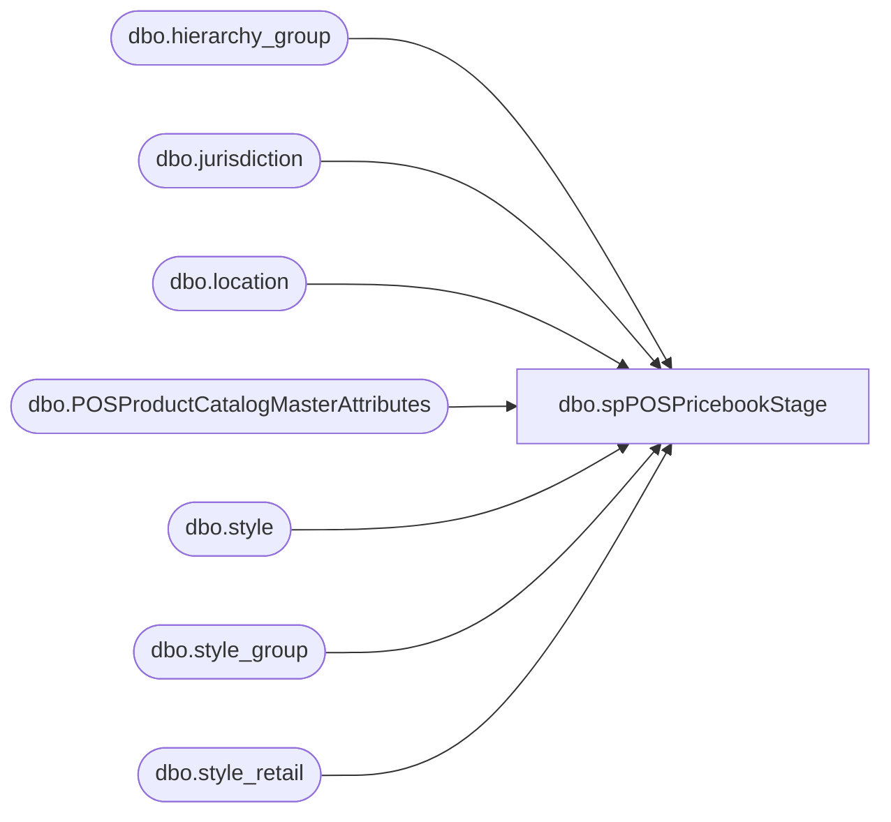

# dbo.spPOSPricebookStage

**Database:** me_01  
**Server:** bedrockdb02  

## Architecture Diagram



## Table Dependencies

| Referenced Table |
|---|
| dbo.hierarchy_group |
| dbo.jurisdiction |
| dbo.location |
| dbo.POSProductCatalogMasterAttributes |
| dbo.style |
| dbo.style_group |
| dbo.style_retail |

## Stored Procedure Code

```sql
CREATE proc [dbo].[spPOSPricebookStage]

as 


--------------------------------------------------------------------------------------------------
-- 2023-01-04 - Created Proc to Pull US, CA, UK prices for Jump Mind POS 
				-- Proc is based on spWEBPricebookStage, but altered
-- 2023-07-17 - Added additional filter to Temp Markdown Chunk - Tim C
--------------------------------------------------------------------------------------------------
set nocount on

declare 
@BryceDate date 


declare @UKHourAdd int
select @UKHourAdd = 18 

select @BryceDate = cast(getdate() as date)

declare 
	@RunDate datetime

select @RunDate = cast((cast(@BryceDate as varchar) + ' ' + convert(varchar, getdate(), 114)) as datetime)

		if (object_id('tempdb..#Locationz') is not null) drop table #Locationz
		select l.location_id, l.location_code, j.jurisdiction_id, case when jurisdiction_code='home' then 'US' else Jurisdiction_code end as JurisdictionCode
		into #Locationz
		from location l
		join jurisdiction j on l.jurisdiction_id=j.jurisdiction_id
		where l.location_code between '0001' and '3000'

		
		if (object_id('tempdb..#Styles') is not null) drop table #Styles
		select style_code, ProductSellingGeography
		into #Styles
		from POSProductCatalogMasterAttributes
		group by style_code, ProductSellingGeography


		if (object_id('tempdb..#Prices') is not null) drop table #Prices
		SELECT 
			sc.style_code, 
			SUBSTRING(hg.hierarchy_group_code,1,5) AS GroupCode,

			UK.current_selling_retail AS UK_ListPrice,
			US.current_selling_retail AS US_ListPrice,
			CA.current_selling_retail as CA_ListPrice,
			IE.current_selling_retail as IE_ListPrice,
			case when UK.current_selling_retail <> UK.original_selling_retail  -- Changed from < to <> on 7/6/22
				then UK.current_selling_retail 
				else NULL 
			end as UK_SalePrice,
			case when US.current_selling_retail <> US.original_selling_retail -- Changed from < to <> on 7/6/22
				then US.current_selling_retail 
				else NULL
			end as US_SalePrice,
			case when CA.current_selling_retail <> CA.original_selling_retail -- Changed from < to <> on 7/6/22
				then CA.current_selling_retail 
				else NULL
			end as CA_SalePrice,
			case when IE.current_selling_retail <> IE.original_selling_retail -- Changed from < to <> on 7/6/22
				then IE.current_selling_retail 
				else NULL
			end as IE_SalePrice
		into #Prices
		FROM style sc (NOLOCK) 
		join style_group sg (NOLOCK) ON sc.style_id=sg.style_id
		join hierarchy_group hg (NOLOCK)ON sg.hierarchy_group_id=hg.hierarchy_group_id
		join style_retail US (NOLOCK) ON sc.style_id=US.style_id
		join style_retail UK (NOLOCK) ON sc.style_id=UK.style_id
		join style_retail CA (nolock) on sc.style_id=CA.style_id 
		join style_retail IE (nolock) on sc.style_id=IE.style_id 
		WHERE sc.active_flag=1 
		and US.jurisdiction_id = 1 --US
		AND UK.jurisdiction_id = 2 --UK
		and CA.jurisdiction_id =3 --CA
		and IE.jurisdiction_id=5 --IE
		and US.original_selling_retail is not null
		and UK.original_selling_retail is not null
		and CA.original_selling_retail is not null 
		and IE.original_selling_retail is not null
		and exists (select vw.style_code from #Styles vw where vw.style_code = sc.style_code)
		--and UK.current_selling_retail<>0
		--and US.current_selling_retail<>0
		--and CA.current_selling_retail<>0
		--and IE.current_selling_retail<>0


		if (object_id('tempdb..#ListPrices') is not null) drop table #ListPrices
		select DISTINCT 
			style_code,
			GroupCode,
			CASE 
				WHEN GroupCode = 'R-B-C' or (GroupCode in ('R-B-Z','W-C-J','W-C-K','W-C-M','W-C-N','W-D-J','W-D-K','W-D-M','W-D-N','W-E-J','W-E-K','W-E-M','W-E-N','W-F-J','W-F-K','W-F-M','W-F-N') and style_code between 100000 and 199999)
					THEN CA_ListPrice
				WHEN GroupCode = 'R-B-U' or (GroupCode in ('R-B-Z','W-C-J','W-C-K','W-C-M','W-C-N','W-D-J','W-D-K','W-D-M','W-D-N','W-E-J','W-E-K','W-E-M','W-E-N','W-F-J','W-F-K','W-F-M','W-F-N') and style_code between 400000 and 699999)
					THEN UK_ListPrice
				ELSE US_ListPrice
			END AS ListPrice,
			CASE 
				WHEN GroupCode = 'R-B-C' or (GroupCode in ('R-B-Z','W-C-J','W-C-K','W-C-M','W-C-N','W-D-J','W-D-K','W-D-M','W-D-N','W-E-J','W-E-K','W-E-M','W-E-N','W-F-J','W-F-K','W-F-M','W-F-N') and style_code between 100000 and 199999)
					THEN CA_SalePrice
				WHEN GroupCode = 'R-B-U' or (GroupCode in ('R-B-Z','W-C-J','W-C-K','W-C-M','W-C-N','W-D-J','W-D-K','W-D-M','W-D-N','W-E-J','W-E-K','W-E-M','W-E-N','W-F-J','W-F-K','W-F-M','W-F-N') and style_code between 400000 and 699999)
					THEN UK_SalePrice
				ELSE US_SalePrice
			END AS SalePrice,
			CASE 
				WHEN GroupCode = 'R-B-C' or (GroupCode in ('R-B-Z','W-C-J','W-C-K','W-C-M','W-C-N','W-D-J','W-D-K','W-D-M','W-D-N','W-E-J','W-E-K','W-E-M','W-E-N','W-F-J','W-F-K','W-F-M','W-F-N') and style_code between 100000 and 199999)
					THEN 3 --CA
				WHEN GroupCode = 'R-B-U' or (GroupCode in ('R-B-Z','W-C-J','W-C-K','W-C-M','W-C-N','W-D-J','W-D-K','W-D-M','W-D-N','W-E-J','W-E-K','W-E-M','W-E-N','W-F-J','W-F-K','W-F-M','W-F-N') and style_code between 400000 and 699999)
					THEN 2 --UK
				ELSE 1 --US
			END AS JurisdictionId	
		into #ListPrices
		FROM #Prices 
		UNION
		select DISTINCT 
			style_code,
			GroupCode,
			IE_ListPrice AS ListPrice,
			IE_SalePrice AS SalePrice,
			5 as JurisdictionId	
		FROM #Prices 
		where (GroupCode = 'R-B-U' or (GroupCode in ('R-B-Z','W-C-J','W-C-K','W-C-M','W-C-N','W-D-J','W-D-K','W-D-M','W-D-N','W-E-J','W-E-K','W-E-M','W-E-N','W-F-J','W-F-K','W-F-M','W-F-N') and style_code between 400000 and 699999))
		and (IE_ListPrice is not NULL or IE_SalePrice is not NULL)	
	
		
             	


IF (Object_ID('me_01..POSListPrices') IS NOT null) DROP TABLE POSListPrices
select 
	case 
		when Jurisdictionid=1 then 'US'
		when Jurisdictionid=2 then 'UK'
		when Jurisdictionid=3 then 'CA'
		when Jurisdictionid=5 then 'IE'
	end as Jurisdiction,
	style_code, 
	ListPrice
into POSListPrices
from #ListPrices 
where ListPrice is not null


--IF (Object_ID('me_01..POSSalePrices') IS NOT null) DROP TABLE POSSalePrices
```

