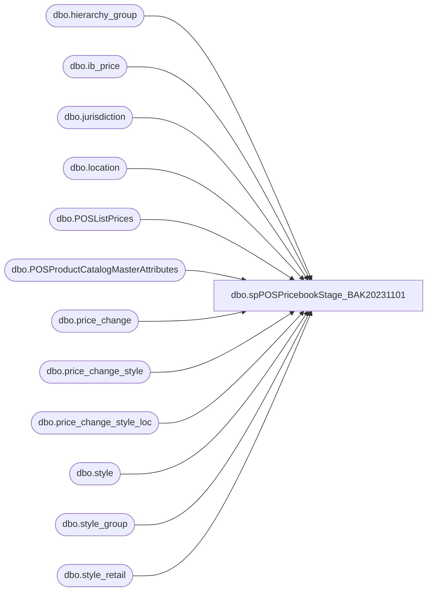

# dbo.spPOSPricebookStage_BAK20231101

**Database:** me_01  
**Server:** bedrockdb02  

## Architecture Diagram



## Table Dependencies

| Referenced Table |
|---|
| dbo.hierarchy_group |
| dbo.ib_price |
| dbo.jurisdiction |
| dbo.location |
| dbo.POSListPrices |
| dbo.POSProductCatalogMasterAttributes |
| dbo.price_change |
| dbo.price_change_style |
| dbo.price_change_style_loc |
| dbo.style |
| dbo.style_group |
| dbo.style_retail |

## Stored Procedure Code

```sql
CREATE proc [dbo].[spPOSPricebookStage_BAK20231101]

as 


--------------------------------------------------------------------------------------------------
-- 2023-01-04 - Created Proc to Pull US, CA, UK prices for Jump Mind POS 
				-- Proc is based on spWEBPricebookStage, but altered
-- 2023-07-17 - Added additional filter to Temp Markdown Chunk - Tim C
--------------------------------------------------------------------------------------------------
set nocount on

declare 
@BryceDate date 


declare @UKHourAdd int
select @UKHourAdd = 18 

select @BryceDate = cast(getdate() as date)

declare 
	@RunDate datetime

select @RunDate = cast((cast(@BryceDate as varchar) + ' ' + convert(varchar, getdate(), 114)) as datetime)

		if (object_id('tempdb..#Locationz') is not null) drop table #Locationz
		select l.location_id, l.location_code, j.jurisdiction_id, case when jurisdiction_code='home' then 'US' else Jurisdiction_code end as JurisdictionCode
		into #Locationz
		from location l
		join jurisdiction j on l.jurisdiction_id=j.jurisdiction_id
		where l.location_code between '0001' and '3000'

		
		if (object_id('tempdb..#Styles') is not null) drop table #Styles
		select style_code, ProductSellingGeography
		into #Styles
		from POSProductCatalogMasterAttributes
		group by style_code, ProductSellingGeography


		if (object_id('tempdb..#Prices') is not null) drop table #Prices
		SELECT 
			sc.style_code, 
			SUBSTRING(hg.hierarchy_group_code,1,5) AS GroupCode,

			UK.current_selling_retail AS UK_ListPrice,
			US.current_selling_retail AS US_ListPrice,
			CA.current_selling_retail as CA_ListPrice,
			IE.current_selling_retail as IE_ListPrice,
			case when UK.current_selling_retail <> UK.original_selling_retail  -- Changed from < to <> on 7/6/22
				then UK.current_selling_retail 
				else NULL 
			end as UK_SalePrice,
			case when US.current_selling_retail <> US.original_selling_retail -- Changed from < to <> on 7/6/22
				then US.current_selling_retail 
				else NULL
			end as US_SalePrice,
			case when CA.current_selling_retail <> CA.original_selling_retail -- Changed from < to <> on 7/6/22
				then CA.current_selling_retail 
				else NULL
			end as CA_SalePrice,
			case when IE.current_selling_retail <> IE.original_selling_retail -- Changed from < to <> on 7/6/22
				then IE.current_selling_retail 
				else NULL
			end as IE_SalePrice
		into #Prices
		FROM style sc (NOLOCK) 
		join style_group sg (NOLOCK) ON sc.style_id=sg.style_id
		join hierarchy_group hg (NOLOCK)ON sg.hierarchy_group_id=hg.hierarchy_group_id
		join style_retail US (NOLOCK) ON sc.style_id=US.style_id
		join style_retail UK (NOLOCK) ON sc.style_id=UK.style_id
		join style_retail CA (nolock) on sc.style_id=CA.style_id 
		join style_retail IE (nolock) on sc.style_id=IE.style_id 
		WHERE sc.active_flag=1 
		and US.jurisdiction_id = 1 --US
		AND UK.jurisdiction_id = 2 --UK
		and CA.jurisdiction_id =3 --CA
		and IE.jurisdiction_id=5 --IE
		and US.original_selling_retail is not null
		and UK.original_selling_retail is not null
		and CA.original_selling_retail is not null 
		and IE.original_selling_retail is not null
		and exists (select vw.style_code from #Styles vw where vw.style_code = sc.style_code)
		--and UK.current_selling_retail<>0
		--and US.current_selling_retail<>0
		--and CA.current_selling_retail<>0
		--and IE.current_selling_retail<>0


		if (object_id('tempdb..#ListPrices') is not null) drop table #ListPrices
		select DISTINCT 
			style_code,
			GroupCode,
			CASE 
				WHEN GroupCode = 'R-B-C' or (GroupCode in ('R-B-Z','W-C-J','W-C-K','W-C-M','W-C-N','W-D-J','W-D-K','W-D-M','W-D-N','W-E-J','W-E-K','W-E-M','W-E-N','W-F-J','W-F-K','W-F-M','W-F-N') and style_code between 100000 and 199999)
					THEN CA_ListPrice
				WHEN GroupCode = 'R-B-U' or (GroupCode in ('R-B-Z','W-C-J','W-C-K','W-C-M','W-C-N','W-D-J','W-D-K','W-D-M','W-D-N','W-E-J','W-E-K','W-E-M','W-E-N','W-F-J','W-F-K','W-F-M','W-F-N') and style_code between 400000 and 699999)
					THEN UK_ListPrice
				ELSE US_ListPrice
			END AS ListPrice,
			CASE 
				WHEN GroupCode = 'R-B-C' or (GroupCode in ('R-B-Z','W-C-J','W-C-K','W-C-M','W-C-N','W-D-J','W-D-K','W-D-M','W-D-N','W-E-J','W-E-K','W-E-M','W-E-N','W-F-J','W-F-K','W-F-M','W-F-N') and style_code between 100000 and 199999)
					THEN CA_SalePrice
				WHEN GroupCode = 'R-B-U' or (GroupCode in ('R-B-Z','W-C-J','W-C-K','W-C-M','W-C-N','W-D-J','W-D-K','W-D-M','W-D-N','W-E-J','W-E-K','W-E-M','W-E-N','W-F-J','W-F-K','W-F-M','W-F-N') and style_code between 400000 and 699999)
					THEN UK_SalePrice
				ELSE US_SalePrice
			END AS SalePrice,
			CASE 
				WHEN GroupCode = 'R-B-C' or (GroupCode in ('R-B-Z','W-C-J','W-C-K','W-C-M','W-C-N','W-D-J','W-D-K','W-D-M','W-D-N','W-E-J','W-E-K','W-E-M','W-E-N','W-F-J','W-F-K','W-F-M','W-F-N') and style_code between 100000 and 199999)
					THEN 3 --CA
				WHEN GroupCode = 'R-B-U' or (GroupCode in ('R-B-Z','W-C-J','W-C-K','W-C-M','W-C-N','W-D-J','W-D-K','W-D-M','W-D-N','W-E-J','W-E-K','W-E-M','W-E-N','W-F-J','W-F-K','W-F-M','W-F-N') and style_code between 400000 and 699999)
					THEN 2 --UK
				ELSE 1 --US
			END AS JurisdictionId	
		into #ListPrices
		FROM #Prices 
		UNION
		select DISTINCT 
			style_code,
			GroupCode,
			IE_ListPrice AS ListPrice,
			IE_SalePrice AS SalePrice,
			5 as JurisdictionId	
		FROM #Prices 
		where (GroupCode = 'R-B-U' or (GroupCode in ('R-B-Z','W-C-J','W-C-K','W-C-M','W-C-N','W-D-J','W-D-K','W-D-M','W-D-N','W-E-J','W-E-K','W-E-M','W-E-N','W-F-J','W-F-K','W-F-M','W-F-N') and style_code between 400000 and 699999))
		and (IE_ListPrice is not NULL or IE_SalePrice is not NULL)	
	
		
             	if (object_id('tempdb..#TemporaryMarkDowns') is not null) drop table #TemporaryMarkDowns
				select  
                    	j.jurisdiction_code,
					cast(s.style_code as varchar(6)) as style_code,
                    	ip.selling_retail_price as TemporaryMarkdownPrice,
                    	ip.document_number
            
				into #TemporaryMarkDowns
				from ib_price ip (NOLOCK) 
             	join style s (NOLOCK) on ip.style_id = s.style_id
             	join jurisdiction j (NOLOCK) on ip.jurisdiction_id = j.jurisdiction_id  
             	--join MaxPriceID mp on ip.ib_price_id = mp.ib_price_id
             	where 1=1
             	and left(s.style_code,1) + cast(j.jurisdiction_ID as char(1)) in ('01','21','31','13','42','45','47','88') -- not sure about this??
             	and ip.end_date is not null
             	and j.jurisdiction_code in ('UK', 'HOME','CA', 'IE')
				and cast(getdate() as date) between cast(ip.start_date as date) and cast(ip.end_date as date)
				and ip.location_id is null --might need to remove this filter, if so will need another table with this filter and then use that for the merge at the end
				and ip.cancel_promo_flag = 0 -- Tim C Added This Filter 7/17/2023
				group by 
				cast(s.style_code as varchar(6)),
                    	ip.selling_retail_price,
                    	ip.document_number,
					j.jurisdiction_code 

		if (object_id('tempdb..#SalePrices') is not null) drop table #SalePrices
		SELECT 
			l.location_code,
			l.jurisdiction_id,
			s.style_code,
			s.style_id AS StyleId,
			ISNULL(locations.new_price,styles.new_price) AS SalePrice,
			pricechange.price_change_no AS ChangeNumber,
			pricechange.price_change_description AS Details,
			pricechange.create_date AS CreateDate,
			pricechange.effective_from_date AS EffectiveFrom,
			pricechange.effective_to_date AS EffectiveTo,
			pricechange.jurisdiction_id AS JurisdictionId
		into #SalePrices
		FROM style s with (NOLOCK)
		join price_change_style styles (NOLOCK) ON styles.style_id = s.style_id
		join price_change pricechange (NOLOCK) ON styles.price_change_id = pricechange.price_change_id
		join #styles ss on s.style_code = ss.style_code
		join price_change_style_loc locations (NOLOCK)
			on locations.location_id not in ('167','78') -- 167 US, corresponds to 0013 / 78 UK, corresponds to 2013
			AND locations.price_change_id = pricechange.price_change_id
    		AND styles.price_change_style_id = locations.price_change_style_id 
		join #locationz l on locations.location_id=l.location_id
		WHERE 1=1
		 ---NEW CODE 2018-02-23 TO EXCLUDE NULL SalePrice
		and ISNULL(locations.new_price,styles.new_price) is NOT NULL 
		and pricechange.approval_status = 2
			and	pricechange.price_change_status <> 5
			AND pricechange.jurisdiction_id IN (1,2,3)
			AND	pricechange.price_change_id NOT IN ('1388','2136','2396','2865','2884','2912','3078','3080','3099','3115','3122','3117','3119','3111','3112','3113','3114','3141','3143','3163','3283','3284','3285','3314','3374','3375','3376','3394','3396','3526','3528','3533','3535','3552','3629','3630','3632','3550','3761','3764','3767','3769','3772','3774','3781','3789','3791')
		and 
			(
					(
						ss.ProductSellingGeography in ('US','CA') 
						and 
						isnull(cast(pricechange.effective_from_date as date), '3030-12-31') 
							<= 
								case when datepart(hh, getdate()) >= 23 -- Temp change to 17 from 23
									then cast(dateadd(hh, +12, getdate()) as date)--cast(getdate() as date)	
									else cast(@BryceDate as date)
								end
						and
						isnull(cast(pricechange.effective_to_date as date), '3030-12-31') 
							>= 
								case when datepart(hh, getdate()) >= 23 -- Temp change to 17 from 23
									then cast(dateadd(hh, +12, getdate()) as date)--cast(getdate() as date)
									else cast(@BryceDate as date)
								end
					)	
				OR
					(
						ss.ProductSellingGeography ='UK' 
						and	 
						isnull(cast(pricechange.effective_from_date as date), '3030-12-31') <= cast(dateadd(hh, +@UKHourAdd, getdate()) as date)	--if the job runs any time past noon BQ time, it should catch the UK's price changes that take effect at midnight BQ time
						and																												
						isnull(cast(pricechange.effective_to_date as date), '3030-12-31') >= cast(dateadd(hh, +@UKHourAdd, getdate()) as date)
					)
			)
		and cast(pricechange.price_change_no as int) <> 5470 --added per Bryce's request
		and not exists 
					(
						select t.style_code,t.document_number
						from #TemporaryMarkDowns t
						where 
							t.style_code = s.style_code
							and t.document_number = pricechange.price_change_no 
							and l.JurisdictionCode=t.jurisdiction_code
						group by t.style_code,t.document_number
					)

		if (object_id('tempdb..#MaxChange') is not null) drop table #MaxChange
		select jurisdiction_id, location_code, style_code, max(ChangeNumber) MaxChange
		into #MaxChange
		from #SalePrices
		group by style_code,location_code,jurisdiction_id

		if (object_id('tempdb..#SalePrice') is not null) drop table #SalePrice
		select np.location_code, np.style_code, np.SalePrice, np.jurisdiction_id
		into #SalePrice
		from #SalePrices np
		join #MaxChange mc on np.style_code = mc.style_code and np.ChangeNumber = mc.MaxChange and np.location_code=mc.location_code and np.jurisdiction_id=mc.jurisdiction_id


IF (Object_ID('me_01..POSListPrices') IS NOT null) DROP TABLE POSListPrices
select 
	case 
		when Jurisdictionid=1 then 'US'
		when Jurisdictionid=2 then 'UK'
		when Jurisdictionid=3 then 'CA'
		when Jurisdictionid=5 then 'IE'
	end as Jurisdiction,
	style_code, 
	ListPrice
into POSListPrices
from #ListPrices 
where ListPrice is not null


IF (Object_ID('me_01..POSSalePrices') IS NOT null) DROP TABLE POSSalePrices
select 
	s.location_code,
	s.style_code,
	case --takes promo price first, then defaults to current_selling_retail
		when isnull(s.SalePrice,l.SalePrice) <> l.ListPrice -- Changed from < to <> on 7/06/22
			then isnull(s.SalePrice,l.SalePrice)
			else NULL
	end as SalePrice
into POSSalePrices
from #SalePrice s
join #ListPrices l 
	on s.style_code=l.style_code
	and s.jurisdiction_id=l.jurisdictionid ---List prices are per jurisdiction, sale prices are per location
where 
	case --takes promo price first, then defaults to current_selling_retail
		when isnull(s.SalePrice,l.SalePrice) <> l.ListPrice -- Changed from < to <> on 7/06/22
			then isnull(s.SalePrice,l.SalePrice)
			else NULL
	end is not null


IF (Object_ID('tempdb..#MarkDownStage') IS NOT null) DROP TABLE #MarkDownStage;
with MaxDoc as
(
	select Jurisdiction_code, style_code, max(document_number) MaxDoc
	from #TemporaryMarkdowns
	group by Jurisdiction_code, style_code
)
select 
	case when tm.jurisdiction_code ='home' then 'US' else tm.jurisdiction_code end as jurisdiction_code,
	tm.style_code,
	tm.TemporaryMarkDownPrice
into #MarkDownStage
from #TemporaryMarkdowns tm
join MaxDoc md 
	on tm.jurisdiction_code=md.jurisdiction_code
	and tm.style_code=md.style_code
	and tm.document_number=md.MaxDoc
group by 
	tm.jurisdiction_code,
	tm.style_code,
	tm.TemporaryMarkDownPrice

;
merge into POSListPrices as target
using #MarkDownStage as source
on 
	target.Jurisdiction=source.jurisdiction_code
	and 
	target.style_code=source.style_code
when matched
	then update
		set target.ListPrice=source.TemporaryMarkDownPrice
when not matched by target
	then insert
		(Jurisdiction, style_code, ListPrice)
	values
		(
			source.jurisdiction_code,
			source.style_code,
			source.TemporaryMarkDownPrice
		)
;

--select *
--from POSListPrices
--where style_code in ('029859','030150')

--select *
--from POSSalePrices 
--where style_code in ('029859','030150')

--select * from POSListPrices order by jurisdiction, style_code
--Select * from POSSalePrices order by style_code, location_code
--select * from #MarkDownStage order by jurisdiction_code, style_code

--select 
--	Jurisdiction,
--	style_code,
--	ListPrice
--from POSListPrices
--group by 
--	Jurisdiction,
--	style_code,
--	ListPrice
--having count(*) >1

--select
--	jurisdiction_code,
--	style_code,
--	TemporaryMarkDownPrice
--from #MarkDownStage
--group by 
--	jurisdiction_code,
--	style_code,
--	TemporaryMarkDownPrice
--having count(*) >1


--select *
--from ib_price
--where document_number='0003182'
--and style_id=42648

--select *
--from style
--where style_code='021294'
```

