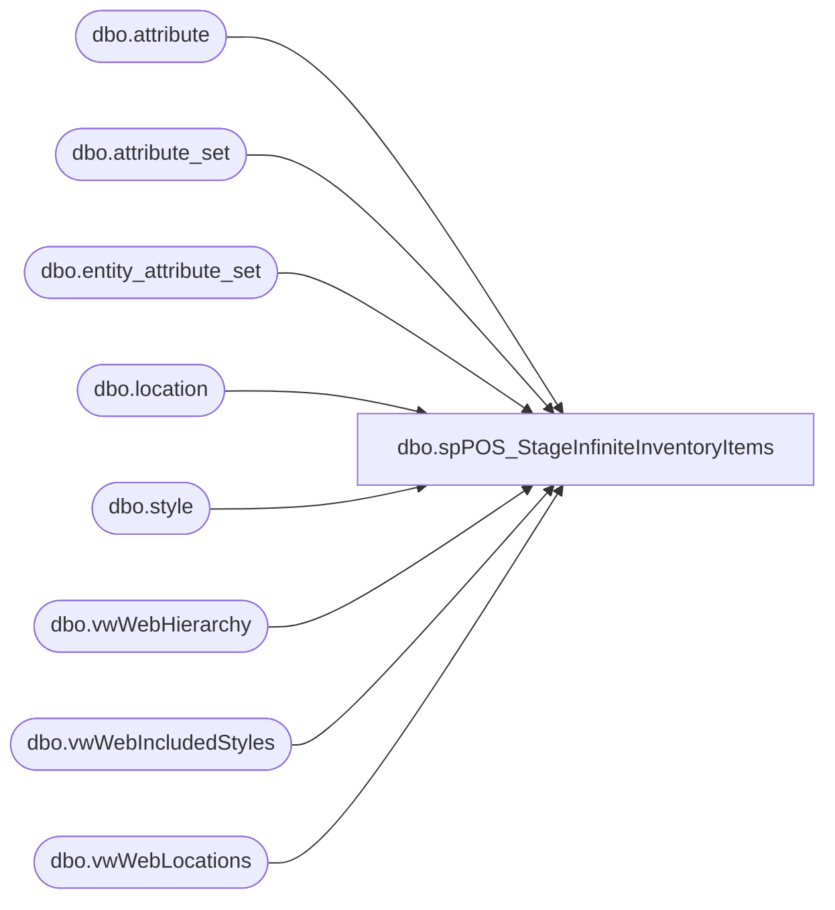

# dbo.spPOS_StageInfiniteInventoryItems

**Database:** me_01  
**Server:** bedrockdb02  

## Architecture Diagram



## Table Dependencies

| Referenced Table |
|---|
| dbo.attribute |
| dbo.attribute_set |
| dbo.entity_attribute_set |
| dbo.location |
| dbo.style |
| dbo.vwWebHierarchy |
| dbo.vwWebIncludedStyles |
| dbo.vwWebLocations |

## Stored Procedure Code

```sql
CREATE proc [dbo].[spPOS_StageInfiniteInventoryItems]

as 

set nocount on

IF (Object_ID('tempdb..#Locations') IS NOT null) DROP TABLE #Locations;
With InfiniteExclude as
	(
		select l.location_code
		from location l
		join entity_attribute_set eas with (nolock) on eas.parent_id = l.location_id
		join attribute_set ats with (nolock) on eas.attribute_set_id = ats.attribute_set_id
		join attribute a with (nolock) on ats.attribute_id = a.attribute_id --and a.parent_type = 1 
		where a.attribute_code='SNDSTN'
		and ats.attribute_set_code='ANA'
	)
select
	l.Code as LocationCode,
	l.SiteID as SellingGeography,
	case when sst.location_code is not null then 1 else 0 end as InfiniteExclude
into #Locations
from vwWebLocations l
left join InfiniteExclude sst on l.Code=sst.location_code
where l.Code not in ('0013', '2013')


IF (Object_ID('tempdb..#Styles') IS NOT null) DROP TABLE #styles
select 
	s.style_code StyleCode,
	cast(s.SKUDescription as varchar(120)) as SKUDescription,
	cast(s.UPC as varchar(20)) as UPC, 
	case 
		when h.SubClassCode in 
			(
				'W-C-K-12-01-07',
				'W-D-K-12-01-07',
				'W-E-K-12-01-07',
				'W-F-K-12-01-07'
			) then 'DigitalBlanks'
		when h.SubClassCode in 
			(
				'R-B-D-80-02-00',
				'R-B-U-80-02-00'
			) then 'VirtualGiftCards' 
		when h.DepartmentCode in 
			(
				'R-B-D-46',
				'R-B-U-46'
			) then 'Donations'
		when h.DepartmentCode in 
			(
				'R-B-D-65'
			) then 'Embroidery'
		else 'PhysicalProduct'
	end as ProductType,
	s.SellingGeography
into #styles
from me_01.dbo.vwWebIncludedStyles s
join me_01.dbo.vwWebHierarchy h on s.hierarchy_group_id = h.SubClassHierarchyGroupID
where s.StorefrontEligible = 1


IF (Object_ID('tempdb..#StyleLocation') IS NOT null) DROP TABLE #StyleLocation
select DISTINCT 
	s.StyleCode,
	s.SKUDescription,
	s.UPC,
	s.ProductType,
	l.LocationCode,
	s.SellingGeography,
	l.InfiniteExclude
into #StyleLocation
from #Styles s
cross join #Locations l 
where s.SellingGeography = l.SellingGeography


IF (Object_ID('tempdb..#Stage') IS NOT null) DROP TABLE #Stage;
with
InfiniteInventory as 
	(
		select s.style_code as StyleCode--, ats.attribute_set_code, ats.attribute_set_label
		from  me_01.dbo.attribute a
		join me_01.dbo.entity_attribute_set eas on a.attribute_id = eas.attribute_id 
		join me_01.dbo.attribute_set ats 
			on a.attribute_id = ats.attribute_id 
			and eas.attribute_set_id = ats.attribute_set_id 
			and ats.active_flag = 1
		join me_01.dbo.style s on eas.parent_id = s.style_id 
		where a.attribute_code = 'WEBINV' and ats.attribute_set_label = 'INFINITE INVENTORY'
		--UNION
		--select StyleCode 
		--from #StyleLocation 
		--where ProductType in ('DigitalBlanks', 'VirtualGiftCards', 'Donations', 'Embroidery') 
		--and SellingGeography in ('US', 'UK')
	)

select 
	sl.StyleCode,
	sl.SKUDescription,
	sl.UPC,
	sl.LocationCode,
	sl.ProductType,
	case 
		when 
			(				
				sl.ProductType in ('VirtualGiftCards')--, 'Donations', 'Embroidery') 
				or
				(sl.ProductType in ('DigitalBlanks') and sl.InfiniteExclude=0)
				or
				sl.StyleCode='030484'
			)
			and (
					(
						--sl.LocationCode in ('0013') and 
						sl.SellingGeography = 'US'
					)
					OR
					(
						--sl.LocationCode in ('2013') and 
						sl.SellingGeography = 'UK'
					)
				)
			then 99999
		when 
			sl.ProductType in ('DigitalBlanks')
			and sl.InfiniteExclude=1 
			and sl.StyleCode<>'030484'
			then 0
		when (
				sl.StyleCode in (select StyleCode from InfiniteInventory) 
				and NOT (sl.ProductType in ('DigitalBlanks') and sl.InfiniteExclude=1) 
			)
			OR sl.StyleCode='030484'
			then 99999
		--else cast(sum(isnull(i.Qty,0)) as int) 
		else NULL -- will get inventory from our other process
	end as QTY,
	sl.SellingGeography
into #Stage
from #StyleLocation sl
group by 
	sl.StyleCode,
	sl.SKUDescription,
	sl.UPC,
	sl.LocationCode,
	sl.ProductType,
	sl.SellingGeography,
	sl.InfiniteExclude


IF (Object_ID('me_01..POS_InfiniteInventoryStage') IS NOT null) DROP TABLE POS_InfiniteInventoryStage;
select DISTINCT 
	s.StyleCode, 
	s.UPC,
	s.LocationCode, 
	QTY,
	s.SellingGeography
into POS_InfiniteInventoryStage
from #Stage s
where Qty=99999


-----------------------------------------
```

