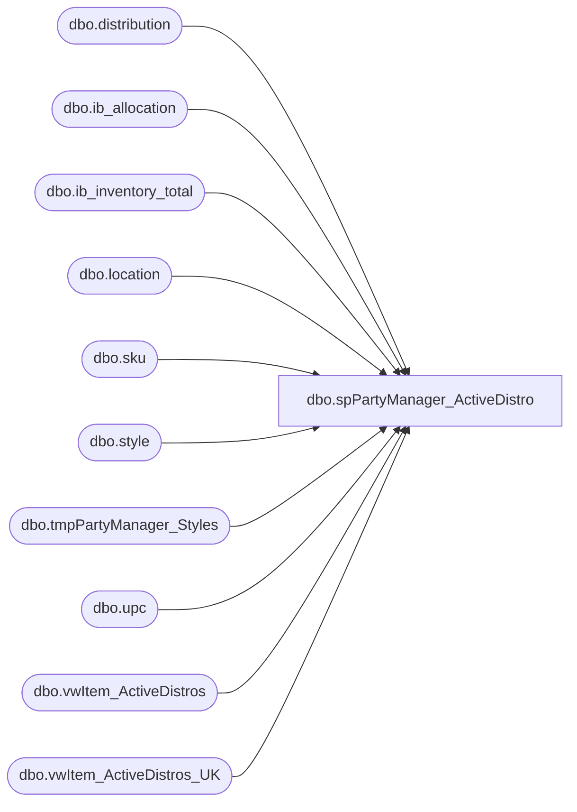

# dbo.spPartyManager_ActiveDistro

**Database:** me_01  
**Server:** bedrockdb02  

## Architecture Diagram



## Table Dependencies

| Referenced Table |
|---|
| dbo.distribution |
| dbo.ib_allocation |
| dbo.ib_inventory_total |
| dbo.location |
| dbo.sku |
| dbo.style |
| dbo.tmpPartyManager_Styles |
| dbo.upc |
| dbo.vwItem_ActiveDistros |
| dbo.vwItem_ActiveDistros_UK |

## Stored Procedure Code

```sql
CREATE proc [dbo].[spPartyManager_ActiveDistro]
AS
-- =============================================================================================================
-- Name: spPartyManager_ActiveDistro
--
-- Description:	This is the source for the Active Styles, with quanity on hand and available to distribute numbers.
--		Population of bedrockdb02.me_01.dbo.tmpPartyManager_Styles working table. This is called from Party Manager ETL.dtsx
-- 
--
-- Output: list of Active Styles with quantities
-- 
-- Available actions:
--
--
-- Dependencies: 
--	kodiak.BearData.dbo.ActiveDistroItems
--	me_01.dbo.tmpPartyManager_Styles
--	me_01.dbo.sku
--	me_01.dbo.ib_inventory_total 
--	me_01.dbo.location  
--	me_01.dbo.ib_allocation 
--	me_01.dbo.distribution
--
-----------------------------------------------------------------------------------------------
--
-- Revision History
--		Name:			Date:			Comments:
--		Mike Pelikan	02/12/2013		Created 
--		Mike Pelikan	07/01/2013		Modified logic to populate working table
--		Mike Pelikan	01/27/2015		Modified to use the local view, instead of the table built off 
--											of the same views.
--		Ben Barud		07/25/2018		Added UK product to #ActiveDistro
--	
DECLARE @Revision DATETIME
SET @Revision = '07/25/2018'
									
/*

*/
-- =============================================================================================================
SET NOCOUNT ON
--vwItem_ActiveDistros
IF OBJECT_ID('tempdb..#ActiveDistro') IS NOT NULL DROP TABLE #ActiveDistro 
IF OBJECT_ID('tempdb..#working') IS NOT NULL DROP TABLE #working;

WITH ActiveDistro
AS
(
	SELECT *
	FROM vwItem_ActiveDistros
	WHERE DeptCode like 'W%' OR DeptCode = 'R-B-D-80' OR DeptCode = 'R-B-D-75'
	UNION
	SELECT *
	FROM vwItem_ActiveDistros_UK
	WHERE DeptCode like 'W%'
)
SELECT *
INTO #ActiveDistro 
FROM ActiveDistro

 --kodiak.BearData.dbo.ActiveDistroItems order by Style
CREATE INDEX idx_tmpStyleNo on #ActiveDistro (Style)

select --l.location_code,
st.style_code , 
1 active_flag, s.Description short_desc, s.DeptCode hierarchy_group_code, 
          isnull(iit.total_on_hand_units, 0) total_on_hand_units,
          sum(isnull(ia.allocated_units,0)) allocated,
          (iit.total_on_hand_units - sum(isnull(ia.allocated_units,0))) available_to_distribute
INTO #working
FROM #ActiveDistro s
inner join upc u (nolock) on u.upc_number = s.style
INNER join sku (nolock) on u.sku_id = sku.sku_id
INNER JOIN style st (nolock) on st.style_id = sku.style_id
left join ib_inventory_total iit (nolock) on sku.sku_id = iit.sku_id and iit.inventory_status_id =1 
left join location l (nolock) on iit.location_id = l.location_id
left join ib_allocation ia with (nolock) on sku.sku_id = ia.sku_id
left join distribution d with (nolock) on ia.allocation_number = d.distribution_number and l.location_id = d.location_id
WHERE l.location_code in ('0980','0960', '2970')
group by --l.location_code, 
st.style_code, s.Description, s.DeptCode, iit.total_on_hand_units

TRUNCATE TABLE tmpPartyManager_Styles

INSERT INTO tmpPartyManager_Styles
SELECT DISTINCT * 
FROM (
	SELECT style_code StyleCode, active_flag, LEFT(ISNULL(short_desc, ''), 75) short_desc, hierarchy_group_code, 
		SUM(total_on_hand_units) total_on_hand_units, SUM(allocated) allocated, 
		SUM(available_to_distribute) available_to_distribute 
	FROM 
	(
		SELECT style_code, 
		active_flag, short_desc, hierarchy_group_code, 
		total_on_hand_units, allocated, available_to_distribute
		FROM #working
	UNION 
		SELECT style_code, 
		1 active_flag, Description short_desc, DeptCode hierarchy_group_code, 
		0 total_on_hand_units,
		0 allocated,
		0 available_to_distribute
		FROM #ActiveDistro s
		inner join upc u (nolock) on u.upc_number = s.style
		INNER join sku (nolock) on u.sku_id = sku.sku_id
		INNER JOIN style st (nolock) on st.style_id = sku.style_id

	)qry 
	GROUP BY style_code, active_flag, LEFT(ISNULL(short_desc, ''), 75), hierarchy_group_code
) qry
ORDER BY 1
```

