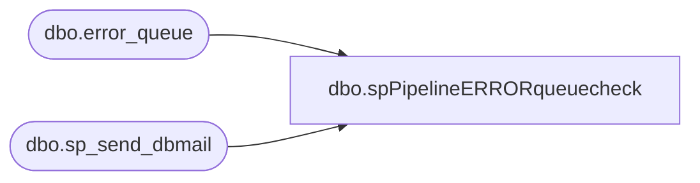

# dbo.spPipelineERRORqueuecheck

**Database:** me_01  
**Server:** bedrockdb02  

## Architecture Diagram



## Table Dependencies

| Referenced Table |
|---|
| dbo.error_queue |
| dbo.sp_send_dbmail |

## Stored Procedure Code

```sql
CREATE proc [dbo].[spPipelineERRORqueuecheck]

-- =====================================================================================================
-- Name: spPipelineERRORqueuecheck
--
-- Description:	Sends Email and Text alert if Pipeline Errors exits for segments 1005, 3100, 5105, 5100, 5100, 5101, 5102, 5103, 5104, 5006, 5010
--
-- Input:	
--
-- Output: Alert is emailed
--
-- Dependencies: na
--				 
-- Revision History
--		Name:			Date:			Comments:
--		Justin Cross		03/05/2024		Created proc.	

-- =====================================================================================================
as
BEGIN
SET NOCOUNT ON
DECLARE @recip VARCHAR(1000), 
        @prof VARCHAR(1000),
		@subj VARCHAR(1000), 
		@text VARCHAR(8000)
 
SET @recip = 'enterprisesystemsalerts@buildabear.com; Justincr@buildabear.com'
SET @subj = 'ALERT Pipeline Segment ERROR'
SET @prof = 'Merchadmin'

IF exists(
SELECT 
[segment_id],
[sequence_id],
[entity_code],
[entity_key],
[action],
[error],
[resubmit_flag],
[resubmit_count]
FROM pipeapp01.PipelineRepository.dbo.error_queue

WHERE segment_id IN (1005, 3100, 5105, 5100, 5100, 5101, 5102, 5103, 5104, 5006, 5010)
)
BEGIN
    SET @text = '<html><p style="font-family: Arial; font-size: 1em; margin: 0% 3%;"> One or More pipeline sales posting segmetns have Failed/Error please check Error Queue.
	Info regarding this alert can be found here https://build-a-bear.atlassian.net/wiki/spaces/ES/pages/3023405102/ALERT+Failed+Pipeline+Segments+WIP' +
    '</p><br/>' +
    '<p style="font-family: Arial; font-size: .6em; margin: 0% 3%;">This email has been generated from [BEDROCKDB02].[me_01].[dbo].[PipelineERRORqueuecheck]' +
    '</p>' +
    '</html>'
    EXEC msdb.dbo.sp_send_dbmail
        @profile_name = @prof,
	    @recipients = @recip,
        @body = @text,
        @subject = @subj,
        @body_format = 'HTML'
END
END
```

