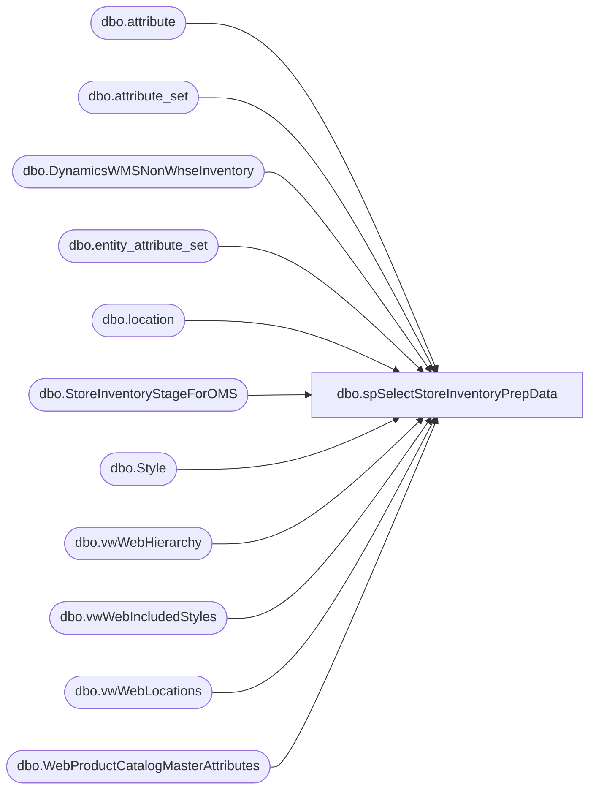

# dbo.spSelectStoreInventoryPrepData

**Database:** me_01  
**Server:** bedrockdb02  

## Architecture Diagram



## Table Dependencies

| Referenced Table |
|---|
| dbo.attribute |
| dbo.attribute_set |
| dbo.DynamicsWMSNonWhseInventory |
| dbo.entity_attribute_set |
| dbo.location |
| dbo.StoreInventoryStageForOMS |
| dbo.Style |
| dbo.vwWebHierarchy |
| dbo.vwWebIncludedStyles |
| dbo.vwWebLocations |
| dbo.WebProductCatalogMasterAttributes |

## Stored Procedure Code

```sql
CREATE proc [dbo].[spSelectStoreInventoryPrepData]

as 

--------------------------------------------------------------------------------------------------
--Dan Tweedie	2020-04-09	Created proc for to push ES store inventory to DECK OMS for select stores for Buy Online / Ship from Store
--Dan Tweedie	2020-08-05	Updated to add exclusion to not send 'infinite' for digital sounds at locations with ANA attribute
--------------------------------------------------------------------------------------------------
set nocount on

truncate table StoreInventoryStageForOMS

IF (Object_ID('tempdb..#Locations') IS NOT null) DROP TABLE #Locations;
With InfiniteExclude as
	(
		select l.location_code
		from me_01.dbo.location l
		join me_01.dbo.entity_attribute_set eas with (nolock) on eas.parent_id = l.location_id
		join me_01.dbo.attribute_set ats with (nolock) on eas.attribute_set_id = ats.attribute_set_id
		join me_01.dbo.attribute a with (nolock) on ats.attribute_id = a.attribute_id --and a.parent_type = 1 
		where a.attribute_code='SNDSTN'
		and ats.attribute_set_code='ANA'
	)
select
	l.Code as LocationCode,
	l.SiteID as SellingGeography,
	case when sst.location_code is not null then 1 else 0 end as InfiniteExclude
into #Locations
from me_01.dbo.vwWebLocations l
left join InfiniteExclude sst on l.Code=sst.location_code
where l.Code not in ('0013', '2013')


IF (Object_ID('tempdb..#Styles') IS NOT null) DROP TABLE #styles
select 
	s.style_code StyleCode,
	cast(s.SKUDescription as varchar(120)) as SKUDescription,
	cast(s.UPC as varchar(20)) as UPC, 
	case 
		when h.SubClassCode in 
			(
				'W-C-K-12-01-07',
				'W-D-K-12-01-07',
				'W-E-K-12-01-07',
				'W-F-K-12-01-07'
			) then 'DigitalBlanks'
		when h.SubClassCode in 
			(
				'R-B-D-80-02-00',
				'R-B-U-80-02-00'
			) then 'VirtualGiftCards' 
		when h.DepartmentCode in 
			(
				'R-B-D-46',
				'R-B-U-46'
			) then 'Donations'
		when h.DepartmentCode in 
			(
				'R-B-D-65'
			) then 'Embroidery'
		else 'PhysicalProduct'
	end as ProductType,
	s.SellingGeography
into #styles
from me_01.dbo.vwWebIncludedStyles s
join me_01.dbo.vwWebHierarchy h on s.hierarchy_group_id = h.SubClassHierarchyGroupID
where s.StorefrontEligible = 1


IF (Object_ID('tempdb..#StyleLocation') IS NOT null) DROP TABLE #StyleLocation
select DISTINCT 
	s.StyleCode,
	s.SKUDescription,
	s.UPC,
	s.ProductType,
	l.LocationCode,
	s.SellingGeography,
	l.InfiniteExclude
into #StyleLocation
from #Styles s
cross join #Locations l 
where s.SellingGeography = l.SellingGeography


--stages US style numbers of CA style codes that meet criteria:
	--NOT Inactive
	--OWNRSHP attribute = CAN
	--Does NOT have MSTAT attribute with QC NO or LIC NO
IF (Object_ID('tempdb..#CA_OWNRSP') IS NOT null) DROP TABLE #CA_OWNRSP
select distinct 
	concat('0', right(cast(a.StyleCode as varchar(6)),5)) as StyleCode
into #CA_OWNRSP
from 
	(
		SELECT distinct
					s.style_code as StyleCode
		FROM me_01.dbo.Style s 
		join me_01.dbo.entity_attribute_set eas with (nolock) on eas.parent_id = s.style_id
		join me_01.dbo.attribute_set ats with (nolock) on eas.attribute_set_id = ats.attribute_set_id
		join me_01.dbo.attribute a with (nolock) on ats.attribute_id = a.attribute_id and a.parent_type = 1
		where a.attribute_code = 'OWNRSP'
		and ats.attribute_set_code in ('CAN')
		and s.active_flag = 1 
		except 
		SELECT distinct
					concat('0', right(cast(s.style_code as varchar(6)),5)) as StyleCode
		FROM me_01.dbo.Style s 
		join me_01.dbo.entity_attribute_set eas with (nolock) on eas.parent_id = s.style_id
		join me_01.dbo.attribute_set ats with (nolock) on eas.attribute_set_id = ats.attribute_set_id
		join me_01.dbo.attribute a with (nolock) on ats.attribute_id = a.attribute_id and a.parent_type = 1
		where a.attribute_code = 'MSTAT'
		and ats.attribute_set_code in ('QC NO','LIC NO')
	) a
join me_01.dbo.WebProductCatalogMasterAttributes w 
	on concat('0', right(cast(a.StyleCode as varchar(6)),5)) = w.BABWProductID 
	and w.StorefrontEligible = 1

--get inventory from Dynamics (this table is staged hourly via WMS_InventorySync SSIS
IF (Object_ID('tempdb..#Inventory') IS NOT null) DROP TABLE #Inventory
select 
	LocationCode,
	case
		when left(StyleCode,1)='1'
			then concat('0', right(StyleCode,5))
		else StyleCode
	end as StyleCode,
	sum(Qty) Qty
into #Inventory
--from DynamicsWMSNonWhseInventoryStage 
from DynamicsWMSNonWhseInventory with(nolock) -- changed from staging table to resolve issue of this process running while th staging table is truncated; LT 05/28/25
WHERE ISNULL(UpdateDate,InsertDate) > DATEADD(year,-1,getdate()) -- added filter to cut back the really old records that were slowing down the job; LT 05/28/25
group by 
	LocationCode,
	case
		when left(StyleCode,1)='1'
			then concat('0', right(StyleCode,5))
		else StyleCode
	end


IF (Object_ID('tempdb..#Stage') IS NOT null) DROP TABLE #Stage;
with
InfiniteInventory as 
	(
		select s.style_code as StyleCode--, ats.attribute_set_code, ats.attribute_set_label
		from  me_01.dbo.attribute a
		join me_01.dbo.entity_attribute_set eas on a.attribute_id = eas.attribute_id 
		join me_01.dbo.attribute_set ats 
			on a.attribute_id = ats.attribute_id 
			and eas.attribute_set_id = ats.attribute_set_id 
			and ats.active_flag = 1
		join me_01.dbo.style s on eas.parent_id = s.style_id 
		where a.attribute_code = 'WEBINV' and ats.attribute_set_label = 'INFINITE INVENTORY'
		--UNION
		--select StyleCode 
		--from #StyleLocation 
		--where ProductType in ('DigitalBlanks', 'VirtualGiftCards', 'Donations', 'Embroidery') 
		--and SellingGeography in ('US', 'UK')
	)

select 
	sl.StyleCode,
	sl.SKUDescription,
	sl.UPC,
	sl.LocationCode,
	sl.ProductType,
	case 
		when 
			(				
				sl.ProductType in ('VirtualGiftCards')--, 'Donations', 'Embroidery') 
				or
				(sl.ProductType in ('DigitalBlanks') and sl.InfiniteExclude=0)
				or
				sl.StyleCode='030484'
			)
			and (
					(
						--sl.LocationCode in ('0013') and 
						sl.SellingGeography = 'US'
					)
					OR
					(
						--sl.LocationCode in ('2013') and 
						sl.SellingGeography = 'UK'
					)
				)
			then 99999
		when 
			sl.ProductType in ('DigitalBlanks')
			and sl.InfiniteExclude=1 
			and sl.StyleCode<>'030484'
			then 0
		when (
				sl.StyleCode in (select StyleCode from InfiniteInventory) 
				and NOT (sl.ProductType in ('DigitalBlanks') and sl.InfiniteExclude=1) 
			)
			OR sl.StyleCode='030484'
			then 99999
		else cast(sum(isnull(i.Qty,0)) as int) 
	end as QTY,
	sl.SellingGeography
into #Stage
from #StyleLocation sl
left join #Inventory i on sl.StyleCode = i.StyleCode and sl.LocationCode = i.LocationCode
group by 
	sl.StyleCode,
	sl.SKUDescription,
	sl.UPC,
	sl.LocationCode,
	sl.ProductType,
	sl.SellingGeography,
	sl.InfiniteExclude


----NEED TO ADD THE NEW STORE / STYLE BUFFER BASED ON BRYCE'S FINAL LOGIC, WHICH WILL BE A CSV IMPORTED
IF (Object_ID('tempdb..#buffer') IS NOT null) DROP TABLE #buffer
select BABWProductID, InventoryBuffer, UPC 
into #buffer
from me_01.dbo.WebProductCatalogMasterAttributes with (nolock)

insert StoreInventoryStageForOMS (StyleCode, SKUDescription, GTIN, LocationCode, QTY, SellingGeography, BufferedQTY)
select DISTINCT 
	s.StyleCode, 
	s.SKUDescription, 
	isnull(me.UPC, s.UPC) UPC,
	s.LocationCode, 
	case when s.QTY < 0 then 0 else QTY end as QTY,
	s.SellingGeography,
	case when (s.QTY - isnull(me.InventoryBuffer,0)) < 0 
		then 0 
		else (s.QTY - isnull(me.InventoryBuffer,0))
	end as BufferedQty
from #Stage s
join #buffer me on s.StyleCode = me.BABWProductID


-----------------------------------------
```

