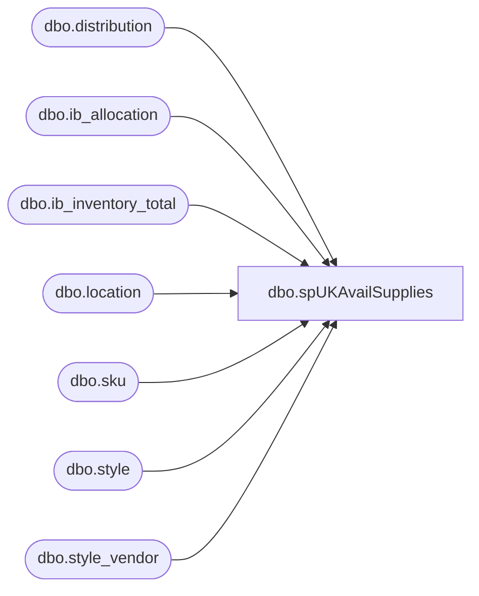

# dbo.spUKAvailSupplies

**Database:** me_01  
**Server:** bedrockdb02  

## Architecture Diagram



## Table Dependencies

| Referenced Table |
|---|
| dbo.distribution |
| dbo.ib_allocation |
| dbo.ib_inventory_total |
| dbo.location |
| dbo.sku |
| dbo.style |
| dbo.style_vendor |

## Stored Procedure Code

```sql
CREATE proc [dbo].[spUKAvailSupplies]

as 

-- =====================================================================================================
-- Name: spUKAvailSupplies
--
-- Description:	Captures a view of available UK supplies, to be queried from Kodiak for WSR 
--				
--
-- Revision History
--		Name:			Date:			Comments:
--		Dan Tweedie		11/24/2015		Created proc
-- =====================================================================================================

set nocount on


select s.style_code,
	(sum(iit.total_on_hand_units) - isnull(sum(ia.allocated_units),0)) as available_to_distribute
from ib_inventory_total iit with (nolock)
join sku sk with (nolock) on sk.sku_id = iit.sku_id
join style s with (nolock) on sk.style_id = s.style_id
join style_vendor sv with (nolock) on s.style_id = sv.style_id
join location l with (nolock) on iit.location_id = l.location_id
left outer join (select sku_id, sum(allocated_units) as allocated_units 
					from ib_allocation ia with (nolock)
					join distribution d with (nolock) on ia.allocation_number = d.distribution_number
					join location l with (nolock) on l.location_id = d.location_id
					where isnull(d.po_id,0)=0 
					  and isnull(d.advance_shipping_notice_id,0)=0  
					  and l.location_code = '2970' 
					  group by sku_id) ia
	on		sk.sku_id = ia.sku_id
where	iit.inventory_status_id =1
and		l.location_code = '2970' -- US Warehouse, '0975' = Canada, '2970' = UK
and		sv.vendor_id <> 71 -- KEENPAC as per Anna
and		sv.primary_vendor_flag = 1
group by s.style_code
having (sum(iit.total_on_hand_units) - isnull(sum(ia.allocated_units),0)) > 0
order by s.style_code
```

