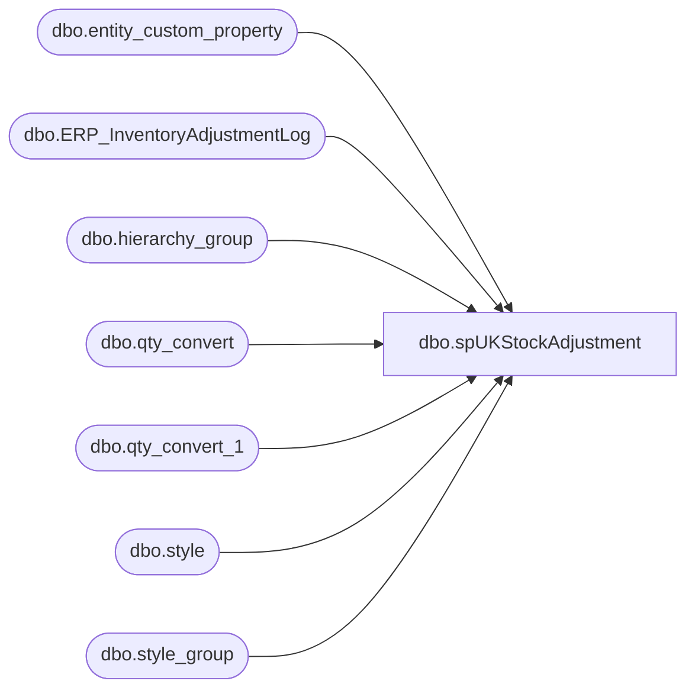

# dbo.spUKStockAdjustment

**Database:** me_01  
**Server:** bedrockdb02  

## Architecture Diagram



## Table Dependencies

| Referenced Table |
|---|
| dbo.entity_custom_property |
| dbo.ERP_InventoryAdjustmentLog |
| dbo.hierarchy_group |
| dbo.qty_convert |
| dbo.qty_convert_1 |
| dbo.style |
| dbo.style_group |

## Stored Procedure Code

```sql
CREATE proc [dbo].[spUKStockAdjustment]
-- =====================================================================================================
-- Name: spUKStockAdjustment
--
-- Description:	Captures data from a stock adjustment file (uploaded by UK Warehouse). 
--				Generates new file, drops file on \\pipeapp01 to process into Merchandising system.
--
-- Input:	Imports file from \\kermode\FileRepository\MERCHANDISING\UK_DISTRO\STOCKADJ\
--
-- Output: Shrink Adjustment file to meet Epicor requirements.
--			File is dropped at \\pipeapp01\e$\Company01\Text File to IM Import Tables- Import Shrink Adj
--
-- Dependencies: Proc executes bedrockdb02.me_01.spUKStockAdjustment_FileExport 
--
-- Revision History
--		Name:			Date:			Comments:
--		Dan Tweedie		05/12/2010		Created proc.
--		Keith Lee		08/08/2016		Updated proc to do multiple files and correct error when renaming.
--		Tim Callahan	04/26/2018		Updated proc to omit rows that have converted quantity of zero
--										If StockADj comes over for a supply style less than pack multiple it will cause the pipeline file to error out
--		Dan Tweedie		2018-07-03		Added stage data for Dynamics
-- =====================================================================================================

as
set nocount on

/*****************************************************************************************
 ****PROCESS ONE: IMPORT DATA FROM FILE, MASSAGE DATA, STORE HISTORICAL RECORD OF FILE****
 *****************************************************************************************/
--------------------------
----BEGIN PROCESS ONE-----
--------------------------

-----see if there's a file waiting. 
---first check to see if stock adjustment file exists


IF (Object_ID('tempdb..#DIR') IS NOT NULL) DROP TABLE #DIR
create table #DIR (output varchar(1000))
insert #DIR exec master..xp_cmdshell 'dir \\kermode\FileRepository\MERCHANDISING\uk_distro\STOCKADJ\*.txt /B'
delete from #DIR where output is null or output = 'File Not Found'


if (select count(*) from #dir where output like 'stock%') > 0

begin 

IF (Object_ID('tempdb..#import') IS NOT NULL) DROP TABLE #import
create table #import (style varchar(6), qty int, description varchar(52))

declare @filename varchar(100),
		@timestamp varchar(52),
		@bulkinsert varchar(4000),
		@move varchar(1000),
		@rename varchar(1000),
		@files int,
		@dir varchar(1000)

set @dir = '\\kermode\FileRepository\MERCHANDISING\UK_Distro\STOCKADJ\'

select @files = count(*) from #dir

---------Bulk Insert Loop
		while @files > 0
			begin
			    select @timestamp = cast(datepart(yyyy, getdate()) as varchar) + cast(datepart(mm, getdate()) as varchar) + cast(datepart(dd, getdate()) as varchar) + cast(datepart(hh, getdate()) as varchar) + cast(datepart(mi, getdate()) as varchar) + cast(datepart(ss, getdate()) as varchar)
				select @filename = max(output) from #dir
								
				select @bulkinsert = 'set language ''British'' bulk insert #import from ''' + @dir + @filename + ''' with (FIRSTROW = 1, FIELDTERMINATOR = ''	'', ROWTERMINATOR = ''\n'')'
				exec (@bulkinsert)

				select @rename = 'ren ' + @dir + @filename + ' ' + @filename + '.' + @timestamp + '.txt'
				exec master..xp_cmdshell @rename
				
				select @move = 'move ' + @dir + @filename + '.' + @timestamp + '.txt' + ' \\kermode\FileRepository\MERCHANDISING\uk_distro\STOCKADJ\Done\'
		        exec master..xp_cmdshell @move
				
				delete from #dir where output = @filename
				select @files = count(*) from #dir
								
				if @files < 1
					break
				else
					continue
			end

-------------- OLD CODE 08-08-2016 - Keith Lee
--begin
--	--rename file to strip datestamp (to make it easy to bulk insert in the next step)
--	declare @rename1 varchar(1000)
--	set @rename1 = 'ren \\kermode\FileRepository\MERCHANDISING\UK_DISTRO\STOCKADJ\*.txt STOCKADJUSTMENT.txt'
--	exec master..xp_cmdshell @rename1
--	--<><><><><><><><><><><><><><><><><><><><><><><><><><><><><><><><><><><><><><><><><>--

--	--bulk insert
--	IF (Object_ID('tempdb..#import') IS NOT NULL) DROP TABLE #import
--	create table #import (style varchar(6), qty int, description varchar(52))

--	bulk insert #import
--	from '\\kermode\FileRepository\MERCHANDISING\UK_DISTRO\STOCKADJ\STOCKADJUSTMENT.txt'
--	with 
--	(
--	FIRSTROW = 1, 
--	FIELDTERMINATOR = '	',
--	ROWTERMINATOR = '\n'
--	)
--	--<><><><><><><><><><><><><><><><><><><><><><><><><><><><><><><><><><><><><><><><><>--

--	--rename file to add datestamp (so we can keep historical files)
--	declare @rename2 varchar(1000)
--	set @rename2 = 'ren \\kermode\FileRepository\MERCHANDISING\UK_DISTRO\STOCKADJ\*.txt STOCKADJUSTMENT%date:~10%%date:~4,2%%date:~7,2%.txt'
--	exec master..xp_cmdshell @rename2
--	--<><><><><><><><><><><><><><><><><><><><><><><><><><><><><><><><><><><><><><><><><>--

--	--move file
--	declare @move varchar(1000)
--	select @move = 'move \\kermode\FileRepository\MERCHANDISING\UK_DISTRO\STOCKADJ\*.txt \\kermode\FileRepository\MERCHANDISING\UK_Distro\STOCKADJ\DONE\'
--	exec master..xp_cmdshell @move
--	--<><><><><><><><><><><><><><><><><><><><><><><><><><><><><><><><><><><><><><><><><>--

	---convert value to +/- and convert supply qty's to cases
	IF (Object_ID('me_01..qty_convert_1') IS NOT NULL) DROP TABLE qty_convert_1
	create table qty_convert_1 (style varchar(6), description varchar(52), orig_qty int, converted_qty int)

	insert qty_convert_1
	select right(('000000' + i.style), 6) style, left(i.description, 20) description, i.qty orig_qty, 
		case when substring(hg.hierarchy_group_code,7,2)='60' 
			then (i.qty * -1) / ecp.custom_property_value
			else (i.qty * -1)
		end as converted_qty
	from #import i
		inner join style s (nolock) on right(('000000' + i.style), 6) = s.style_code
		inner join style_group sg (nolock) on s.style_id = sg.style_id
		inner join hierarchy_group hg (nolock) on sg.hierarchy_group_id = hg.hierarchy_group_id
		left outer join	entity_custom_property ecp on s.style_id = ecp.parent_id and ecp.custom_property_id = 2 and	ecp.parent_type = 1
	where i.style not like 'IT%'
	and s.active_flag = 1 --ensures we only work with active skus

	----remove rows that have value of '0' for original qty
	IF (Object_ID('me_01..qty_convert') IS NOT NULL) DROP TABLE qty_convert
	create table qty_convert (style varchar(6), description varchar(52), orig_qty int, converted_qty int)

	insert qty_convert
	select style, description, sum(orig_qty) orig_qty, sum(converted_qty) converted_qty
	from qty_convert_1 
	group by style, description
	having sum(orig_qty) <> 0


	-- Remove rows that have value of 0 for converted qty 
	-- Added 4/26/2018
	delete 
	from qty_convert
	where converted_qty = 0

	----------------------------------------------------
----ARCHIVE DATA FOR DYNAMICS
----------------------------------
IF (select count(*) from #import) > 0
begin
	insert ERP_InventoryAdjustmentLog 
		select 	
			'2970' as LocationCode, 
			right(('000000' + style), 6) as Style, 
			qty as Qty,
			left(description, 20) as Description, 
			getdate()
		from #Import 
end
-------------------------------------------
----------------------------

	--<><><><><><><><><><><><><><><><><><><><><><><><><><><><><><><><><><><><><><><><><>--
	--------------------------
	-----END PROCESS ONE------
	--------------------------
	--<><><><><><><><><><><><><><><><><><><><><><><><><><><><><><><><><><><><><><><><><>--

	/**********************************************************************************************************
	 ***PROCESS TWO: TAKE DATA FROM PROCESS ONE, GENERATE SHRINK ADJUSTMENT FILE, DROP ON PIPELINE DIRECTORY***
	 **********************************************************************************************************/
	--------------------------
	----BEGIN PROCESS TWO-----
	--------------------------
	---executes stored proc spUKStockAdjustment_FileExport:

	if (select count(*) from qty_convert) > 0

		begin

			declare @file varchar(1000) 
			select @file = 'sqlcmd -Sbedrockdb02 -dme_01 -Q"exec spUKStockAdjustment_FileExport" -o"\\pipeapp01\Company01\Text File to IM Import Tables- Import Shrink Adj\STSIMSA.UK.%date:~10%%date:~4,2%%date:~7,2%%time:~0,2%%time:~3,2%%time:~6,2%.GO" -w1000'
			exec master..xp_cmdshell @file
	
		end

end
```

