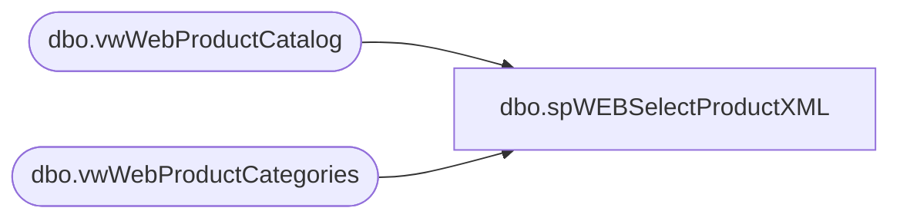

# dbo.spWEBSelectProductXML

**Database:** me_01  
**Server:** bedrockdb02  

## Architecture Diagram



## Table Dependencies

| Referenced Table |
|---|
| dbo.vwWebProductCatalog |
| dbo.vwWebProductCategories |

## Stored Procedure Code

```sql
CREATE proc spWEBSelectProductXML

as 

set nocount on

--try staging these via ssis, then running new view against staged tables
IF (Object_ID('tempdb..#CAT') IS NOT NULL) DROP TABLE #CAT
select *
into #CAT
from vwWebProductCategories

IF (Object_ID('tempdb..#PRODUCT') IS NOT NULL) DROP TABLE #PRODUCT
select *
into #PRODUCT
from vwWebProductCatalog

IF (Object_ID('tempdb..#CatProd') IS NOT NULL) DROP TABLE #CatProd
select 
	c.CategoryID,
	p.Style
into #CatProd
from #PRODUCT p
join #CAT c on 
	case 
		when US_Catalog = 1 then 'US'
		when UK_Catalog = 1 then 'UK'
	end 
	+ '-' + p.Enterprise 
	+ '-' + p.Concept 
	+ '-' + p.Division 
	+ '-' + p.Department
	+ '-' + p.Class 
	+ '-' + p.SubClass 
	+ '-' + p.DefinitionName
	= c.CategoryID

--header
select 
	(
		select 
			'BABW Master Catalog' as '@catalog-id',
			(	
				select 
					(
						select '/images' as 'internal-location/@base-path',
						(
							select
								'large' as 'view-type', NULL,
								'medium' as 'view-type', NULL,
								'small' as 'view-type', NULL,
								'swatch' as 'view-type', NULL,
								'hi-res' as 'view-type' 
							for xml path('view-types'), Type
						),
						'color' as 'variation-attribute-id',
						'${productname}, ${variationvalue}, ${viewtype}' as 'alt-pattern',
						'${productname}, ${variationvalue}' as 'title-pattern'
						for xml path('image-settings'), Type
					)
				for xml path ('header'), Type
			),
			( --CATEGORIES
				select 
					CategoryID as '@category-id',
					'x-default' as 'display-name/@xml:lang',
					DisplayName as 'display-name',
					'true' as 'online-flag',
					Parent as 'parent',

					'' as 'template',
					'' as 'page-attributes'
				from #CAT
				order by CategoryID
				for xml path('category'), Type
			),
			( --PRODUCTS
				select
					Style as 'product-id',
					'' as 'ean',
					UPC as 'upc',
					'' as 'unit',
					'1' as 'min-order-quantity',
					'1' as 'step-quantity',
					'x-default' as 'display-name/@xml:lang',
					SKUDescription as 'display-name',
					'x-default' as 'short-description/@xml:lang',
					'Enter descriptive product text here' as 'short-description', --need to find out from where to pull this
					'x-default' as 'long-description/@xml:lang',
					cast('<ul> <li>More Descriptive text with html tags</li> <li>sku description</li> <li>more text</li> <li>etc</li> <li>etc</li> <li>etc</li> </ul>' as xml) as 'long-description',--need to find out from where to pull this
					'true' as 'online-flag',
					'true' as 'available-flag', --will need to join to inventory, only include what is available, this value will therefore always be true
					'true' as 'searchable-flag',
					'large' as 'images/image-group/@view-type',
					'large/imageName.jpg' as 'images/image-group/image/@path',--need to know from where to pull this
					'standard' as 'tax-class-id', --do we need to put this in the view? where does it come from?
					'x-default' as 'page-attributes/page-title/@xml:lang',
					SKUDescription as 'page-attributes/page-title',
					'x-default' as 'page-attributes/page-description/@xml:lang',
					'More product descriptive text here' as 'page-attributes/page-description',
						( 
							select
								'ColorCode' as 'custom-attribute/@attribute-id',
								ColorCode as 'custom-attribute', 
								NULL,
								'Color' as 'custom-attribute/@attribute-id',
								WebColor as 'custom-attribute', 
								NULL,
								'isAccessory' as 'custom-attribute/@attribute-id',
								isAccessory as 'custom-attribute', 
								NULL,
								'isSound' as 'custom-attribute/@attribute-id',
								isSound as 'custom-attribute', 
								NULL,
								'isMusic' as 'custom-attribute/@attribute-id',
								isMusic as 'custom-attribute', 
								NULL,
								'isVirtualCard' as 'custom-attribute/@attribute-id',
								isVirtualCard as 'custom-attribute', 
								NULL,
								'isClothing' as 'custom-attribute/@attribute-id',
								isClothing as 'custom-attribute', 
								NULL,
								'isAnyAmount' as 'custom-attribute/@attribute-id',
								isAnyAmount as 'custom-attribute', 
								NULL,
								'isDino' as 'custom-attribute/@attribute-id',
								isDino as 'custom-attribute', 
								NULL,
								'isVirtualItem' as 'custom-attribute/@attribute-id',
								isVirtualItem as 'custom-attribute', 
								NULL,
								'CanAddSound' as 'custom-attribute/@attribute-id',
								CanAddSound as 'custom-attribute', 
								NULL,
								'CanAddAccessory' as 'custom-attribute/@attribute-id',
								CanAddAccessory as 'custom-attribute', 
								NULL,
								'FurColor' as 'custom-attribute/@attribute-id',
								FurColor as 'custom-attribute',
								NULL,
								'EyeColor' as 'custom-attribute/@attribute-id',
								EyeColor as 'custom-attribute', 
								NULL,
								'Height' as 'custom-attribute/@attribute-id',
								Height as 'custom-attribute', 
								NULL,
								'Weight' as 'custom-attribute/@attribute-id',
								Weight as 'custom-attribute', 
								NULL,
								'AnimalType' as 'custom-attribute/@attribute-id',
								AnimalType as 'custom-attribute', 
								NULL,
								'AnimalName' as 'custom-attribute/@attribute-id',
								AnimalName as 'custom-attribute', 
								NULL,
								'Theme' as 'custom-attribute/@attribute-id',
								Theme as 'custom-attribute', 
								NULL,
								'Occasion' as 'custom-attribute/@attribute-id',
								Occasion as 'custom-attribute', 
								NULL,
								'Recipient' as 'custom-attribute/@attribute-id',
								Recipient as 'custom-attribute', 
								NULL,
								'NFLTeam' as 'custom-attribute/@attribute-id',
								NFLTeam as 'custom-attribute', 
								NULL,
								'NHLTeam' as 'custom-attribute/@attribute-id',
								NHLTeam as 'custom-attribute', 
								NULL,
								'MLBTeam' as 'custom-attribute/@attribute-id',
								MLBTeam as 'custom-attribute', 
								NULL,
								'NBATeam' as 'custom-attribute/@attribute-id',
								NBATeam as 'custom-attribute', 
								NULL,
								'College' as 'custom-attribute/@attribute-id',
								College as 'custom-attribute', 
								NULL,
								'UKFootball' as 'custom-attribute/@attribute-id',
								UKFootball as 'custom-attribute', 
								NULL,
								'CountryOfManufacture' as 'custom-attribute/@attribute-id',
								CountryOfManufacture as 'custom-attribute' 
							for xml path('custom-attributes'), Type
						) ,
						(---NEED TO ADD A VARIANTS PATH FOR VARIANT PRODUCT-IDS	
							select 
								'123456' as 'variant/@product-id',NULL,
								'234567' as 'variant/@product-id',NULL,
								'345678' as 'variant/@product-id'
							for xml path('variants'), ROOT('variations'), Type
						),
					Department + '-' + Class + '-' + SubClass + '-' + DefinitionName as 'classification-category' 
				from #PRODUCT
				order by Style
				for xml path('product'), Type
			),
			( --CATEGORY ASSIGNMENT
				select 
					CategoryID as '@category-id',
					Style as '@product-id',
					'true' as 'primary-flag'
				from #CatProd
				order by 2, 1
				for xml path('category-assignment'), Type
			)
		for xml path('catalog'), Type
	) as COL_XML
```

