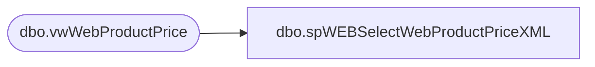

# dbo.spWEBSelectWebProductPriceXML

**Database:** me_01  
**Server:** bedrockdb02  

## Architecture Diagram



## Table Dependencies

| Referenced Table |
|---|
| dbo.vwWebProductPrice |

## Stored Procedure Code

```sql
CREATE proc [dbo].[spSelectWebProductPriceXML]

--------------------------------------------------------------------------------------------------
-- spSelectWebProductPriceXML - Outputs Price XML file for ecommerce system 
--- 2017-05-01 - Dan Tweedie - Created proc
--------------------------------------------------------------------------------------------------

as

set nocount on

declare @xml xml,
		@wrapper nvarchar(max)

select @wrapper = '<pricebooks xmlns="http://www.demandware.com/xml/impex/pricebook/2006-10-31">text</pricebooks>' 

select @xml = 
	(

		(
			select 
				'usd-list-prices' as 'header/@pricebook-id', 
					'USD' as 'header/currency',
					'x-default' as 'header/display-name/@xml:lang',
					'List Prices' as 'header/display-name',
					'true' as 'header/online-flag',
					(select 
						
						(
							select 
								SKU as '@product-id',
								'1' as 'amount/@quantity',
								Price as 'amount'
							from vwWebProductPrice
--							where Catalog = 'US'
							for xml path('price-table'), Type
						)
						for xml path('price-tables'), Type
					)
				for xml path('pricebook'), Type
		)
	
	) 

select @wrapper = replace(@wrapper, 'text', cast(@xml as nvarchar(max)))
select @xml = cast(@wrapper as xml)
select @xml
```

