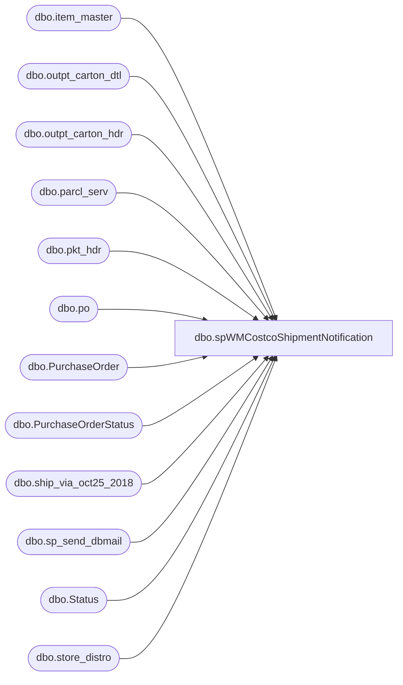

# dbo.spWMCostcoShipmentNotification

**Database:** me_01  
**Server:** bedrockdb02  

## Architecture Diagram



## Table Dependencies

| Referenced Table |
|---|
| dbo.item_master |
| dbo.outpt_carton_dtl |
| dbo.outpt_carton_hdr |
| dbo.parcl_serv |
| dbo.pkt_hdr |
| dbo.po |
| dbo.PurchaseOrder |
| dbo.PurchaseOrderStatus |
| dbo.ship_via_oct25_2018 |
| dbo.sp_send_dbmail |
| dbo.Status |
| dbo.store_distro |

## Stored Procedure Code

```sql
CREATE proc [dbo].[spWMCostcoShipmentNotification]

as

-- =====================================================================================================
-- Name: spWMCostcoShipmentNotification
--
-- Description:	Sends email to Costco for items shipped to Costco each day, updates Gift Card Master Database with tracking number per PO
--
-- Input:	NA
--
-- Output: log file and emails only if failure occurs
--
-- Dependencies: NA
--				 
-- Revision History
--		Name:			Date:			Comments:
--		Dan Tweedie		08/18/2014		Created proc.
--		Mike Pelikan	09/15/2014		Pointed to Production Server	
--		Mike Pelikan	09/16/2014		Added logic to Status Insert to exclude duplicates from manual processing
--		Dan Tweedie		11/11/2014		Added handling for Canadian shipments
--		Tim Callahan	10/04/2018		Added logic if the Tracking Number field is null, also added Shaun Starkey to the US email
--		Ben Barud		10/30/2018		Updated wmdb01.wmprod.dbo.ship_via to wmdb01.wmprod.dbo.ship_via_oct25_2018.  With the new Fedex/WM integration
--										Fedex serv_types will be null.  The backup table will need to be used going forward
-- =====================================================================================================


set nocount on 

IF (Object_ID('tempdb..##CostcoShipments') IS NOT null) DROP TABLE ##CostcoShipments
select sd.po_nbr,
	   sd.store_nbr, 
	   ph.shipto_name, 
	   ph.shipto_cntry,
	   ps.serv_desc, 
	   case when och.trkg_nbr is null -- Added 10/4/2018
			Then 'No Tracking Number Assigned'
			else och.trkg_nbr
	   end as 'trkg_nbr',
	   im.sku_desc,
	   sum(cast(ocd.units_pakd as int)) / 2 as Qty --per Jack McCormick divide by 2
into ##CostcoShipments
from wmdb01.wmprod.dbo.outpt_carton_hdr och (nolock)
join wmdb01.wmprod.dbo.outpt_carton_dtl ocd (nolock) on och.carton_nbr = ocd.carton_nbr
join wmdb01.wmprod.dbo.item_master im (nolock) on ocd.sku_id = im.sku_id
join wmdb01.wmprod.dbo.pkt_hdr ph (nolock) on och.pkt_ctrl_nbr = ph.pkt_ctrl_nbr
join wmdb01.wmprod.dbo.store_distro sd (nolock) on och.pkt_ctrl_nbr = sd.pkt_ctrl_nbr and ocd.pkt_seq_nbr = sd.pkt_seq_nbr
join wmdb01.wmprod.dbo.ship_via_oct25_2018 sv (nolock) on och.ship_via = sv.ship_via
join wmdb01.wmprod.dbo.parcl_serv ps (nolock) on sv.serv_type = ps.serv_type
where ph.shipto_name like '%costco%'
and im.style not in ('050188', '150188') --exclude this style per Jack McCormick
and datediff(dd, och.create_date_time, getdate()) = 0
group by sd.po_nbr, sd.store_nbr, ph.shipto_name, ph.shipto_cntry, ps.serv_desc, och.trkg_nbr, im.sku_desc


if (select count(*) from ##CostcoShipments) > 0

begin

	declare @text nvarchar(max)

	if(select count(*) from ##CostcoShipments where shipto_cntry = 'US') > 0 

	begin

		set @text = '
		<font face =arial size = 4> ' +
			'<b>Build-A-Bear to Costco Shipment Notification</b>' +
			'<br><br>' +
			'<table border="1" <font face =arial size = 2>' +
			'<tr><th>PO</th><th>Whse#</th><th>Whse Name</th><th>Shipping Service</th><th>Tracking Number</th><th>SKU Description</th><th>Qty Shipped</th></tr>' +
			CAST ( ( SELECT td = po_nbr, '',
							td = store_nbr, '',
							td = shipto_name, '',
							td = serv_desc, '',
							td = trkg_nbr, '',
							td = sku_desc, '',
							td = qty, ''
						from  ##CostcoShipments
						where shipto_cntry = 'US'
						order by po_nbr, store_nbr, serv_desc, trkg_nbr, sku_desc
						FOR XML PATH('tr'), TYPE 
			) AS NVARCHAR(MAX) ) +
					'</font></table></font></p></p>
					<br>
					<br>
					<br>
				<font face =arial size = 1><i>The information in this message may be privileged, “confidential” and protected from disclosure and/or intended only for the addressee(s) named above.  If the reader of this message is not the intended recipient, or an employee or agent responsible for delivering this message to the intended recipient, you are hereby notified that any dissemination, distribution or copying of the communication is strictly prohibited.  If you have received this communication in error, please notify us immediately by replying to the message and deleting it from your computer.  Thank you beary much.</i></font>'
					
		exec msdb.dbo.sp_send_dbmail
		@profile_name = 'merchadmin',
		@recipients = 'GiftCardCostcoNotification@buildabear.com',--'swells@costco.com;gabriel.poirier@costco.com;blarson@costco.com'
		@blind_copy_recipients = 'merchadmin@buildabear.com;ShaunS@buildabear.com',
		@subject = 'Build-A-Bear to Costco Shipment Notification',
		@body = @text,
		@body_format = 'HTML'

	end

		if(select count(*) from ##CostcoShipments where shipto_cntry = 'CA') > 0 

	begin

		set @text = '
		<font face =arial size = 4> ' +
			'<b>Build-A-Bear to Costco Shipment Notification</b>' +
			'<br><br>' +
			'<table border="1" <font face =arial size = 2>' +
			'<tr><th>PO</th><th>Whse#</th><th>Whse Name</th><th>Shipping Service</th><th>Tracking Number</th><th>SKU Description</th><th>Qty Shipped</th></tr>' +
			CAST ( ( SELECT td = po_nbr, '',
							td = store_nbr, '',
							td = shipto_name, '',
							td = serv_desc, '',
							td = trkg_nbr, '',
							td = sku_desc, '',
							td = qty, ''
						from  ##CostcoShipments
						where shipto_cntry = 'CA'
						order by po_nbr, store_nbr, serv_desc, trkg_nbr, sku_desc
						FOR XML PATH('tr'), TYPE 
			) AS NVARCHAR(MAX) ) +
					'</font></table></font></p></p>
					<br>
					<br>
					<br>
				<font face =arial size = 1><i>The information in this message may be privileged, “confidential” and protected from disclosure and/or intended only for the addressee(s) named above.  If the reader of this message is not the intended recipient, or an employee or agent responsible for delivering this message to the intended recipient, you are hereby notified that any dissemination, distribution or copying of the communication is strictly prohibited.  If you have received this communication in error, please notify us immediately by replying to the message and deleting it from your computer.  Thank you beary much.</i></font>'
					
		exec msdb.dbo.sp_send_dbmail
		@profile_name = 'merchadmin',
		@recipients = 'gloria.ung@costco.com',--'GiftCardCostcoCanadaNotification@buildabear.com',--'swells@costco.com;gabriel.poirier@costco.com;blarson@costco.com'
		@blind_copy_recipients = 'merchadmin@buildabear.com;santiagob@buildabear.com;jackm@buildabear.com;lindak@buildabear.com',
		@subject = 'Build-A-Bear to Costco Shipment Notification',
		@body = @text,
		@body_format = 'HTML'

	end


	----update gift card database
	--the giftcard database can only have one tracking number per PO, so per Mike P, I should use the 'max' tracking number just in case we ever have multiple per po
	IF (Object_ID('tempdb..#CostcoTracking') IS NOT null) DROP TABLE #CostcoTracking
	select po_nbr, max(trkg_nbr) tracking
	into #CostcoTracking
	from ##CostcoShipments
	group by po_nbr

	update po
	set po.ShipperTrackingNumber = ct.tracking, 
	po.ShipDateTime = getdate()
	from KODIAK.GiftCardMstrData.dbo.PurchaseOrder po
	inner join #CostcoTracking ct on po.PurchaseOrderNumber = ct.po_nbr

	--sql by Mike Pelikan, requested to run at same time as sql above...
	DECLARE @POShipped INT
	SELECT @POShipped = StatusID FROM KODIAK.GiftCardMstrData.dbo.[Status] WHERE StatusDescription = 'PO Shipped'
	
	INSERT INTO KODIAK.GiftCardMstrData.dbo.PurchaseOrderStatus (PurchaseOrderID, StatusID, StatusMachineName, CRTED_BY, CRTED_DT)
	SELECT DISTINCT po.PurchaseOrderID, @POShipped, HOST_NAME(), SYSTEM_USER, po.ShipDateTime
	FROM KODIAK.GiftCardMstrData.dbo.PurchaseOrder po
	LEFT JOIN KODIAK.GiftCardMstrData.dbo.PurchaseOrderStatus pos ON po.PurchaseOrderID = pos.PurchaseOrderID AND @POShipped = StatusID
	WHERE PurchaseOrderNumber IN (SELECT po_nbr FROM #CostcoTracking)
	AND pos.PurchaseOrderID IS NULL
	
	

	
End
```

