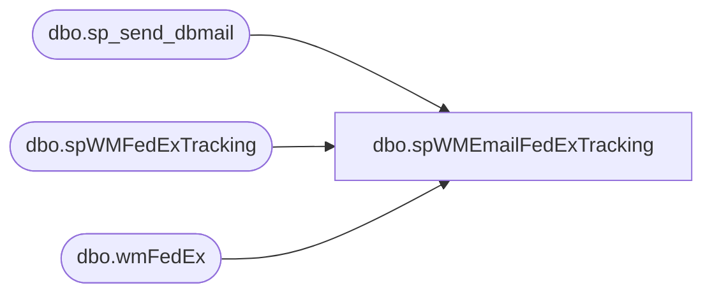

# dbo.spWMEmailFedExTracking

**Database:** me_01  
**Server:** bedrockdb02  

## Architecture Diagram



## Table Dependencies

| Referenced Table |
|---|
| dbo.sp_send_dbmail |
| dbo.spWMFedExTracking |
| dbo.wmFedEx |

## Stored Procedure Code

```sql
CREATE proc [dbo].[spWMEmailFedExTracking]

as

-- =====================================================================================================
-- Name: spWMEmailFedExTracking
--
-- Description:	Sends email to Distro team with FedEx tracking information from WM
--
-- Revision History
--		Name:			Date:			Comments:
--		Dan Tweedie		10/24/2014		Created proc.
--		Dan Tweedie		1/22/2015		Added email to store 0247
--		Dan Tweedie		1/28/2015		Removed Larry White from 247's email
-- =====================================================================================================


set nocount on

exec wmdb01.wmprod.dbo.spWMFedExTracking

IF (Object_ID('tempdb..##WMShipments') IS NOT null) DROP TABLE ##WMShipments 
select * 
into ##WMShipments
from wmdb01.wmprod.dbo.wmFedEx

if (select count(*) from ##WMShipments) > 0

begin

	declare @text nvarchar(max)
	set @text = '
	<font face =arial size = 4> ' +
		'<b>Bearhouse FedEx Cartons Shipped Today</b>' +
		'<br><br>' +
		'<table border="1" <font face =arial size = 2>' +
		'<tr><th>STORE</th><th>DISTRO</th><th>CARRIER</th><th>CARTON</th><th>TRACKING</th><th>STYLE</th><th>SKU DESCRIPTION</th><th>QTY</th><th>SHIP DATE</th></tr>' +
		CAST ( ( SELECT td = store_nbr, '',
						td = distro, '',
						td = serv_desc, '',
						td = carton_nbr, '',
						td = trkg_nbr, '',
						td = style, '',
						td = sku_desc, '',
						td = qty, '',
						td = ship_date, ''
					from  ##WMShipments
					order by store_nbr, style, serv_desc
					FOR XML PATH('tr'), TYPE 
		) AS NVARCHAR(MAX) ) +
				'</font></table></font></p></p>
				<br>
				<br>
				<br>
			<font face =arial size = 1><i>The information in this message may be privileged, “confidential” and protected from disclosure and/or intended only for the addressee(s) named above.  If the reader of this message is not the intended recipient, or an employee or agent responsible for delivering this message to the intended recipient, you are hereby notified that any dissemination, distribution or copying of the communication is strictly prohibited.  If you have received this communication in error, please notify us immediately by replying to the message and deleting it from your computer.  Thank you beary much.</i></font>'
					
	exec msdb.dbo.sp_send_dbmail
	@profile_name = 'merchadmin',
	@recipients = 'distrobears@buildabear.com;purchasing@buildabear.com',
	@copy_recipients = 'larryw@buildabear.com;shauns@buildabear.com;chuckw@buildabear.com',
	@subject = 'WM FedEx Tracking Numbers',
	@body = @text,
	@body_format = 'HTML'

end


if (select count(*) from ##WMShipments where store_nbr = '0247') > 0

BEGIN

	set @text = '
		<font face =arial size = 4> ' +
			'<b>Bearhouse FedEx Cartons Shipped Today To Store 247</b>' +
			'<br><br>' +
			'<table border="1" <font face =arial size = 2>' +
			'<tr><th>STORE</th><th>DISTRO</th><th>CARRIER</th><th>CARTON</th><th>TRACKING</th><th>STYLE</th><th>SKU DESCRIPTION</th><th>QTY</th><th>SHIP DATE</th></tr>' +
			CAST ( ( SELECT td = store_nbr, '',
							td = distro, '',
							td = serv_desc, '',
							td = carton_nbr, '',
							td = trkg_nbr, '',
							td = style, '',
							td = sku_desc, '',
							td = qty, '',
							td = ship_date, ''
						from  ##WMShipments
						where store_nbr = '0247'
						order by store_nbr, style, serv_desc
						FOR XML PATH('tr'), TYPE 
			) AS NVARCHAR(MAX) ) +
					'</font></table></font></p></p>
					<br>
					<br>
					<br>
				<font face =arial size = 1><i>The information in this message may be privileged, “confidential” and protected from disclosure and/or intended only for the addressee(s) named above.  If the reader of this message is not the intended recipient, or an employee or agent responsible for delivering this message to the intended recipient, you are hereby notified that any dissemination, distribution or copying of the communication is strictly prohibited.  If you have received this communication in error, please notify us immediately by replying to the message and deleting it from your computer.  Thank you beary much.</i></font>'
					
		exec msdb.dbo.sp_send_dbmail
		@profile_name = 'merchadmin',
		@recipients = 'store247@buildabear.com',
		@copy_recipients = 'shauns@buildabear.com;chuckw@buildabear.com',
		@subject = 'WM FedEx Tracking Numbers For Store 247',
		@body = @text,
		@body_format = 'HTML'

END
```

