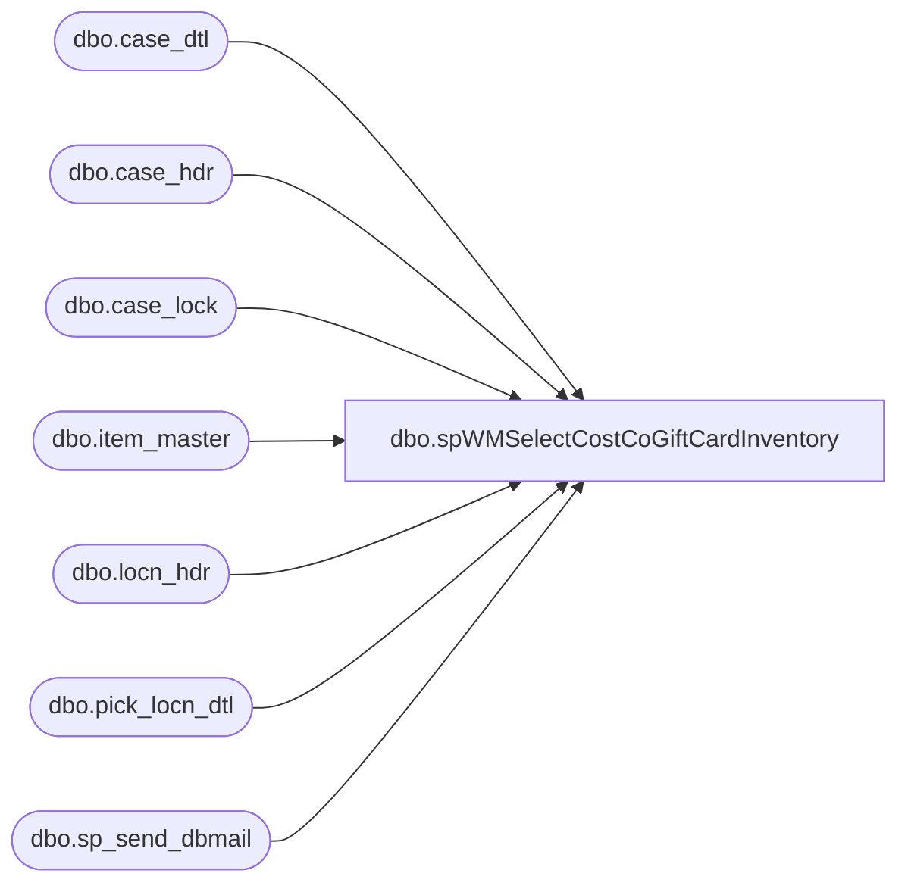

# dbo.spWMSelectCostCoGiftCardInventory

**Database:** me_01  
**Server:** bedrockdb02  

## Architecture Diagram



## Table Dependencies

| Referenced Table |
|---|
| dbo.case_dtl |
| dbo.case_hdr |
| dbo.case_lock |
| dbo.item_master |
| dbo.locn_hdr |
| dbo.pick_locn_dtl |
| dbo.sp_send_dbmail |

## Stored Procedure Code

```sql
CREATE proc [dbo].[spWMSelectCostCoGiftCardInventory]
as

-- =====================================================================================================
-- Name: spWMSelectCostCoGiftCardInventory
--
-- Description:	Gathers 980 Inventory for CostCo Gift Cards, send e-mail with available on hand. 
-- Divides total units by 4 as CostCo sells the Gift Cards in 4 packs, so 25 units = 100 Gift Cards 
-- Input:	NA
--
--
--
-- Revision History
--		Name:			Date:			Comments:
--		Tim Callahan	09/01/2016		Created proc
--		Tim Callahan	10/24/2016		Modified e-mail step to sum quantity rather than have a seperate line for Active Pick and Case Pick 
--		Tim Callahan	10/24/2016		Added Stacy Wells and Robert Poole from Cost Co to Distribution List per Bryson Ahrens 
--		Tim Callahan	10/16/2018		Removed Stacy Wells & Robert Poole added Dolores Jimenez and Michele Albrecht per Bryson Ahrens
--		Tim Callahan	11/26/2018		Removed Dolores Jimenez (CostCo) at her request 
--		Lizzy Timm		11/26/2018		Added email generation information in email bodies.
--		Lizzy Timm		10/21/2019		Added swells@costco.com to recipient list per Bryson Ahrens
--		Lizzy Timm		12/13/2019		Replaced malbrecht@costco.com with sstainer@costco.com in the recipient list per Bryson Ahrens' Service Request 27031
-- =====================================================================================================
set nocount on 

IF (Object_ID('tempdb..#item_master') IS NOT NULL) DROP TABLE #item_master
create table #item_master
(sku_id varchar(10), 
style varchar(6), 
sku_desc varchar(40))

insert #item_master
select sku_id, style, sku_desc 
from wmdb01.wmprod.dbo.item_master
where size_range_code is null --- Excludes LMM styles since those have a size_range_code value
order by style asc
----------------------------------------------------------------------------------------

--Capture Available 980 inventory
IF (Object_ID('tempdb..#CostCoAvail_invn') IS NOT NULL) DROP TABLE #CostCoAvail_invn
create table #CostCoAvail_invn
(sku_id varchar(10),
style varchar(6),
sku_desc varchar(40),
avail_qty int)

insert #CostCoAvail_invn
----capture cases in 'putaway' status, with no lock codes (excludes allocated)
select im.sku_id, im.style, im.sku_desc, sum(cd.actl_qty) avail_qty
from wmdb01.wmprod.dbo.case_hdr ch (nolock)
join wmdb01.wmprod.dbo.case_dtl cd (nolock) on cd.case_nbr = ch.case_nbr
join #item_master im (nolock) on cd.sku_id = im.sku_id
join wmdb01.wmprod.dbo.locn_hdr lh (nolock) on lh.locn_id = ch.locn_id
left join wmdb01.wmprod.dbo.case_lock cl (nolock) on cl.case_nbr = ch.case_nbr
where (lh.work_grp not in ('WEB', 'OUTL') or lh.work_grp is null) --980 location
and ch.stat_code = 30 --putaway status (excludes allocated)
and cl.case_nbr is null --not in case_lock table
and im.style = '021912'
group by im.sku_id, im.style, im.sku_desc
UNION ALL
--Capture inventory from Active-Pick locations (excludes allocated)
select im.sku_id, im.style, im.sku_desc,
(sum(pld.actl_invn_qty) + sum(pld.to_be_filld_qty) - sum(pld.to_be_pikd_qty)) avail_qty  ---this excludes allocated 
from wmdb01.wmprod.dbo.pick_locn_dtl pld (nolock)
join wmdb01.wmprod.dbo.locn_hdr lh (nolock) on lh.locn_id = pld.locn_id
join #item_master im (nolock) on im.sku_id = pld.sku_id
where (lh.work_grp not in ('WEB', 'OUTL') or lh.work_grp is null) --980 location
and pld.pikng_lock_code is null --ensures pick location detail is not locked
and im.style = '021912'
group by im.sku_id, im.style, im.sku_desc
----------------------------------------------

-- View Data \ Testing Stuff
/*

select * from #CostCoAvail_invn

insert into #CostCoAvail_invn
values (111161831,021912,'COSTCO $25 4PK',16000)

*/

-- Send E-mail, body of e-mail will depend on if there is zero inventory or not. 

IF (select count(*) from #CostCoAvail_invn) < 1


	Begin 

		Declare @BODY2 nvarchar(max);		

			set @BODY2 = '<font face =arial size = 2>' + 
					'The quantity available is as of roughly 11:00 AM CST on Friday.'+
					'<br>'+
					'Any POs received after that time on Friday morning may not have been taken into account.'+
					'<br>'+
					'<br>'+
					'Please Find The Current Packs Available:' +
					'<br>'+
					'<br>'+
					'<br>'+
						'<table border="1">' +
						'<tr><th>DESCRIPTION</th><th>AVAILABLE QTY</th></tr>' +
						CAST ( ( SELECT td = 'COSTCO $25 4PK', '',
										td = 0, ''
								  --from #CostCoAvail_invn CC
								  FOR XML PATH('tr'), TYPE 
						) AS NVARCHAR(MAX) ) +
						'</font></table></font></p></p>
						<br>
						<br>
						<br>
						<font face =arial size = 1.5>This email has been generated from bedrockdb02.me_01.dbo.spWMSelectCostCoGiftCardInventory</font>
						<br>
						<br>
					<font face =arial size = 1><i>The information in this message may be privileged, “confidential” and protected from disclosure and/or intended only for the addressee(s) named above.  If the reader of this message is not the intended recipient, or an empl
			oyee or agent responsible for delivering this message to the intended recipient, you are hereby notified that any dissemination, distribution or copying of the communication is strictly prohibited.  If you have received this communication in error, please
			 notify us immediately by replying to the message and deleting it from your computer.</i></font>'

	

				EXEC bedrockdb02.msdb.dbo.sp_send_dbmail
					@recipients = 'BrysonA@buildabear.com;swells@costco.com;sstainer@costco.com', -- Replaced malbrecht@costco.com with sstainer@costco.com per Service Request 27031; 12/13/2019 LT
					@copy_recipients = 'MerchAdmin@buildabear.com',
					@subject = 'Build-A-Bear Gift Cards - Packs Available at BAB Warehouse',
					@body = @BODY2,
					@profile_name = 'MerchAdmin',
					@body_format= HTML

	

	End

Else 

	Begin

-- Update data to account for 100 Gift Cards = 25 units to CostCo (100/4 = 25) 

	update #CostCoAvail_invn
	set avail_qty = avail_qty / 4 

-- Send Inventory Levels 

	Declare @BODY3 nvarchar(max);		

set @BODY3 = '<font face =arial size = 2>' + 
		'The quantity available is as of roughly 11:00 AM CST on Friday.'+
		'<br>'+
		'Any POs received after that time on Friday morning may not have been taken into account.'+
		'<br>'+
		'<br>'+
		'Please Find The Current Packs Available:' +
		'<br>'+		
		'<br>'+
		'<br>'+
			'<table border="1">' +
			'<tr><th>DESCRIPTION</th><th>AVAILABLE QTY</th></tr>' +
			CAST ( ( SELECT	td = cc.sku_desc, '',
							td = sum(cc.avail_qty), ''
					  from #CostCoAvail_invn CC
					  group by cc.sku_desc
					  FOR XML PATH('tr'), TYPE 
			) AS NVARCHAR(MAX) ) +
			'</font></table></font></p></p>
			<br>
			<br>
			<br>
			<font face =arial size = 1.5>This email has been generated from bedrockdb02.me_01.dbo.spWMSelectCostCoGiftCardInventory</font>
			<br>
			<br>
		<font face =arial size = 1><i>The information in this message may be privileged, “confidential” and protected from disclosure and/or intended only for the addressee(s) named above.  If the reader of this message is not the intended recipient, or an empl
oyee or agent responsible for delivering this message to the intended recipient, you are hereby notified that any dissemination, distribution or copying of the communication is strictly prohibited.  If you have received this communication in error, please
 notify us immediately by replying to the message and deleting it from your computer.</i></font>'

	

	EXEC bedrockdb02.msdb.dbo.sp_send_dbmail
		@recipients = 'BrysonA@buildabear.com;swells@costco.com;sstainer@costco.com', -- Replaced malbrecht@costco.com with sstainer@costco.com per Service Request 27031; 12/13/2019 LT
		@copy_recipients = 'MerchAdmin@buildabear.com',
		@subject = 'Build-A-Bear Gift Cards - Packs Available at BAB Warehouse',
		@body = @BODY3,
		@profile_name = 'MerchAdmin',
		@body_format= HTML


	End
```

