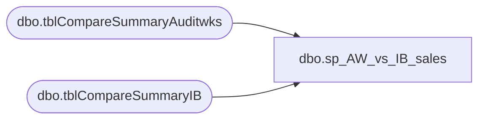

# dbo.sp_AW_vs_IB_sales

**Database:** me_01  
**Server:** bedrockdb02  

## Architecture Diagram



## Table Dependencies

| Referenced Table |
|---|
| dbo.tblCompareSummaryAuditwks |
| dbo.tblCompareSummaryIB |

## Stored Procedure Code

```sql
CREATE procedure [dbo].[sp_AW_vs_IB_sales]
as


select Distinct a.aw_store,
				b.ib_store,
				a.aw_date,
                a.aw_units,
                b.ib_units,
                (a.aw_units-b.ib_units) as aw_ib_diff        
into #keith_temp
from    tblCompareSummaryAuditwks a
left outer join tblCompareSummaryIB b
on  a.aw_store = b.ib_store
AND a.aw_date = b.ib_date

select * from #keith_temp where aw_ib_diff > 20 or ib_store is null
```

