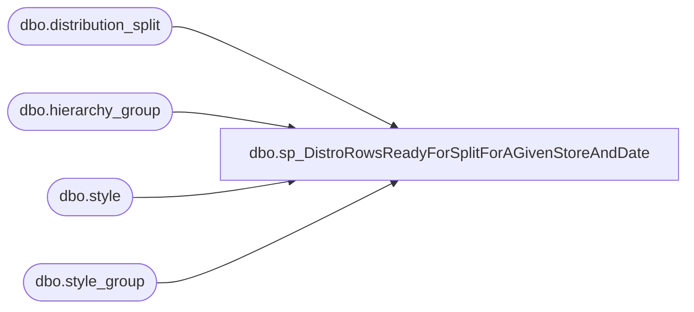

# dbo.sp_DistroRowsReadyForSplitForAGivenStoreAndDate

**Database:** me_01  
**Server:** bedrockdb02  

## Architecture Diagram



## Table Dependencies

| Referenced Table |
|---|
| dbo.distribution_split |
| dbo.hierarchy_group |
| dbo.style |
| dbo.style_group |

## Stored Procedure Code

```sql
-----------------------------------------------------------------------------------
---DAN TWEEDIE - 2018-07-02 - UPDATED PROC TO ALLOW FOR HANDLING OF DYNAMICS DATA
---Tim Callahan 2022-08-04	Updated to only inlcude where isnumeric(distribution_number)=1 so it only includes Aptos distros, not Dynamics
-----------------------------------------------------------------------------------

CREATE PROCEDURE [dbo].[sp_DistroRowsReadyForSplitForAGivenStoreAndDate] 
	(@storeNum  int,
	 @warehouseNum int)
	
	
AS

	SET NOCOUNT ON 


--------------------------------------------------------------------------------------------------------------------------
	
DECLARE @sumCartons AS INT

SELECT @sumCartons = SUM([quantity])
  FROM [me_01].[dbo].[distribution_split] ds
  INNER JOIN
		style s (NOLOCK) ON ds.style_code = s.style_code
	JOIN 
		style_group sg (NOLOCK) ON s.style_id = sg.style_id
	JOIN 
		hierarchy_group hg (NOLOCK) ON sg.hierarchy_group_id = hg.hierarchy_group_id
  WHERE destid = @storeNum
  AND sourceid = @warehouseNum
  AND released = 0 
  AND active_pick_flag = 'N' AND substring(hg.hierarchy_group_code,7,2)<>'60'
  and isnumeric(distribution_number)=1 -- Added on 8/4/2022

SELECT style_code, SUM(quantity) 'sumQuantity' 
INTO #sumQuantity
FROM distribution_split (NOLOCK) 
WHERE destid = @storeNum 
AND sourceid = @warehouseNum 
AND released = 0 
and isnumeric(distribution_number)=1 -- Added on 8/4/2022
GROUP BY style_code

SELECT inner_table.Id
		, inner_table.SourceID
		, inner_table.DestID
		, inner_table.style_code
		, inner_table.quantity
		, inner_table.rec_Type
		, inner_table.sequencenbr
		, inner_table.distribution_number
		, inner_table.ref_field_1
		, inner_table.release_date
		, inner_table.active_pick_flag
		, SortType = CASE 
			WHEN active_pick_flag = 'Y' THEN 0
			WHEN rec_type = 11 or (hierarchy_group_code = 'x-x-x-60' AND rec_type = 1) THEN 1 --UPDATED FOR DYNAMICS - WE NO LONGER WANT TO USE REC TYPE 11, USE 1 INSTEAD
			WHEN substring(inner_table.hierarchy_group_code,7,2)<>'60' THEN 2
			ELSE 3
        END
		,inner_table.percentOfShipment
FROM (SELECT 
		 distribution_split.[id]
		,distribution_split.[sourceid]
		,distribution_split.[destid]
		,distribution_split.[style_code]
		,distribution_split.[quantity]
		,distribution_split.[rec_type]
		,distribution_split.[sequencenbr]
		,distribution_split.[distribution_number]
		,distribution_split.[ref_field_1]
		,distribution_split.[release_date]
		,distribution_split.[active_pick_flag]
		,distribution_split.[released]
		,distribution_split.[exported_date]
		, percentOfShipment = CASE 
			WHEN distribution_split.active_pick_flag = 'Y' THEN 0
			WHEN substring(hg.hierarchy_group_code,7,2) = '60' THEN 0
			ELSE CAST((CAST([sumQuantity] AS DECIMAL(10,4))/@sumCartons)*100 AS DECIMAL(10,4))
		END
		,hg.hierarchy_group_code
	FROM 
		distribution_split (NOLOCK)
		INNER JOIN
		style s (NOLOCK) ON distribution_split.style_code = s.style_code
	JOIN 
		style_group sg (NOLOCK) ON s.style_id = sg.style_id
	JOIN 
		hierarchy_group hg (NOLOCK) ON sg.hierarchy_group_id = hg.hierarchy_group_id
	JOIN #sumQuantity ON #sumQuantity.style_code = s.style_code		
	WHERE 1=1
	AND LEFT(distribution_split.[distribution_number],1) NOT IN ('T','S') --DYNAMICS TRANFERS
	and
		destid = @storeNum
	AND 
		sourceid = @warehouseNum
	AND 
		released = 0
	and isnumeric(distribution_number)=1 -- Added on 8/4/2022
UNION
	SELECT 
		 distribution_split.[id]
		,distribution_split.[sourceid]
		,distribution_split.[destid]
		,distribution_split.[style_code]
		,distribution_split.[quantity]
		,distribution_split.[rec_type]
		,distribution_split.[sequencenbr]
		,distribution_split.[distribution_number]
		,distribution_split.[ref_field_1]
		,distribution_split.[release_date]
		,distribution_split.[active_pick_flag]
		,distribution_split.[released]
		,distribution_split.[exported_date]
		, percentOfShipment = 0
		,'x-x-x-60' as hierarchy_group_code---faking to make it have same code as a supply from merch for the query above
	FROM 
		distribution_split (NOLOCK)
	JOIN #sumQuantity ON #sumQuantity.style_code = distribution_split.style_code		
	WHERE 1=1
	AND LEFT(distribution_split.[distribution_number],1) IN ('T','S') --DYNAMICS TRANFERS
	--and not exists (select m.style_code from style m with (nolock) where m.style_code = distribution_split.style_code)
	AND	destid = @storeNum
	AND sourceid = @warehouseNum
	AND released = 0		
	and isnumeric(distribution_number)=1 -- Added on 8/4/2022	
		
		) AS inner_table
	ORDER BY 
		SortType
		, percentOfShipment DESC
		, inner_table.style_code DESC
		, release_date DESC
```

